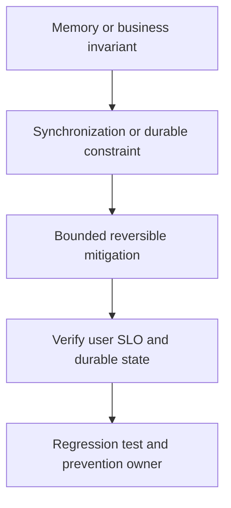

# Production race/data corruption

## Bài toán và ví dụ đầu tiên

**Tình huống mô phỏng.** Một coupon chỉ còn một lượt nhưng hai đơn đều được áp dụng khi traffic tăng. Go race detector không báo trong unit tests. Có thể invariant nằm ở database check-then-update giữa nhiều requests chứ không ở shared memory Go.

## Đi từng bước qua một tình huống

Lấy operation IDs và transaction timestamps để dựng A đọc remaining 1, B đọc remaining 1, A tạo order, B tạo order. Kiểm tra constraints và isolation thật; mutex local trong một replica không khóa replica khác. Nếu symptom là corrupted map/counter trong process, chạy race detector trên đường đó là nhánh điều tra khác.

Hai loại lỗi cần phân biệt để chọn đúng tool: data race theo access memory và race condition theo ordering nghiệp vụ.

## Hiểu cơ chế từ kết quả quan sát

Đưa quyết định consume coupon vào conditional update/constraint và transaction bao đủ order effect theo domain. Kiểm tra affected rows để một requester nhận conflict/không còn lượt. Không lock reader và writer riêng rồi để khoảng giữa vẫn race.

Mitigation có thể tạm giới hạn concurrency use case trong khi sửa invariant durable, nhưng không tuyên bố đó là bảo đảm đa replica. Records đã vi phạm cần repair theo policy product.

## Khái niệm và mô hình làm việc

Race symptom có thể crash, corrupt response hoặc duplicate state; cần tách memory race và business race.

## Cơ chế và những ranh giới cần giữ

Read stack/evidence, identify shared locations/invariant và conflicting operations. Reproduce memory path dưới -race; DB duplicate dùng concurrent transaction test.

### Cách đọc diagram

Đọc từ trên xuống: Memory or business invariant là điểm lấy bằng chứng từ race access stacks hoặc concurrent transaction timeline; Synchronization or durable constraint là nhóm giả thuyết cần kiểm chứng, không phải kết luận tự động. Mũi tên tới mitigation yêu cầu một thay đổi có bound và có thể đảo ngược. Sau đó kiểm tra memory protocol và durable invariant dưới contention, rồi chuyển cause đã xác nhận thành regression scenario và action có owner. Sơ đồ là trình tự điều tra; phần timeline ở đầu bài chỉ cách chọn bằng chứng để loại giả thuyết sai.

## Áp dụng vào hệ thống thật

Rollback unsafe shared-buffer optimization; protect invariant bằng lock/ownership, giữ data reconciliation plan.

## Những đường lỗi cần hiểu

Lock chỉ map nhưng pointer values mutable ngoài lock; test sleeps che race; local lock không bảo vệ nhiều pods.

## Lần theo bằng chứng khi có sự cố

Both race access stacks, goroutine creators, business IDs và transaction order; vet copylocks.

## Đánh đổi và giới hạn sử dụng

Fix lock có thể thêm contention/deadlock; verify correctness rồi measure latency.

## Thực hành, debugging và kết luận

Integration test dùng hai connections và barrier cho cả hai đến điểm tranh chấp, rồi assert chỉ một effect hợp lệ. Với Go state, chạy -race và kiểm tra mọi access dùng cùng protocol. Verify conflict rate có thể tăng hợp lệ trong khi double-apply về0; không coi mọi conflict là lỗi cần retry vô hạn.

## Đọc tiếp

- [Race condition versus data race](../04-concurrency/race-condition.md)
- [pprof: chọn profile từ câu hỏi production](../16-performance/pprof.md)
- [Incident debugging với evidence](../17-observability/incident-debugging.md)

## Nguồn đối chiếu

- [Tài liệu chính thức](https://go.dev/doc/diagnostics)
