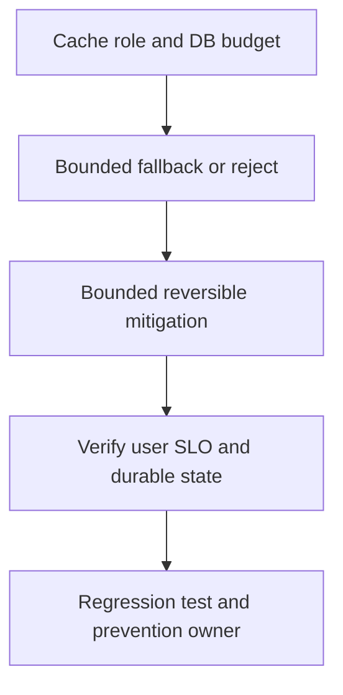

# Redis unavailable và cache collapse

## Bài toán và ví dụ đầu tiên

**Tình huống mô phỏng.** Redis timeout khiến cache hit từ 90% về0%; DB reads tăng gần 10 lần và pool wait kéo P99 vượt 2 giây. API CPU chưa đầy nhưng dependency cascade đã bắt đầu.

## Đi từng bước qua một tình huống

Xác minh Redis latency/errors cùng timestamp và tách connect/network/server metrics. Đo DB QPS/pool wait để thấy fallback amplification. Nếu mọi request chờ Redis hết1s rồi mới DB, tổng latency vừa có timeout cache vừa có queue DB. Kiểm tra retries ở cache client có nhân thêm attempts không.

Một rate limiter dùng Redis còn có semantics fail-open/fail-closed khác cache dữ liệu; không tắt mọi Redis usage bằng cùng một switch.

## Hiểu cơ chế từ kết quả quan sát

Fail-fast cache path khi phù hợp, giới hạn fallback concurrency và shed optional/expensive routes theo product policy. Có thể trả stale data chỉ trong freshness budget đã cho phép. Đừng để mọi miss chạy DB cùng lúc hoặc clear toàn cache lần nữa trong recovery.

Khi Redis hồi phục, ramp refill, coalesce hot keys và dùng TTL jitter để tránh đợt expiry đồng loạt kế tiếp. Cache health không làm DB backlog biến mất tức thì.

## Khái niệm và mô hình làm việc

Redis failure có thể là cache outage, quota authority outage hoặc correctness-state outage; policy khác nhau theo role.

## Cơ chế và những ranh giới cần giữ

Derived reads dùng bounded fallback/stale; security/idempotency keys cần durable authority hoặc reject. Model DB demand từ misses tăng.

### Cách đọc diagram

Đọc từ trên xuống: Cache role and DB budget là điểm lấy bằng chứng từ miss amplification và DB headroom; Bounded fallback or reject là nhóm giả thuyết cần kiểm chứng, không phải kết luận tự động. Mũi tên tới mitigation yêu cầu một thay đổi có bound và có thể đảo ngược. Sau đó kiểm tra SLO cùng freshness và DB backlog sau warmup, rồi chuyển cause đã xác nhận thành regression scenario và action có owner. Sơ đồ là trình tự điều tra; phần timeline ở đầu bài chỉ cách chọn bằng chứng để loại giả thuyết sai.

## Áp dụng vào hệ thống thật

Circuit short Redis waits, reserve DB capacity, shed low-priority reads và pause cache warmers/retries.

## Những đường lỗi cần hiểu

All reads hit DB, retry herd, reconnect storm, stale authorization hoặc double processing do fail-open dedup.

## Lần theo bằng chứng khi có sự cố

Redis latency/errors, cache hit ratio, DB QPS/wait, connection churn và response freshness.

## Đánh đổi và giới hạn sử dụng

Availability qua stale cache chỉ cho fields product cho phép; no blanket fail-open policy.

## Thực hành, debugging và kết luận

Test cache outage dưới load và xác minh DB không vượt budget, requests bị từ chối có response rõ. Verify user SLO, DB waits và hit/freshness phục hồi sau warmup. Regression giữ bound/fallback policy, alert theo amplification và oldest wait. Ghi policy riêng cho Redis cache, lock và limiter vì failure effects khác nhau.

## Đọc tiếp

- [Redis failure game day](../09-redis-cache/failure-scenarios.md)
- [pprof: chọn profile từ câu hỏi production](../16-performance/pprof.md)
- [Incident debugging với evidence](../17-observability/incident-debugging.md)

## Nguồn đối chiếu

- [Tài liệu chính thức](https://go.dev/doc/diagnostics)
