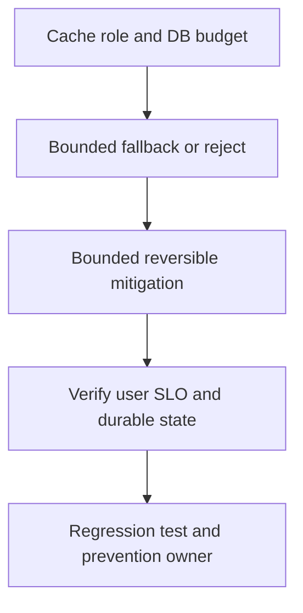

# Redis unavailable và cache collapse

## Concept và Mental Model

Redis failure có thể là cache outage, quota authority outage hoặc correctness-state outage; policy khác nhau theo role.

## How it works

Derived reads dùng bounded fallback/stale; security/idempotency keys cần durable authority hoặc reject. Model DB demand từ misses tăng.

## Production Use Case

Circuit short Redis waits, reserve DB capacity, shed low-priority reads và pause cache warmers/retries.

## Failure Scenarios

All reads hit DB, retry herd, reconnect storm, stale authorization hoặc double processing do fail-open dedup.

## How I would debug this in production

Redis latency/errors, cache hit ratio, DB QPS/wait, connection churn và response freshness.

## Trade-offs và When NOT to use

Availability qua stale cache chỉ cho fields product cho phép; no blanket fail-open policy.

## Interview practice

What happens to DB demand when hit rate drops from 95% to 0%? Read query demand có thể tăng20× với cùng traffic.

## Key Takeaways

Redis failure có thể là cache outage, quota authority outage hoặc correctness-state outage; policy khác nhau theo role..

## See also

- [Redis failure game day](../09-redis-cache/failure-scenarios.md)
- [pprof: chọn profile từ câu hỏi production](../16-performance/pprof.md)
- [Incident debugging với evidence](../17-observability/incident-debugging.md)

## Nguồn đối chiếu

- [Tài liệu chính thức](https://go.dev/doc/diagnostics)

## Drill và exit criteria

Trong staging, tạo triệu chứng **Redis unavailable và cache collapse** bằng failure injection có bounded duration. Trước khi thay đổi, ghi baseline traffic, version, resource limits và câu hỏi cần trả lời: **Cache role and DB budget**. Thực hiện một mitigation, rồi so outcome theo cùng workload.

- Success: user-facing errors/latency trở về SLO, accepted durable work được hoàn tất hoặc replayable, queues không tiếp tục tăng.
- Regression guard: test tái hiện failure path, metrics/alert chỉ ra triệu chứng trước saturation, runbook có owner và rollback trigger.
- Follow-up: **What would make your diagnosis wrong?** Nêu một measurement có thể bác bỏ giả thuyết, không chỉ evidence xác nhận.
