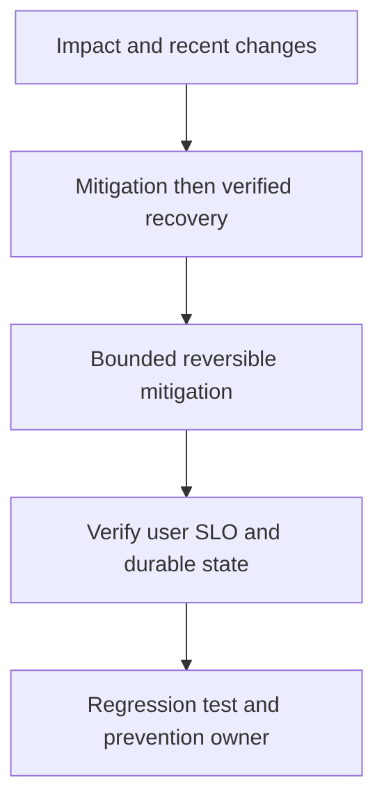

# Service outage: first15 minutes

## Bài toán và ví dụ đầu tiên

**Tình huống mô phỏng.** Sau rollout, nhiều Pods restart và availability giảm. Một dashboard chỉ báo5xx không nói lỗi startup, probe loop, config hay dependency cascade. Cần xác định phạm vi và một mitigation có cơ sở nhanh.

## Đi từng bước qua một tình huống

Xem release/config timeline, pod termination reason/events và readiness/liveness. Nếu OOMKilled thì nối memory trend/limits; nếu panic thì giữ stack; nếu liveness dependency fail đồng loạt thì probe có thể đang khuếch đại outage. Kiểm tra DB/Redis health để tránh rollback code trong khi authority dữ liệu mới là gốc.

So canary/old replicas nếu còn để có đối chứng. Ghi hành động và timestamp cho nhóm cùng điều tra, không để nhiều người đổi nhiều biến không phối hợp.

## Hiểu cơ chế từ kết quả quan sát

Rollback một release có bằng chứng và schema-compatible có thể giảm ảnh hưởng nhanh. Nếu migration destructive đã chạy, image rollback đơn thuần có thể không an toàn; chọn roll-forward/compatibility theo state thực. Giảm admission/retries và giữ capacity khỏe tránh cascade.

Không restart toàn fleet cùng lúc khi cold caches/pools có thể đè dependency. Thu evidence ngắn nếu không trì hoãn mitigation cần thiết, dùng config/build IDs để bảo toàn khả năng tái hiện.

## Khái niệm và mô hình làm việc

Mục tiêu đầu tiên giảm user impact với reversible actions và timeline rõ; root-cause investigation tiếp tục sau ổn định.

## Cơ chế và những ranh giới cần giữ

Xác định scope/routes/regions, recent deploy/config, edge errors, dependencies, saturation và data safety. Giao incident lead/comms/diagnostics roles nếu team có.

### Cách đọc diagram

Đọc từ trên xuống: Impact and recent changes là điểm lấy bằng chứng từ release/probe/config timeline và pod termination reason; Mitigation then verified recovery là nhóm giả thuyết cần kiểm chứng, không phải kết luận tự động. Mũi tên tới mitigation yêu cầu một thay đổi có bound và có thể đảo ngược. Sau đó kiểm tra user outcomes, pending work và data reconciliation, rồi chuyển cause đã xác nhận thành regression scenario và action có owner. Sơ đồ là trình tự điều tra; phần timeline ở đầu bài chỉ cách chọn bằng chứng để loại giả thuyết sai.

## Áp dụng vào hệ thống thật

Rollback change correlated, failover theo runbook đã test, shed load hoặc pause harmful background work; ghi action/time/outcome.

## Những đường lỗi cần hiểu

Restart storm, simultaneous config changes, failover split-brain, declare recovered khi backlog/unknown payments còn tồn.

## Lần theo bằng chứng khi có sự cố

SLI/error-budget burn, dependency health, deployment cohorts, traces/profiles và durable state gaps.

## Đánh đổi và giới hạn sử dụng

Availability mitigation không được phá financial/security invariant; nêu trade-off và owner.

## Thực hành, debugging và kết luận

Verify user-visible success/latency, không chỉ Pods Ready. Kiểm tra accepted jobs, unknown payments, queue backlog và dữ liệu cần reconcile. Sau đó viết timeline causal, contributing factors và action có owner/test. Drill tiếp theo tái hiện đúng trigger như probe dependency failure hoặc schema mismatch, thay vì chỉ kill một Pod rồi kết luận hệ thống resilient.

## Đọc tiếp

- [Incident debugging với evidence](../17-observability/incident-debugging.md)
- [pprof: chọn profile từ câu hỏi production](../16-performance/pprof.md)
- [Incident debugging với evidence](../17-observability/incident-debugging.md)

## Nguồn đối chiếu

- [Tài liệu chính thức](https://go.dev/doc/diagnostics)

## Drill và exit criteria

Trong staging, tạo triệu chứng **Service outage: first15 minutes** bằng failure injection có bounded duration. Trước khi thay đổi, ghi baseline traffic, version, resource limits và câu hỏi cần trả lời: **Impact and recent changes**. Thực hiện một mitigation, rồi so outcome theo cùng workload.

- Success: user-facing errors/latency trở về SLO, accepted durable work được hoàn tất hoặc replayable, queues không tiếp tục tăng.
- Regression guard: test tái hiện failure path, metrics/alert chỉ ra triệu chứng trước saturation, runbook có owner và rollback trigger.
- Follow-up: **What would make your diagnosis wrong?** Nêu một measurement có thể bác bỏ giả thuyết, không chỉ evidence xác nhận.
