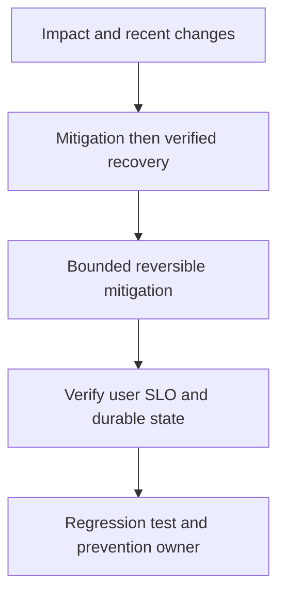

# Service outage: first15 minutes

## Concept và Mental Model

Mục tiêu đầu tiên giảm user impact với reversible actions và timeline rõ; root-cause investigation tiếp tục sau ổn định.

## How it works

Xác định scope/routes/regions, recent deploy/config, edge errors, dependencies, saturation và data safety. Giao incident lead/comms/diagnostics roles nếu team có.

## Production Use Case

Rollback change correlated, failover theo runbook đã test, shed load hoặc pause harmful background work; ghi action/time/outcome.

## Failure Scenarios

Restart storm, simultaneous config changes, failover split-brain, declare recovered khi backlog/unknown payments còn tồn.

## How I would debug this in production

SLI/error-budget burn, dependency health, deployment cohorts, traces/profiles và durable state gaps.

## Trade-offs và When NOT to use

Availability mitigation không được phá financial/security invariant; nêu trade-off và owner.

## Interview practice

What proves recovery beyond green health checks? User SLIs, queue freshness và reconciliation trở lại acceptable bounds.

## Key Takeaways

Mục tiêu đầu tiên giảm user impact với reversible actions và timeline rõ; root-cause investigation tiếp tục sau ổn định..

## See also

- [Incident debugging với evidence](../17-observability/incident-debugging.md)
- [pprof: chọn profile từ câu hỏi production](../16-performance/pprof.md)
- [Incident debugging với evidence](../17-observability/incident-debugging.md)

## Nguồn đối chiếu

- [Tài liệu chính thức](https://go.dev/doc/diagnostics)

## Drill và exit criteria

Trong staging, tạo triệu chứng **Service outage: first15 minutes** bằng failure injection có bounded duration. Trước khi thay đổi, ghi baseline traffic, version, resource limits và câu hỏi cần trả lời: **Impact and recent changes**. Thực hiện một mitigation, rồi so outcome theo cùng workload.

- Success: user-facing errors/latency trở về SLO, accepted durable work được hoàn tất hoặc replayable, queues không tiếp tục tăng.
- Regression guard: test tái hiện failure path, metrics/alert chỉ ra triệu chứng trước saturation, runbook có owner và rollback trigger.
- Follow-up: **What would make your diagnosis wrong?** Nêu một measurement có thể bác bỏ giả thuyết, không chỉ evidence xác nhận.
