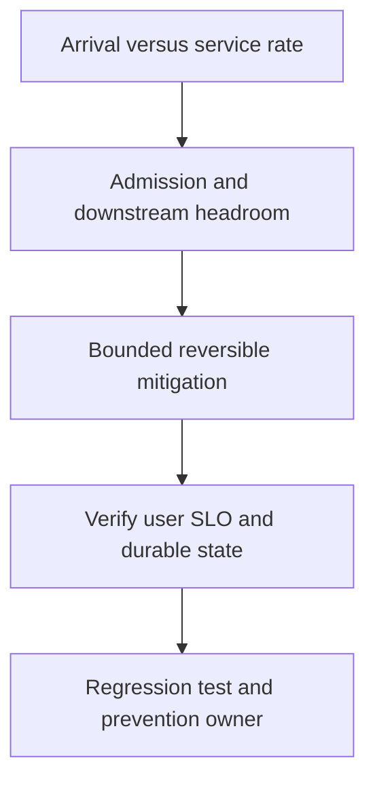

# Traffic spike và load shedding

## Concept và Mental Model

Arrival tăng nhanh hơn autoscaling/service rate làm queues/G/memory tăng trước CPU dashboard ổn định.

## How it works

Bound admission, queue count/bytes và per-tenant fairness; distinguish legitimate burst, hot key và abuse.

## Production Use Case

Shed optional endpoints, enforce429/503 policy, serve allowed stale reads, reserve critical capacity.

## Failure Scenarios

HPA tăng pools overload DB; buffer tăng chỉ delay OOM; retry clients amplify rejected load.

## How I would debug this in production

Offered/accepted/completed RPS, queue oldest age, CPU throttle, DB wait và error budget burn.

## Trade-offs và When NOT to use

Reject sớm giữ latency/capacity nhưng cần client retry guidance; durable queue chỉ cho async work đúng contract.

## Interview practice

How would you handle10k events/s when workers process5k/s? Bound backlog và control admission, không promise buffer là solution.

## Key Takeaways

Arrival tăng nhanh hơn autoscaling/service rate làm queues/G/memory tăng trước CPU dashboard ổn định..

## See also

- [Backpressure: 10k vào, 5k ra](../10-messaging/backpressure.md)
- [pprof: chọn profile từ câu hỏi production](../16-performance/pprof.md)
- [Incident debugging với evidence](../17-observability/incident-debugging.md)

## Nguồn đối chiếu

- [Tài liệu chính thức](https://go.dev/doc/diagnostics)

## Drill và exit criteria

Trong staging, tạo triệu chứng **Traffic spike và load shedding** bằng failure injection có bounded duration. Trước khi thay đổi, ghi baseline traffic, version, resource limits và câu hỏi cần trả lời: **Arrival versus service rate**. Thực hiện một mitigation, rồi so outcome theo cùng workload.

- Success: user-facing errors/latency trở về SLO, accepted durable work được hoàn tất hoặc replayable, queues không tiếp tục tăng.
- Regression guard: test tái hiện failure path, metrics/alert chỉ ra triệu chứng trước saturation, runbook có owner và rollback trigger.
- Follow-up: **What would make your diagnosis wrong?** Nêu một measurement có thể bác bỏ giả thuyết, không chỉ evidence xác nhận.
