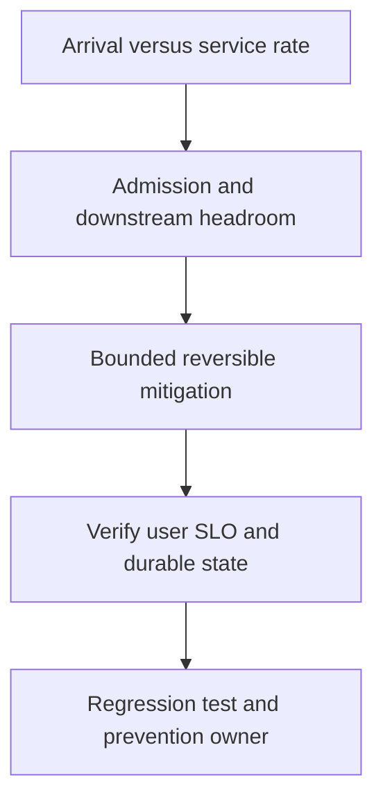

# Traffic spike và load shedding

## Bài toán và ví dụ đầu tiên

**Tình huống mô phỏng.** Traffic tăng từ2k lên12k RPS trong một phút. API replicas chưa scale kịp, queue và in-flight tăng, một số requests đã hết deadline trước khi được xử lý. Buffer lớn chỉ chuyển overload thành latency/memory.

## Đi từng bước qua một tình huống

Đo offered, accepted, rejected và completed rate cùng queue age/bytes. Nếu completed giữ ở3k/s còn accepted12k/s, backlog tăng9k/s. Xác định bottleneck đầu tiên: CPU, SQL pool, partner quota hay partition hot. HPA CPU thấp không giúp nếu mọi worker waiting ở DB.

Kiểm tra traffic hợp lệ/abuse và tenant skew theo labels hữu hạn. Một payload lớn hơn bình thường có thể tăng work/request nên RPS không mô tả đầy đủ tải.

## Hiểu cơ chế từ kết quả quan sát

Áp admission/concurrency bounds, ưu tiên operations thiết yếu và reject sớm có retry guidance phù hợp. Retry clients cần backoff/jitter để không dồn thêm burst. Scale API chỉ khi downstream budget và startup headroom cho phép; max replicas×pool phải vẫn hợp lý.

Với durable jobs, accepted nghĩa đã lưu trách nhiệm; không drop silently để queue depth đẹp. Giới hạn tuổi job và communicate pending theo contract.

## Khái niệm và mô hình làm việc

Arrival tăng nhanh hơn autoscaling/service rate làm queues/G/memory tăng trước CPU dashboard ổn định.

## Cơ chế và những ranh giới cần giữ

Bound admission, queue count/bytes và per-tenant fairness; distinguish legitimate burst, hot key và abuse.

### Cách đọc diagram

Đọc từ trên xuống: Arrival versus service rate là điểm lấy bằng chứng từ offered/accepted/completed và queue bytes/age; Admission and downstream headroom là nhóm giả thuyết cần kiểm chứng, không phải kết luận tự động. Mũi tên tới mitigation yêu cầu một thay đổi có bound và có thể đảo ngược. Sau đó kiểm tra memory bound, fairness và backlog drain, rồi chuyển cause đã xác nhận thành regression scenario và action có owner. Sơ đồ là trình tự điều tra; phần timeline ở đầu bài chỉ cách chọn bằng chứng để loại giả thuyết sai.

## Áp dụng vào hệ thống thật

Shed optional endpoints, enforce429/503 policy, serve allowed stale reads, reserve critical capacity.

## Những đường lỗi cần hiểu

HPA tăng pools overload DB; buffer tăng chỉ delay OOM; retry clients amplify rejected load.

## Lần theo bằng chứng khi có sự cố

Offered/accepted/completed RPS, queue oldest age, CPU throttle, DB wait và error budget burn.

## Đánh đổi và giới hạn sử dụng

Reject sớm giữ latency/capacity nhưng cần client retry guidance; durable queue chỉ cho async work đúng contract.

## Thực hành, debugging và kết luận

Load test burst dài hơn buffer absorption và scale delay, xác nhận memory plateau, fair capacity và recovery. Sau spike, completion phải vượt arrival để drain backlog, không chỉ autoscaler đạt đủ Pods. Kiểm tra P99 theo success/reject và retries về baseline. Capacity plan cần headroom cho rollout/zone loss, không chỉ peak healthy.

## Đọc tiếp

- [Backpressure: 10k vào, 5k ra](../10-messaging/backpressure.md)
- [pprof: chọn profile từ câu hỏi production](../16-performance/pprof.md)
- [Incident debugging với evidence](../17-observability/incident-debugging.md)

## Nguồn đối chiếu

- [Tài liệu chính thức](https://go.dev/doc/diagnostics)

## Drill và exit criteria

Trong staging, tạo triệu chứng **Traffic spike và load shedding** bằng failure injection có bounded duration. Trước khi thay đổi, ghi baseline traffic, version, resource limits và câu hỏi cần trả lời: **Arrival versus service rate**. Thực hiện một mitigation, rồi so outcome theo cùng workload.

- Success: user-facing errors/latency trở về SLO, accepted durable work được hoàn tất hoặc replayable, queues không tiếp tục tăng.
- Regression guard: test tái hiện failure path, metrics/alert chỉ ra triệu chứng trước saturation, runbook có owner và rollback trigger.
- Follow-up: **What would make your diagnosis wrong?** Nêu một measurement có thể bác bỏ giả thuyết, không chỉ evidence xác nhận.
