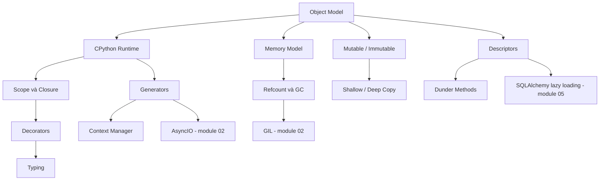

# 01 — Python Core

## Module này học gì?

Cách Python thực sự vận hành bên dưới cú pháp: object được tạo và tồn tại thế nào, name liên hệ với object ra sao, CPython biến source code thành bytecode và thực thi, memory được cấp phát và thu hồi thế nào, và các cơ chế ngôn ngữ (closure, decorator, descriptor, generator, context manager, data model, typing) được xây dựng từ đâu.

## Tại sao cần học?

Gần như mọi chủ đề backend phía sau đều dựa trên module này:

- [GIL](../02-python-concurrency/gil.md) tồn tại vì reference counting và cách eval loop chạy bytecode.
- [AsyncIO](../02-python-concurrency/asyncio.md) dựa trên cơ chế tạm dừng/tiếp tục frame của generator.
- [FastAPI](../03-fastapi/README.md) dựa trên decorator, typing và context manager (lifespan, dependency có `yield`).
- [SQLAlchemy](../05-sqlalchemy/README.md) dựa trên descriptor để lazy load, và context manager để quản lý session/transaction.
- Memory leak, OOM, latency spike do GC là các sự cố production có gốc rễ ở đây.

## Thứ tự nên đọc

1. [Python Object Model](object-model.md) — identity, type, value; name và reference; class là object.
2. [CPython Runtime](cpython-runtime.md) — bytecode, eval loop, frame, stack và heap, import.
3. [Python Memory Model](python-memory-model.md) — pymalloc, arena, fragmentation, vì sao RSS không giảm.
4. [Reference Counting và GC](gc-reference-counting.md) — refcount, cycle, generation, finalizer.
5. [Mutable và Immutable](mutable-immutable.md)
6. [Shallow Copy và Deep Copy](shallow-vs-deep-copy.md)
7. [Scope, LEGB và Closure](closures.md)
8. [Decorators](decorators.md)
9. [Iterators và Generators](generators-iterators.md)
10. [Context Manager](context-manager.md)
11. [Descriptors](descriptors.md)
12. [Dunder Methods và Data Model](dunder-methods.md)
13. [Typing](typing.md)

## Các concept phụ thuộc nhau thế nào?

Cách đọc diagram:

1. **Object Model** là gốc: mọi thứ khác đều nói về object, reference và type.
2. **Runtime** và **Memory Model** mô tả CPython thực thi và cấp phát memory; **Refcount/GC** là vòng đời object — nền của GIL.
3. **Mutable/Immutable** quyết định hành vi khi chia sẻ object, từ đó dẫn tới câu hỏi copy.
4. **Closure** là nền của **Decorator**; decorator cần **Typing** (`ParamSpec`) để giữ signature.
5. **Generator** (frame có thể tạm dừng) là nền của **Context Manager** dạng `@contextmanager` và của **coroutine** trong AsyncIO.
6. **Descriptor** giải thích method binding, `property`, và lazy loading của ORM; **Dunder methods** là giao thức để class tham gia cú pháp.

## File quan trọng nhất

Nếu chỉ có thời gian cho ba file: [Object Model](object-model.md), [Reference Counting và GC](gc-reference-counting.md), [Iterators và Generators](generators-iterators.md). Ba file này là điều kiện để hiểu GIL và AsyncIO ở module tiếp theo.

---

[← Knowledge map](../../README.md) · [Module tiếp theo: Python Concurrency →](../02-python-concurrency/README.md)
