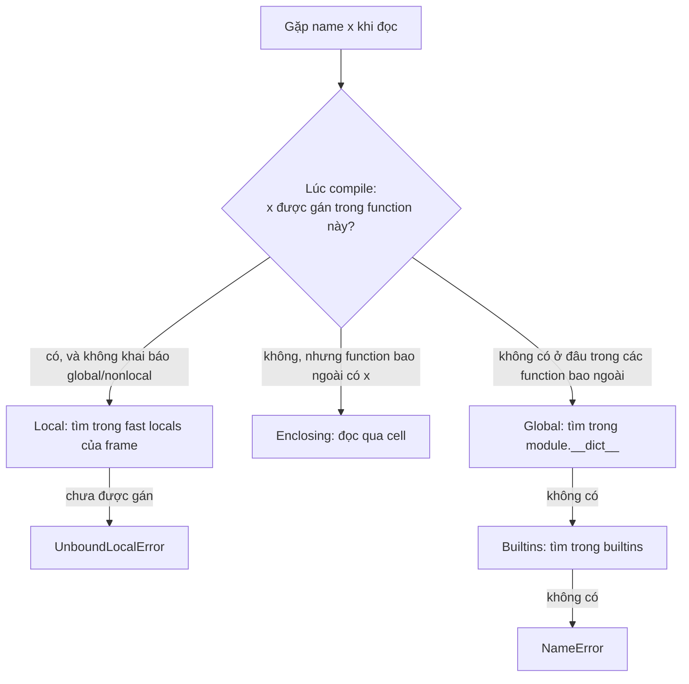
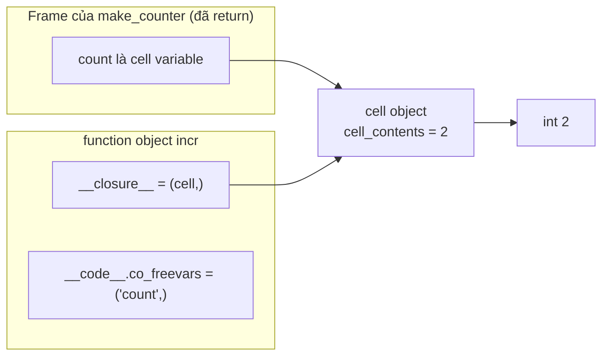

# Scope, LEGB và Closure

## 1. Tổng quan

Khi Python gặp một name như `timeout` trong function, nó phải trả lời: name này thuộc về đâu? Là biến local, biến của function bao ngoài, biến global của module, hay built-in? Bộ quy tắc trả lời câu hỏi đó gọi là **scope resolution**, thường tóm tắt bằng **LEGB**.

**Closure** là hệ quả trực tiếp của scope: một function lồng bên trong có thể dùng biến của function bao ngoài, **kể cả sau khi function bao ngoài đã return**. Closure là nền tảng của [decorator](decorators.md), callback, factory function, và nhiều pattern cấu hình trong FastAPI, Celery.

## 2. Mental Model

- **Scope được quyết định lúc compile**, dựa trên vị trí name được **gán** trong source code, không phải lúc chạy.
- **Closure = function object + các "ô nhớ" (cell) trỏ tới biến của scope bao ngoài.** Function bên trong không sao chép giá trị; nó giữ cell, và cell trỏ tới giá trị hiện tại của biến.

Vì closure giữ cell chứ không giữ giá trị, closure luôn thấy **giá trị mới nhất** của biến bao ngoài. Đây là chìa khóa để hiểu cả sức mạnh lẫn bug kinh điển "late binding".

## 3. Vì sao cần hiểu?

- Giải thích `UnboundLocalError` khi đọc biến trước khi gán trong cùng function.
- Giải thích vì sao `[lambda: i for i in range(3)]` trả về `2, 2, 2`.
- Hiểu decorator giữ state ở đâu.
- Hiểu vì sao callback giữ object sống lâu hơn dự kiến (memory leak).
- Hiểu vì sao lambda/closure không truyền được qua `multiprocessing` hay Celery.

## 4. Cơ chế hoạt động: LEGB



Giải thích:

1. Compiler quét toàn bộ thân function. Nếu `x` xuất hiện ở vế trái của phép gán (hoặc là tham số, biến vòng `for`, `import`, `def`, `class`, `with ... as`, `except ... as`), `x` là **local** cho **toàn bộ** function — kể cả những dòng đứng trước phép gán.
2. Đọc biến local chưa được gán → `UnboundLocalError`.
3. Nếu `x` không được gán trong function nhưng được gán trong một function bao ngoài, `x` là **free variable**, đọc qua cell (Enclosing).
4. Nếu không, `x` là **global**: tra `module.__dict__` lúc chạy.
5. Không có trong globals thì tra `builtins` (`len`, `print`, `Exception`...).

Ví dụ `UnboundLocalError`:

```python
retries = 3

def call():
    print(retries)   # UnboundLocalError
    retries = 5      # phép gán này biến retries thành local cho CẢ function
```

### `global` và `nonlocal`

- `global x`: mọi đọc/ghi `x` trong function đi thẳng tới module globals.
- `nonlocal x`: mọi đọc/ghi `x` đi tới biến `x` của function bao ngoài gần nhất (qua cell).

```python
def make_counter():
    count = 0
    def incr():
        nonlocal count     # không có dòng này, count += 1 sẽ biến count thành local
        count += 1
        return count
    return incr
```

### Các scope đặc biệt

- **Class body không phải enclosing scope cho method.** Method không thấy trực tiếp biến trong thân class; phải truy cập qua `self.x` hoặc `ClassName.x`.
- **Comprehension có scope riêng**: biến vòng lặp trong `[x for x in data]` không rò ra ngoài. Từ Python 3.12 (PEP 709), CPython inline comprehension vào function chứa nó để chạy nhanh hơn, nhưng vẫn giữ ngữ nghĩa scope riêng.
- **Biến `except ... as e`** bị xóa khi ra khỏi khối `except` để phá cycle traceback.

## 5. Internals: cell object và closure

Khi compiler thấy một biến local của function ngoài được dùng bởi function trong, nó đánh dấu biến đó là **cell variable** (`co_cellvars` của function ngoài) và là **free variable** (`co_freevars` của function trong).



Diễn giải:

1. Biến `count` không nằm trực tiếp trong fast locals của `make_counter` mà được bọc trong một **cell object**.
2. Khi `def incr` chạy, function object `incr` được tạo với `__closure__` là tuple chứa reference tới cell đó.
3. Khi `make_counter` return, frame của nó bị hủy, nhưng cell vẫn sống vì `incr.__closure__` còn giữ reference.
4. `incr` đọc/ghi `count` bằng lệnh `LOAD_DEREF`/`STORE_DEREF`, thao tác trên `cell_contents`.
5. Mỗi lần gọi `make_counter()` tạo một cell mới — mỗi counter có state riêng.

Kiểm chứng:

```python
c = make_counter()
c(); c()
c.__code__.co_freevars           # ('count',)
c.__closure__[0].cell_contents   # 2
```

## 6. Late binding: bug kinh điển

```python
handlers = [lambda: i for i in range(3)]
[h() for h in handlers]     # [2, 2, 2]
```

Ba lambda cùng đóng gói **một** cell cho biến `i`. Khi được gọi (sau vòng lặp), cell chứa giá trị cuối cùng là `2`.

Cách sửa là bắt giá trị tại thời điểm tạo:

```python
handlers = [lambda i=i: i for i in range(3)]      # default arg được đánh giá khi tạo lambda
# hoặc
from functools import partial
handlers = [partial(lambda x: x, i) for i in range(3)]
```

Cùng bug xuất hiện trong code bất đồng bộ:

```python
for user_id in user_ids:
    loop.call_later(1, lambda: notify(user_id))   # mọi callback notify user_id cuối cùng
```

## 7. Ví dụ: closure làm factory có cấu hình

```python
import httpx

def make_client_call(base_url: str, timeout_s: float):
    client = httpx.Client(base_url=base_url, timeout=timeout_s)

    def get(path: str) -> dict:
        response = client.get(path)
        response.raise_for_status()
        return response.json()

    return get

fetch_inventory = make_client_call("https://inventory.internal", 0.5)
```

`get` giữ `client` qua closure. Cách này gọn cho cấu hình đơn giản. Khi state bắt đầu phức tạp (cần đóng client, đổi cấu hình, test thay thế), một class với `__init__`/`close` thường dễ bảo trì hơn — closure và class là hai cách biểu diễn cùng một ý tưởng "hành vi + state".

## 8. Hành vi trong production

**Closure giữ object sống.** Callback đăng ký vào một registry sống lâu (event bus, signal, cache) giữ mọi thứ nó đóng gói. Một closure đóng gói `request` hoặc `session` và bị lưu vào registry toàn cục sẽ giữ request đó mãi mãi. Đây là một dạng [memory leak](../20-production-incidents/memory-leak.md) khó thấy vì không có biến global nào trỏ trực tiếp tới request.

**Closure không pickle được.** `multiprocessing`, `ProcessPoolExecutor`, Celery serialize function bằng tên đầy đủ (`module.qualname`). Lambda và function lồng nhau không có tên truy cập được từ module nên không pickle được. Task gửi sang process khác phải là function ở module level, dữ liệu truyền qua argument.

**State trong closure không thread-safe.** Counter dùng `nonlocal count; count += 1` gặp đúng vấn đề như biến global: đọc-cộng-ghi không nguyên tử. Nếu closure được gọi từ nhiều thread, cần lock hoặc dùng cấu trúc thread-safe.

**Closure trong vòng lặp tạo task async.** Tạo task trong vòng lặp với closure tham chiếu biến vòng lặp gây late binding; truyền giá trị qua argument của coroutine thay vì đóng gói.

## 9. Failure Modes

| Failure | Nguyên nhân | Dấu hiệu |
|---|---|---|
| `UnboundLocalError` | Gán cho name trong function làm nó thành local | Lỗi ở dòng đọc biến, dù biến global tồn tại |
| Late binding | Closure đọc biến vòng lặp sau khi vòng lặp kết thúc | Mọi callback dùng giá trị cuối |
| Memory giữ lâu | Closure trong registry giữ object lớn | Object request/session không được giải phóng |
| `PicklingError` | Truyền lambda/closure qua process | Lỗi khi submit task vào process pool/Celery |
| Race trên `nonlocal` | Closure được gọi đồng thời từ nhiều thread | Counter/metric sai lệch |

## 10. Trade-offs

| Lựa chọn | Lợi ích | Chi phí |
|---|---|---|
| Closure | Ngắn gọn, đóng gói state riêng tư | Khó introspect, khó test thay thế, không pickle được |
| Class có `__call__` | State tường minh, có method dọn dẹp, dễ mở rộng | Dài dòng hơn |
| `functools.partial` | Gắn sẵn argument, pickle được nếu function gốc ở module level | Chỉ gắn argument, không có state thay đổi |
| Biến global | Đơn giản | Dùng chung toàn process, khó test, dễ race |

## 11. Sai lầm thường gặp

- Nghĩ closure "chụp" giá trị tại thời điểm tạo. Nó giữ cell, đọc giá trị lúc gọi.
- Quên `nonlocal` khi muốn cập nhật biến bao ngoài.
- Tưởng method thấy được biến trong thân class.
- Dùng lambda làm Celery task hoặc argument cho `ProcessPoolExecutor.submit`.
- Để closure dài và phức tạp thay vì chuyển thành class.

## 12. Cách debug

- `func.__code__.co_varnames`, `co_freevars`, `co_cellvars` để xem compiler phân loại name thế nào.
- `func.__closure__` và `cell.cell_contents` để xem closure đang giữ gì.
- `inspect.getclosurevars(func)` trả về nonlocals, globals, builtins mà function dùng.
- `dis.dis(func)`: `LOAD_FAST` (local), `LOAD_DEREF` (closure), `LOAD_GLOBAL` (global/builtin).
- Với memory, `gc.get_referrers(obj)` sẽ chỉ ra cell object nếu closure đang giữ nó.

## 13. Best Practices

- Hạn chế `global`; truyền state qua argument hoặc đóng gói trong object.
- Truyền giá trị vào callback qua argument (default arg, `partial`) thay vì đọc biến vòng lặp.
- Không đóng gói object lớn hoặc có lifetime ngắn (request, session) trong closure được lưu vào nơi sống lâu.
- Task gửi qua process/queue phải là function ở module level.
- Khi closure cần nhiều hơn một hai biến state hoặc cần dọn dẹp, chuyển thành class.

## 14. Tóm tắt

- Scope được quyết định lúc compile dựa trên nơi name được gán; thứ tự tra cứu là Local → Enclosing → Global → Builtins.
- Gán cho một name ở bất kỳ đâu trong function làm nó thành local cho toàn function.
- Closure giữ cell object trỏ tới biến bao ngoài, không giữ bản sao giá trị; vì vậy có late binding.
- Cell sống lâu hơn frame tạo ra nó, cho phép function trong dùng biến sau khi function ngoài return.
- Closure giữ reference, nên có thể kéo dài lifetime object; closure không pickle được.

## Liên quan

- [Decorators](decorators.md)
- [CPython Runtime](cpython-runtime.md)
- [Reference Counting và GC](gc-reference-counting.md)
- [Race Condition](../02-python-concurrency/race-condition.md)
