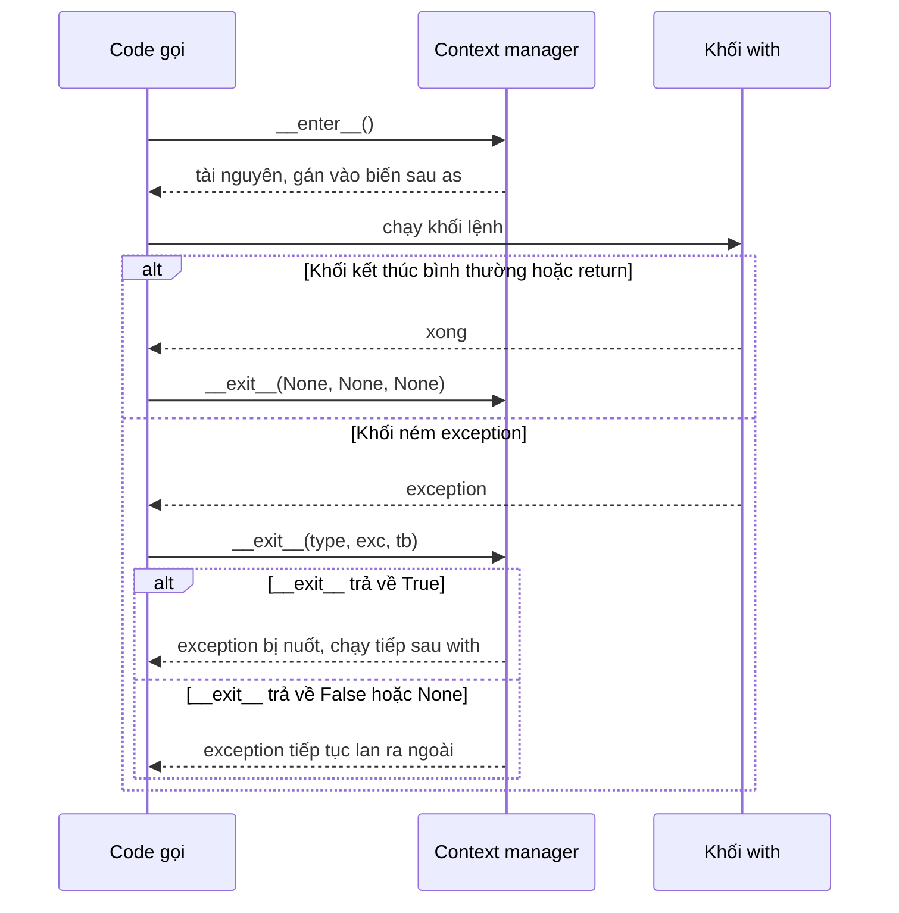

# Context Manager

## 1. Tổng quan

Context manager là object định nghĩa hành động **khi vào** và **khi ra** khỏi một khối code, và đảm bảo hành động "khi ra" luôn chạy — dù khối code kết thúc bình thường, `return` giữa chừng, hay ném exception.

```python
with open("report.csv", "w") as f:
    f.write(data)
# file chắc chắn đã đóng ở đây
```

Trong backend, context manager quản lý mọi tài nguyên có vòng đời: file, socket, lock, database session, transaction, connection lấy từ pool, span của distributed tracing, timeout, tài nguyên khởi tạo khi application khởi động (lifespan).

## 2. Mental Model

> Context manager là một cặp "mở — đóng" được ràng buộc với một khối code. Ra khỏi khối bằng bất kỳ đường nào thì "đóng" vẫn chạy.

Nó là cách viết `try/finally` có tên, có thể tái sử dụng, và có thể quyết định số phận của exception.

## 3. Vì sao cần?

Python dùng [reference counting và GC](gc-reference-counting.md) để hủy object, nhưng **thời điểm** hủy không phải là hợp đồng của ngôn ngữ. Trên PyPy, file có thể không đóng trong nhiều giây; trên CPython, một cycle hoặc một traceback giữ reference cũng làm trễ việc đóng. Tài nguyên hệ thống thì khan hiếm:

- File descriptor có giới hạn (`ulimit -n`).
- Connection pool thường chỉ 10–20 connection mỗi process.
- Lock không được nhả → deadlock.
- Transaction không được commit/rollback → giữ lock row, chặn VACUUM.

Tài nguyên khan hiếm cần được giải phóng **tất định**, ngay khi hết dùng. Context manager là cơ chế chuẩn cho việc đó.

## 4. Cơ chế hoạt động: giao thức

Một context manager có hai method:

- `__enter__(self)` — chạy khi vào khối; giá trị trả về được gán cho biến sau `as`.
- `__exit__(self, exc_type, exc_value, traceback)` — chạy khi ra khỏi khối. Nếu khối kết thúc bình thường, ba tham số là `None`. Nếu trả về giá trị truthy, exception bị **nuốt**.

Câu lệnh `with` được dịch (theo đặc tả ngôn ngữ) gần như sau:

```python
# with EXPR as VAR:
#     BLOCK

manager = EXPR
enter = type(manager).__enter__
exit_ = type(manager).__exit__
value = enter(manager)
try:
    VAR = value
    BLOCK
except BaseException as exc:
    if not exit_(manager, type(exc), exc, exc.__traceback__):
        raise
else:
    exit_(manager, None, None, None)
```

Lưu ý: `__enter__` và `__exit__` được tra trên **type**, không phải instance — giống mọi [dunder method](dunder-methods.md).



Diễn giải:

1. `__enter__` được gọi trước; nếu nó raise, khối không chạy và `__exit__` **không** được gọi (tài nguyên chưa được lấy thành công).
2. Khối lệnh chạy.
3. Dù khối kết thúc thế nào, `__exit__` luôn được gọi.
4. Nếu có exception, `__exit__` nhận thông tin exception và quyết định: trả truthy để nuốt, trả falsy để exception tiếp tục lan.
5. Nếu chính `__exit__` raise exception mới, exception mới thay thế exception cũ (exception cũ được gắn vào `__context__`).

## 5. Viết context manager

### Dạng class

```python
import time

class Timer:
    def __enter__(self):
        self.start = time.perf_counter()
        return self

    def __exit__(self, exc_type, exc, tb):
        self.elapsed = time.perf_counter() - self.start
        return False          # không nuốt exception
```

### Dạng generator với `contextlib.contextmanager`

```python
from contextlib import contextmanager

@contextmanager
def transaction(conn):
    tx = conn.begin()
    try:
        yield tx              # thân with chạy ở đây
    except BaseException:
        tx.rollback()
        raise                 # phải raise lại, nếu không exception bị nuốt
    else:
        tx.commit()
```

`@contextmanager` biến generator thành context manager:

- `__enter__` gọi `next(gen)`, chạy đến `yield`, trả giá trị được yield.
- `__exit__` khi không có exception: gọi `next(gen)` lần nữa; generator phải kết thúc (nếu `yield` lần thứ hai → `RuntimeError`).
- `__exit__` khi có exception: `gen.throw(exc)` — exception xuất hiện **tại dòng `yield`** trong generator. Nếu generator bắt và không raise lại, exception bị nuốt.

Cơ chế này dựa trực tiếp trên `throw()` của [generator](generators-iterators.md).

### Async context manager

Khi việc vào/ra cần `await` (mở connection async, commit async), dùng `__aenter__`/`__aexit__` và `async with`, hoặc `contextlib.asynccontextmanager`.

```python
from contextlib import asynccontextmanager

@asynccontextmanager
async def db_session(sessionmaker):
    session = sessionmaker()
    try:
        yield session
        await session.commit()
    except BaseException:
        await session.rollback()
        raise
    finally:
        await session.close()
```

## 6. Quản lý nhiều tài nguyên: `ExitStack`

Khi số tài nguyên chỉ biết lúc chạy, dùng `contextlib.ExitStack` (hoặc `AsyncExitStack`):

```python
from contextlib import ExitStack

with ExitStack() as stack:
    files = [stack.enter_context(open(p)) for p in paths]
    merge(files)
# mọi file được đóng theo thứ tự ngược với lúc mở
```

`ExitStack` là một ngăn xếp các callback dọn dẹp; khi thoát, nó gọi chúng theo thứ tự **LIFO**. FastAPI dùng chính cơ chế này (AsyncExitStack) để chạy phần dọn dẹp của các [dependency có `yield`](../03-fastapi/dependency-injection.md) theo thứ tự ngược với lúc khởi tạo.

## 7. Ví dụ trong backend

| Tài nguyên | Context manager |
|---|---|
| Transaction SQLAlchemy | `with Session() as s, s.begin(): ...` |
| Lock | `with lock:` / `async with asyncio_lock:` |
| Timeout async | `async with asyncio.timeout(2):` (3.11+) |
| Tracing span | `with tracer.start_as_current_span("charge"):` |
| HTTP client | `async with httpx.AsyncClient() as client:` |
| Lifespan ứng dụng | `@asynccontextmanager async def lifespan(app): ... yield ...` |
| Tạm đổi state | `unittest.mock.patch(...)`, `decimal.localcontext()` |
| Bỏ qua exception cụ thể | `with contextlib.suppress(FileNotFoundError):` |

### Lifespan của FastAPI

```python
from contextlib import asynccontextmanager
from fastapi import FastAPI

@asynccontextmanager
async def lifespan(app: FastAPI):
    app.state.http = httpx.AsyncClient(timeout=2.0)
    app.state.engine = create_async_engine(DB_URL, pool_size=10)
    yield                                   # application phục vụ request
    await app.state.http.aclose()           # chạy khi shutdown
    await app.state.engine.dispose()

app = FastAPI(lifespan=lifespan)
```

Phần trước `yield` chạy một lần khi worker khởi động; phần sau `yield` chạy khi worker nhận tín hiệu tắt. Đây là nơi đúng để tạo và đóng connection pool, không phải ở module level.

## 8. Hành vi trong production

**Phạm vi của context manager chính là thời gian giữ tài nguyên.** Transaction mở bằng `with session.begin()` giữ lock row và snapshot MVCC trong suốt khối. Đặt một HTTP call 3 giây trong khối đó nghĩa là giữ lock và connection thêm 3 giây — dưới tải, [connection pool](../04-database-postgresql/connection-pooling.md) cạn và lock chờ nhau dây chuyền. Nguyên tắc: khối `with` của tài nguyên khan hiếm chỉ chứa những việc cần tài nguyên đó.

**Cancellation trong async.** Khi một task bị cancel (timeout, client ngắt kết nối), `CancelledError` xuất hiện tại điểm `await` hiện tại. `__aexit__` vẫn chạy, nhưng nếu phần dọn dẹp có `await` (ví dụ `await session.rollback()`), nó có thể bị cancel lần nữa hoặc bị timeout. Dọn dẹp async phải ngắn và chịu được việc bị gián đoạn; với dọn dẹp bắt buộc phải hoàn tất, cân nhắc `asyncio.shield` có giới hạn thời gian.

**Lock và `await`.** `async with lock:` giữ lock qua mọi `await` bên trong. Một `await` gọi network trong vùng lock biến lock thành nút cổ chai tuần tự hóa mọi request.

**Exception bị che.** Nếu `__exit__` ném exception trong lúc xử lý exception gốc, log chỉ thấy exception thứ hai (exception gốc nằm trong `__context__`). Dọn dẹp nên tự bắt lỗi của chính nó và log, không che lỗi gốc.

## 9. Failure Modes

| Failure | Nguyên nhân | Dấu hiệu |
|---|---|---|
| Exception biến mất | `__exit__` trả truthy, hoặc generator CM không `raise` lại | Lỗi không được log, dữ liệu sai lặng lẽ |
| Connection pool cạn | Khối `with session` chứa I/O chậm không liên quan | Pool wait cao, DB không bận |
| Lock contention | Giữ lock qua `await` network | Throughput giảm về mức tuần tự |
| `RuntimeError: generator didn't stop` | `@contextmanager` yield hai lần | Lỗi khi thoát khối |
| Rò tài nguyên khi shutdown | Tạo client/pool ở module level, không đóng | Cảnh báo "Unclosed client session", connection treo phía DB |
| Rollback không chạy | `__aexit__` bị cancel giữa chừng | Transaction treo "idle in transaction" |

## 10. Trade-offs

| Lựa chọn | Lợi ích | Chi phí |
|---|---|---|
| Class với `__enter__/__exit__` | Tường minh, có thể giữ state, tái sử dụng được nhiều lần | Dài hơn |
| `@contextmanager` | Ngắn gọn, đọc tuần tự | Dùng một lần mỗi instance, dễ quên `raise` lại |
| `try/finally` trực tiếp | Không cần abstraction | Lặp code, dễ sai khi nhiều tài nguyên |
| `ExitStack` | Số tài nguyên động | Khó đọc hơn nếu lạm dụng |

## 11. Sai lầm thường gặp

- Dựa vào GC hoặc `__del__` để đóng tài nguyên.
- Viết `@contextmanager` với `try/except` nhưng không `raise` lại.
- Trả `True` từ `__exit__` "cho an toàn".
- Mở transaction quá rộng: bao cả gọi API bên ngoài, xử lý file, gửi email.
- Tạo tài nguyên dùng chung (engine, HTTP client) mỗi request thay vì một lần trong lifespan.
- Quên rằng `__exit__` không chạy nếu `__enter__` raise.

## 12. Khi nào nên dùng?

- Mọi tài nguyên cần được giải phóng: file, socket, connection, lock, transaction, subprocess.
- Tạm thay đổi state và phải khôi phục (patch, config tạm, thư mục làm việc).
- Đo lường hoặc tracing cho một khối code.
- Khởi tạo và dọn dẹp tài nguyên theo vòng đời application (lifespan).

## 13. Khi nào không nên?

- Logic không có hành động "đóng" — một function bình thường rõ ràng hơn.
- Khi vòng đời tài nguyên không khớp với một khối code (ví dụ connection được trả về cho nơi khác sử dụng lâu dài) — cần quản lý ownership tường minh.

## 14. Cách debug

- `python -W error::ResourceWarning` hoặc `-X dev` để biến cảnh báo tài nguyên không đóng thành lỗi trong test.
- Kiểm tra `exc.__context__` và `exc.__cause__` để tìm exception gốc bị che.
- Với PostgreSQL, `SELECT pid, state, xact_start, query FROM pg_stat_activity WHERE state = 'idle in transaction'` để phát hiện transaction bị giữ mở.
- Metric pool: số connection đang checkout và thời gian chờ checkout. Xem [Connection Pooling](../04-database-postgresql/connection-pooling.md).
- `lsof -p <pid>` hoặc `/proc/<pid>/fd` để đếm file descriptor đang mở.

## 15. Best Practices

- Mọi tài nguyên khan hiếm đều đi qua context manager.
- Giữ khối `with` của tài nguyên khan hiếm ngắn nhất có thể.
- Trong generator context manager, luôn dùng `try/finally` hoặc `except: ...; raise`.
- Chỉ nuốt exception khi đó là ý đồ rõ ràng (`contextlib.suppress` với exception cụ thể).
- Khởi tạo tài nguyên dùng chung trong lifespan, đóng ở phần sau `yield`.
- Phần dọn dẹp async phải ngắn và chịu được cancellation.

## 16. Tóm tắt

- Context manager ràng buộc hành động mở/đóng với một khối code; `__exit__` luôn chạy khi ra khỏi khối.
- `__exit__` nhận thông tin exception và quyết định nuốt hay để lan tiếp.
- `@contextmanager` dựa trên generator: exception được `throw` vào tại điểm `yield`.
- `ExitStack` quản lý số tài nguyên động, dọn theo thứ tự LIFO; FastAPI dùng cơ chế này cho dependency có `yield`.
- Phạm vi khối `with` chính là thời gian giữ tài nguyên; giữ nó ngắn là yếu tố quyết định hiệu năng dưới tải.

## Liên quan

- [Iterators và Generators](generators-iterators.md)
- [Reference Counting và GC](gc-reference-counting.md)
- [Session Lifecycle trong SQLAlchemy](../05-sqlalchemy/session-lifecycle.md)
- [Dependency Injection trong FastAPI](../03-fastapi/dependency-injection.md)
- [Synchronization](../02-python-concurrency/synchronization.md)
