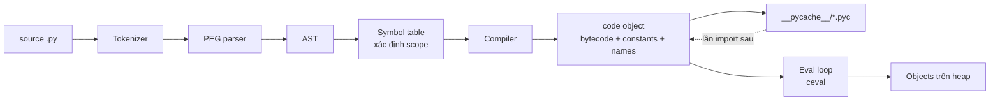
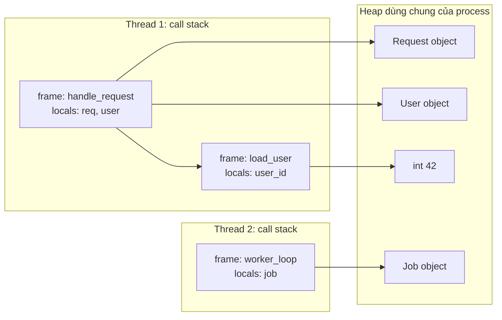
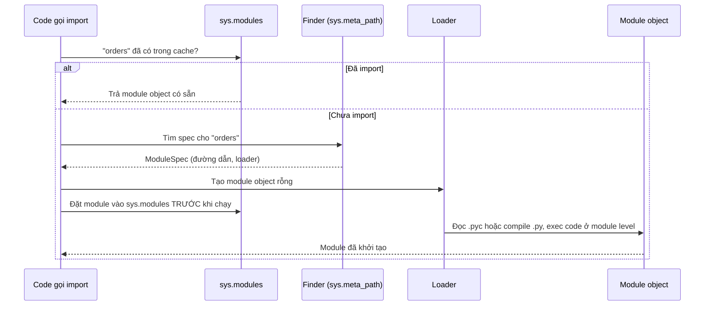

# CPython Runtime: từ source code đến bytecode và eval loop

## 1. Tổng quan

"Python" là một ngôn ngữ, được định nghĩa bởi language reference. **CPython** là implementation chính thức của ngôn ngữ đó, viết bằng C, và là thứ bạn chạy khi gõ `python`. Các implementation khác gồm PyPy (có JIT), GraalPy, MicroPython.

Nhiều hành vi mà người ta hay gọi là "hành vi của Python" thực chất là hành vi của CPython: GIL, reference counting, `id()` là địa chỉ memory, small int cache, cách thread chuyển đổi. Tài liệu này mô tả CPython chạy code thế nào, để các chủ đề như [GIL](../02-python-concurrency/gil.md), [race condition](../02-python-concurrency/race-condition.md), [generator](generators-iterators.md) và [profiling](../17-performance-reliability/profiling-python.md) có một nền chung.

> **Ghi chú version:** Nội dung bám theo CPython 3.11–3.14. Bytecode, cấu trúc frame và cơ chế tối ưu thay đổi đáng kể giữa các minor version. Đừng viết code phụ thuộc vào opcode cụ thể.

## 2. Mental Model

CPython là một **máy ảo dạng stack** (stack-based virtual machine):

- Compiler dịch source thành **bytecode** — một chuỗi lệnh đơn giản cho máy ảo.
- **Eval loop** là một vòng lặp C khổng lồ, lấy từng lệnh bytecode, thực thi, rồi lấy lệnh tiếp theo.
- Mỗi lần gọi function tạo một **frame** chứa local variables và một **value stack** nhỏ để tính toán trung gian.
- Mọi object đều nằm trên **heap**; frame chỉ giữ reference tới chúng.

Một dòng Python như `total += price * qty` không phải một thao tác nguyên tử. Nó là vài lệnh bytecode, và giữa các lệnh đó interpreter có thể chuyển sang thread khác.

## 3. Vì sao cần hiểu runtime?

- Giải thích vì sao `counter += 1` không thread-safe dù có GIL.
- Hiểu vì sao Python code thuần chậm với vòng lặp số học, còn NumPy thì nhanh: mỗi lệnh bytecode tốn chi phí dispatch, type check, refcount.
- Hiểu `RecursionError`, chi phí gọi function, và vì sao Python 3.11+ nhanh hơn đáng kể.
- Đọc được output của profiler, `py-spy dump`, `faulthandler` — tất cả đều nói bằng ngôn ngữ frame và code object.
- Hiểu vì sao import chậm ảnh hưởng tới thời gian khởi động worker và readiness probe.

## 4. Luồng xử lý: từ file `.py` đến kết quả



Các bước:

1. **Tokenizer** chia source thành token (`NAME`, `NUMBER`, `OP`, `INDENT`...).
2. **Parser** (PEG parser từ Python 3.9) dựng cây cú pháp và chuyển thành **AST**. Có thể xem bằng `ast.dump(ast.parse(src))`.
3. **Symbol table** phân tích mỗi name thuộc scope nào: local, global, free (lấy từ enclosing function) hay cell (được inner function dùng). Quyết định này xảy ra lúc compile, không phải lúc chạy — đó là lý do `UnboundLocalError` xuất hiện khi gán cho name trong function mà trước đó lại đọc nó.
4. **Compiler** sinh **code object**: bytecode (`co_code`), hằng số (`co_consts`), tên (`co_names`, `co_varnames`), thông tin closure (`co_freevars`, `co_cellvars`), bảng exception.
5. Khi import module, code object được ghi vào `__pycache__/module.cpython-3XX.pyc`. Lần import sau, nếu source không đổi, CPython bỏ qua bước 1–4.
6. **Eval loop** thực thi bytecode, tạo và thao tác object trên heap.

Code object là bất biến và có thể dùng chung. Function object = code object + globals + defaults + closure. Mỗi lần `def` chạy tạo function object mới nhưng có thể dùng lại cùng code object.

## 5. Bytecode và value stack

```python
import dis

def line_total(price, qty, discount):
    return price * qty - discount

dis.dis(line_total)
```

Output (CPython 3.12, rút gọn):

```text
RESUME          0
LOAD_FAST       0 (price)
LOAD_FAST       1 (qty)
BINARY_OP       5 (*)
LOAD_FAST       2 (discount)
BINARY_OP      10 (-)
RETURN_VALUE
```

Diễn giải theo value stack:

| Lệnh | Value stack sau lệnh |
|---|---|
| `LOAD_FAST price` | `[price]` |
| `LOAD_FAST qty` | `[price, qty]` |
| `BINARY_OP *` | `[price*qty]` — pop 2, push kết quả |
| `LOAD_FAST discount` | `[price*qty, discount]` |
| `BINARY_OP -` | `[result]` |
| `RETURN_VALUE` | pop và trả về caller |

`BINARY_OP *` không biết trước `price` là `int`, `float` hay `Decimal`. Nó phải tra type, gọi slot `nb_multiply` tương ứng, cấp phát object kết quả, cập nhật refcount. Chi phí này lặp lại ở mỗi lệnh, mỗi vòng lặp. Đây là nguồn gốc của "Python chậm" với số học thuần.

### Vì sao `x += 1` không nguyên tử

```python
counter = 0

def incr():
    global counter
    counter += 1
```

```text
LOAD_GLOBAL     counter
LOAD_CONST      1
BINARY_OP       13 (+=)
STORE_GLOBAL    counter
```

Đọc, cộng, ghi là ba bước riêng. Nếu thread A đọc `counter = 5`, bị chuyển sang thread B, B đọc `5`, ghi `6`, rồi A quay lại ghi `6`, một lần tăng bị mất. GIL chỉ đảm bảo mỗi lệnh bytecode chạy trọn vẹn, không bảo đảm một chuỗi lệnh. Xem [Race Condition](../02-python-concurrency/race-condition.md).

## 6. Frame, call stack và heap

### Stack và heap trong Python nghĩa là gì?

Từ "stack" trong Python có ba nghĩa, dễ gây nhầm:

1. **Call stack** — chuỗi frame của các function đang được gọi dở. Mỗi thread có call stack riêng.
2. **Value stack** — vùng nhỏ trong mỗi frame để tính toán trung gian như bảng ở trên.
3. **C stack** — stack của thread OS mà chính interpreter (code C) chạy trên đó.

**Heap** là nơi chứa mọi Python object. Tất cả thread trong một process dùng chung heap. Khác với C/Go, Python không có khái niệm "object nằm trên stack": ngay cả số nguyên cục bộ cũng là object trên heap, frame chỉ giữ reference.



Diễn giải:

1. Mỗi thread có call stack riêng; frame trên cùng là function đang chạy.
2. Local variable trong frame chỉ là reference. `user_id` trỏ tới int object `42` trên heap.
3. Hai thread có thể cùng trỏ tới một object trên heap. Đây là điểm mà shared state và race condition phát sinh.
4. Khi `load_user` return, frame của nó bị hủy, reference tới `42` biến mất; object bị giải phóng nếu không còn ai giữ.

### Frame trong CPython 3.11+

> **Ghi chú version:** Từ 3.11, CPython tách "interpreter frame" (struct C nhẹ, cấp phát liên tiếp trong một vùng nhớ riêng của thread) khỏi "frame object" (`types.FrameType`, chỉ được tạo khi có người cần như traceback, `sys._getframe`, debugger). Việc gọi Python function từ Python function cũng không còn đệ quy trên C stack.

Hệ quả:

- Gọi function rẻ hơn đáng kể so với 3.10 trở về trước.
- Code dùng `inspect.currentframe()` hoặc tracing (`sys.settrace`) buộc CPython "vật chất hóa" frame object, làm chậm lại.
- Generator và coroutine giữ frame của chúng sống qua các lần `yield`/`await`, đó là cách chúng "nhớ" vị trí đang dừng. Xem [Generators](generators-iterators.md).

### Recursion limit

`sys.getrecursionlimit()` mặc định là 1000. Vượt quá sẽ nhận `RecursionError`. Giới hạn này bảo vệ interpreter khỏi tràn C stack. Tăng limit bừa bãi có thể dẫn tới segfault thay vì exception có thể bắt được. Với dữ liệu sâu (cây, graph), chuyển thuật toán đệ quy thành vòng lặp với stack tường minh.

## 7. Internals: eval loop và cơ chế tối ưu

### Eval loop

Trái tim của CPython là function `_PyEval_EvalFrameDefault` trong `Python/ceval.c`. Về khái niệm:

```text
loop:
    instr = next bytecode
    dispatch(instr)          # nhảy tới đoạn C xử lý opcode
    nếu eval_breaker được bật:
        xử lý signal, yêu cầu nhả GIL, GC đã được lên lịch, async exception
    goto loop
```

**Eval breaker** là một cờ được kiểm tra tại một số điểm (đầu function, nhánh nhảy ngược của vòng lặp). Khi thread khác chờ GIL quá lâu, nó bật cờ này; thread đang chạy thấy cờ và nhả GIL. Signal như `SIGINT` cũng chỉ được xử lý tại các điểm này, nên một lời gọi C kéo dài (ví dụ regex phức tạp) không thể bị `Ctrl+C` ngắt ngay.

### Specializing adaptive interpreter (3.11+)

PEP 659 đưa vào cơ chế **specialization**: sau vài lần thực thi, CPython thay lệnh chung bằng phiên bản chuyên biệt dựa trên type quan sát được.

| Lệnh chung | Phiên bản chuyên biệt (ví dụ) | Điều kiện |
|---|---|---|
| `BINARY_OP` | `BINARY_OP_ADD_INT` | Cả hai toán hạng luôn là `int` |
| `LOAD_ATTR` | `LOAD_ATTR_INSTANCE_VALUE` | Attribute nằm ở vị trí cố định của instance |
| `LOAD_GLOBAL` | `LOAD_GLOBAL_MODULE` | Dict globals không đổi version |

Nếu giả định sai (type thay đổi), lệnh "deoptimize" về dạng chung. Hệ quả thực tế: code **monomorphic** (một biến luôn giữ cùng một type) chạy nhanh hơn code đa hình. Đây là một trong các lý do Python 3.11 nhanh hơn 3.10 khoảng 10–60% tùy workload.

### JIT

> **Ghi chú version:** Python 3.13 thêm JIT thử nghiệm kiểu copy-and-patch, mặc định tắt và phải build với cờ riêng. 3.14 tiếp tục ở trạng thái experimental. Ngoài ra 3.14 có "tail-calling interpreter" khi build bằng compiler hỗ trợ, cho cải thiện hiệu năng vài phần trăm. Không nên dựa vào JIT của CPython cho quyết định kiến trúc ở thời điểm này.

## 8. Import system và thời gian khởi động



Diễn giải:

1. `import` luôn kiểm tra `sys.modules` trước. Mỗi module chỉ được thực thi **một lần** mỗi process. Các lần import sau chỉ là tra dict.
2. Nếu chưa có, các finder trong `sys.meta_path` tìm module (file hệ thống, zip, namespace package...).
3. Module object được đặt vào `sys.modules` **trước** khi code của nó chạy. Nhờ vậy import vòng (A import B, B import A) không lặp vô hạn, nhưng B có thể thấy A ở trạng thái khởi tạo dở — nguồn gốc của lỗi `ImportError: cannot import name ... (most likely due to a circular import)`.
4. Loader đọc `.pyc` (hoặc compile `.py`) rồi `exec` code ở module level. Mọi `def`, `class`, decorator, biến global đều được tạo tại bước này.

Trong production, chi phí import cộng dồn thành thời gian khởi động worker. Dùng `python -X importtime -c "import app"` để xem module nào import chậm. Các nguồn chậm phổ biến: load model ML, kết nối network ở module level, đọc file cấu hình lớn, import thư viện nặng không dùng tới.

## 9. Hành vi trong production

**Cold start và readiness.** Worker Gunicorn/Uvicorn chỉ nhận request sau khi import xong application. Import 8 giây nghĩa là mỗi lần rolling update, mỗi pod mới trễ ít nhất 8 giây trước khi sẵn sàng; nếu readiness probe quá gắt, pod bị restart liên tục. Xem [Health Check](../13-kubernetes/health-check.md).

**Pre-fork và copy-on-write.** Gunicorn có thể import app trong master rồi fork worker (`--preload`). Các page memory được chia sẻ copy-on-write. Nhưng reference counting ghi vào header của object mỗi khi có reference mới, nên page chứa object bị "chạm" sẽ bị copy. Đây là lý do `gc.freeze()` (3.7+) tồn tại: chuyển object hiện có ra khỏi tầm của GC để GC không ghi vào chúng sau khi fork. Immortal object (3.12+) cũng giảm vấn đề này cho các singleton.

**Hiệu năng theo version.** Nâng cấp từ 3.10 lên 3.11+ thường cho lợi ích CPU miễn phí. Nhưng C extension cần wheel tương thích với version mới; free-threaded build (`python3.14t`) cần extension build riêng.

**Signal và shutdown.** `SIGTERM` được xử lý bởi main thread tại điểm eval breaker. Nếu main thread đang block trong một lời gọi C dài không nhả control, graceful shutdown bị trễ đến khi lời gọi kết thúc hoặc bị kill sau grace period.

## 10. Failure Modes

| Failure | Nguyên nhân | Cách nhận biết |
|---|---|---|
| Worker khởi động chậm, probe fail | Import nặng, network call ở module level | `-X importtime`, log thời điểm ready |
| `RecursionError` | Đệ quy sâu trên dữ liệu người dùng (JSON lồng nhau, cây) | Traceback lặp lại cùng function |
| Circular import | Hai module import nhau ở top-level | `ImportError ... partially initialized module` |
| CPU cao với code "đơn giản" | Vòng lặp Python thuần trên dữ liệu lớn | Profiler cho thấy thời gian nằm trong Python frame, không trong I/O |
| RSS tăng sau fork dù dùng `--preload` | Refcount/GC ghi vào page được chia sẻ | So sánh USS/PSS giữa các worker |

## 11. Trade-offs

| Lựa chọn | Lợi ích | Chi phí |
|---|---|---|
| Interpreter bytecode | Khởi động nhanh, dễ debug, portable | Chậm hơn native với CPU-bound |
| C extension / NumPy / Rust (PyO3) | Hiệu năng gần native, có thể nhả GIL | Build phức tạp, crash khó debug, cần wheel theo platform |
| PyPy | JIT nhanh cho code thuần Python chạy lâu | Tương thích C extension hạn chế, warm-up, memory lớn hơn |
| Free-threaded CPython | Thread chạy song song thật | Hiệu năng single-thread thấp hơn một chút, ecosystem còn chuyển đổi |

## 12. Sai lầm thường gặp

- Cho rằng một dòng Python là một thao tác nguyên tử.
- Cho rằng biến local "nằm trên stack" như C. Object luôn ở heap.
- Nhầm Python (ngôn ngữ) với CPython (implementation) khi nói về GIL, refcount, `id`.
- Tăng `sys.setrecursionlimit` để "sửa" `RecursionError` thay vì đổi thuật toán.
- Đặt code khởi tạo đắt (kết nối DB, tải model) ở module level thay vì trong lifespan/startup hook có kiểm soát.

## 13. Cách debug trong production

- **`dis.dis(func)`**: xem bytecode để hiểu một thao tác gồm bao nhiêu bước.
- **`py-spy dump --pid <PID>`**: in call stack của mọi thread trong process đang chạy mà không cần sửa code. Rất hữu ích khi worker bị treo.
- **`py-spy top` / `py-spy record`**: sampling profiler, xem function nào tốn CPU. Chi tiết ở [Profiling Python](../17-performance-reliability/profiling-python.md).
- **`faulthandler`**: `python -X faulthandler` hoặc `faulthandler.dump_traceback_later(timeout)` để in traceback của mọi thread khi segfault hoặc khi bị treo quá lâu.
- **`python -X importtime`**: đo thời gian import từng module.
- **`sys._current_frames()`**: lấy frame hiện tại của mọi thread từ bên trong process (dùng cho endpoint debug nội bộ).

## 14. Best Practices

- Viết code monomorphic ở hot path: một biến giữ một type, attribute được khởi tạo đầy đủ trong `__init__` theo cùng thứ tự.
- Đẩy vòng lặp số học nặng xuống thư viện native (NumPy, Polars, thư viện C/Rust) thay vì tối ưu vi mô bằng Python.
- Giữ import time thấp; khởi tạo tài nguyên trong lifespan của application để có thể log, timeout và retry.
- Ghi rõ version CPython trong image và lockfile; test hiệu năng khi nâng version.
- Luôn bật khả năng lấy stack trace của process đang chạy (py-spy trong image debug, hoặc `faulthandler`).

## 15. Tóm tắt

- CPython compile source → AST → code object chứa bytecode, rồi eval loop thực thi từng lệnh.
- CPython là stack VM: mỗi frame có locals và value stack; mọi object ở heap dùng chung giữa các thread.
- Một dòng Python là nhiều lệnh bytecode; thread có thể bị chuyển giữa các lệnh.
- Eval breaker là điểm interpreter xử lý signal, nhả GIL và chạy GC.
- 3.11+ có specialization làm code nhanh hơn, đặc biệt với code monomorphic; JIT và free-threading vẫn đang phát triển.
- Import chạy code module level một lần mỗi process và ảnh hưởng trực tiếp đến thời gian khởi động worker.

## Liên quan

- [Python Object Model](object-model.md)
- [Python Memory Model](python-memory-model.md)
- [Global Interpreter Lock](../02-python-concurrency/gil.md)
- [Race Condition](../02-python-concurrency/race-condition.md)
- [Profiling Python](../17-performance-reliability/profiling-python.md)
