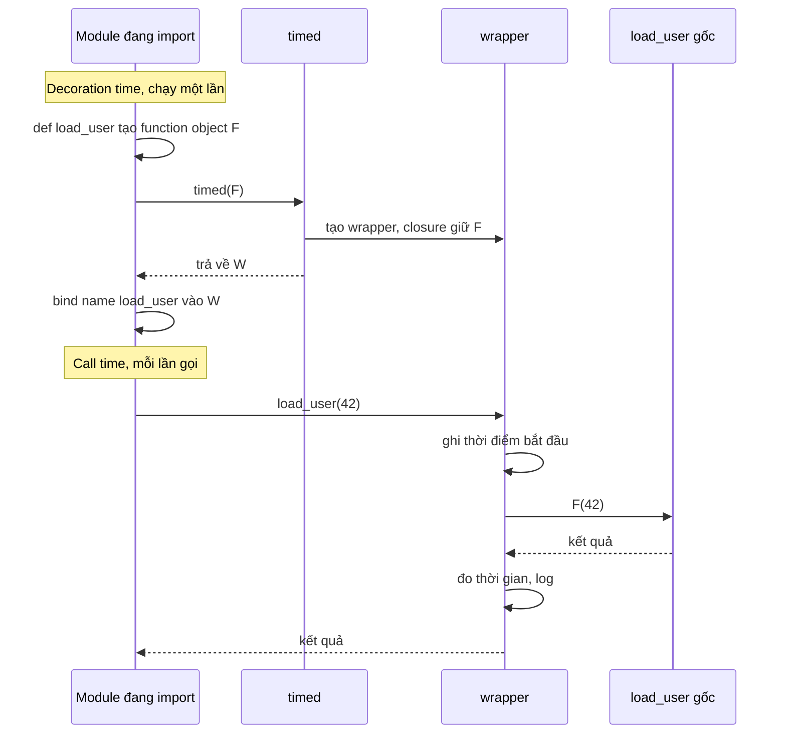

# Decorators

## 1. Tổng quan

Decorator là một callable nhận vào một function (hoặc class) và trả về một callable thay thế. Cú pháp `@decorator` chỉ là cách viết ngắn:

```python
@timed
def load_user(user_id): ...

# tương đương chính xác với
def load_user(user_id): ...
load_user = timed(load_user)
```

Decorator có mặt ở khắp nơi trong backend Python: `@app.get` của FastAPI, `@app.task` của Celery, `@pytest.fixture`, `@functools.lru_cache`, `@property`, `@dataclass`, retry, đo thời gian, kiểm tra quyền. Không có phép màu nào: decorator chỉ dựa trên ba tính chất của Python — function là object, closure giữ state, và `@` là cú pháp gán lại name.

## 2. Mental Model

> Decorator thay thế function gốc bằng một function khác, thường là một **wrapper** bọc quanh function gốc. Name `load_user` sau khi decorate trỏ tới wrapper, không còn trỏ tới function bạn viết.

Có hai thời điểm tách biệt:

- **Decoration time** — khi câu lệnh `def` chạy (thường lúc import module). Decorator được gọi đúng **một lần**.
- **Call time** — mỗi lần code gọi `load_user(...)`. Wrapper được gọi, và wrapper quyết định có gọi function gốc hay không, gọi thế nào.

## 3. Vì sao cần decorator?

Decorator giải quyết bài toán **cross-cutting concern**: logic lặp lại ở nhiều function nhưng không thuộc về nghiệp vụ của function đó — đo thời gian, log, retry, cache, kiểm tra quyền, đăng ký route. Thay vì chèn cùng một đoạn code vào 50 function, bạn viết một lần và áp dụng bằng một dòng.

Cái giá là một tầng gián tiếp: khi đọc function, bạn phải biết decorator làm gì với nó.

## 4. Nền tảng: first-class function và closure

Function trong Python là object thông thường:

```python
def greet(name):
    return f"hi {name}"

f = greet                 # gán cho name khác
f("An")                   # gọi qua name khác
handlers = {"greet": greet}   # lưu trong dict
greet.__name__            # 'greet' — có attribute
```

Vì function là object, nó có thể được **truyền vào** một function khác và được **trả về** từ function khác. Kết hợp với [closure](closures.md) — function trong giữ reference tới biến của function ngoài — ta có decorator:

```python
import functools
import time

def timed(func):                          # nhận function gốc
    @functools.wraps(func)
    def wrapper(*args, **kwargs):         # function thay thế
        start = time.perf_counter()
        try:
            return func(*args, **kwargs)  # func lấy từ closure
        finally:
            elapsed = time.perf_counter() - start
            print(f"{func.__qualname__} took {elapsed * 1000:.1f} ms")
    return wrapper                        # trả về function thay thế
```

`wrapper` giữ `func` trong closure cell. Mỗi lần gọi `timed(some_func)` tạo một `wrapper` mới với cell riêng trỏ tới `some_func`.

## 5. Luồng xử lý: decoration time và call time



Diễn giải:

1. Khi module được import, `def load_user` tạo function object gốc.
2. Ngay sau đó `timed` được gọi với function gốc. `timed` tạo `wrapper`, đóng gói function gốc trong closure, và trả `wrapper` về.
3. Name `load_user` trong module được gắn vào `wrapper`. Function gốc chỉ còn truy cập được qua closure (và `wrapper.__wrapped__` nếu dùng `functools.wraps`).
4. Mỗi lần gọi `load_user(42)`, thực chất là gọi `wrapper(42)`. Wrapper làm việc trước, gọi function gốc, làm việc sau, rồi trả kết quả.

Hệ quả: code bên trong decorator nhưng **ngoài** wrapper chạy lúc import. Nếu decorator đọc config, kết nối network hoặc đăng ký vào registry, những việc đó xảy ra lúc import.

## 6. Decorator có argument

`@retry(times=3)` có thêm một tầng: `retry(times=3)` được gọi trước, trả về decorator thực sự.

```python
def retry(times: int, exceptions: tuple[type[Exception], ...]):
    def decorator(func):                          # tầng 2: decorator thật
        @functools.wraps(func)
        def wrapper(*args, **kwargs):             # tầng 3: wrapper
            for attempt in range(1, times + 1):
                try:
                    return func(*args, **kwargs)
                except exceptions:
                    if attempt == times:
                        raise
        return wrapper
    return decorator                              # tầng 1 trả decorator

@retry(times=3, exceptions=(ConnectionError,))
def fetch(): ...
# tương đương: fetch = retry(times=3, exceptions=(ConnectionError,))(fetch)
```

Ba tầng closure: `wrapper` thấy `func` (tầng 2) và `times`, `exceptions` (tầng 1). Decorator retry thực tế cần thêm backoff, jitter và giới hạn tổng thời gian — xem [Retry](../10-distributed-systems/retry.md); ví dụ trên chỉ minh họa cấu trúc.

## 7. `functools.wraps` giải quyết vấn đề gì?

Không có `wraps`, function sau khi decorate mang danh tính của wrapper:

```python
load_user.__name__        # 'wrapper'
load_user.__doc__         # None
inspect.signature(load_user)   # (*args, **kwargs)
```

`functools.wraps(func)` sao chép `__module__`, `__name__`, `__qualname__`, `__doc__`, `__annotations__` (và `__type_params__` từ 3.12) từ function gốc sang wrapper, cập nhật `__dict__`, và gán `wrapper.__wrapped__ = func`.

Vì sao điều này quan trọng trong backend:

| Hệ thống | Phụ thuộc vào |
|---|---|
| FastAPI | `inspect.signature` (đi theo `__wrapped__`) để biết tham số, dependency, kiểu dữ liệu. Mất signature → FastAPI không biết endpoint nhận gì |
| Celery | Tên task mặc định từ `__module__` + `__name__`; tên sai gây trùng hoặc không tìm thấy task |
| Log, metric, trace | Tên function để gắn nhãn |
| pickle | Serialize function bằng tên đầy đủ |
| pytest, debugger, docs | `__name__`, `__doc__`, signature |

## 8. Decorator cho async function

Decorator đồng bộ áp lên coroutine function sẽ đo sai:

```python
@timed                      # wrapper đồng bộ
async def fetch_user(): ...

await fetch_user()
```

`wrapper` gọi `func(...)` — với coroutine function, lời gọi chỉ **tạo coroutine object** và trả về ngay, chưa chạy gì. `timed` đo khoảng thời gian gần bằng 0, rồi caller `await` coroutine bên ngoài wrapper.

Decorator cho async phải có wrapper async:

```python
import inspect

def timed(func):
    if inspect.iscoroutinefunction(func):
        @functools.wraps(func)
        async def async_wrapper(*args, **kwargs):
            start = time.perf_counter()
            try:
                return await func(*args, **kwargs)
            finally:
                record(func.__qualname__, time.perf_counter() - start)
        return async_wrapper

    @functools.wraps(func)
    def sync_wrapper(*args, **kwargs):
        start = time.perf_counter()
        try:
            return func(*args, **kwargs)
        finally:
            record(func.__qualname__, time.perf_counter() - start)
    return sync_wrapper
```

Ngược lại, decorator có wrapper async nhưng bên trong làm việc blocking (`time.sleep`, `requests.get`) sẽ block event loop. Xem [Sync vs Async Endpoint](../03-fastapi/sync-vs-async-endpoint.md).

## 9. Nhiều decorator chồng nhau

```python
@a
@b
def f(): ...
# f = a(b(f))
```

- **Áp dụng** từ dưới lên: `b` bọc `f` trước, `a` bọc kết quả.
- **Thực thi** từ ngoài vào: gọi `f()` chạy phần "trước" của `a`, rồi của `b`, rồi `f`, rồi phần "sau" của `b`, rồi của `a`.

Thứ tự quan trọng trong thực tế:

```python
@app.get("/orders/{order_id}")
@require_role("admin")          # phải nằm DƯỚI @app.get
async def get_order(order_id: int): ...
```

`@app.get` đăng ký function **nó nhận được** vào router. Nếu `require_role` nằm trên `@app.get`, router đăng ký function chưa được bọc — kiểm tra quyền không bao giờ chạy. Và `require_role` phải dùng `functools.wraps` để FastAPI vẫn đọc được signature. Trong FastAPI, kiểm tra quyền thường nên làm bằng [dependency](../03-fastapi/dependency-injection.md) thay vì decorator.

## 10. Decorator không bọc function

Không phải decorator nào cũng trả wrapper. Một số chỉ **đăng ký** function rồi trả về nguyên bản:

```python
ROUTES = {}

def route(path):
    def decorator(func):
        ROUTES[path] = func      # side effect lúc import
        return func              # trả nguyên function gốc
    return decorator
```

`@app.get`, `@app.task`, `@pytest.fixture`, `@atexit.register` đều thuộc dạng này (kèm thêm xử lý). Hệ quả: route/task chỉ tồn tại nếu module chứa nó **được import**. Quên import module → endpoint 404 hoặc Celery báo "unregistered task".

Class decorator hoạt động tương tự với class: `@dataclass` nhận class, sinh thêm `__init__`, `__repr__`, `__eq__`, rồi trả về chính class đó.

## 11. Internals: decorator dạng class và vấn đề method binding

Decorator có thể là class có `__call__`:

```python
class CountCalls:
    def __init__(self, func):
        functools.update_wrapper(self, func)
        self.func = func
        self.calls = 0
    def __call__(self, *args, **kwargs):
        self.calls += 1
        return self.func(*args, **kwargs)
```

Áp lên function bình thường thì chạy. Áp lên **method** thì hỏng: `obj.method(...)` không truyền `self` vì instance của `CountCalls` không phải descriptor. Function thường tự trở thành bound method nhờ `function.__get__` (xem [Descriptors](descriptors.md)); class decorator muốn làm việc với method phải tự định nghĩa `__get__`. Đây là lý do decorator dạng function (trả về function) phổ biến hơn.

## 12. Hành vi trong production

**`lru_cache` trên method giữ instance sống.** `@functools.lru_cache` trên method dùng `self` làm một phần của key. Cache giữ reference tới mọi `self` từng gọi — object không bao giờ được giải phóng cho đến khi bị đẩy khỏi cache (hoặc mãi mãi nếu `maxsize=None`). Dùng `functools.cached_property` cho giá trị tính một lần trên instance, hoặc cache ở module level với key tường minh.

**Cache decorator không có giới hạn.** `lru_cache(maxsize=None)` với key là input của người dùng là một memory leak có kiểm soát.

**Decorator nuốt exception.** Wrapper `try/except Exception: log; return None` biến lỗi thành giá trị `None` hợp lệ, lỗi lộ ra ở chỗ khác, xa nguyên nhân. Nếu bắt exception để log, hãy `raise` lại.

**Chi phí gọi.** Mỗi tầng decorator thêm một lần gọi function và `*args/**kwargs` packing. Không đáng kể với endpoint gọi DB, nhưng đáng kể trong vòng lặp nóng gọi hàng triệu lần.

**Import side effect.** Decorator đăng ký (routes, tasks, signal handlers) chạy lúc import. Import thiếu → tính năng biến mất; import hai lần dưới hai tên module khác nhau → đăng ký trùng.

## 13. Failure Modes

| Failure | Nguyên nhân | Dấu hiệu |
|---|---|---|
| FastAPI không nhận tham số | Wrapper thiếu `functools.wraps` | Endpoint yêu cầu `args`, `kwargs` trong OpenAPI, lỗi 422 |
| Kiểm tra quyền không chạy | Decorator đặt trên `@app.get` | Endpoint truy cập được không cần quyền |
| Đo thời gian ≈ 0 ms | Wrapper sync bọc async function | Metric latency gần 0 dù endpoint chậm |
| Event loop bị block | Wrapper async gọi code blocking | Latency tăng cho mọi request cùng worker |
| Memory tăng | `lru_cache` không giới hạn hoặc trên method | Object không được giải phóng |
| Task Celery "unregistered" | Module chứa `@app.task` không được worker import | Lỗi khi worker nhận message |

## 14. Trade-offs

| Lựa chọn | Lợi ích | Chi phí |
|---|---|---|
| Decorator | Tái sử dụng cross-cutting concern, khai báo ngắn | Ẩn hành vi, thêm tầng gián tiếp, khó debug |
| Gọi tường minh trong thân function | Rõ ràng, dễ đọc | Lặp code |
| Dependency Injection (FastAPI) | Tích hợp với framework, test override dễ | Chỉ áp dụng trong framework |
| Middleware | Áp dụng cho mọi request | Không phân biệt theo endpoint dễ dàng |
| Context manager | Phạm vi tường minh, dùng cho một khối code | Phải viết ở từng chỗ dùng |

## 15. Sai lầm thường gặp

- Quên `functools.wraps`.
- Dùng wrapper sync cho async function hoặc ngược lại.
- Đặt decorator tùy biến sai thứ tự với decorator đăng ký của framework.
- Viết decorator có argument nhưng dùng không có ngoặc (`@retry` thay vì `@retry()`), khiến function bị truyền vào vị trí tham số `times`.
- Đặt logic đắt trong phần decoration time mà không nhận ra nó chạy lúc import.
- Dùng decorator dạng class cho method mà không cài `__get__`.

## 16. Cách debug

- `func.__wrapped__` để lấy function gốc; `inspect.unwrap(func)` để bóc mọi tầng.
- `inspect.signature(func)` để kiểm tra signature mà framework nhìn thấy.
- `func.__qualname__`, `func.__module__` để kiểm tra danh tính sau decorate.
- Stack trace chứa `wrapper` nhiều tầng: xác định tầng nào thêm hành vi bất thường.
- Với route/task không xuất hiện: kiểm tra module có được import không (`sys.modules`), danh sách route (`app.routes`), danh sách task (`celery_app.tasks`).

## 17. Best Practices

- Luôn dùng `functools.wraps` cho wrapper.
- Hỗ trợ cả sync và async nếu decorator dùng chung, hoặc giới hạn rõ ràng một loại.
- Decorator không nên đổi ngữ nghĩa trả về hoặc nuốt exception mà không có lý do rõ.
- Giữ decoration time nhẹ; không làm I/O lúc import.
- Với cache, luôn đặt giới hạn và cân nhắc lifetime của key.
- Trong framework có DI (FastAPI), ưu tiên dependency cho auth, DB session, rate limit; dùng decorator cho concern thuần Python (metric, retry nội bộ).
- Type decorator bằng `ParamSpec` và `TypeVar` (Python 3.10+) để type checker giữ được signature. Xem [Typing](typing.md).

## 18. Tóm tắt

- Decorator là callable nhận function và trả callable thay thế; `@d` tương đương `f = d(f)`.
- Decorator dựa trên function là object và closure giữ state.
- Decoration time (lúc import, một lần) khác call time (mỗi lần gọi).
- Decorator có argument là decorator factory: thêm một tầng function.
- `functools.wraps` giữ danh tính và signature, bắt buộc với FastAPI, Celery, logging.
- Wrapper phải khớp bản chất sync/async của function được bọc.

## Liên quan

- [Scope, LEGB và Closure](closures.md)
- [Descriptors](descriptors.md)
- [Typing](typing.md)
- [Dependency Injection trong FastAPI](../03-fastapi/dependency-injection.md)
- [Retry](../10-distributed-systems/retry.md)
