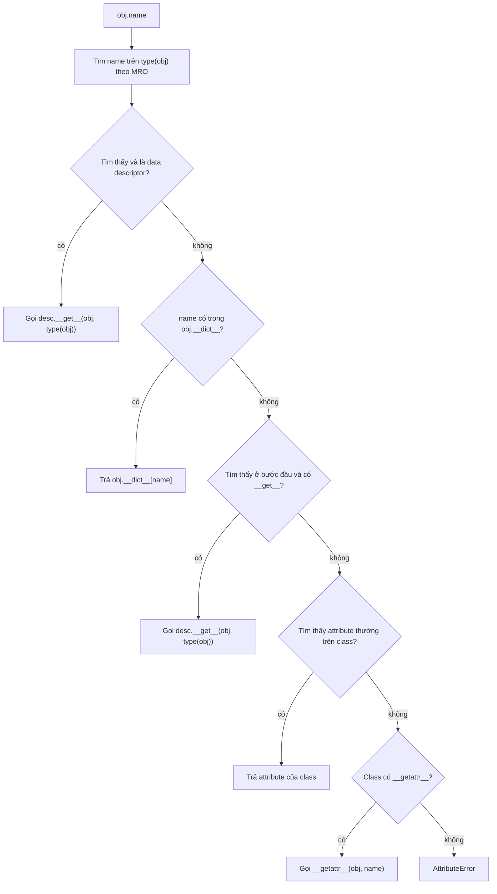
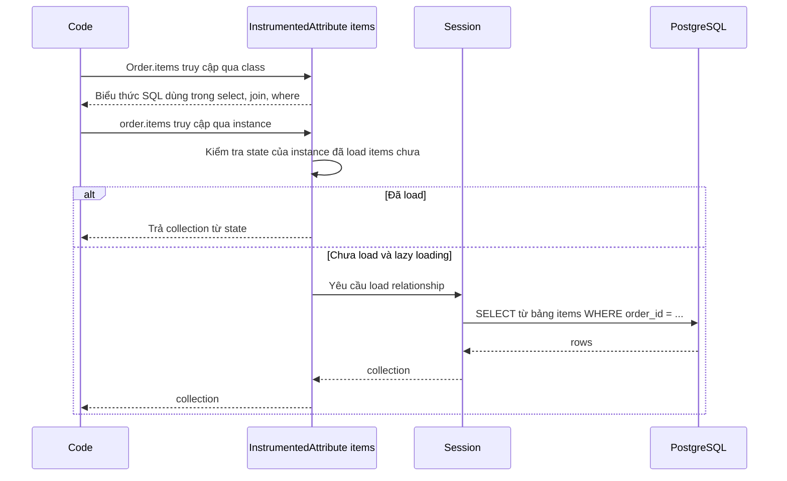

# Descriptors

## 1. Tổng quan

Descriptor là object định nghĩa một hoặc nhiều method `__get__`, `__set__`, `__delete__`, và được đặt làm **attribute của class**. Khi code truy cập attribute đó qua instance hoặc class, Python không trả về descriptor mà gọi method tương ứng của nó.

Descriptor là cơ chế ẩn sau rất nhiều thứ quen thuộc:

- **Method**: function là descriptor; nhờ đó `obj.method` trở thành bound method có `self`.
- `property`, `classmethod`, `staticmethod`, `functools.cached_property`.
- `__slots__`: mỗi slot là một descriptor.
- Column của SQLAlchemy ORM: `User.email == "a@b.c"` sinh biểu thức SQL, còn `user.email` trả về giá trị — cùng một attribute, hai hành vi.
- Lazy loading relationship của ORM: truy cập `order.items` có thể phát sinh câu SQL.

Hiểu descriptor là hiểu `obj.attr` thực sự làm gì.

## 2. Mental Model

> Attribute trên class có thể là một "người gác cổng". Khi bạn đọc/ghi attribute đó, bạn không chạm trực tiếp vào dữ liệu mà nói chuyện với người gác cổng, và người gác cổng quyết định trả gì, lưu ở đâu, có tính toán hay gọi database không.

Hai loại người gác cổng:

- **Data descriptor** (có `__set__` hoặc `__delete__`): quyền ưu tiên cao nhất, instance `__dict__` không thể che nó. Ví dụ `property`.
- **Non-data descriptor** (chỉ có `__get__`): nhường cho instance `__dict__` nếu instance có cùng tên. Ví dụ function (method), `cached_property`.

## 3. Vì sao cần?

- Tái sử dụng logic truy cập attribute (validation, chuyển đổi, lazy load, ghi log thay đổi) cho nhiều attribute và nhiều class, điều mà `property` viết tay từng cái không làm được gọn.
- Giải thích hành vi mà nếu không biết sẽ rất khó hiểu: vì sao method có `self`, vì sao `cached_property` chỉ tính một lần, vì sao truy cập attribute ORM lại gây query, vì sao `MissingGreenlet` xuất hiện khi dùng SQLAlchemy async.

## 4. Giao thức descriptor

```python
class Descriptor:
    def __set_name__(self, owner, name): ...        # 3.6+: gọi khi class được tạo
    def __get__(self, instance, owner=None): ...    # đọc
    def __set__(self, instance, value): ...         # ghi
    def __delete__(self, instance): ...             # xóa
```

- `instance` là object được truy cập qua (`obj` trong `obj.attr`), hoặc `None` khi truy cập qua class (`Cls.attr`).
- `owner` là class.
- `__set_name__` cho descriptor biết tên attribute mà nó được gán, tránh phải truyền tên thủ công.

## 5. Internals: thuật toán attribute lookup

Khi đọc `obj.name`, `type(obj).__getattribute__(obj, "name")` được gọi. Với `object.__getattribute__` mặc định:



Diễn giải:

1. Python **luôn tìm trên type trước**, theo MRO. Kết quả được nhớ lại để dùng ở các bước sau.
2. Nếu đó là data descriptor, nó thắng tuyệt đối — kể cả khi `obj.__dict__` có key cùng tên. Đây là lý do `property` không bị che.
3. Nếu không, instance `__dict__` được xét. Có key thì trả về.
4. Nếu attribute trên class là non-data descriptor (function, `cached_property`), gọi `__get__`.
5. Nếu là attribute thường trên class (hằng số, list), trả về nguyên giá trị.
6. Không tìm thấy ở đâu: `__getattr__` (nếu có) là cơ hội cuối; không thì `AttributeError`.

Với ghi `obj.name = value`: nếu type có data descriptor tên `name`, gọi `desc.__set__(obj, value)`; nếu không, ghi thẳng vào `obj.__dict__`.

Truy cập qua class (`Cls.name`) đi qua `type.__getattribute__`, xét metaclass trước rồi đến MRO của class, và gọi `desc.__get__(None, Cls)`.

## 6. Method hoạt động thế nào?

Function là **non-data descriptor**. `function.__get__(instance, owner)`:

- Nếu `instance` là `None` (truy cập qua class): trả về chính function.
- Ngược lại: trả về **bound method** — object gói function và `instance`. Khi gọi bound method, `instance` được chèn làm argument đầu tiên.

```python
class Order:
    def total(self):
        return 100

o = Order()
Order.__dict__["total"]          # <function Order.total>
Order.total                       # <function Order.total> — instance là None
o.total                           # <bound method Order.total of <Order>>
o.total.__self__ is o             # True
o.total.__func__ is Order.total   # True
o.total()  # == Order.total(o)
```

Không có gì đặc biệt trong ngôn ngữ về `self`; đó chỉ là argument đầu tiên được descriptor chèn vào. `classmethod` là descriptor chèn `owner` thay vì `instance`; `staticmethod` là descriptor không chèn gì.

> **Ghi chú version:** CPython tối ưu lời gọi `obj.method()` để không thực sự tạo bound method object (lệnh `LOAD_ATTR` với cờ method, trước 3.12 là `LOAD_METHOD`). Ngữ nghĩa vẫn như mô tả.

## 7. Ví dụ: descriptor validation tái sử dụng

```python
class Positive:
    def __set_name__(self, owner, name):
        self.private_name = "_" + name

    def __get__(self, instance, owner=None):
        if instance is None:
            return self
        return getattr(instance, self.private_name)

    def __set__(self, instance, value):
        if value <= 0:
            raise ValueError(f"{self.private_name[1:]} must be positive")
        setattr(instance, self.private_name, value)

class LineItem:
    quantity = Positive()
    unit_price = Positive()

    def __init__(self, quantity, unit_price):
        self.quantity = quantity        # đi qua Positive.__set__
        self.unit_price = unit_price
```

- Descriptor instance nằm trên **class**, dùng chung cho mọi `LineItem`. State của từng instance phải lưu **trên instance** (`_quantity`), không lưu trên descriptor — nếu lưu `self.value` trong descriptor, mọi instance sẽ dùng chung một giá trị.
- `__set_name__` giúp descriptor biết tên `quantity`, `unit_price` mà không phải truyền vào.
- `if instance is None: return self` cho phép introspection qua class (`LineItem.quantity`).

Trong code thực tế, validation kiểu này thường do Pydantic hoặc dataclass + `__post_init__` đảm nhận; descriptor phù hợp khi xây framework hoặc thư viện.

## 8. `property` và `cached_property`

`property` là data descriptor viết bằng C: `__get__` gọi getter, `__set__` gọi setter (hoặc raise `AttributeError` nếu không có setter).

`functools.cached_property` là **non-data descriptor**:

1. Lần đầu `obj.attr`: không có trong `obj.__dict__`, descriptor chạy function và **ghi kết quả vào `obj.__dict__["attr"]`**.
2. Lần sau: lookup tìm thấy trong `obj.__dict__` ở bước 3 của thuật toán — descriptor không được gọi nữa. Chi phí gần bằng đọc dict.
3. `del obj.attr` xóa khỏi `__dict__`, lần sau tính lại.

Hệ quả:

- Không dùng được với class có `__slots__` không chứa `__dict__`.
- > **Ghi chú version:** Trước 3.12, `cached_property` có lock nội bộ (nhưng lock dùng chung cho mọi instance, gây contention). Từ 3.12 lock bị bỏ: nhiều thread có thể cùng tính giá trị lần đầu. Nếu hàm tính toán có side effect hoặc rất đắt, cần tự đồng bộ.

## 9. Bên trong ORM: descriptor làm gì với `order.items`?

SQLAlchemy gắn mỗi mapped attribute bằng một `InstrumentedAttribute` — một data descriptor.



Diễn giải:

1. Truy cập qua class (`instance is None`): descriptor trả về đối tượng biểu thức để xây câu query — `select(Order).where(Order.status == "paid")`.
2. Truy cập qua instance: descriptor kiểm tra state đã có dữ liệu chưa.
3. Nếu chưa và strategy là lazy loading, descriptor **phát sinh câu SQL ngay tại dòng đọc attribute**.

Đây là gốc rễ của [N+1 query](../05-sqlalchemy/n-plus-one.md): vòng lặp `for o in orders: o.items` trông vô hại nhưng mỗi lần đọc attribute là một round trip tới database. Với SQLAlchemy async, lazy loading kiểu này không thể `await` được từ một lần đọc attribute đồng bộ, nên sinh lỗi `MissingGreenlet`. Xem [Async SQLAlchemy](../05-sqlalchemy/async-sqlalchemy.md).

## 10. `__slots__`

```python
class Point:
    __slots__ = ("x", "y")
```

Khi class định nghĩa `__slots__`, Python không tạo `__dict__` cho instance. Mỗi tên trong `__slots__` trở thành một **member descriptor** trên class, đọc/ghi vào một vị trí cố định trong struct của instance.

- Memory giảm đáng kể (không có dict mỗi instance).
- Truy cập nhanh hơn một chút.
- Không thể thêm attribute ngoài danh sách; `cached_property` không dùng được.
- `@dataclass(slots=True)` (3.10+) sinh `__slots__` tự động.

## 11. Hành vi trong production

- **Property làm I/O là cái bẫy.** `user.permissions` trông như đọc field, nhưng nếu property gọi database hoặc HTTP, một vòng lặp đơn giản tạo ra hàng trăm lời gọi. Tên attribute không báo hiệu chi phí; dùng method với tên động từ (`load_permissions()`) cho thao tác có I/O.
- **Lazy loading ẩn trong template/serializer.** Serializer duyệt qua object ORM và truy cập relationship, sinh N+1 mà code nghiệp vụ không hề thấy.
- **`__getattr__` che lỗi đánh máy.** Proxy object với `__getattr__` trả về giá trị mặc định cho mọi tên chưa biết khiến `obj.stauts` (gõ sai) không báo lỗi.
- **Descriptor lưu state trên chính nó.** Descriptor là object dùng chung cho mọi instance; state lưu trên descriptor bị chia sẻ giữa mọi instance và mọi thread.

## 12. Failure Modes

| Failure | Cơ chế | Dấu hiệu |
|---|---|---|
| N+1 query | Relationship lazy load qua descriptor trong vòng lặp | Số query tỷ lệ với số row |
| `MissingGreenlet` | Lazy load đồng bộ trong context async | Exception khi truy cập relationship sau khi query async |
| Giá trị dùng chung giữa instance | Descriptor lưu state trên chính nó | Sửa một object làm thay đổi object khác |
| `RecursionError` trong `__getattr__`/`__getattribute__` | Truy cập `self.x` bên trong chính hàm lookup | Stack overflow khi đọc attribute |
| Tính toán lặp trong `cached_property` | Nhiều thread cùng truy cập lần đầu (3.12+) | Side effect chạy nhiều lần |

## 13. Trade-offs

| Cách | Khi phù hợp | Chi phí |
|---|---|---|
| Attribute thường | Dữ liệu đơn giản | Không kiểm soát được |
| `property` | Logic cho một attribute cụ thể, tính toán rẻ | Chạy function mỗi lần đọc |
| `cached_property` | Tính một lần, đắt, instance sống ngắn | Không tự invalidate, cần `__dict__` |
| Descriptor tùy biến | Cùng logic cho nhiều attribute/class, framework | Khó đọc, người dùng không nhận ra hành vi ẩn |
| `__getattr__` | Proxy, lazy module, backward compat | Che lỗi, chậm hơn, khó cho type checker |

## 14. Sai lầm thường gặp

- Nghĩ `self` là từ khóa đặc biệt thay vì argument được descriptor chèn.
- Nhầm `__getattr__` (chỉ gọi khi lookup thất bại) với `__getattribute__` (gọi cho mọi lookup).
- Lưu state per-instance trên descriptor.
- Đặt I/O trong property.
- Quên xử lý `instance is None` trong `__get__`.

## 15. Cách debug

- `inspect.getattr_static(obj, "name")` trả về thứ nằm trong dict mà không kích hoạt descriptor.
- `type(obj).__mro__` và `vars(cls)` cho từng class trong MRO để tìm attribute được định nghĩa ở đâu.
- `hasattr(type(attr), "__set__")` để biết là data hay non-data descriptor.
- Với ORM: bật log SQL (`echo=True` hoặc logger `sqlalchemy.engine`) và đếm số query mỗi request; `sqlalchemy.inspect(obj).unloaded` liệt kê attribute chưa được load.

## 16. Best Practices

- Dùng `property` cho tính toán rẻ, không I/O; dùng method có tên động từ cho thao tác đắt.
- Với ORM, chọn loading strategy tường minh (`selectinload`, `joinedload`) và cân nhắc `lazy="raise"` để lazy load ngoài ý muốn trở thành lỗi rõ ràng.
- Descriptor tùy biến lưu state trên instance, dùng `__set_name__` để lấy tên.
- Tránh `__getattr__` ở domain model; nếu dùng, raise `AttributeError` cho tên không được hỗ trợ.
- Cân nhắc `__slots__`/`dataclass(slots=True)` cho object nhỏ tạo với số lượng lớn.

## 17. Tóm tắt

- Descriptor là attribute của class có `__get__`/`__set__`/`__delete__`, can thiệp vào việc đọc/ghi attribute.
- Thứ tự lookup: data descriptor trên type → instance `__dict__` → non-data descriptor → attribute class → `__getattr__`.
- Function là non-data descriptor; `__get__` tạo bound method, đó là nguồn gốc của `self`.
- `property` là data descriptor; `cached_property` là non-data descriptor ghi kết quả vào instance dict.
- ORM dùng descriptor để vừa xây biểu thức SQL (qua class) vừa lazy load dữ liệu (qua instance) — nguồn gốc của N+1 và `MissingGreenlet`.

## Liên quan

- [Python Object Model](object-model.md)
- [Dunder Methods](dunder-methods.md)
- [Decorators](decorators.md)
- [N+1 Query](../05-sqlalchemy/n-plus-one.md)
- [Relationship Loading](../05-sqlalchemy/relationship-loading.md)
