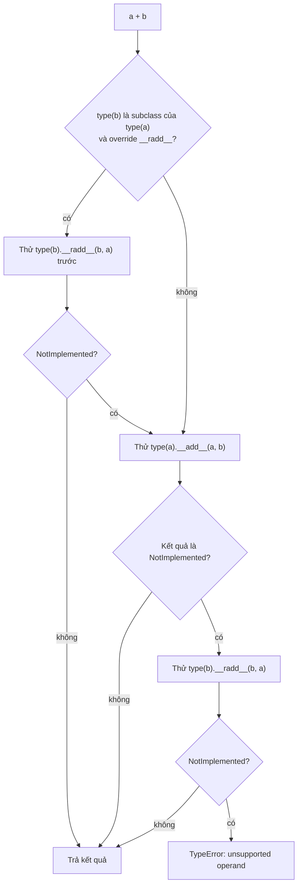

# Dunder Methods và Python Data Model

## 1. Tổng quan

Dunder method (double underscore, như `__len__`, `__eq__`, `__iter__`) là các method đặc biệt mà **interpreter gọi thay bạn** khi bạn dùng cú pháp hoặc built-in function. Tập hợp các quy ước này gọi là **Python data model**.

| Bạn viết | Interpreter gọi |
|---|---|
| `len(x)` | `type(x).__len__(x)` |
| `a + b` | `type(a).__add__(a, b)`, có thể `type(b).__radd__(b, a)` |
| `a == b` | `type(a).__eq__(a, b)` |
| `x[k]` | `type(x).__getitem__(x, k)` |
| `for i in x` | `type(x).__iter__(x)` |
| `with x:` | `type(x).__enter__(x)` / `__exit__` |
| `f(...)` | `type(f).__call__(f, ...)` |
| `if x:` | `type(x).__bool__(x)`, nếu không có thì `__len__` |
| `print(x)`, f-string | `__str__` / `__format__` |
| log, debugger, REPL | `__repr__` |

Nhờ data model, class do bạn viết có thể hành xử như kiểu built-in: dùng được với `for`, `len`, `in`, toán tử, `with`, `sorted`.

## 2. Mental Model

> Cú pháp Python là "giao diện"; dunder method là "cổng cắm". Class nào cắm đúng cổng thì cú pháp tương ứng hoạt động với nó.

Đây là **duck typing ở mức ngôn ngữ**: `for` không quan tâm object có phải list không, chỉ quan tâm type của nó có `__iter__` (hoặc `__getitem__`).

## 3. Vì sao cần hiểu?

- Viết value object (Money, Version, DateRange) có so sánh, hash, toán tử đúng đắn.
- Hiểu vì sao object không bỏ vào `set` được, vì sao `sorted` báo lỗi, vì sao `a + b` chạy nhưng `b + a` thì không.
- Kiểm soát thông tin xuất hiện trong log (`__repr__`) — bao gồm việc không làm lộ dữ liệu nhạy cảm.
- Nhận ra khi cú pháp vô hại (`if queryset:`, `len(result)`) kích hoạt thao tác đắt.

## 4. Cơ chế: lookup trên type, không trên instance

```python
class Box:
    def __len__(self):
        return 1

b = Box()
b.__len__ = lambda: 99     # gán lên instance
len(b)                      # 1 — interpreter bỏ qua instance
b.__len__()                 # 99 — gọi tường minh thì đi qua lookup thường
```

Interpreter gọi dunder qua **slot** trên type object (xem [Object Model](object-model.md)). Khi class được tạo, CPython điền slot `sq_length`/`mp_length` bằng wrapper gọi `Box.__len__`. `len(b)` đọc thẳng slot, không tra `b.__dict__`.

Hai lý do thiết kế:

1. **Hiệu năng**: không phải tra dict mỗi lần dùng toán tử.
2. **Nhất quán**: nếu lookup qua instance, `type.__repr__` (của chính class object) sẽ xung đột với `__repr__` định nghĩa cho instance của class. Tra trên type tránh mơ hồ này.

## 5. Toán tử nhị phân và `NotImplemented`



Diễn giải:

1. Thông thường Python thử `a.__add__(b)` trước.
2. Nếu `__add__` trả về singleton `NotImplemented` (nghĩa là "tôi không biết cộng với kiểu này"), Python thử phía còn lại: `b.__radd__(a)`.
3. Nếu cả hai đều `NotImplemented`, raise `TypeError`.
4. Ngoại lệ: nếu `b` thuộc subclass của type của `a` và subclass override method phản chiếu, `b.__radd__` được thử **trước**. Điều này cho phép subclass kiểm soát kết quả khi trộn với class cha.

Vì vậy method so sánh và toán tử nên **trả `NotImplemented`** (không raise, không trả `False`) khi gặp kiểu không hỗ trợ:

```python
from dataclasses import dataclass
from decimal import Decimal

@dataclass(frozen=True)
class Money:
    amount: Decimal
    currency: str

    def __add__(self, other):
        if not isinstance(other, Money):
            return NotImplemented
        if other.currency != self.currency:
            raise ValueError("currency mismatch")
        return Money(self.amount + other.amount, self.currency)

    def __radd__(self, other):
        if other == 0:              # cho phép sum([...]) bắt đầu từ 0
            return self
        return NotImplemented
```

`sum(prices)` bắt đầu bằng `0 + prices[0]`; `int.__add__` trả `NotImplemented` với `Money`, Python gọi `Money.__radd__(prices[0], 0)`.

Trả `False` từ `__eq__` khi gặp kiểu lạ ngăn phía bên kia có cơ hội so sánh; trả `NotImplemented` thì Python thử phía còn lại rồi mới fallback về so sánh identity.

## 6. Các nhóm giao thức quan trọng

### Biểu diễn

- `__repr__`: cho developer — log, debugger, REPL, exception message. Nên rõ ràng, lý tưởng là trông như biểu thức tạo lại object.
- `__str__`: cho người dùng cuối; mặc định dùng `__repr__`.
- `__format__`: điều khiển f-string với format spec (`f"{money:.2f}"`).

### So sánh, hash, sắp xếp

- `__eq__` và `__hash__` phải nhất quán (xem [Mutable và Immutable](mutable-immutable.md)).
- `sorted` chỉ cần `__lt__`. `functools.total_ordering` sinh các phép so sánh còn lại từ `__eq__` và một phép thứ tự. `@dataclass(order=True)` sinh so sánh theo thứ tự field.

### Container

- `__len__`, `__getitem__`, `__setitem__`, `__delitem__`, `__contains__`, `__iter__`, `__reversed__`.
- `in` thử `__contains__`; không có thì duyệt `__iter__`; không có thì thử `__getitem__` với index 0, 1, 2...
- `collections.abc` (`Mapping`, `Sequence`, `Set`) cung cấp mixin: định nghĩa vài method cốt lõi, nhận miễn phí các method còn lại.

### Truthiness

`if x:` gọi `__bool__`; không có thì `__len__` (khác 0 là True); không có cả hai thì luôn True.

### Callable, attribute, context, async

- `__call__`: instance gọi được như function.
- `__getattr__`, `__getattribute__`, `__setattr__`, `__delattr__`: can thiệp lookup (xem [Descriptors](descriptors.md)).
- `__enter__`/`__exit__`, `__aenter__`/`__aexit__`: [context manager](context-manager.md).
- `__await__`, `__aiter__`/`__anext__`: awaitable và async iterator.

### Vòng đời class

- `__new__`/`__init__`: tạo và khởi tạo instance.
- `__init_subclass__`: hook khi có class con được định nghĩa — thay thế metaclass trong nhiều trường hợp (plugin registry, kiểm tra cấu trúc class con).
- `__set_name__`: descriptor biết tên của nó.
- `__class_getitem__`: cho phép `MyClass[int]` trong type hint.

## 7. Ví dụ: `__repr__` và dữ liệu nhạy cảm

```python
from dataclasses import dataclass, field

@dataclass
class Credentials:
    username: str
    password: str = field(repr=False)
    api_token: str = field(repr=False)

Credentials("svc", "p@ss", "tok")   # Credentials(username='svc')
```

Exception tracker (Sentry), structured logger và traceback đều gọi `__repr__` của local variable và argument. `__repr__` mặc định của dataclass/Pydantic in toàn bộ field. Một exception trong function có argument là credentials có thể đẩy mật khẩu lên hệ thống log. Đánh dấu field nhạy cảm `repr=False`, hoặc dùng `pydantic.SecretStr`.

## 8. Hành vi trong production

- **Cú pháp vô hại, thao tác đắt.** `if results:` hay `len(results)` trên một đối tượng query lazy có thể thực thi query (Django QuerySet đánh giá khi gọi `__bool__`/`__len__`). `x in big_list` là O(n); `x in big_set` là O(1) trung bình.
- **`__eq__` của entity.** Hai object ORM đại diện cho cùng một row nên bằng nhau theo primary key, không theo mọi field. Định nghĩa `__eq__` theo mọi field cho entity mutable phá vỡ hash và gây hành vi lạ khi bỏ vào set.
- **`__hash__` sai làm dict/cache hỏng.** Hash dựa trên field mutable làm object "biến mất" khỏi dict sau khi sửa.
- **`__del__` không phải destructor đáng tin.** Xem [Reference Counting và GC](gc-reference-counting.md).

## 9. Failure Modes

| Failure | Nguyên nhân | Dấu hiệu |
|---|---|---|
| `TypeError: unhashable type` | Định nghĩa `__eq__` mà không `__hash__` | Không bỏ được object vào set/dict |
| `a + b` chạy, `b + a` lỗi | Thiếu `__radd__` hoặc raise thay vì `NotImplemented` | `sum()` lỗi với object tùy biến |
| Lộ dữ liệu nhạy cảm | `__repr__` mặc định in mọi field | Mật khẩu/token trong log hoặc Sentry |
| Query ngoài ý muốn | `__bool__`/`__len__` kích hoạt đánh giá lazy | Số query tăng ở dòng `if` |
| Vòng lặp vô hạn | `__getattr__` truy cập attribute chưa tồn tại của chính nó | `RecursionError` |

## 10. Trade-offs

| Lựa chọn | Lợi ích | Chi phí |
|---|---|---|
| Tự viết dunder | Kiểm soát hoàn toàn | Dễ sai quy tắc (hash/eq, NotImplemented) |
| `@dataclass` | Sinh `__init__`, `__repr__`, `__eq__`, tùy chọn `order`, `frozen`, `slots` | Ít linh hoạt với logic đặc biệt |
| `collections.abc` mixin | Đủ giao thức container với ít code | Method mixin có thể chưa tối ưu |
| Overload toán tử | API tự nhiên cho value object | Dễ lạm dụng, làm code khó đoán |

## 11. Sai lầm thường gặp

- Gán dunder lên instance và mong cú pháp dùng nó.
- Trả `False` hoặc raise trong `__eq__` với kiểu không hỗ trợ.
- Overload toán tử với ngữ nghĩa không hiển nhiên (`+` để gửi email).
- `__repr__` gọi database hoặc tính toán đắt — nó được gọi bởi logger và debugger.
- Định nghĩa `__getattribute__` thay vì `__getattr__` khi chỉ cần xử lý attribute thiếu.

## 12. Cách debug

- `type(x).__mro__` và `vars(cls)` để xem dunder được định nghĩa ở class nào.
- `operator` module (`operator.add`, `operator.lt`) để gọi toán tử tường minh khi test.
- Kiểm tra `cls.__hash__ is None` để biết class có unhashable không.
- Với log lộ dữ liệu: tìm các dataclass/model chứa trường nhạy cảm và kiểm tra `repr`.

## 13. Best Practices

- Dùng `@dataclass` (với `frozen=True`, `slots=True` khi phù hợp) cho value object thay vì viết tay.
- Trả `NotImplemented` cho kiểu không hỗ trợ trong toán tử và so sánh.
- `__repr__` rõ ràng, rẻ, không chứa dữ liệu nhạy cảm.
- Chỉ overload toán tử khi ngữ nghĩa là hiển nhiên với người đọc.
- Dùng `__init_subclass__` thay metaclass cho registry và kiểm tra class con.

## 14. Tóm tắt

- Dunder method là cổng để class tham gia cú pháp và built-in function của Python.
- Interpreter tra dunder trên **type** qua slot, không trên instance.
- Toán tử nhị phân thử phía trái, rồi phía phải nếu nhận `NotImplemented`; subclass có quyền ưu tiên.
- `__eq__` và `__hash__` phải nhất quán; `__repr__` xuất hiện trong log nên cần cẩn trọng với dữ liệu nhạy cảm.
- Cú pháp đơn giản (`if x`, `len(x)`, `x in y`) có thể che giấu chi phí thật.

## Liên quan

- [Python Object Model](object-model.md)
- [Descriptors](descriptors.md)
- [Context Manager](context-manager.md)
- [Iterators và Generators](generators-iterators.md)
- [Mutable và Immutable](mutable-immutable.md)
