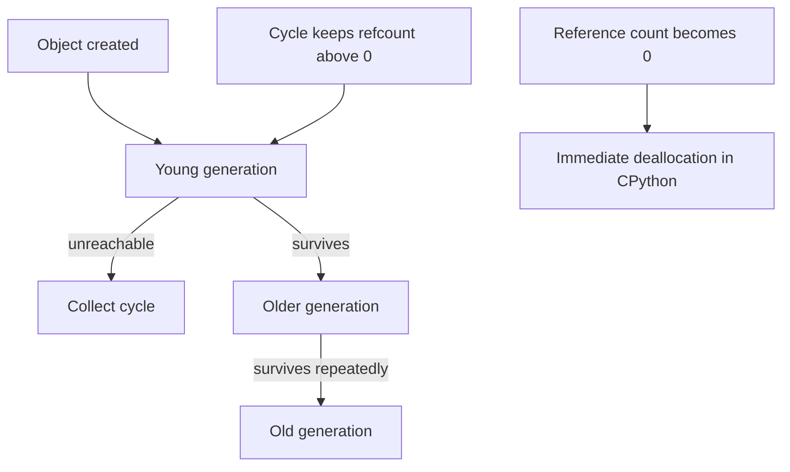

# Gc Reference Counting

> **Phạm vi phỏng vấn:** Python Core · **Ưu tiên:** P0/P1 · **Mindset:** Why → How → Trade-off → Production.

## 1. What is it?

CPython chủ yếu thu hồi bằng reference counting và dùng cyclic garbage collector để tìm reference cycle ở các generation.

## 2. Why does it matter?

Senior Engineer cần hiểu **Gc Reference Counting** để giải thích hành vi runtime, tránh bug khó thấy và ra quyết định API/library có cơ sở. Điểm phỏng vấn nằm ở khả năng nêu invariant, điều kiện áp dụng và failure behavior, không nằm ở việc thuộc định nghĩa.

## 3. How does it work?

`del` chỉ bỏ một reference; object được giải phóng khi refcount về 0. GC theo thế hệ quét container objects, còn external resource phải đóng deterministically bằng context manager.

Khi reasoning, đi theo chuỗi: **input → state transition → output → failure → recovery**. Quan sát `allocation rate, RSS, GC pause, latency và correctness` và phân biệt symptom, bottleneck với root cause.

## 4. Example

```python
from dataclasses import dataclass

@dataclass(frozen=True)
class Decision:
    topic: str
    invariant: str
    metric: str

decision = Decision(
    topic='Gc Reference Counting',
    invariant="Không làm mất hoặc lặp business effect",
    metric="p99 latency và error rate",
)
```

Ví dụ biến quyết định về **Gc Reference Counting** thành invariant và tín hiệu vận hành có thể kiểm chứng.

## 5. Production Use Case

Worker tạo cycle chứa exception traceback giữ payload lớn; quan sát generation count, phá cycle và giới hạn task-per-child thay vì gọi `gc.collect()` trên mọi request.

Checklist triển khai: capacity budget, timeout, idempotency (nếu có side effect), telemetry, canary, rollback và reconciliation.

## 6. Common Problems

- Không định nghĩa invariant và source of truth trước khi chọn công nghệ.
- Retry không backoff/jitter làm traffic amplification khi dependency lỗi.
- Không có bound cho queue, connection, memory hoặc concurrency.
- Chỉ theo dõi average; bỏ qua p95/p99, saturation và error semantics.
- Rollout toàn bộ, thiếu feature flag/canary và đường rollback dữ liệu.

## 7. Trade-offs

| Lựa chọn | Lợi ích | Chi phí / rủi ro | Khi phù hợp |
|---|---|---|---|
| Tối ưu/thiết kế xoay quanh Gc Reference Counting | Kiểm soát rõ constraint chính | Tăng complexity và coupling | Metric chứng minh đây là bottleneck/risk |
| Giữ baseline đơn giản | Ít dependency, dễ debug | Có thể chạm giới hạn sớm | Traffic vừa, invariant vẫn được giữ |
| Managed service/library | Giảm vận hành hạ tầng | Cost, lock-in, giới hạn control | SLA và economics phù hợp |
| Tự vận hành/customize | Kiểm soát sâu | Ownership và failure surface lớn | Có năng lực vận hành và nhu cầu thật |

## 8. Interview Questions

### Basic / Mid-level (10)

- **B1.** What is Gc Reference Counting, and which concrete problem does it address?
- **B2.** Explain the main internal mechanism behind Gc Reference Counting.
- **B3.** Which guarantees does Gc Reference Counting provide, and which does it not provide?
- **B4.** Which metrics or observations reveal the behavior of Gc Reference Counting?
- **B5.** What is the most common misconception about Gc Reference Counting?
- **B6.** How would you test assumptions involving Gc Reference Counting?
- **B7.** Which edge cases or failure modes matter most for Gc Reference Counting?
- **B8.** How can Gc Reference Counting affect latency, throughput, memory, or correctness?
- **B9.** Which runtime conditions or configuration choices change the behavior of Gc Reference Counting?
- **B10.** When is a different or simpler approach better than relying on Gc Reference Counting?

### Production Scenarios (5)

- **S1.** A release involving Gc Reference Counting triples p99 while averages look normal. How do you investigate and mitigate?
- **S2.** A critical dependency around Gc Reference Counting is unavailable for ten minutes. Define degraded behavior and recovery.
- **S3.** Two concurrent operations expose a correctness gap related to Gc Reference Counting. Which invariant and atomic boundary fix it?
- **S4.** Traffic grows from 1,000 to 20,000 RPS. Which measured limit involving Gc Reference Counting fails first?
- **S5.** A canary changes the behavior of Gc Reference Counting; success rate is flat but saturation rises. Promote or roll back?

## 9. Senior-level Questions

- **L1.** How does Gc Reference Counting constrain the surrounding architecture and operational model?
- **L2.** Which subtle correctness issue appears when Gc Reference Counting meets concurrency or partial failure?
- **L3.** What breaks first around Gc Reference Counting at 20,000 RPS or 100× data volume?
- **L4.** Where should admission control or backpressure be placed when using Gc Reference Counting?
- **L5.** How would you benchmark or validate Gc Reference Counting without a misleading microbenchmark?
- **L6.** Which hidden coupling or migration cost can Gc Reference Counting introduce?
- **L7.** How would you change a poor decision around Gc Reference Counting with no downtime?
- **L8.** What production evidence would make you choose a different approach?
- **L9.** How do correctness, latency, cost, and complexity trade off for Gc Reference Counting?
- **L10.** How would you turn an incident involving Gc Reference Counting into a durable prevention mechanism?

## 10. Short Answers

**B1.** CPython chủ yếu thu hồi bằng reference counting và dùng cyclic garbage collector để tìm reference cycle ở các generation. Trả lời tốt nối definition với constraint/invariant và một use case cụ thể.

**B2.** Mô tả state, lifecycle, boundary và failure path; không dừng ở public API của Gc Reference Counting.

**B3.** Nêu lúc tạo, lúc sử dụng, lúc release/commit và điều xảy ra khi timeout hoặc cancellation.

**B4.** Đo allocation rate, RSS, GC pause, latency và correctness; luôn tách average khỏi tail và success khỏi useful result.

**B5.** Lỗi phổ biến là dùng Gc Reference Counting như mặc định mà không xác định ownership, limit và fallback.

**B6.** Test invariant trước, sau đó integration test failure path, concurrency và representative load.

**B7.** Xét timeout, duplicate, stale state, overload, dependency loss và recovery/reconciliation.

**B8.** Đo critical path, contention, queueing và amplification; throughput cao không bù được p99 xấu.

**B9.** Deadline, concurrency limit, retention/TTL, resource budget, telemetry và rollout policy phải explicit.

**B10.** Tránh Gc Reference Counting khi bài toán đơn giản hơn giải được invariant với ít state và operational cost hơn.

Cấu trúc câu trả lời: **Definition → Why → How → Trade-off → Production example**. Với câu scenario: **stabilize → observe → hypothesize → verify → mitigate → prevent**.

## 11. Follow-up Questions

- **F1.** What assumption in your answer is most risky?
- **F2.** How would you prove that with metrics or an experiment?
- **F3.** What changes if the operation is not idempotent?
- **F4.** Where would you add timeout, retry, and backpressure?
- **F5.** What is your rollback and data-reconciliation plan?

## 12. Key Takeaways

- Nói được **vai trò, constraint hoặc invariant của Gc Reference Counting**, không chỉ “dùng để làm gì”.
- Định lượng bằng allocation rate, RSS, GC pause, latency và correctness và có baseline trước tối ưu.
- Thiết kế cho timeout, duplicate, overload, partial failure và recovery.
- Mọi tối ưu đều có chi phí về correctness, complexity, latency hoặc money.
- Production-ready nghĩa là có owner, alert, runbook, canary, rollback và reconciliation.


## 13. Mental Model

Reference counting dọn object ngay khi không còn owner; cyclic GC là đội thu gom chuyên tìm các nhóm object chỉ còn trỏ lẫn nhau.

## 14. Internals Deep Dive


Refcount tăng khi reference mới được giữ bởi name/container/frame và giảm khi reference bị overwrite, container bỏ phần tử hoặc frame kết thúc. `del x` xóa binding `x`; nó không ra lệnh free object. Khi refcount về 0, CPython thường deallocate ngay và cascading decrement các child reference.

Cycle `a → b → a` không bao giờ tự về 0, nên cyclic GC theo dõi container object. Object mới vào generation trẻ; object sống qua collection được promote. Exact generation policy/threshold thay đổi theo Python version—đặc biệt free-threaded builds—nên dùng `gc.get_stats()`/official docs thay vì thuộc con số implementation. External resource vẫn cần `with`/`finally` vì GC timing không phải contract.


Implementation detail có thể đổi theo version; khi trả lời interview, nêu rõ CPython/PostgreSQL/Redis/framework version nếu kết luận dựa vào behavior nội bộ thay vì public contract.

## 15. Request / Data Flow



Đọc diagram từ input tới state transition và output. Tại mỗi mũi tên, hỏi: operation có block không, có retry không, state có durable không, identity nào dùng để dedupe và metric nào chứng minh bước đó khỏe.

## 16. Failure Scenario

Failure thường xuất hiện dưới dạng aliasing sai, retained reference, unexpected lookup hoặc version-specific behavior. Reproduce với input nhỏ, quan sát identity/type/referrer và giảm global/cache lifetime trước khi đổi GC tuning.

Phân tích theo chuỗi: **trigger → saturation/incorrect state → propagation → user impact → immediate mitigation → durable prevention**. Tránh gọi retry hoặc scale là giải pháp nếu chưa chỉ ra dependency budget.

## 17. How I would debug this in production

1. Reproduce với input/lifetime nhỏ nhất.
2. Đo RSS và Python heap; so snapshot `tracemalloc`.
3. Inspect type, identity, referrer/owner.
4. Kiểm global, closure, cache và container retention.
5. Xác nhận behavior theo Python/CPython version.

## 18. Common Misconceptions

**Sai:** syntax mô tả đầy đủ memory behavior. **Đúng:** binding, alias, object lifetime và CPython optimization quyết định behavior; implementation detail phải gắn version.

## 19. When NOT to use

Không phụ thuộc CPython-specific behavior nếu library phải chạy nhiều implementation/version; ưu tiên language contract và benchmark thực tế.

## 20. What interviewer may ask next

1. **What guarantee does Gc Reference Counting provide, and what does it explicitly not guarantee?**
2. **Which implementation detail changes across versions or runtimes?**
3. **Where is the first queue or contention point under high load?**
4. **What happens if the dependency times out after committing state?**
5. **How would you observe, degrade, and recover this in production?**
6. **Which simpler design would you choose at 100 RPS, and when would you evolve it?**

## 21. Check Your Understanding

1. Nếu throughput tăng 20× nhưng downstream capacity không đổi, **Gc Reference Counting** sẽ tạo queue/backpressure ở đâu?
2. Timeout xảy ra ngay sau một state transition; caller có thể kết luận điều gì và không thể kết luận điều gì?
3. Metric, trace span và log field tối thiểu nào giúp phân biệt application, dependency và network latency?

<details>
<summary>Answer</summary>

1. Queue xuất hiện tại bounded resource đầu tiên: worker/thread/semaphore/connection pool/broker hoặc dependency. Nếu không có bound, overload chuyển thành memory growth và timeout storm.
2. Caller chỉ biết chưa nhận response trong deadline; operation có thể chưa chạy, đang chạy hoặc đã commit. Cần operation identity/idempotency và status/reconciliation.
3. Dùng end-to-end latency + queue/service time, correlation/trace ID, dependency spans, error/retry classification và saturation của pool/queue/resource.

</details>

## 22. See also

- [GIL](../02-python-concurrency/gil.md)
- [Python Profiling](../17-performance-reliability/profiling-python.md)
