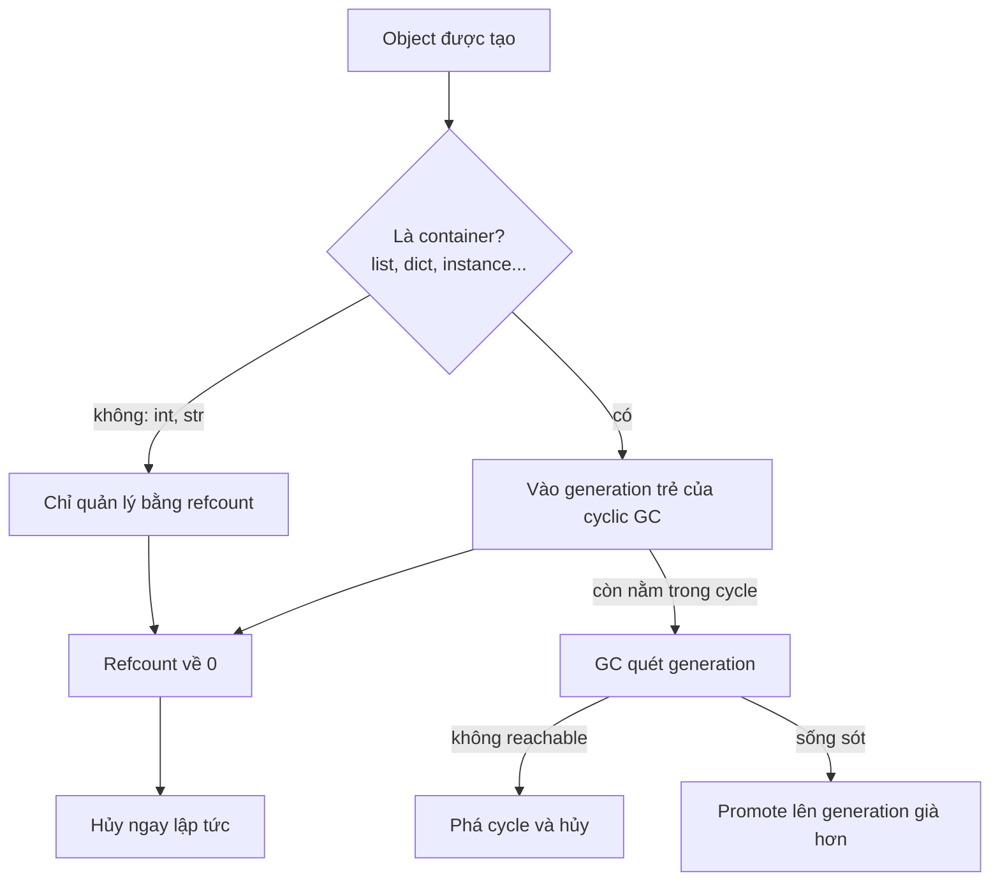
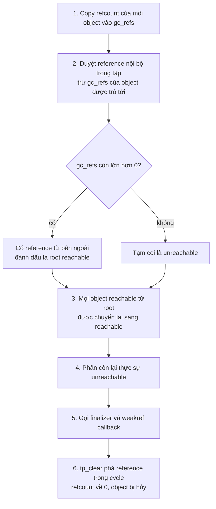

# Reference Counting và Garbage Collection

## 1. Tổng quan

Python không yêu cầu lập trình viên giải phóng memory thủ công. CPython dùng **hai cơ chế** kết hợp để quyết định khi nào một object có thể bị hủy:

1. **Reference counting** — cơ chế chính. Mỗi object đếm số reference đang trỏ tới nó; khi số đếm về 0, object bị hủy **ngay lập tức**.
2. **Cyclic garbage collector** — cơ chế bổ sung. Tìm và dọn các nhóm object tham chiếu vòng lẫn nhau mà không còn ai bên ngoài trỏ tới, trường hợp reference counting không xử lý được.

Hiểu hai cơ chế này giúp giải thích: vì sao file đôi khi tự đóng dù quên `close()`, vì sao một số object "sống mãi", vì sao service có latency spike định kỳ, và vì sao reference counting là lý do lịch sử chính của [GIL](../02-python-concurrency/gil.md).

> **Ghi chú version:** Đây là hành vi của CPython. Ngôn ngữ Python không bắt buộc reference counting; PyPy dùng tracing GC và không hủy object ngay khi hết reference. Chi tiết generation và threshold của cyclic GC thay đổi giữa các version (đặc biệt 3.12, 3.14 và free-threaded build).

## 2. Mental Model

- **Reference counting** giống người giữ chìa khóa: mỗi nơi giữ reference là một chìa. Người cuối cùng trả chìa thì căn phòng được dọn ngay.
- **Cyclic GC** là đội kiểm tra định kỳ, tìm những căn phòng mà người bên trong giữ chìa của nhau nhưng không ai từ bên ngoài còn vào được.



Giải thích:

1. Mọi object đều có refcount. Object không thể chứa reference khác (int, str, float) không bao giờ tạo được cycle nên chỉ cần refcount.
2. Object dạng container được GC "track": chúng có thể nằm trong cycle.
3. Trong đa số trường hợp, refcount về 0 và object bị hủy ngay, GC không cần làm gì.
4. Khi cycle xuất hiện, refcount không bao giờ về 0. GC định kỳ quét, phát hiện nhóm không reachable và phá chúng.
5. Object sống sót qua lần quét được chuyển sang generation già hơn, ít bị quét hơn.

## 3. Vì sao cần cả hai cơ chế?

| Cơ chế | Ưu điểm | Hạn chế |
|---|---|---|
| Reference counting | Giải phóng ngay, dự đoán được, không cần pause dài | Chi phí mỗi lần gán/xóa reference; không xử lý được cycle; khó làm thread-safe hiệu quả |
| Tracing GC (cyclic GC) | Xử lý được cycle | Cần duyệt object, gây pause; thời điểm chạy không dự đoán được |

CPython chọn refcount làm cơ chế chính vì tính tất định: phần lớn object bị hủy đúng lúc hết dùng, memory được tái sử dụng ngay, C extension dễ viết. Cyclic GC chỉ là lưới an toàn cho trường hợp vòng.

## 4. Reference counting hoạt động thế nào?

Refcount tăng khi một reference mới được tạo:

- gán vào name: `x = obj`
- đưa vào container: `lst.append(obj)`, `d[k] = obj`
- truyền làm argument (frame của callee giữ reference)
- closure cell giữ reference
- attribute: `self.cache = obj`

Refcount giảm khi reference biến mất:

- name bị rebind hoặc `del`
- container bỏ phần tử hoặc bị hủy
- frame kết thúc (function return), local variable biến mất
- object chứa reference bị hủy (giảm refcount của các con)

```python
import sys

a = []
sys.getrefcount(a)   # 2: name a + tham số tạm của chính getrefcount
b = a
sys.getrefcount(a)   # 3
del b
sys.getrefcount(a)   # 2
```

### `del` không hủy object

`del x` chỉ xóa name `x` khỏi namespace và giảm refcount một đơn vị. Object chỉ bị hủy nếu đó là reference cuối cùng.

### Hủy dây chuyền

Khi một object bị hủy, nó giảm refcount của mọi object nó đang giữ. Nếu những object đó cũng về 0, chúng bị hủy tiếp. Hủy một dict lớn có thể kéo theo hủy hàng triệu object con trong một lần — tốn thời gian đáng kể ngay tại dòng code làm mất reference cuối cùng. CPython có cơ chế "trashcan" để giới hạn độ sâu đệ quy khi hủy cấu trúc lồng nhau sâu, tránh tràn C stack.

### Chi phí của refcount

Mỗi lần gán, truyền tham số, lấy phần tử từ list đều là thao tác `Py_INCREF`/`Py_DECREF` — ghi vào memory của object. Điều này có ba hệ quả:

1. **Tốn CPU** ở mọi thao tác, kể cả chỉ đọc.
2. **Phá copy-on-write** sau `fork`: chỉ đọc object cũng ghi vào header của nó, làm page bị copy. Xem [Python Memory Model](python-memory-model.md).
3. **Không thread-safe** nếu không có đồng bộ. Hai thread cùng tăng refcount của một object mà không có lock có thể làm sai số đếm, dẫn tới hủy object khi vẫn còn dùng (crash) hoặc không bao giờ hủy (leak). GIL giải quyết vấn đề này bằng cách chỉ cho một thread chạy bytecode tại một thời điểm. Free-threaded build giải quyết bằng biased reference counting.

## 5. Vì sao reference counting không đủ: cycle

```python
class Node:
    def __init__(self):
        self.peer = None

a = Node()
b = Node()
a.peer = b
b.peer = a
del a, b
```

Sau `del`, không name nào trỏ tới hai object, nhưng `a.peer` giữ `b` và `b.peer` giữ `a`. Refcount của mỗi object là 1, không bao giờ về 0. Nếu chỉ có refcount, hai object này leak vĩnh viễn.

Cycle trong code thực tế xuất hiện nhiều hơn bạn nghĩ:

- Cấu trúc parent ↔ child (cây DOM, ORM object có relationship hai chiều).
- Object giữ bound method của chính nó (`self.callback = self.handle`): bound method giữ `self`.
- Exception và traceback: traceback giữ frame, frame giữ local variable, local variable giữ exception.
- Closure tham chiếu tới function chứa nó.
- Class object: class ↔ `__dict__` ↔ function ↔ `__globals__` của module.

## 6. Internals: cyclic GC tìm cycle thế nào?

Cyclic GC không quét toàn bộ memory. Nó chỉ xét tập container được track và dựa trên một nhận xét: nếu trừ đi mọi reference **nội bộ** trong tập đang xét mà một object vẫn còn refcount dương, thì phải có reference từ **bên ngoài** tập — object đó reachable.



Các bước:

1. Với mỗi object trong generation đang được quét, GC sao chép refcount vào trường tạm `gc_refs`.
2. GC gọi `tp_traverse` của mỗi object để liệt kê reference nó giữ. Với mỗi reference trỏ tới object **trong cùng tập**, giảm `gc_refs` của object bị trỏ.
3. Sau bước 2, `gc_refs > 0` nghĩa là còn reference từ ngoài tập (từ generation khác, từ frame, từ global...). Object đó là root.
4. Mọi thứ reachable từ root cũng được giữ lại.
5. Những object còn lại không có đường nào từ bên ngoài đi tới: chúng là rác. GC gọi finalizer (`__del__`, theo PEP 442 từ Python 3.4 được gọi an toàn cho object trong cycle), xử lý weakref callback.
6. GC gọi `tp_clear` để xóa reference bên trong cycle; refcount về 0 và object được hủy như bình thường.

### Generation

Nhận xét thực nghiệm: phần lớn object chết trẻ. Object sống qua vài lần quét thường sống lâu (config, cache, class, module). Vì vậy GC chia object thành các generation và quét generation trẻ thường xuyên hơn.

Ở CPython trước 3.14, có ba generation với threshold mặc định `(700, 10, 10)`:

- Generation 0 được quét khi số container được cấp phát trừ số bị hủy vượt 700.
- Generation 1 được quét sau 10 lần quét generation 0.
- Generation 2 (già nhất) được quét sau 10 lần quét generation 1, kèm điều kiện số object chờ promote đủ lớn so với tổng object già, để tránh việc quét full heap quá thường xuyên.

> **Ghi chú version:**
> - Từ 3.12, GC không chạy ngay tại thời điểm cấp phát mà được lên lịch và chạy ở điểm eval breaker kế tiếp.
> - CPython 3.14 giới thiệu incremental GC với hai generation (young và old): mỗi lần chạy thu gom generation trẻ cộng một phần của generation già, giảm độ dài pause với heap lớn. Chi tiết có thể điều chỉnh qua các bản patch; kiểm tra tài liệu module `gc` của version đang chạy.
> - Free-threaded build dùng GC stop-the-world với chiến lược khác build mặc định.

Luôn dùng `gc.get_threshold()`, `gc.get_count()`, `gc.get_stats()` để xem cấu hình thực tế thay vì thuộc lòng con số.

## 7. Ví dụ: cycle từ exception giữ frame

```python
errors = []

def process(batch):
    big_buffer = bytearray(50_000_000)   # 50 MB
    try:
        parse(batch)
    except ValueError as exc:
        errors.append(exc)               # giữ exception lại để báo cáo sau
```

`exc.__traceback__` → traceback → frame của `process` → local `big_buffer`. Chừng nào `errors` còn giữ `exc`, 50 MB của mỗi lần lỗi không được giải phóng. Đây không phải cycle mà là reference sống từ global list, nhưng cơ chế giống nhau: traceback kéo theo toàn bộ local variable của mọi frame trong stack.

Cách xử lý: chỉ lưu thông tin cần thiết (`str(exc)`, loại lỗi, ID), hoặc `exc.with_traceback(None)`, hoặc dùng `traceback.format_exception` để lưu chuỗi.

Bản thân Python cũng xóa `exc` khi thoát khối `except ... as exc`, chính là để phá cycle frame → exc → traceback → frame.

## 8. Finalizer và weakref

### `__del__`

`__del__` được gọi khi object sắp bị hủy. Nó **không** phải destructor đáng tin cậy:

- Thời điểm gọi phụ thuộc refcount và GC; với PyPy có thể rất trễ.
- Exception trong `__del__` bị bỏ qua (chỉ in cảnh báo).
- Tại lúc interpreter shutdown, module global có thể đã bị xóa, `__del__` có thể lỗi hoặc không được gọi.
- `__del__` có thể "hồi sinh" object bằng cách lưu `self` ở đâu đó.

Với tài nguyên bên ngoài (file, socket, connection, lock), dùng [context manager](context-manager.md) để giải phóng tất định. Nếu cần hook dọn dẹp dự phòng, dùng `weakref.finalize`, an toàn hơn `__del__`.

### Weak reference

`weakref.ref(obj)` trỏ tới object **mà không tăng refcount**. Khi object bị hủy, weakref trả về `None`. Dùng để:

- Phá cycle tự nhiên: child giữ weakref tới parent.
- Cache không giữ object sống: `weakref.WeakValueDictionary`.
- Đăng ký listener mà không ngăn listener bị thu hồi: `weakref.WeakMethod`.

## 9. Hành vi trong production

**GC pause gây latency spike.** Service giữ hàng triệu container object sống lâu (cache lớn trong process, ORM identity map lớn, graph trong memory) có thể thấy p99 tăng định kỳ khi generation già bị quét. Pause tỷ lệ với số object được track trong generation đang quét.

**Refcount trả memory đều đặn.** Với code không tạo cycle, memory được giải phóng liên tục và gần như không có pause. Đây là lợi thế của CPython so với runtime chỉ dùng tracing GC.

**Pre-fork server.** Master process khởi tạo app rồi fork worker. Nếu gọi `gc.freeze()` ngay trước khi fork, mọi object hiện có được chuyển vào một vùng "permanent" mà GC bỏ qua, giảm việc GC ghi vào page được chia sẻ và giảm thời gian quét.

**Tắt GC.** Một số hệ thống lớn tắt cyclic GC (`gc.disable()`) hoặc tăng threshold rất cao để loại bỏ pause, chấp nhận memory của cycle chỉ được thu hồi khi worker restart. Đây là quyết định chỉ hợp lý khi đã đo và có worker recycling.

## 10. Failure Modes

| Failure | Cơ chế | Dấu hiệu |
|---|---|---|
| Leak do reference sống | Global/cache/list giữ object, exception giữ traceback | `tracemalloc` tăng; `gc.get_referrers` chỉ ra nơi giữ |
| Cycle tích lũy nhanh hơn GC dọn | Tạo nhiều cycle lớn mỗi request | Memory dao động răng cưa lớn; `gc.get_stats()` cho thấy nhiều object collected |
| GC pause | Heap lớn nhiều container sống lâu | p99 spike định kỳ không tương quan với traffic |
| Tài nguyên không được đóng | Dựa vào `__del__`/GC để đóng file/socket | "Too many open files", connection pool cạn |
| Crash trong C extension | Refcount sai (thiếu INCREF hoặc thừa DECREF) | Segfault, use-after-free, không tái hiện ổn định |

## 11. Trade-offs

| Lựa chọn | Lợi ích | Chi phí |
|---|---|---|
| Để GC mặc định | An toàn, không cần suy nghĩ | Có thể có pause với heap lớn |
| Tăng threshold / `gc.freeze()` | Ít pause hơn, bảo toàn copy-on-write | Cycle được dọn chậm hơn, memory cao hơn |
| `gc.disable()` | Không còn pause của cyclic GC | Cycle leak đến khi restart; cần recycling và giám sát chặt |
| Thiết kế tránh cycle (weakref) | Object được hủy tất định bằng refcount | Code phức tạp hơn, phải xử lý weakref chết |

## 12. Sai lầm thường gặp

- Cho rằng `del x` giải phóng memory ngay.
- Gọi `gc.collect()` trong mỗi request để "giảm memory". Nó tốn CPU và không giải quyết leak do reference sống.
- Dùng `__del__` để đóng connection hoặc release lock.
- Lưu exception object vào list/log buffer lâu dài, giữ toàn bộ frame và local.
- Nghĩ rằng Python "không có memory leak vì có GC". GC chỉ thu hồi object **không reachable**; object vẫn reachable qua cache toàn cục thì không bao giờ bị thu hồi.

## 13. Cách debug trong production

1. **Đo GC**: đăng ký callback để đo thời gian mỗi lần quét.
   ```python
   import gc, time

   _start = {}

   def gc_timer(phase, info):
       if phase == "start":
           _start["t"] = time.perf_counter()
       else:
           elapsed_ms = (time.perf_counter() - _start["t"]) * 1000
           # gửi metric: generation=info["generation"], collected=info["collected"]
           print(info["generation"], info["collected"], f"{elapsed_ms:.1f}ms")

   gc.callbacks.append(gc_timer)
   ```
   Nếu pause của generation già trùng với p99 spike, GC là nghi phạm.
2. **Đếm object được track**: `len(gc.get_objects())` theo thời gian.
3. **Tìm cycle không thu hồi được**: `gc.set_debug(gc.DEBUG_SAVEALL)` trong môi trường test, sau `gc.collect()` xem `gc.garbage`.
4. **Tìm nơi giữ reference**: `gc.get_referrers(obj)`, `objgraph.show_backrefs([obj], max_depth=5)`.
5. **Theo dõi allocation**: `tracemalloc` snapshot diff, `memray` cho cả native.

## 14. Best Practices

- Quản lý tài nguyên bên ngoài bằng `with`/`try-finally`, không dựa vào GC.
- Dùng `weakref` cho quan hệ ngược (child → parent), cache phụ, listener.
- Không giữ exception object lâu dài; lưu thông tin đã format.
- Giới hạn kích thước mọi cache trong process.
- Chỉ tinh chỉnh GC (`set_threshold`, `freeze`, `disable`) sau khi đo được GC là nguyên nhân latency, và luôn đi kèm worker recycling cùng giám sát memory.

## 15. Tóm tắt

- CPython dùng reference counting làm cơ chế chính: object bị hủy ngay khi refcount về 0.
- `del` chỉ xóa một reference, không ra lệnh giải phóng.
- Cyclic GC bổ sung để dọn cycle, dựa trên việc trừ reference nội bộ để tìm object không reachable từ bên ngoài.
- GC chia generation vì phần lớn object chết trẻ; chi tiết generation phụ thuộc version.
- Refcount không thread-safe nếu không có đồng bộ — lý do lịch sử của GIL.
- Tài nguyên bên ngoài phải được đóng tất định bằng context manager.

## Liên quan

- [Python Memory Model](python-memory-model.md)
- [Python Object Model](object-model.md)
- [Context Manager](context-manager.md)
- [Global Interpreter Lock](../02-python-concurrency/gil.md)
- [Memory Leak](../20-production-incidents/memory-leak.md)
