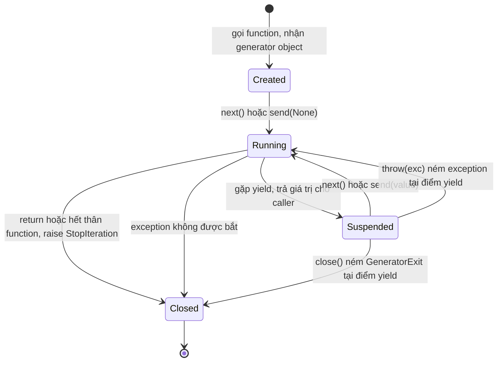
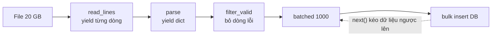

# Iterators và Generators

## 1. Tổng quan

**Iterator** là cơ chế chung để duyệt tuần tự qua dữ liệu, từng phần tử một, mà không cần biết dữ liệu nằm ở đâu: list trong memory, dòng trong file, row từ database cursor, message từ queue. Vòng `for`, comprehension, `sum()`, `list()`, unpacking đều dựa trên giao thức iterator.

**Generator** là cách viết iterator bằng một function có `yield`. Điểm đặc biệt: function có thể **tạm dừng** giữa chừng, giữ nguyên toàn bộ trạng thái, và **tiếp tục** từ đúng chỗ đó ở lần gọi sau. Cơ chế tạm dừng/tiếp tục này cũng chính là nền tảng của coroutine và [AsyncIO](../02-python-concurrency/asyncio.md).

## 2. Mental Model

- **Iterable** là thứ có thể sinh ra iterator (list, dict, file, range). Có thể duyệt nhiều lần.
- **Iterator** là con trỏ đang di chuyển trên dữ liệu. Chỉ đi tiến, dùng một lần; hết thì hết.
- **Generator** là function được "đóng băng" giữa chừng: mỗi `next()` cho nó chạy đến `yield` kế tiếp rồi đóng băng lại.

> Generator không tính trước kết quả. Nó tính **khi được hỏi**, từng phần tử một. Vì vậy memory của nó không phụ thuộc số phần tử.

## 3. Vì sao cần?

- **Memory giới hạn.** Xử lý file 20 GB, bảng 100 triệu row, export CSV lớn mà memory mỗi worker vẫn cố định.
- **Lazy evaluation.** Chỉ tính phần tử cần dùng; dừng sớm khi tìm thấy kết quả.
- **Pipeline.** Ghép các bước đọc → parse → lọc → gom batch → ghi thành chuỗi generator, mỗi bước chỉ biết đầu vào và đầu ra.
- **Streaming.** Trả response từng phần cho client (CSV, log, token của LLM) thay vì đợi toàn bộ.

## 4. Cơ chế hoạt động: giao thức iterator

Giao thức gồm hai method:

- `iterable.__iter__()` trả về một iterator.
- `iterator.__next__()` trả phần tử kế tiếp, hoặc raise `StopIteration` khi hết. Iterator cũng có `__iter__` trả về chính nó.

Vòng `for` thực chất là:

```python
# for item in data:
#     process(item)

it = iter(data)                 # gọi data.__iter__()
while True:
    try:
        item = next(it)         # gọi it.__next__()
    except StopIteration:
        break
    process(item)
```

Hệ quả quan trọng: iterator chỉ dùng được **một lần**.

```python
rows = (r for r in fetch())     # generator expression → iterator
total = sum(r.amount for r in rows)
count = len(list(rows))         # 0 — rows đã cạn, không báo lỗi
```

## 5. Generator hoạt động thế nào?

```python
def read_batches(path, size):
    batch = []
    with open(path) as f:
        for line in f:
            batch.append(line.rstrip("\n"))
            if len(batch) == size:
                yield batch
                batch = []
    if batch:
        yield batch
```

Gọi `read_batches("big.csv", 1000)` **không chạy dòng code nào** trong thân function. Nó trả về một generator object. Code chỉ chạy khi có `next()`.



Diễn giải các trạng thái:

1. **Created**: generator object đã tồn tại, frame đã được tạo nhưng chưa thực thi lệnh nào.
2. **Running**: `next()` làm frame chạy tiếp từ vị trí đã lưu.
3. **Suspended**: gặp `yield`, giá trị được trả cho caller; vị trí lệnh hiện tại, toàn bộ local variable (`batch`, `f`, `line`) và cả khối `with` đang mở được giữ nguyên trong frame.
4. Lần `next()` tiếp theo tiếp tục ngay sau `yield`.
5. **Closed**: khi function return, generator raise `StopIteration`. Khi `close()` được gọi (tường minh hoặc khi generator bị hủy), `GeneratorExit` được ném vào tại điểm `yield`, khối `finally`/`with` bên trong chạy để dọn dẹp.

`inspect.getgeneratorstate(gen)` trả về một trong bốn trạng thái `GEN_CREATED`, `GEN_RUNNING`, `GEN_SUSPENDED`, `GEN_CLOSED`.

## 6. Internals: frame được giữ lại

Function thông thường: gọi → tạo frame → chạy hết → hủy frame. Generator: frame được gắn vào generator object và **sống sót qua các lần tạm dừng**.

> **Ghi chú version:** Từ CPython 3.11, interpreter frame của generator được lưu ngay trong generator object thay vì một frame object riêng. Ngữ nghĩa không đổi.

Khi gặp lệnh `YIELD_VALUE`, interpreter:

1. Lấy giá trị trên đỉnh value stack làm kết quả trả về cho caller.
2. Lưu instruction pointer và value stack trong frame của generator.
3. Thoát khỏi eval loop cho frame này, quay về frame của caller.

Khi `next()`/`send()` được gọi, interpreter đưa frame của generator trở lại eval loop và tiếp tục từ instruction pointer đã lưu. Không có thread nào được tạo, không có gì chạy song song — chỉ là một frame được "tạm cất" rồi "lấy ra".

### `send`, `throw`, `close`

- `gen.send(value)`: tiếp tục generator, và biểu thức `yield` bên trong nhận giá trị `value`. Đây là cách truyền dữ liệu **vào** generator.
- `gen.throw(exc)`: ném exception vào tại điểm `yield`.
- `gen.close()`: ném `GeneratorExit` để generator dọn dẹp.

### `yield from` và nguồn gốc của coroutine

`yield from sub` (PEP 380) ủy quyền cho generator con: mọi `next`, `send`, `throw` được chuyển thẳng xuống `sub`, và giá trị `return` của `sub` trở thành giá trị của biểu thức `yield from`.

Trước Python 3.5, asyncio viết coroutine bằng generator và `yield from`. `async def`/`await` sau này là cú pháp riêng, nhưng cơ chế bên dưới giống hệt: coroutine là một frame có thể tạm dừng, `await` ủy quyền xuống awaitable giống `yield from`, và event loop gọi `coro.send(None)` để tiếp tục nó. Hiểu generator là đã hiểu một nửa AsyncIO. Xem [Coroutine, Task và Future](../02-python-concurrency/coroutine-task-future.md).

## 7. Luồng xử lý: pipeline generator



Diễn giải:

1. Consumer cuối cùng (bước ghi DB) gọi `next()` trên `batched`.
2. `batched` gọi `next()` trên `filter_valid` 1000 lần; mỗi lần `filter_valid` kéo từ `parse`, `parse` kéo từ `read_lines`.
3. Tại mọi thời điểm, trong memory chỉ có tối đa một batch 1000 phần tử và vài dòng đang xử lý. Memory không phụ thuộc kích thước file.
4. Dữ liệu được **kéo** (pull) từ cuối pipeline, nên tốc độ của bước chậm nhất tự động điều tiết cả pipeline — một dạng backpressure tự nhiên.

```python
import csv
from itertools import batched   # Python 3.12+

def read_rows(path):
    with open(path, newline="") as f:
        yield from csv.DictReader(f)

def valid(rows):
    for row in rows:
        if row.get("vin"):
            yield row

for chunk in batched(valid(read_rows("claims.csv")), 1000):
    repository.bulk_insert(chunk)
```

## 8. Generator expression và comprehension

```python
squares_list = [x * x for x in range(10_000_000)]   # tạo list 10 triệu phần tử ngay
squares_gen = (x * x for x in range(10_000_000))    # generator, gần như không tốn memory
total = sum(x * x for x in range(10_000_000))       # không tạo list trung gian
```

Dùng list khi cần duyệt nhiều lần, truy cập theo index, hoặc biết `len`. Dùng generator khi chỉ duyệt một lần và dữ liệu lớn.

`itertools` cung cấp các khối xây dựng lazy: `islice` (lấy một đoạn), `chain` (nối), `groupby` (gom nhóm liên tiếp — dữ liệu phải được sắp xếp theo key trước), `tee` (tách thành nhiều iterator, tốn memory nếu các nhánh lệch nhau), `batched` (3.12+).

## 9. Async generator

`async def` có `yield` tạo **async generator**, duyệt bằng `async for`. Dùng khi mỗi bước lấy dữ liệu cần `await` (đọc từ database async, stream từ HTTP).

```python
async def stream_events(client):
    async with client.stream("GET", "/events") as response:
        async for line in response.aiter_lines():
            yield parse(line)
```

Async generator có vấn đề dọn dẹp riêng: nếu consumer dừng giữa chừng, khối `async with` bên trong chỉ đóng khi generator được `aclose()`. Không thể chạy code async trong lúc GC hủy object, nên asyncio phải theo dõi async generator chưa đóng và đóng chúng khi loop shutdown. Dùng `contextlib.aclosing(gen)` để đảm bảo đóng tất định.

## 10. Hành vi trong production

**Streaming response.** FastAPI/Starlette `StreamingResponse` nhận generator hoặc async generator. Generator đồng bộ được chạy trong threadpool để không block event loop; async generator chạy trên event loop — nếu nó làm việc CPU nặng hoặc blocking giữa các `yield`, mọi request khác trên worker bị chậm.

**Generator giữ tài nguyên mở.** Generator đọc từ DB cursor giữ connection và transaction mở **suốt thời gian consumer còn chưa đọc xong**. Nếu consumer là client HTTP tải chậm, một connection bị chiếm hàng phút. Với nhiều client như vậy, connection pool cạn. Cân nhắc: đọc theo batch rồi đóng transaction, hoặc export ra object storage rồi trả link.

**Dọn dẹp muộn.** Generator dừng giữa chừng không được đóng ngay; `finally` bên trong chỉ chạy khi generator bị `close()` hoặc bị GC hủy. Với CPython, thường là ngay khi mất reference cuối; nhưng nếu generator nằm trong cycle hoặc chạy trên PyPy, việc dọn dẹp có thể trễ không xác định.

**Không thread-safe.** Hai thread cùng gọi `next()` trên một generator sẽ gặp `ValueError: generator already executing`. Không chia sẻ generator giữa các thread; dùng `queue.Queue` nếu cần phân phối công việc.

**Iterator cạn lặng lẽ.** Truyền cùng một iterator cho hai hàm: hàm thứ hai nhận dữ liệu rỗng, không có lỗi. Bug này thường xuất hiện khi refactor từ list sang generator để tiết kiệm memory.

## 11. Failure Modes

| Failure | Nguyên nhân | Dấu hiệu |
|---|---|---|
| Dữ liệu "biến mất" | Duyệt iterator hai lần | Lần duyệt thứ hai rỗng, tổng bằng 0 |
| Connection pool cạn | Generator giữ cursor/transaction trong lúc stream | Pool wait tăng khi có download lớn |
| File/socket không đóng | Generator dừng giữa chừng không được close | "Too many open files", `ResourceWarning` |
| Event loop bị block | Async generator làm việc nặng giữa các `yield` | Latency tăng cho request khác trong lúc stream |
| `groupby` cho kết quả sai | Dữ liệu chưa sắp xếp theo key | Cùng key xuất hiện ở nhiều nhóm |
| `ValueError: generator already executing` | Generator dùng chung giữa thread | Lỗi không ổn định dưới tải |

## 12. Trade-offs

| Lựa chọn | Lợi ích | Chi phí |
|---|---|---|
| List (eager) | Duyệt nhiều lần, có `len`, index, debug dễ | Memory tỷ lệ với dữ liệu |
| Generator (lazy) | Memory cố định, bắt đầu xử lý sớm | Dùng một lần, khó debug, giữ tài nguyên mở lâu |
| Batch generator | Cân bằng giữa overhead mỗi phần tử và memory | Phải chọn kích thước batch |
| Materialize rồi xử lý | Đơn giản, tách I/O khỏi xử lý | Không dùng được với dữ liệu lớn hơn memory |

## 13. Sai lầm thường gặp

- Nghĩ gọi generator function sẽ chạy code ngay.
- Tái sử dụng iterator đã cạn.
- Dùng `list(gen)` "cho tiện" và mất toàn bộ lợi ích memory.
- Để generator giữ transaction mở trong lúc chờ client hoặc gọi service khác.
- Nhầm `return value` trong generator là giá trị được `yield` (nó trở thành `StopIteration.value`).
- Quên `aclose()` với async generator dừng giữa chừng.

## 14. Cách debug

- `inspect.getgeneratorstate(gen)` / `inspect.getasyncgenstate(agen)` để biết generator đang ở trạng thái nào.
- `gen.gi_frame.f_lineno` để biết generator đang dừng ở dòng nào (khi chưa closed).
- Bật `python -W error::ResourceWarning` trong test để phát hiện file/socket không đóng.
- Với connection pool cạn, đối chiếu thời lượng request streaming với thời gian connection bị checkout.
- Với asyncio, bật debug mode (`PYTHONASYNCIODEBUG=1`) để thấy cảnh báo async generator không được đóng và callback chạy quá lâu.

## 15. Best Practices

- Dùng generator cho dữ liệu lớn, duyệt một lần; dùng list cho dữ liệu nhỏ cần duyệt nhiều lần.
- Xử lý theo batch thay vì từng phần tử khi mỗi bước có overhead cố định (insert DB, gọi API).
- Đóng generator tường minh khi dừng sớm: `with contextlib.closing(gen)` hoặc `aclosing` cho async.
- Không giữ tài nguyên khan hiếm (connection, lock, transaction) qua các điểm `yield` phụ thuộc tốc độ của bên ngoài.
- Đặt tên rõ ràng để người đọc biết đó là iterator dùng một lần (`iter_rows`, `stream_events`).

## 16. Tóm tắt

- Iterable sinh iterator; iterator trả từng phần tử qua `__next__` và dùng một lần.
- Generator là function có thể tạm dừng tại `yield`, giữ nguyên frame và tiếp tục sau.
- Gọi generator function không chạy code; code chỉ chạy khi có `next()`.
- Pipeline generator giữ memory cố định và tự điều tiết theo bước chậm nhất.
- Cơ chế tạm dừng/tiếp tục frame của generator chính là nền của coroutine trong AsyncIO.
- Generator giữ mọi tài nguyên đang mở trong frame cho đến khi được đóng.

## Liên quan

- [CPython Runtime](cpython-runtime.md)
- [Context Manager](context-manager.md)
- [Coroutine, Task và Future](../02-python-concurrency/coroutine-task-future.md)
- [AsyncIO](../02-python-concurrency/asyncio.md)
- [Relationship Loading và yield_per](../05-sqlalchemy/relationship-loading.md)
