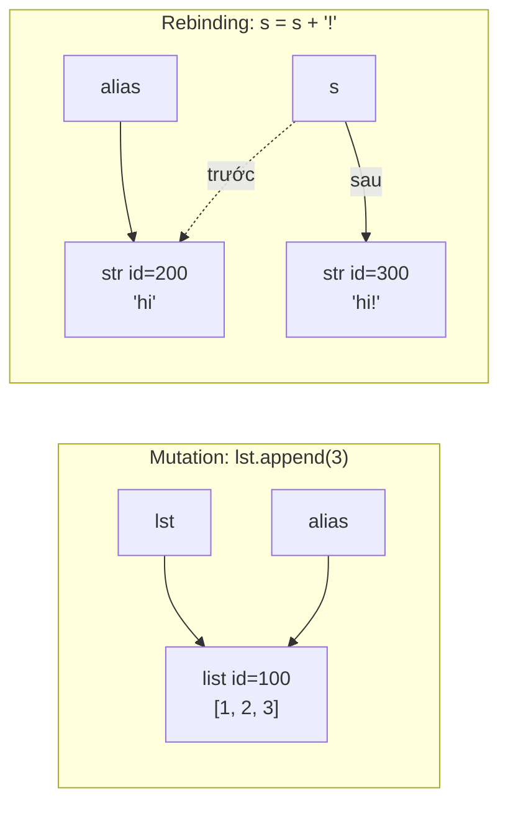

# Mutable và Immutable

## 1. Tổng quan

Một object là **mutable** nếu value của nó có thể thay đổi trong khi identity giữ nguyên. Object **immutable** không cho phép thay đổi value sau khi tạo; mọi "thay đổi" đều tạo ra object mới.

| Immutable | Mutable |
|---|---|
| `int`, `float`, `complex`, `bool` | `list` |
| `str`, `bytes` | `dict` |
| `tuple`, `frozenset` | `set` |
| `range`, `None` | `bytearray` |
| `@dataclass(frozen=True)` instance | instance class thông thường |

Phân biệt này quyết định ba thứ: object có thể làm key của dict/set không, có an toàn khi chia sẻ giữa nhiều nơi (nhiều hàm, nhiều thread) không, và một thao tác như `+=` sẽ mutate hay tạo object mới.

## 2. Mental Model

> Mutation thay đổi **object**. Rebinding thay đổi **name**.



Giải thích:

1. Bên trái: `append` sửa trực tiếp list có id 100. Mọi name trỏ tới list đó (`lst`, `alias`) đều thấy `[1, 2, 3]`.
2. Bên phải: string không thể sửa. `s + '!'` tạo string mới id 300, rồi name `s` được gắn sang object mới. `alias` vẫn trỏ tới `'hi'` cũ.
3. Câu hỏi "thay đổi có lan sang nơi khác không" chỉ phụ thuộc vào việc thao tác là mutation hay rebinding.

## 3. Vì sao cần phân biệt?

- **Hashing.** Dict và set dựa trên hash để tìm kiếm. Nếu key thay đổi value sau khi được đưa vào dict, hash thay đổi và dict không tìm lại được nó. Vì vậy chỉ object hashable (thường là immutable) mới làm key.
- **Chia sẻ an toàn.** Immutable object có thể chia sẻ giữa nhiều hàm, nhiều thread mà không cần copy, không cần lock.
- **Dự đoán được code.** Hàm nhận immutable argument không thể làm hỏng dữ liệu của caller.
- **Hiệu năng.** Nối chuỗi trong vòng lặp tạo object mới mỗi lần; append vào list thì không.

## 4. Cơ chế hoạt động

### Immutable là "shallow"

Tuple là immutable: không thể thay phần tử bằng object khác. Nhưng nếu phần tử là object mutable, object đó vẫn có thể bị sửa:

```python
t = (1, [2, 3])
t[1].append(4)     # hợp lệ: mutate list bên trong
t                   # (1, [2, 3, 4])
hash(t)             # TypeError: unhashable type: 'list'
```

Tuple chỉ đảm bảo **danh sách reference** không đổi. Một tuple chỉ hashable khi mọi phần tử của nó đều hashable. Tương tự, `@dataclass(frozen=True)` chặn gán attribute nhưng không ngăn mutate một list là attribute.

### Augmented assignment

`x += y` được dịch thành:

1. Nếu type của `x` có `__iadd__`, gọi `x.__iadd__(y)` — thường mutate tại chỗ và trả `self`.
2. Nếu không, gọi `x.__add__(y)` để tạo object mới.
3. Bind kết quả vào `x`.

```python
a = [1]
b = a
a += [2]        # list.__iadd__ mutate → b cũng thấy [1, 2]

s = "x"
t = s
s += "y"        # str không có __iadd__ → object mới, t vẫn là "x"
```

Một trường hợp bất ngờ minh họa rõ hai bước "gọi `__iadd__`" và "gán lại":

```python
t = ([1],)
t[0] += [2]     # TypeError: 'tuple' object does not support item assignment
t               # ([1, 2],)  — list vẫn bị mutate!
```

`list.__iadd__` đã chạy thành công (mutate), sau đó bước gán `t[0] = result` thất bại vì tuple immutable.

### Hash và equality

Quy tắc bắt buộc: `a == b` thì `hash(a) == hash(b)`. Object mutable dùng value để so sánh (`list`, `dict`) không thể có hash ổn định nên đặt `__hash__ = None`. Object do bạn định nghĩa:

- Không định nghĩa `__eq__`: hash dựa trên identity, luôn hashable.
- Định nghĩa `__eq__` nhưng không `__hash__`: unhashable.
- Định nghĩa cả hai: hash phải chỉ dùng các field không đổi trong lifetime.

## 5. Internals: interpreter tối ưu gì cho immutable?

> **Ghi chú version:** Các tối ưu dưới đây là implementation detail của CPython; không dựa vào chúng để đảm bảo đúng đắn.

- **Small int cache** (-5 đến 256) và **string interning**: vì immutable nên chia sẻ an toàn, không ai sửa được.
- **Constant folding**: `x = 2 * 3600` được tính sẵn lúc compile thành `7200`; tuple literal chứa toàn hằng số được tạo một lần và lưu trong code object.
- **In-place string concat**: CPython có tối ưu cho `s += t` khi `s` chỉ có một reference — có thể mở rộng buffer tại chỗ. Tối ưu này không có trên PyPy và mất tác dụng khi có alias, nên nối chuỗi trong vòng lặp vẫn có thể thành O(n²). Dùng `"".join(parts)`.
- **Immortal object** (3.12+): `None`, `True`, small int có refcount cố định vì chúng immutable và dùng chung toàn process.

## 6. Ví dụ: immutable config dùng chung

```python
from dataclasses import dataclass
from types import MappingProxyType

@dataclass(frozen=True, slots=True)
class RetryPolicy:
    max_attempts: int
    base_delay_ms: int
    retryable_status: frozenset[int]

DEFAULT_POLICY = RetryPolicy(3, 100, frozenset({502, 503, 504}))

_TIMEOUTS = {"payment": 2.0, "inventory": 0.5}
TIMEOUTS = MappingProxyType(_TIMEOUTS)   # view chỉ đọc
```

- `DEFAULT_POLICY` có thể được mọi request, mọi thread dùng chung mà không cần lock.
- Muốn biến thể, dùng `dataclasses.replace(DEFAULT_POLICY, max_attempts=5)` — tạo object mới, object gốc không đổi.
- `MappingProxyType` ngăn caller sửa dict qua view; nhưng ai giữ `_TIMEOUTS` vẫn sửa được, nên chỉ export proxy.

## 7. Hành vi trong production

**Chia sẻ giữa thread.** Trong worker đa thread (threadpool của FastAPI cho sync endpoint, Gunicorn `gthread`), object mutable dùng chung là nơi phát sinh [race condition](../02-python-concurrency/race-condition.md). Immutable object loại bỏ cả một lớp bug mà không cần lock.

**Cache.** Giá trị trả về từ cache nên immutable. Nếu cache trả list/dict và caller mutate, dữ liệu trong cache bị hỏng cho mọi request sau — bug khó tái hiện vì phụ thuộc thứ tự request.

**Key của cache và dedup.** Key phải hashable và ổn định: tuple của các field, frozenset cho tập tham số không thứ tự. Dùng dict làm key bằng cách `tuple(sorted(d.items()))` chỉ đúng khi value cũng hashable.

**Model dữ liệu.** Pydantic hỗ trợ `model_config = ConfigDict(frozen=True)`; dataclass có `frozen=True`. Dùng cho value object (tiền tệ, địa chỉ, khoảng thời gian), event, command — những thứ không nên thay đổi sau khi tạo.

## 8. Failure Modes

| Failure | Cơ chế | Dấu hiệu |
|---|---|---|
| Key "biến mất" khỏi dict/set | Object mutable có `__hash__` tùy biến, field bị sửa sau khi insert | `key in d` trả False dù key có trong `d.keys()` |
| Dữ liệu cache bị hỏng | Caller mutate object trả về từ cache | Kết quả sai xuất hiện sau một request cụ thể |
| Default argument tích lũy | Default mutable dùng chung giữa các lần gọi | Dữ liệu từ request trước lọt sang request sau |
| Nối chuỗi O(n²) | Tạo string mới mỗi vòng lặp | CPU cao khi build response/CSV lớn |
| Tưởng tuple bảo vệ dữ liệu | Tuple chứa list/dict mutable | Dữ liệu "bất biến" vẫn bị sửa |

## 9. Trade-offs

| Lựa chọn | Lợi ích | Chi phí |
|---|---|---|
| Immutable | An toàn khi chia sẻ, hashable, dễ lý luận | Mỗi thay đổi tạo object mới, tốn allocation |
| Mutable | Cập nhật tại chỗ, hiệu quả với dữ liệu thay đổi liên tục | Phải kiểm soát ai được sửa, cần lock khi chia sẻ |
| Copy tại boundary | Giữ API an toàn với object mutable | Chi phí copy, có thể lớn |
| Frozen dataclass + `replace` | Rõ ràng, có type | `replace` chậm hơn gán attribute; `frozen` thêm chút overhead khi khởi tạo |

Thực tế thường kết hợp: dữ liệu dùng chung, config, message giữa các thành phần là immutable; dữ liệu cục bộ trong một hàm hoặc buffer đang xây dựng là mutable.

## 10. Sai lầm thường gặp

- Nghĩ rằng `x += 1` và `lst += [1]` có cùng ngữ nghĩa với alias.
- Tin rằng tuple hoặc frozen dataclass là "deep immutable".
- Định nghĩa `__hash__` dựa trên field có thể thay đổi.
- Dùng `is` để so sánh string/int vì "chúng immutable nên được dùng chung". Việc dùng chung là tối ưu tùy ý của interpreter.
- Trả về list nội bộ của object (`return self._items`) cho caller, cho phép caller sửa state nội bộ.

## 11. Khi nào nên dùng immutable?

- Config, constant, policy dùng chung toàn process.
- Value object trong domain (Money, DateRange, Address).
- Key của dict, cache, set dedup.
- Event, command, message truyền giữa các thành phần hoặc qua queue.
- Dữ liệu chia sẻ giữa thread.

## 12. Khi nào không nên?

- Cấu trúc được cập nhật liên tục trong vòng lặp nóng (buffer, accumulator) — dùng mutable cục bộ rồi "đóng băng" kết quả.
- Object ORM được Session theo dõi thay đổi: SQLAlchemy dựa trên mutation để phát hiện dirty state.
- Khi chi phí tạo object mới đo được là đáng kể ở hot path.

## 13. Cách debug

- `id(x)` trước và sau thao tác để biết là mutation hay rebinding.
- `hash(x)` để kiểm tra hashability; `TypeError: unhashable type` chỉ ra phần tử mutable lẫn trong tuple.
- Với bug dữ liệu lan giữa request, tìm mutable default (`__defaults__`), class attribute mutable, và object được trả thẳng từ cache.
- Trong test, bọc dữ liệu dùng chung bằng `MappingProxyType` hoặc frozen model để lỗi mutate xuất hiện ngay dưới dạng exception.

## 14. Best Practices

- Mặc định dùng immutable cho dữ liệu dùng chung; chỉ dùng mutable khi có lý do.
- Không để lộ container nội bộ; trả về tuple/copy hoặc view chỉ đọc.
- Dùng `None` làm default cho tham số mutable.
- Dùng `"".join()` hoặc `io.StringIO` để xây string lớn.
- Với dataclass/Pydantic dùng làm key hoặc chia sẻ, bật `frozen`.

## 15. Tóm tắt

- Mutable: value đổi, identity giữ nguyên. Immutable: mọi thay đổi tạo object mới.
- Mutation lan tới mọi alias; rebinding chỉ ảnh hưởng một name.
- Immutability là shallow: tuple chứa list vẫn có phần bị sửa được.
- `+=` gọi `__iadd__` nếu có (mutate), không thì tạo object mới.
- Hashable đòi hỏi hash ổn định, thường đồng nghĩa với immutable.
- Immutable object là cách rẻ nhất để chia sẻ dữ liệu an toàn giữa thread và giữa các thành phần.

## Liên quan

- [Python Object Model](object-model.md)
- [Shallow Copy và Deep Copy](shallow-vs-deep-copy.md)
- [Race Condition](../02-python-concurrency/race-condition.md)
- [Hashmap trong Python](../19-data-structures-algorithms/hashmap.md)
