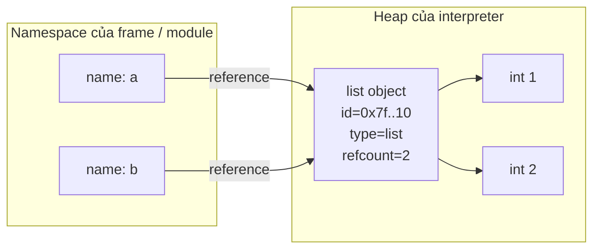
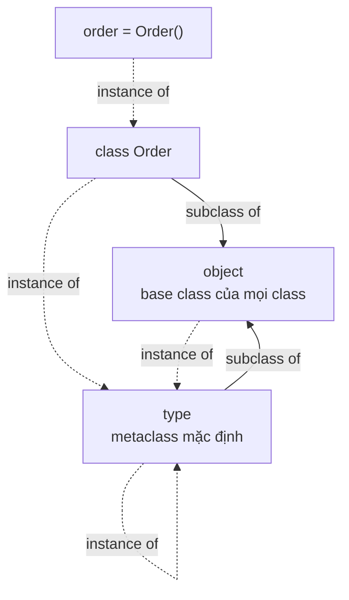
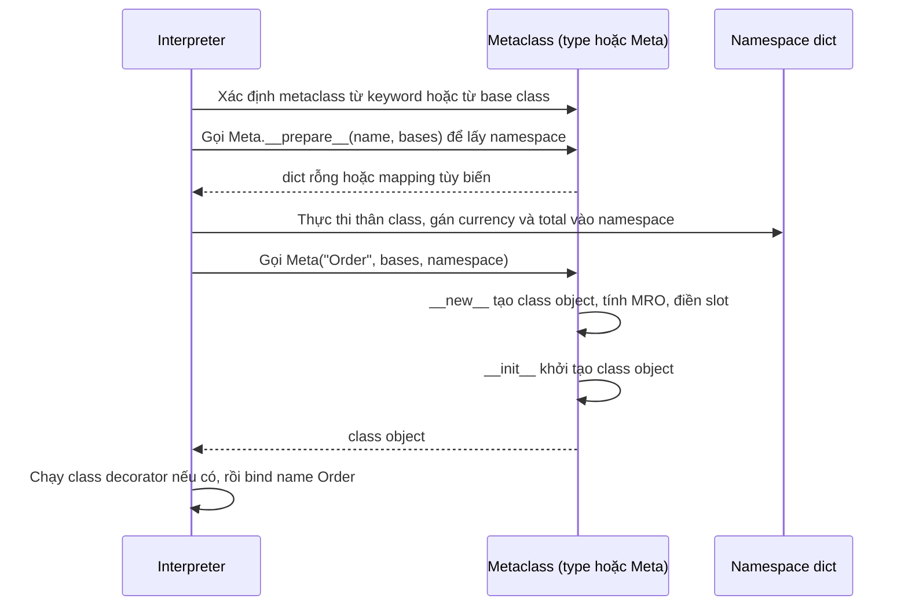

# Python Object Model

## 1. Tổng quan

Câu "trong Python mọi thứ đều là object" không phải khẩu hiệu. Số nguyên, chuỗi, function, class, module, exception, thậm chí `type` cũng là object. Mọi giá trị mà chương trình thao tác đều là một object nằm trên heap của interpreter, và chương trình chỉ cầm **reference** tới object đó.

Object model là bộ quy tắc trả lời ba câu hỏi:

- Một object được tạo ra thế nào và tồn tại đến khi nào?
- Khi viết `obj.attr`, `a + b`, `len(x)`, `f(x)` thì interpreter tìm hành vi ở đâu?
- Name (biến) liên hệ với object ra sao?

Hiểu object model là nền tảng để hiểu các chủ đề phía sau: [mutable/immutable](mutable-immutable.md), [reference counting và GC](gc-reference-counting.md), [descriptor](descriptors.md), [decorator](decorators.md), [dunder methods](dunder-methods.md), và cả lý do tồn tại của [GIL](../02-python-concurrency/gil.md).

## 2. Mental Model



Đọc diagram theo thứ tự:

1. `a` và `b` là **name** nằm trong một namespace (thực chất là mapping từ chuỗi tên sang reference).
2. Cả hai name cùng trỏ tới **một** list object duy nhất trên heap. Không có "biến a chứa list" và "biến b chứa bản sao list".
3. List object không chứa trực tiếp số `1`, `2`; nó chứa các reference tới int object.
4. Refcount của list là 2 vì có hai reference trỏ vào.

Mental model cần nhớ:

> Name là nhãn dán lên object, không phải chiếc hộp chứa giá trị. Assignment dán thêm nhãn; nó không sao chép object.

Vì vậy `b.append(3)` làm `a` "thay đổi theo": không có gì thay đổi theo cả, chỉ có một object được mutate và hai nhãn cùng nhìn vào nó.

## 3. Vì sao cần hiểu object model?

Rất nhiều bug production không đến từ thuật toán mà đến từ hiểu sai object model:

| Hiện tượng | Nguyên nhân gốc |
|---|---|
| Default argument `def f(items=[])` tích lũy dữ liệu qua các lần gọi | Default value được tạo **một lần** khi `def` chạy, mọi lần gọi dùng chung object |
| Cache trả về dict, caller sửa dict, cache bị "nhiễm bẩn" | Cache trả reference, không trả bản sao |
| Class attribute kiểu list bị chia sẻ giữa mọi instance | Attribute nằm trên class object, instance chỉ lookup tới đó |
| `x is 1000` lúc đúng lúc sai | `is` so sánh identity, kết quả phụ thuộc interpreter có tái sử dụng object hay không |
| Object không bị giải phóng dù "đã xóa biến" | `del` chỉ xóa name, object còn reference ở nơi khác |
| Định nghĩa `__eq__` xong object không bỏ vào `set` được | Định nghĩa `__eq__` mà không định nghĩa `__hash__` thì `__hash__` bị đặt thành `None` |

Người hiểu object model sẽ đọc các hiện tượng trên như hệ quả hiển nhiên, không cần thuộc từng trường hợp.

## 4. Ba thuộc tính của mọi object

Mỗi object có đúng ba thứ:

1. **Identity** — định danh không đổi trong suốt lifetime. `id(obj)` trả về giá trị này; toán tử `is` so sánh identity.
2. **Type** — quyết định object hỗ trợ operation nào. `type(obj)` trả về type object. Type của một object không đổi trong thực tế (có thể gán `__class__` trong một số trường hợp hẹp nhưng gần như không dùng).
3. **Value** — trạng thái mà object biểu diễn. Với mutable object, value có thể đổi trong khi identity giữ nguyên.

```python
a = [1, 2]
b = a
c = [1, 2]

a is b        # True  — cùng identity
a == c        # True  — value bằng nhau (list.__eq__)
a is c        # False — hai object khác nhau
```

`==` gọi `__eq__` và trả lời câu hỏi "giá trị có tương đương không". `is` không gọi method nào, chỉ so sánh hai reference có trỏ cùng object không. Chỉ dùng `is` cho singleton được ngôn ngữ bảo đảm: `None`, `True`, `False`, `NotImplemented`, `Ellipsis`, hoặc sentinel do chính bạn tạo (`_MISSING = object()`).

## 5. Name, binding và namespace

### Assignment là binding

`x = expr` làm hai việc: đánh giá `expr` để được một reference tới object, rồi gắn name `x` trong namespace hiện tại vào reference đó. Không có bước copy.

Các cú pháp sau đều là binding:

- `x = ...`, `x += ...` (với immutable object, `+=` tạo object mới rồi rebind)
- `def f(): ...` — bind name `f` vào function object mới
- `class C: ...` — bind name `C` vào class object mới
- `import m` — bind name `m` vào module object
- `for x in ...` — rebind `x` ở mỗi vòng lặp
- tham số function khi được gọi
- `except E as e`, `with ... as v`

### Namespace là mapping

Namespace của module là `module.__dict__`. Namespace của instance thông thường là `obj.__dict__`. Namespace của class là `cls.__dict__` (một `mappingproxy` chỉ đọc). Local namespace của function được CPython tối ưu thành mảng "fast locals" trong frame thay vì dict, nhưng về mặt ngữ nghĩa vẫn là mapping từ tên sang reference.

Quy tắc tìm name (LEGB) được giải thích chi tiết trong [Scope, LEGB và Closure](closures.md).

### Truyền tham số: call by sharing

Python không phải "pass by value" cũng không phải "pass by reference" theo nghĩa C++. Khi gọi `f(obj)`, parameter trong `f` được bind vào **cùng object** mà caller truyền vào.

```python
def add_item(items):
    items.append("x")      # mutate object chung → caller thấy
    items = ["new"]        # rebind name local → caller KHÔNG thấy

data = []
add_item(data)
print(data)                # ['x']
```

- `items.append` mutate object mà cả caller và callee đang cùng trỏ tới.
- `items = [...]` chỉ dán nhãn `items` (local) sang object khác; nhãn `data` của caller vẫn ở nguyên chỗ cũ.

## 6. Internals: object trong CPython trông như thế nào?

> **Ghi chú version:** Phần này mô tả CPython (implementation phổ biến nhất), không phải đặc tả ngôn ngữ. PyPy, GraalPy có layout khác. Chi tiết struct thay đổi giữa các version.

### Object header

Trong CPython build mặc định (có GIL), mọi object bắt đầu bằng header `PyObject`:

```c
typedef struct {
    Py_ssize_t ob_refcnt;      // reference count
    PyTypeObject *ob_type;     // con trỏ tới type object
} PyObject;
```

Object có độ dài biến đổi (tuple, int lớn, bytes) dùng `PyVarObject`, thêm trường `ob_size`. Mọi API C của CPython làm việc với `PyObject *`, đó là lý do mọi thứ đều "là object": interpreter chỉ biết con trỏ tới struct có header này.

Trên CPython, `id(obj)` trả về địa chỉ của struct trong memory. Đây là **implementation detail**; ngôn ngữ chỉ đảm bảo `id` duy nhất trong lifetime của object. Sau khi object bị giải phóng, `id` có thể được tái sử dụng cho object khác.

### Free-threaded build

Từ Python 3.13 có build tùy chọn không GIL (PEP 703; từ 3.14 được hỗ trợ chính thức nhưng chưa phải mặc định). Ở build này, header chứa thêm thread id của owner và tách refcount thành hai phần (`ob_ref_local` cho thread sở hữu, `ob_ref_shared` cho thread khác) — kỹ thuật gọi là *biased reference counting*. Mục đích: phần lớn thao tác refcount xảy ra trên thread sở hữu và không cần atomic instruction. Xem thêm [GIL](../02-python-concurrency/gil.md).

### Immortal object

Từ Python 3.12 (PEP 683), một số object như `None`, `True`, `False`, small int được đánh dấu *immortal*: refcount của chúng không bao giờ thay đổi thực sự. Lợi ích: không phải ghi vào memory của các object dùng chung cực nhiều, giảm cache-line contention và hỗ trợ chia sẻ giữa interpreter/process. Hệ quả dễ thấy: `sys.getrefcount(None)` trả về một số rất lớn cố định, không phản ánh số reference thật.

### Type object và slot

Type object (`PyTypeObject`) chứa các **slot** là con trỏ hàm cho từng operation: `tp_getattro` (lấy attribute), `tp_call` (gọi object), `tp_hash`, `tp_richcompare`, `tp_iter`, `nb_add` (toán tử `+`), `sq_length`/`mp_length` (`len`)...

Khi viết `a + b`, interpreter không tìm chuỗi `"__add__"` trong dict mỗi lần. Nó gọi slot `nb_add` trên type của `a`. Với class viết bằng Python, khi class được tạo, CPython điền slot bằng wrapper gọi tới method `__add__` tương ứng. Đây là lý do [dunder methods](dunder-methods.md) được lookup trên **type**, không phải trên instance.

## 7. `type` và `object`: hai object đặc biệt



Giải thích từng quan hệ:

1. `order` là instance của `Order`: `type(order) is Order`.
2. `Order` là một object, và type của nó là `type`: `type(Order) is type`. Class cũng là object, được tạo ra bởi một metaclass.
3. `type` là instance của chính nó: `type(type) is type`. Đây là điểm dừng của chuỗi "type của type".
4. `object` là instance của `type`, nhưng `type` lại là subclass của `object`. Quan hệ vòng này được interpreter dựng sẵn khi khởi động, không thể tạo ra bằng code Python thông thường.
5. Mọi class đều kế thừa (trực tiếp hoặc gián tiếp) từ `object`.

Có hai quan hệ khác nhau cần tách bạch:

- **instance-of** (`type(x)`, `isinstance`) — ai tạo ra object và quyết định hành vi của nó.
- **subclass-of** (`__bases__`, `__mro__`, `issubclass`) — thứ tự tìm attribute khi kế thừa.

## 8. Bên trong hệ thống xảy ra gì khi tạo class và instance?

### Tạo class

Câu lệnh `class` là code chạy tại runtime, không phải khai báo tĩnh:

```python
class Order(Base, metaclass=Meta):
    currency = "VND"
    def total(self): ...
```



Các bước:

1. Interpreter chọn metaclass: nếu có `metaclass=` thì dùng nó, không thì lấy metaclass của base class (mặc định là `type`).
2. `__prepare__` trả về mapping để chứa namespace của class.
3. Thân class được thực thi như một function body: `currency = "VND"` và `def total` tạo các binding trong namespace đó.
4. Metaclass được gọi với `(name, bases, namespace)`. `type.__new__` tạo class object, tính MRO bằng thuật toán C3, gọi `__set_name__` trên các descriptor, gọi `__init_subclass__` của class cha.
5. Class decorator (nếu có) nhận class object và có thể thay thế nó.
6. Name `Order` được bind vào kết quả cuối cùng.

Hệ quả thực tế: code trong thân class chạy **một lần** lúc import module. Tính toán nặng hoặc gọi network trong thân class sẽ làm chậm import và khởi động worker.

### Tạo instance

`Order(...)` là gọi class object. Vì class là instance của `type`, lời gọi đi vào `type.__call__`:

1. `Order.__new__(Order, ...)` cấp phát object mới (thường kế thừa từ `object.__new__`).
2. Nếu kết quả là instance của `Order`, gọi tiếp `instance.__init__(...)` để khởi tạo state.
3. Trả về instance.

`__new__` hữu ích khi cần kiểm soát việc tạo object (immutable type như subclass của `tuple`, singleton, cache instance). `__init__` chỉ khởi tạo object đã tồn tại.

## 9. Attribute lookup — cái nhìn tổng quát

Khi đọc `obj.name`, `object.__getattribute__` thực hiện (bản đơn giản hóa):

1. Tìm `name` trên **type** của `obj` theo MRO. Nếu tìm thấy một **data descriptor** (có `__set__` hoặc `__delete__`, ví dụ `property`), gọi `descriptor.__get__(obj, type(obj))` và trả kết quả.
2. Nếu không, tìm trong `obj.__dict__`. Có thì trả về.
3. Nếu bước 1 tìm thấy **non-data descriptor** (chỉ có `__get__`, ví dụ function), gọi `__get__` — đây là lúc function trở thành bound method.
4. Nếu bước 1 tìm thấy attribute thường trên class, trả về nó.
5. Không thấy: gọi `__getattr__` nếu class định nghĩa, nếu không thì raise `AttributeError`.

Thứ tự này giải thích vì sao `property` không bị instance dict che khuất, còn method thì có thể bị che. Chi tiết nằm trong [Descriptors](descriptors.md).

### MRO

Với đa kế thừa, thứ tự tìm trên class được quyết định bởi **Method Resolution Order**, tính bằng thuật toán C3 linearization. `Order.__mro__` cho thấy thứ tự đó. C3 đảm bảo: class con đứng trước class cha, và thứ tự khai báo base class được tôn trọng. `super()` không có nghĩa "class cha" mà là "class tiếp theo trong MRO của type của `self`" — điều quan trọng khi làm mixin.

## 10. Ví dụ: ba bug kinh điển từ object model

### Default argument dùng chung

```python
def add_tag(tag, tags=[]):      # list tạo MỘT lần khi def chạy
    tags.append(tag)
    return tags

add_tag("a")   # ['a']
add_tag("b")   # ['a', 'b']  — cùng object với lần gọi trước
```

Default value được đánh giá khi câu lệnh `def` thực thi và lưu trong `add_tag.__defaults__`. Mọi lần gọi không truyền `tags` đều dùng chung object đó.

```python
def add_tag(tag, tags=None):
    if tags is None:
        tags = []
    tags.append(tag)
    return tags
```

### Class attribute mutable

```python
class Session:
    handlers = []                 # nằm trên class object

s1, s2 = Session(), Session()
s1.handlers.append("h1")
s2.handlers                       # ['h1'] — lookup tới cùng list trên class
```

`s1.handlers` không tìm thấy trong `s1.__dict__` nên lookup lên class. `append` mutate list của class. Khởi tạo state riêng trong `__init__`, hoặc dùng `dataclasses.field(default_factory=list)`.

### `__eq__` làm mất `__hash__`

```python
class Point:
    def __init__(self, x, y):
        self.x, self.y = x, y
    def __eq__(self, other):
        return (self.x, self.y) == (other.x, other.y)

{Point(1, 2)}   # TypeError: unhashable type: 'Point'
```

Khi class định nghĩa `__eq__` mà không định nghĩa `__hash__`, Python đặt `__hash__ = None`. Lý do: hash mặc định dựa trên identity, sẽ mâu thuẫn với `__eq__` dựa trên value (hai object bằng nhau phải có hash bằng nhau). Nếu object bất biến về mặt logic, định nghĩa `__hash__` dựa trên cùng các field dùng trong `__eq__`, hoặc dùng `@dataclass(frozen=True)`.

## 11. Hành vi trong production

**Module-level state được chia sẻ.** Module chỉ được import một lần mỗi process; mọi request trong process đó dùng chung các object ở module level. Trong worker dạng thread (Gunicorn `gthread`, sync endpoint của FastAPI chạy trong threadpool), một dict ở module level bị ghi đồng thời bởi nhiều thread là nguồn [race condition](../02-python-concurrency/race-condition.md). Trong worker dạng process, mỗi process có bản riêng, nên "cache ở module level" không được chia sẻ giữa các worker.

**Cache trả reference.** `functools.lru_cache` hay một dict cache trả về chính object đã lưu. Nếu caller mutate kết quả, lần gọi sau nhận dữ liệu đã bị sửa. Với dữ liệu cache, trả về immutable object (tuple, `frozenset`, frozen dataclass) hoặc copy tại boundary.

**Chi phí bộ nhớ của "mọi thứ là object".** Trên CPython 64-bit, một `int` nhỏ chiếm khoảng 28 byte, một `float` 24 byte, một instance class thường kèm `__dict__` thêm vài chục đến hàng trăm byte. Một list 10 triệu số nguyên tốn hàng trăm MB, trong khi `array('q')` hay NumPy array chỉ tốn 80 MB. Khi xử lý dữ liệu lớn trong worker, object overhead thường là nguyên nhân RSS tăng. Xem [Python Memory Model](python-memory-model.md).

**Import time.** Thân class, decorator và code ở module level chạy lúc import. Worker khởi động chậm, readiness probe fail, autoscale phản ứng trễ thường có nguyên nhân từ import nặng.

## 12. Failure Modes

| Failure | Cơ chế | Dấu hiệu |
|---|---|---|
| Dữ liệu rò rỉ giữa request | Mutable default, class attribute, module global bị mutate | User thấy dữ liệu của user khác, bug không tái hiện ở local |
| So sánh sai | Dùng `is` thay cho `==` với int/str | Code đúng trong test với giá trị nhỏ, sai với giá trị lớn hoặc chuỗi tạo động |
| Object không được giải phóng | Reference còn nằm trong cache/global/closure | Memory tăng dần, xem [Memory Leak](../20-production-incidents/memory-leak.md) |
| Hash không nhất quán | `__hash__` dựa trên field mutable | Object "biến mất" khỏi dict/set sau khi field thay đổi |
| MRO bất ngờ | Mixin gọi `super()` sai thứ tự | Method của một mixin không bao giờ được gọi |

## 13. Trade-offs

| Lựa chọn | Lợi ích | Chi phí |
|---|---|---|
| Object động, `__dict__` mỗi instance | Thêm attribute tùy ý, introspection mạnh | Tốn memory, lookup chậm hơn truy cập field cố định |
| `__slots__` | Giảm memory, lookup nhanh hơn | Không thêm attribute động, kế thừa phức tạp hơn |
| Immutable value object | An toàn khi chia sẻ, hashable | Mỗi thay đổi tạo object mới |
| Metaclass | Kiểm soát việc tạo class | Khó đọc, xung đột metaclass khi đa kế thừa; thường `__init_subclass__` hoặc class decorator là đủ |

## 14. Sai lầm thường gặp

- Nghĩ rằng `a = b` tạo bản sao. Nó chỉ tạo thêm một reference.
- Nghĩ rằng `del x` giải phóng object. Nó chỉ xóa name `x`; object bị giải phóng khi không còn reference nào.
- Dùng `is` để so sánh chuỗi hoặc số. Kết quả phụ thuộc interning/caching của interpreter.
- Tin rằng `id()` là địa chỉ memory ổn định có thể lưu lại. `id` chỉ có ý nghĩa trong lifetime của object.
- Nghĩ `super()` luôn gọi class cha trực tiếp. Nó đi theo MRO của instance.
- Viết metaclass cho những việc mà `__init_subclass__` (Python 3.6+) hoặc class decorator giải quyết đơn giản hơn.

## 15. Cách debug

- `id(a) == id(b)` hoặc `a is b` để kiểm tra aliasing.
- `type(x)`, `type(x).__mro__` để hiểu attribute được lấy từ đâu.
- `vars(obj)` / `obj.__dict__` để xem state của instance; `type(obj).__dict__` để xem class.
- `inspect.getattr_static(obj, "name")` để xem attribute mà không kích hoạt descriptor.
- `sys.getrefcount(obj)` (luôn lớn hơn 1 vì chính lời gọi giữ một reference) và `gc.get_referrers(obj)` để tìm ai đang giữ object.
- `dis.dis(func)` để xem bytecode — ví dụ thấy `STORE_NAME`/`STORE_FAST` chỉ là binding.

## 16. Best Practices

- Dùng `None` làm default cho tham số mutable, hoặc `default_factory` trong dataclass/Pydantic.
- Coi dữ liệu dùng chung (cache, config, constant) là immutable: `tuple`, `frozenset`, `MappingProxyType`, `@dataclass(frozen=True)`.
- Chỉ dùng `is` cho singleton và sentinel.
- Khi định nghĩa `__eq__`, quyết định rõ object có hashable không; nếu có, `__hash__` chỉ dựa trên field không đổi.
- Tránh side effect nặng ở module level và thân class; chuyển vào function khởi tạo hoặc lifespan của application.
- Ưu tiên `__init_subclass__` hoặc class decorator trước khi nghĩ tới metaclass.

## 17. Tóm tắt

- Mọi giá trị là object trên heap; name chỉ là reference trỏ tới object.
- Mỗi object có identity, type, value. `is` so identity, `==` so value.
- Assignment và truyền tham số chia sẻ reference, không copy.
- Class là object được tạo tại runtime bởi metaclass (mặc định `type`); thân class chạy lúc import.
- Hành vi của operator và built-in function được tra trên **type** thông qua slot.
- Attribute lookup đi theo thứ tự: data descriptor trên type → instance `__dict__` → non-data descriptor/attribute trên type → `__getattr__`.

## Liên quan

- [CPython Runtime](cpython-runtime.md)
- [Python Memory Model](python-memory-model.md)
- [Reference Counting và Garbage Collection](gc-reference-counting.md)
- [Mutable và Immutable](mutable-immutable.md)
- [Descriptors](descriptors.md)
- [Dunder Methods](dunder-methods.md)
