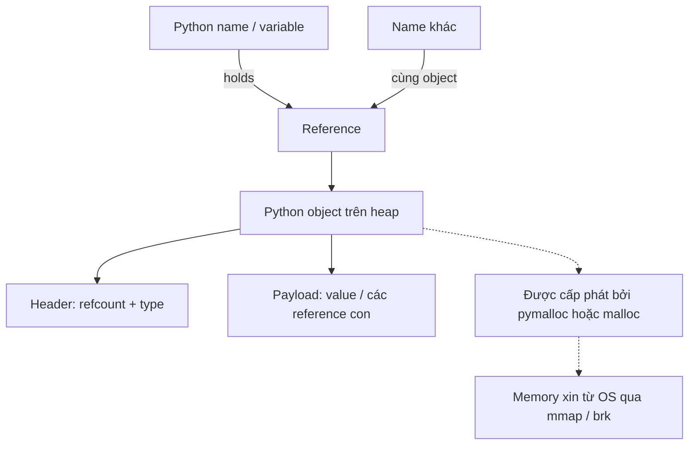
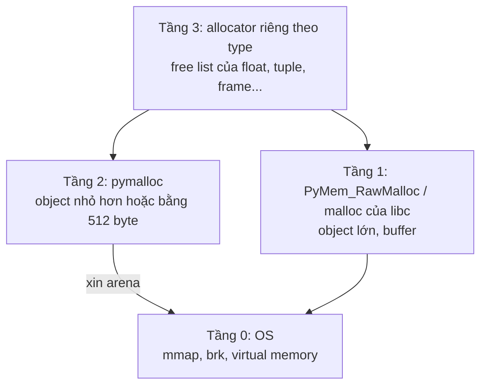
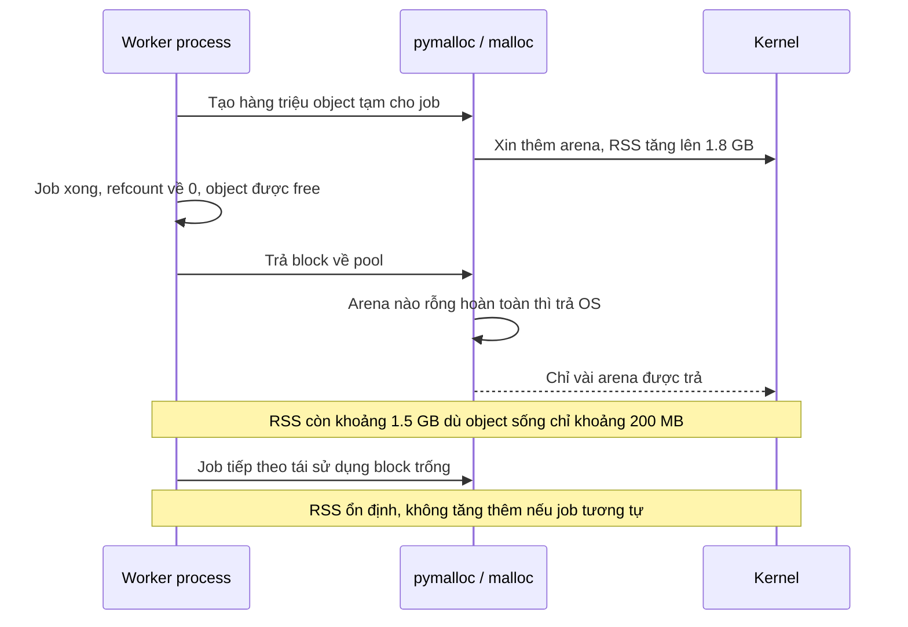

# Python Memory Model

## 1. Tổng quan

Memory model của Python trả lời hai câu hỏi khác nhau:

1. **Ở mức ngôn ngữ**: name, reference và object liên hệ với nhau thế nào; khi nào hai name cùng nhìn thấy một thay đổi. Phần này đã được mô tả trong [Python Object Model](object-model.md).
2. **Ở mức runtime (CPython)**: memory cho object được cấp phát từ đâu, khi nào được trả lại, vì sao process "ăn" nhiều RAM hơn tổng kích thước object, và vì sao RSS không giảm sau khi dữ liệu đã được giải phóng.

Tài liệu này tập trung vào câu hỏi thứ hai — thứ quyết định worker của bạn có bị `OOMKilled` hay không.

> **Ghi chú version:** Mô tả allocator áp dụng cho CPython build mặc định. Free-threaded build (3.13+) dùng mimalloc thay cho pymalloc. Kích thước object và arena thay đổi theo version và platform; con số trong bài là giá trị điển hình trên CPython 64-bit.

## 2. Mental Model



Đọc từ trên xuống:

1. Name giữ reference; nhiều name có thể trỏ cùng object (alias).
2. Object gồm header (refcount, con trỏ type) và payload.
3. Memory của object không đến trực tiếp từ OS mỗi lần. Object nhỏ được lấy từ **pymalloc**, một allocator có pool riêng; object lớn đi qua `malloc` của C.
4. pymalloc và `malloc` lại xin memory từ OS theo từng khối lớn.

Mental model quan trọng nhất cho production:

> "Object đã được giải phóng" và "process đã trả memory cho OS" là hai sự kiện khác nhau. Giữa chúng có ít nhất hai tầng allocator giữ memory lại để tái sử dụng.

## 3. Vì sao cần hiểu?

- Worker Celery xử lý một file lớn, RSS tăng từ 200 MB lên 2 GB và **không bao giờ giảm lại** dù task đã xong. Đây có thể không phải memory leak.
- Pod bị `OOMKilled` dù `tracemalloc` chỉ thấy 300 MB object Python đang sống.
- Load 5 triệu row từ database vào list of dict tốn gấp 5–10 lần kích thước dữ liệu thô.
- Gunicorn `--preload` được kỳ vọng tiết kiệm memory nhờ copy-on-write nhưng thực tế mỗi worker vẫn tăng dần.

Không hiểu tầng allocator, bạn sẽ đuổi theo "leak" không tồn tại hoặc bỏ qua leak thật.

## 4. Cơ chế hoạt động: các tầng cấp phát



Giải thích từng tầng:

1. **Tầng 3 — free list theo type.** Một số type giữ danh sách object đã giải phóng để tái sử dụng ngay, tránh gọi allocator. Ví dụ tuple nhỏ, float, frame, dict. Khi tạo float mới, CPython có thể lấy ngay một ô từ free list.
2. **Tầng 2 — pymalloc.** Allocator tối ưu cho object nhỏ (≤ 512 byte), vốn chiếm đại đa số object Python. pymalloc tổ chức memory thành:
   - **Arena**: khối lớn xin từ OS (256 KiB ở các version cũ, 1 MiB trên 64-bit từ 3.10).
   - **Pool**: arena chia thành nhiều pool; mỗi pool chỉ phục vụ một **size class** (bội số của 16 byte).
   - **Block**: một pool chia thành các block cùng kích thước; mỗi object nhỏ chiếm một block.
3. **Tầng 1 — malloc.** Object lớn hơn 512 byte (list có nhiều phần tử, string dài, bytes, buffer) đi thẳng tới `malloc`. glibc malloc có arena riêng theo thread, và cũng có chiến lược giữ memory lại.
4. **Tầng 0 — OS.** Memory ảo được cấp bằng `mmap` hoặc `brk`. Chỉ khi allocator trả về ở tầng này thì RSS mới giảm.

### Vì sao RSS không giảm

pymalloc chỉ trả một arena cho OS khi **mọi block trong mọi pool của arena đó đều rỗng**. Chỉ cần một object nhỏ còn sống (một string trong cache, một dict config) nằm trong arena, cả arena bị giữ lại. Đây là **fragmentation**:

```text
Arena 1: [████░░░░░░░░░░░░]  ← 1 object còn sống → không trả được
Arena 2: [░░░░░░░░░░░░░░░░]  ← rỗng hoàn toàn → trả OS
Arena 3: [█░░░░░░░█░░░░░░░]  ← không trả được
```

Sau một đợt tạo hàng triệu object tạm thời rồi giải phóng, các object sống lâu rải rác khắp arena khiến phần lớn arena không trả được. RSS "kẹt" ở đỉnh. Memory đó vẫn được tái sử dụng cho object mới, nên nếu workload ổn định, RSS sẽ phẳng ở mức cao chứ không tăng mãi. **Đây là dấu hiệu phân biệt fragmentation với leak**: leak làm RSS tăng liên tục theo thời gian/số request; fragmentation làm RSS nhảy lên một bậc rồi đứng yên.

glibc malloc có hành vi tương tự với object lớn. Một số team dùng `MALLOC_ARENA_MAX=2` để giảm số arena theo thread, hoặc dùng jemalloc qua `LD_PRELOAD` để giảm fragmentation.

## 5. Chi phí bộ nhớ của object

Trên CPython 64-bit (con số tham khảo, đo bằng `sys.getsizeof`, thay đổi theo version):

| Object | Kích thước xấp xỉ |
|---|---|
| `int` nhỏ | 28 byte |
| `float` | 24 byte |
| `str` ASCII rỗng | 41–49 byte + 1 byte/ký tự |
| `tuple` rỗng | 40 byte + 8 byte/phần tử |
| `list` rỗng | 56 byte + 8 byte/slot (có over-allocation) |
| `dict` rỗng | 64 byte, tăng theo bậc khi resize |
| instance class thường | ~48–56 byte + `__dict__` riêng |
| instance có `__slots__` | ~16 + 8 byte/slot |

Hai điều hay bị bỏ qua:

- **`sys.getsizeof` là "shallow".** Với list, nó chỉ tính mảng con trỏ, không tính object mà con trỏ trỏ tới. Một list 1 triệu int: `getsizeof` báo ~8 MB, nhưng tổng thực tế ~36 MB vì mỗi int là object riêng (trừ small int được cache).
- **Container over-allocate.** `list.append` cấp dư chỗ để append tiếp theo có chi phí amortized O(1). Dict giữ tỷ lệ lấp đầy dưới ~2/3 để tránh collision.

### Ví dụ: 1 triệu row từ database

```python
rows = [
    {"id": i, "status": "active", "amount": 100.5}
    for i in range(1_000_000)
]
```

Mỗi row là một dict (~180–230 byte) + int + float (24 byte) + reference tới string `"active"` (được intern, dùng chung). Tổng dễ vượt 250–300 MB cho dữ liệu mà ở dạng cột chỉ cần ~20 MB.

Các lựa chọn giảm memory:

| Cách | Hiệu quả | Đánh đổi |
|---|---|---|
| `tuple` hoặc `namedtuple` thay dict | Giảm ~50% | Truy cập theo vị trí hoặc tên cố định |
| `@dataclass(slots=True)` | Giảm đáng kể so với instance thường | Không thêm attribute động |
| Xử lý theo batch / streaming (`yield_per`, server-side cursor) | Memory giới hạn theo batch | Code phức tạp hơn, giữ connection lâu hơn |
| Định dạng cột (NumPy, Arrow, Polars) | Giảm 5–20 lần | Thêm dependency, API khác |

## 6. Object reuse và caching của interpreter

CPython tái sử dụng một số object để tiết kiệm memory và thời gian:

- **Small int cache**: các số từ -5 đến 256 được tạo sẵn và dùng chung.
- **String interning**: identifier, tên attribute, và nhiều string ngắn giống identifier được intern. `sys.intern(s)` intern thủ công.
- **Singleton**: `None`, `True`, `False`, tuple rỗng.
- **Hằng số trong code object**: literal giống nhau trong một function thường dùng chung object.

Tất cả là **implementation detail**. Không dùng `is` để so sánh int/str dựa trên các cơ chế này. Xem [Mutable và Immutable](mutable-immutable.md).

## 7. Bên trong hệ thống xảy ra gì khi worker xử lý một job lớn?



Các bước:

1. Job tạo nhiều object tạm; allocator xin thêm arena từ OS, RSS tăng.
2. Job kết thúc; reference counting giải phóng object ngay khi refcount về 0 (hoặc cyclic GC dọn sau).
3. Block trống được trả về pool, nhưng arena chỉ được trả OS khi rỗng hoàn toàn.
4. RSS giảm rất ít. Tuy nhiên memory này được tái sử dụng cho job sau.
5. Nếu job sau lớn hơn, RSS lại tăng lên một bậc mới.

Trong container có memory limit, bậc cao nhất từng đạt được mới là con số quyết định. Một job hiếm gặp nhưng cực lớn có thể đẩy worker vượt limit.

## 8. Hành vi trong production

**Mỗi process có heap riêng.** Gunicorn 4 worker = 4 heap độc lập. Cache trong memory của worker A không có ở worker B; tổng memory ≈ số worker × memory mỗi worker (trừ phần chia sẻ copy-on-write).

**Copy-on-write sau fork bị phá vỡ dần.** Với `--preload`, worker con chia sẻ page của master. Nhưng mỗi lần một object được tham chiếu, refcount trong header bị ghi, page chứa object đó bị copy. GC duyệt object cũng ghi vào header. Sau một thời gian, phần lớn page đã bị copy. `gc.freeze()` gọi trước khi fork giảm việc GC chạm vào object cũ; immortal object (3.12+) giảm việc ghi refcount vào singleton.

**Worker recycling là tấm lưới an toàn.** Gunicorn `--max-requests` (kèm `--max-requests-jitter`), Celery `--max-tasks-per-child` và `--max-memory-per-child` restart worker định kỳ để thu hồi memory bị phân mảnh hoặc leak chậm từ thư viện bên thứ ba. Đây là biện pháp giảm thiểu, không thay cho việc tìm nguyên nhân.

**Memory limit của container tính cả page cache và memory ngoài Python.** C extension, thư viện native (OpenCV, ONNX Runtime), buffer của driver database đều không hiện trong `tracemalloc`.

## 9. Khi scale lên thì chuyện gì xảy ra?

| Tình huống | Điều xảy ra với memory |
|---|---|
| Tăng số worker từ 4 lên 16 trên cùng node | Tổng memory tăng gần tuyến tính; node có thể hết memory trước CPU |
| Tăng payload mỗi request (upload lớn, export CSV) | Đỉnh memory mỗi worker tăng; nhiều request lớn đồng thời gây OOM |
| Tăng concurrency trong async worker | Mỗi request đang chờ vẫn giữ object của nó; 1.000 request đang chờ × 1 MB = 1 GB |
| Dữ liệu tăng 10× nhưng code load hết vào memory | Chuyển từ "chạy được" sang OOM đột ngột |

Nguyên tắc: memory mỗi worker phải có **giới hạn trên** độc lập với kích thước dữ liệu đầu vào. Streaming, pagination, batch size cố định và giới hạn concurrency là cách tạo ra giới hạn đó. Xem [Backpressure](../10-distributed-systems/backpressure.md).

## 10. Failure Modes

| Failure | Cơ chế | Dấu hiệu |
|---|---|---|
| Leak do reference còn sống | Global cache không giới hạn, list tích lũy, closure/callback giữ object | RSS tăng tuyến tính theo số request; `tracemalloc` diff tăng ở cùng dòng code |
| Fragmentation | Object sống lâu rải rác trong arena | RSS nhảy bậc rồi phẳng; object Python sống ít |
| Leak ở native code | C extension không giải phóng buffer | RSS tăng nhưng `tracemalloc` không thấy |
| Spike do payload lớn | Load toàn bộ file/result set | OOM ở một request cụ thể, không tăng dần |
| OOM do concurrency | Quá nhiều request đồng thời giữ dữ liệu | Memory tương quan với số request in-flight |

## 11. Trade-offs

| Lựa chọn | Lợi ích | Chi phí |
|---|---|---|
| Load toàn bộ vào memory | Code đơn giản, truy cập ngẫu nhiên nhanh | Memory tỷ lệ với dữ liệu, OOM khi dữ liệu tăng |
| Streaming / batch | Memory giới hạn | Phức tạp hơn, khó truy cập ngẫu nhiên |
| Cache trong process | Nhanh, không network | Nhân theo số worker, không chia sẻ, dễ leak nếu không giới hạn |
| Worker recycling | Giới hạn thiệt hại từ leak/fragmentation | Mất cache warm, chi phí khởi động lại |
| jemalloc / `MALLOC_ARENA_MAX` | Giảm fragmentation của malloc | Thêm biến cấu hình, cần đo lại |

## 12. Sai lầm thường gặp

- Thấy RSS không giảm sau job lớn và kết luận là leak.
- Dùng `sys.getsizeof` để ước lượng memory của cấu trúc lồng nhau.
- Gọi `gc.collect()` để "giải phóng memory". Nó chỉ dọn cycle; không làm pymalloc trả arena đang bị phân mảnh.
- Tin rằng `del big_list` sẽ làm RSS giảm ngay.
- Cache trong process không có giới hạn (`dict` toàn cục, `lru_cache(maxsize=None)` với key không giới hạn).
- Chỉ nhìn `tracemalloc` và bỏ qua memory của thư viện native.

## 13. Cách debug trong production

Quy trình theo thứ tự:

1. **Xác định hình dạng đường RSS** theo thời gian: tăng tuyến tính (leak), nhảy bậc rồi phẳng (fragmentation/spike), tương quan với traffic (concurrency).
2. **So sánh RSS với memory Python đang sống**:
   ```python
   import tracemalloc
   tracemalloc.start(25)
   before = tracemalloc.take_snapshot()
   # ... chạy N request / job ...
   after = tracemalloc.take_snapshot()
   for stat in after.compare_to(before, "lineno")[:10]:
       print(stat)
   ```
   Nếu `tracemalloc` tăng theo, leak nằm ở Python object. Nếu RSS tăng mà `tracemalloc` phẳng, nghi native code hoặc fragmentation.
3. **Đếm object theo type**: `collections.Counter(type(o).__name__ for o in gc.get_objects())` chụp hai lần và so sánh.
4. **Tìm ai giữ object**: `gc.get_referrers(obj)` hoặc `objgraph.show_backrefs`.
5. **Profiler memory chuyên dụng**: `memray` (theo dõi cả allocation native), `py-spy` không đo memory nhưng giúp thấy code đang chạy.
6. **Ở mức OS**: `/proc/<pid>/smaps_rollup` để xem RSS, PSS (chia sẻ), USS (riêng); `container_memory_working_set_bytes` trong Kubernetes.

Chi tiết quy trình xử lý sự cố ở [Memory Leak](../20-production-incidents/memory-leak.md).

## 14. Best Practices

- Đặt giới hạn cho mọi cache trong process (`maxsize`, TTL) và cho kích thước payload.
- Xử lý dữ liệu lớn theo batch hoặc streaming; không để kích thước dữ liệu quyết định memory mỗi worker.
- Với nhiều instance nhỏ cùng kiểu, cân nhắc `@dataclass(slots=True)` hoặc tuple.
- Cấu hình worker recycling với jitter để các worker không restart cùng lúc.
- Đặt memory request/limit của container dựa trên đỉnh đo được khi load test, không dựa trên giá trị trung bình.
- Khi dùng `--preload`, cân nhắc `gc.freeze()` sau khi khởi tạo xong trong master.

## 15. Tóm tắt

- Name giữ reference; object nằm trên heap với header gồm refcount và type.
- CPython cấp phát qua nhiều tầng: free list theo type → pymalloc (object ≤ 512 byte) → malloc → OS.
- Object được giải phóng không có nghĩa memory được trả cho OS; arena chỉ được trả khi rỗng hoàn toàn.
- RSS nhảy bậc rồi phẳng thường là fragmentation; tăng tuyến tính theo thời gian mới là dấu hiệu leak.
- Object overhead lớn; dữ liệu nhiều row nên dùng cấu trúc gọn hoặc định dạng cột.
- Memory mỗi worker phải có giới hạn trên độc lập với kích thước dữ liệu đầu vào.

## Liên quan

- [Python Object Model](object-model.md)
- [Reference Counting và Garbage Collection](gc-reference-counting.md)
- [CPython Runtime](cpython-runtime.md)
- [Memory Leak](../20-production-incidents/memory-leak.md)
- [Profiling Python](../17-performance-reliability/profiling-python.md)
