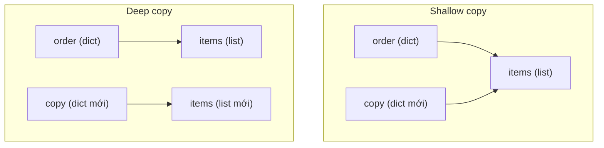

# Shallow Copy và Deep Copy

## 1. Tổng quan

Trong Python có ba mức "sao chép" khác nhau:

| Thao tác | Tạo object mới ở cấp ngoài? | Tạo object mới cho các object con? |
|---|---|---|
| Assignment `b = a` | Không | Không |
| Shallow copy `copy.copy(a)`, `a[:]`, `dict(a)` | Có | Không — dùng chung object con |
| Deep copy `copy.deepcopy(a)` | Có | Có — đệ quy toàn bộ |

Chọn sai mức là nguồn gốc của hai loại bug đối lập: dữ liệu bị sửa ngoài ý muốn (copy quá nông) và service chậm/tốn memory hoặc lỗi khó hiểu (copy quá sâu).

## 2. Mental Model



Giải thích:

1. Shallow copy tạo dict mới nhưng value bên trong vẫn là **cùng** list `items`. Sửa `copy["items"].append(...)` sẽ thấy ở `order` gốc.
2. Deep copy tạo dict mới **và** list mới cho mọi object con mutable. Hai cấu trúc độc lập hoàn toàn.
3. Với object con immutable (int, str, tuple của immutable), deep copy thường không tạo bản mới vì không cần: không ai sửa được chúng.

## 3. Vì sao cần hiểu?

- Hàm "làm việc trên bản sao" nhưng dùng shallow copy cho dữ liệu lồng nhau vẫn sửa dữ liệu gốc.
- Template/config mặc định bị sửa bởi request đầu tiên và "nhiễm" sang mọi request sau.
- `deepcopy` ở hot path (mỗi request) có thể chiếm phần lớn CPU và gây latency.
- `deepcopy` một object chứa lock, socket, DB session gây lỗi hoặc tạo ra bản sao vô nghĩa.

## 4. Cơ chế hoạt động

### Shallow copy

Các cách tạo shallow copy phổ biến:

```python
new_list = old_list[:]          # hoặc list(old_list), old_list.copy()
new_dict = dict(old_dict)       # hoặc old_dict.copy(), {**old_dict}
new_set = set(old_set)
import copy
new_obj = copy.copy(obj)
```

Tất cả tạo container mới và sao chép **reference** của các phần tử.

### `copy.copy` với object tùy biến

`copy.copy(x)` tìm theo thứ tự:

1. `type(x).__copy__` nếu có.
2. Giao thức pickle: `__reduce_ex__(4)` để lấy "công thức" tái tạo object, rồi dựng object mới với cùng state. Với instance thông thường, kết quả là object mới có `__dict__` là shallow copy của `__dict__` cũ.

### Deep copy và memo

`copy.deepcopy(x, memo)` đệ quy qua mọi object con. Tham số `memo` là dict ánh xạ `id(original) → copy`:

- Khi gặp lại object đã copy (hai reference tới cùng object), dùng lại bản copy — giữ nguyên cấu trúc chia sẻ.
- Khi gặp cycle, không đệ quy vô hạn vì object đã nằm trong memo.

```python
import copy

shared = [1, 2]
data = {"a": shared, "b": shared}
clone = copy.deepcopy(data)
clone["a"] is clone["b"]      # True — chia sẻ được bảo toàn
clone["a"] is shared          # False
```

Object tùy biến có thể định nghĩa `__deepcopy__(self, memo)` để kiểm soát, ví dụ bỏ qua cache hoặc không copy connection.

## 5. Internals: chi phí thật của deepcopy

`deepcopy` được viết bằng Python thuần (module `copy`), với mỗi object nó:

1. Tra `memo` bằng `id(x)`.
2. Tra dispatch table theo type hoặc tìm `__deepcopy__`/`__reduce_ex__`.
3. Tạo object mới, đệ quy cho từng phần tử, ghi vào memo.

Với cấu trúc có hàng chục nghìn node, chi phí có thể lên tới hàng chục mili giây — tức là lớn hơn cả một truy vấn database nhanh. Đo bằng `timeit` trước khi đặt `deepcopy` vào đường xử lý request.

Một số object không deep copy được hoặc cho kết quả vô nghĩa:

- `threading.Lock`, socket, file handle: raise `TypeError: cannot pickle ...`.
- Generator, frame: không copy được.
- Module, class, function: được coi là "atomic", trả về chính nó.
- SQLAlchemy session, HTTP client: nếu copy được thì bản sao chia sẻ connection pool bên dưới một cách khó lường.

## 6. Ví dụ: template mặc định bị nhiễm

```python
DEFAULT_REPORT = {
    "filters": {"status": ["active"]},
    "columns": ["id", "amount"],
}

def build_report(extra_status: str | None):
    report = DEFAULT_REPORT.copy()                 # shallow
    if extra_status:
        report["filters"]["status"].append(extra_status)   # sửa list DÙNG CHUNG
    return report
```

Request đầu tiên với `extra_status="pending"` làm `DEFAULT_REPORT["filters"]["status"]` thành `["active", "pending"]` vĩnh viễn trong process đó.

Ba cách sửa, theo thứ tự ưu tiên:

```python
# 1. Xây mới thay vì sửa: không cần copy
def build_report(extra_status: str | None):
    statuses = ["active"] + ([extra_status] if extra_status else [])
    return {"filters": {"status": statuses}, "columns": ["id", "amount"]}

# 2. Default là immutable, tạo cấu trúc mutable mới khi cần
DEFAULT_STATUSES = ("active",)

# 3. Deep copy khi cấu trúc thực sự phức tạp và nhỏ
import copy
report = copy.deepcopy(DEFAULT_REPORT)
```

## 7. Hành vi trong production

**Pydantic và dataclass.** Pydantic v2 tạo bản copy cho default mutable của field (vì vậy `items: list[str] = []` an toàn trong Pydantic model, khác với function default). `model.model_copy()` là shallow; `model_copy(deep=True)` là deep. `dataclasses.replace(obj, **changes)` tạo instance mới với shallow copy các field còn lại.

**Truyền dữ liệu qua process/queue.** Khi gửi object qua `multiprocessing` hoặc Celery, dữ liệu được serialize (pickle/JSON) — tương đương một deep copy. Bên nhận có bản độc lập; sửa bên nhận không ảnh hưởng bên gửi. Đồng thời chi phí serialize tỷ lệ với kích thước dữ liệu.

**Cache.** Nếu cache lưu object mutable và cần trả bản an toàn, việc deepcopy mỗi lần đọc có thể xóa sạch lợi ích của cache. Lưu dạng immutable (tuple, frozen model) hoặc dạng đã serialize (bytes) thường rẻ hơn.

## 8. Failure Modes

| Failure | Nguyên nhân | Dấu hiệu |
|---|---|---|
| Rò dữ liệu giữa request | Shallow copy template lồng nhau rồi mutate phần con | Kết quả sai sau request đầu tiên có tham số đặc biệt |
| CPU cao ở endpoint đơn giản | `deepcopy` cấu trúc lớn mỗi request | Profiler thấy `copy.deepcopy`, `_deepcopy_dict` |
| `TypeError: cannot pickle '_thread.lock'` | Deep copy object chứa lock/connection | Lỗi khi copy model/service object |
| Memory tăng đột biến | Deep copy tạo bản thứ hai của dữ liệu lớn | Đỉnh memory gấp đôi khi xử lý batch |

## 9. Trade-offs

| Cách | Khi phù hợp | Chi phí |
|---|---|---|
| Không copy, dùng immutable | Dữ liệu dùng chung, config, message | Cần thiết kế từ đầu |
| Shallow copy | Chỉ thay đổi cấp ngoài cùng (thêm/xóa key) | Phần con vẫn dùng chung |
| Deep copy | Cấu trúc nhỏ, lồng nhau, cần độc lập hoàn toàn | CPU, memory, không copy được tài nguyên |
| Xây mới từ dữ liệu gốc | Biến đổi dữ liệu theo kiểu functional | Code dài hơn đôi chút, nhưng rõ ràng |

## 10. Sai lầm thường gặp

- Nghĩ `list(a)` hay `a.copy()` cho ra bản độc lập với dữ liệu lồng nhau.
- Dùng `deepcopy` như phản xạ "cho chắc", kể cả ở hot path.
- Deep copy object nghiệp vụ đang giữ session/connection.
- Quên rằng `[[0] * 3] * 3` tạo ba reference tới **cùng** một list con; dùng `[[0] * 3 for _ in range(3)]`.

## 11. Cách debug

- So sánh `id()` của object con giữa bản gốc và bản copy để biết chúng có dùng chung không.
- Khi nghi dữ liệu dùng chung bị sửa, bọc bằng `MappingProxyType` hoặc frozen model trong test để phát hiện nơi mutate.
- Dùng profiler (`py-spy`, `cProfile`) để tìm `deepcopy` trong hot path.

## 12. Best Practices

- Thiết kế để không cần copy: dữ liệu dùng chung là immutable, biến đổi bằng cách tạo mới.
- Nếu phải copy, copy đúng mức: shallow cho thay đổi cấp ngoài, deep cho cấu trúc nhỏ cần độc lập.
- Định nghĩa `__deepcopy__` hoặc tách tài nguyên ra khỏi object dữ liệu để object dữ liệu copy được an toàn.
- Đo chi phí copy trước khi đưa vào đường xử lý request.

## 13. Tóm tắt

- Assignment không copy; shallow copy tạo container mới nhưng dùng chung phần tử; deep copy tạo mới đệ quy.
- `deepcopy` dùng memo để bảo toàn chia sẻ và xử lý cycle.
- Deep copy tốn kém và không áp dụng được cho tài nguyên như lock, socket, session.
- Cách tốt nhất để tránh bug copy là dùng immutable cho dữ liệu dùng chung.

## Liên quan

- [Mutable và Immutable](mutable-immutable.md)
- [Python Object Model](object-model.md)
- [Validation với Pydantic](../03-fastapi/validation-pydantic.md)
