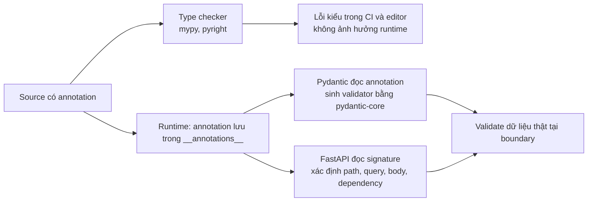
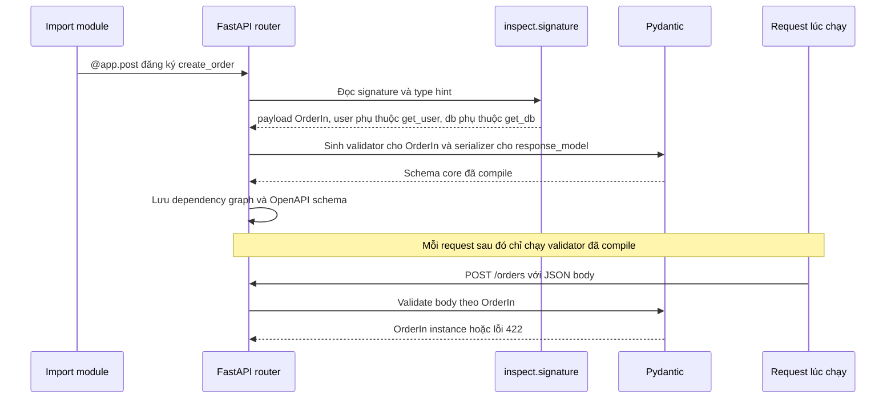

# Typing trong Python

## 1. Tổng quan

Type hint (`def get(user_id: int) -> User | None`) là **annotation**: metadata gắn vào function, class, biến. Bản thân CPython **không kiểm tra** type hint khi chạy — truyền `"abc"` vào tham số `int` vẫn chạy bình thường cho đến khi code bên trong gặp lỗi.

Type hint có hai "người đọc" hoàn toàn khác nhau:

1. **Static type checker** (mypy, pyright, Pyrefly, ty...) đọc source code trước khi chạy, phát hiện lỗi kiểu trong CI hoặc trong editor.
2. **Framework runtime** (Pydantic, FastAPI, dataclasses, SQLAlchemy 2.0, Typer) đọc annotation **lúc chạy** để sinh validator, serializer, dependency injection, OpenAPI schema, ánh xạ ORM.

Trong backend Python hiện đại, type hint không còn chỉ là tài liệu: với FastAPI, annotation **chính là** định nghĩa API.

## 2. Mental Model



Diễn giải:

1. Cùng một annotation đi theo hai nhánh độc lập.
2. Nhánh static: type checker suy luận kiểu trên toàn bộ codebase, không chạy code. Nó chỉ tốt bằng mức độ annotation đầy đủ và trung thực.
3. Nhánh runtime: annotation được lưu vào object; framework đọc chúng để sinh logic kiểm tra dữ liệu thật đến từ bên ngoài (HTTP body, env var, message queue).
4. Static typing bảo vệ **bên trong** code (developer gọi sai hàm); runtime validation bảo vệ **boundary** (dữ liệu từ thế giới bên ngoài không đáng tin).

> Type hint là lời hứa. Type checker kiểm tra lời hứa giữa các phần code với nhau; Pydantic kiểm tra lời hứa với dữ liệu thật.

## 3. Vì sao cần typing?

- **Refactor an toàn** trong codebase lớn: đổi signature, type checker liệt kê mọi nơi gọi sai.
- **Tài liệu luôn đúng**: annotation không lỗi thời như docstring vì CI kiểm tra nó.
- **Phát hiện lỗi `None`**: `User | None` buộc caller xử lý trường hợp không tìm thấy.
- **Contract của API**: FastAPI sinh validation và OpenAPI từ annotation; client được sinh từ OpenAPI.
- **Editor hỗ trợ**: autocomplete, go-to-definition chính xác.

## 4. Cơ chế: annotation được lưu và đánh giá thế nào?

```python
def charge(amount: Decimal, currency: str = "VND") -> Receipt: ...
charge.__annotations__
# {'amount': Decimal, 'currency': str, 'return': Receipt}
```

Thời điểm annotation được **đánh giá** thay đổi theo version:

> **Ghi chú version:**
> - Trước 3.14 (mặc định): annotation được đánh giá ngay khi `def`/`class` chạy. Tham chiếu tới class chưa định nghĩa (forward reference) phải viết dạng chuỗi `"Receipt"`.
> - `from __future__ import annotations` (PEP 563): mọi annotation được lưu dưới dạng chuỗi, không đánh giá. Framework phải tự `eval` lại bằng `typing.get_type_hints()`.
> - Python 3.14 (PEP 649/749): annotation được đánh giá **lười** — chỉ khi có người truy cập `__annotations__`. Forward reference hoạt động mà không cần chuỗi. Module `annotationlib` cho phép lấy annotation dưới dạng giá trị, chuỗi, hoặc forward reference.

Hệ quả thực tế: dùng `typing.get_type_hints(obj)` hoặc `annotationlib.get_annotations` (3.14+) thay vì đọc `__annotations__` trực tiếp khi viết code đọc annotation lúc runtime.

## 5. Các công cụ typing quan trọng cho backend

### Union, Optional, generic built-in

```python
def find(user_id: int) -> User | None: ...          # 3.10+, thay cho Optional[User]
def batch(ids: list[int]) -> dict[int, User]: ...    # 3.9+, thay cho List, Dict
```

### Generic: TypeVar và cú pháp mới

```python
# Cú pháp 3.12+ (PEP 695)
def first[T](items: Sequence[T]) -> T | None:
    return items[0] if items else None

class Repository[ModelT]:
    def get(self, id: int) -> ModelT | None: ...

type UserId = int          # type alias 3.12+
```

Trước 3.12 dùng `T = TypeVar("T")` và `class Repository(Generic[ModelT])`.

### Protocol: structural typing

```python
from typing import Protocol

class Cache(Protocol):
    async def get(self, key: str) -> bytes | None: ...
    async def set(self, key: str, value: bytes, ttl: int) -> None: ...

async def cached_profile(cache: Cache, user_id: int) -> Profile: ...
```

Bất kỳ class nào có hai method đúng signature đều thỏa `Cache`, **không cần kế thừa**. Đây là cách biểu diễn "port" trong [Hexagonal Architecture](../09-software-architecture/hexagonal-architecture.md) mà không buộc adapter phụ thuộc vào module định nghĩa interface.

### `Annotated`: gắn metadata cho framework

```python
from typing import Annotated
from fastapi import Depends, Query

async def list_orders(
    limit: Annotated[int, Query(ge=1, le=100)] = 20,
    db: Annotated[AsyncSession, Depends(get_db)] = ...,
): ...
```

`Annotated[T, meta...]` với type checker vẫn là `T`; framework đọc phần metadata. FastAPI khuyến nghị cách viết này vì nó giữ signature Python bình thường và cho phép tái sử dụng alias: `DB = Annotated[AsyncSession, Depends(get_db)]`.

### ParamSpec: typing decorator

```python
from typing import Callable, ParamSpec, TypeVar
P = ParamSpec("P")
R = TypeVar("R")

def timed(func: Callable[P, R]) -> Callable[P, R]: ...
```

Không có `ParamSpec`, decorator làm mất signature với type checker. Xem [Decorators](decorators.md).

### Các công cụ khác

| Công cụ | Dùng khi |
|---|---|
| `Literal["pending", "paid"]` | Giá trị cố định, ít hơn cả Enum |
| `TypedDict` | Dict có cấu trúc cố định (JSON payload, kwargs) |
| `Final` | Hằng số không được gán lại |
| `NewType("OrderId", int)` | Phân biệt ID cùng kiểu cơ sở (không nhầm OrderId với UserId) |
| `Self` (3.11+) | Method trả về instance của chính class (builder, fluent API) |
| `TypeIs` (3.13+), `TypeGuard` | Hàm kiểm tra thu hẹp kiểu |
| `@overload` | Kiểu trả về phụ thuộc vào argument |
| `Never`/`NoReturn` | Hàm không bao giờ return |

### Variance: vì sao nhận `Sequence` thay vì `list`

`list[Dog]` không phải `list[Animal]` với type checker, vì `list` mutable: hàm nhận `list[Animal]` có thể `append(Cat())`, làm hỏng list của caller. `Sequence[Animal]` là read-only nên **covariant**: `Sequence[Dog]` được chấp nhận. Quy tắc thực hành: tham số nhận kiểu trừu tượng, read-only (`Sequence`, `Mapping`, `Iterable`); giá trị trả về dùng kiểu cụ thể.

## 6. Bên trong hệ thống xảy ra gì khi FastAPI đọc annotation?



Diễn giải:

1. Phân tích annotation xảy ra **một lần** khi route được đăng ký (lúc import), không phải mỗi request.
2. FastAPI dùng `inspect.signature` và type hint để phân loại từng tham số: path, query, header, body, dependency.
3. Pydantic v2 compile schema thành validator viết bằng Rust (`pydantic-core`), nên validation mỗi request nhanh.
4. Mỗi request chỉ chạy validator đã compile. Annotation sai hoặc decorator làm mất signature sẽ làm hỏng bước 2.

Chi tiết ở [Validation với Pydantic](../03-fastapi/validation-pydantic.md) và [Request Lifecycle](../03-fastapi/request-lifecycle.md).

## 7. Hành vi trong production

- **Type hint không bảo vệ runtime.** Dữ liệu từ Redis, message queue, API bên ngoài có thể không đúng kiểu dù code được annotate đầy đủ. Validate tại boundary (Pydantic `model_validate`, `TypeAdapter`), sau đó tin vào type bên trong.
- **`Any` lan truyền.** Một hàm trả `Any` (thường từ `json.loads`, thư viện không có type) làm mọi thứ dùng kết quả của nó thoát khỏi kiểm tra. Parse vào model có kiểu càng sớm càng tốt.
- **`cast` là lời nói dối có chủ đích.** `cast(User, obj)` không kiểm tra gì; chỉ dùng khi bạn biết chắc hơn type checker.
- **Chi phí runtime validation.** Validate model lồng nhau lớn ở mỗi request tốn CPU. Pydantic v2 nhanh hơn v1 nhiều lần, nhưng validate lại dữ liệu đã tin cậy (từ database của chính mình) có thể không cần thiết — `model_construct` bỏ qua validation khi dữ liệu đã chắc chắn đúng.
- **Nâng version Python.** Thay đổi cách đánh giá annotation (PEP 563, PEP 649) có thể làm thư viện đọc annotation lúc runtime hành xử khác; kiểm tra khả năng tương thích của Pydantic, FastAPI, SQLAlchemy khi nâng version.

## 8. Failure Modes

| Failure | Nguyên nhân | Dấu hiệu |
|---|---|---|
| `NameError` khi import | Forward reference chưa định nghĩa, không dùng chuỗi (trước 3.14) | Lỗi lúc import module |
| FastAPI hiểu sai tham số | Decorator mất signature, annotation sai | Tham số thành query thay vì body, lỗi 422 |
| Lỗi runtime dù CI xanh | Dữ liệu ngoài không đúng type, `Any`/`cast` che giấu | `AttributeError`/`TypeError` trong production |
| Type checker chậm / nhiều lỗi giả | Codebase lớn thiếu annotation, cấu hình không nhất quán | Team tắt kiểm tra |
| Circular import vì typing | Import module chỉ để dùng trong annotation | `ImportError` vòng |

Với circular import chỉ vì annotation, dùng `if TYPE_CHECKING:` để import chỉ khi type checker chạy.

## 9. Trade-offs

| Lựa chọn | Lợi ích | Chi phí |
|---|---|---|
| Strict typing toàn bộ | Bắt nhiều lỗi nhất, refactor an toàn | Tốn công, khó với thư viện thiếu type |
| Gradual typing | Áp dụng dần từ module quan trọng | Có vùng không được kiểm tra |
| Runtime validation mọi nơi | An toàn tối đa | Tốn CPU, code dài |
| Validate chỉ tại boundary | Hiệu quả, rõ trách nhiệm | Phải kỷ luật về nơi dữ liệu đi vào |
| Protocol | Loose coupling, không cần kế thừa | Lỗi chỉ phát hiện bởi type checker, không phải runtime |
| ABC | Kiểm tra lúc khởi tạo instance | Buộc kế thừa, coupling |

## 10. Sai lầm thường gặp

- Tin rằng type hint được kiểm tra khi chạy.
- Dùng `dict[str, Any]` cho mọi payload thay vì model có cấu trúc.
- Dùng `list` cho tham số khi chỉ cần đọc (nên `Sequence`/`Iterable`).
- Rải `# type: ignore` và `cast` để làm CI xanh.
- Chạy type checker ở chế độ khác nhau giữa editor và CI.
- Quên rằng annotation trong FastAPI/Pydantic có hiệu lực runtime: đổi `int` thành `str` là đổi contract của API.

## 11. Cách debug

- `typing.get_type_hints(func, include_extras=True)` để xem annotation đã được giải quyết (kể cả `Annotated`).
- `inspect.signature(func)` để xem thứ FastAPI nhìn thấy.
- `reveal_type(expr)` trong code để type checker in kiểu suy luận được.
- `app.openapi()` hoặc `/docs` để kiểm tra FastAPI hiểu tham số thế nào.
- `pydantic.TypeAdapter(T).json_schema()` để xem schema Pydantic sinh ra.

## 12. Best Practices

- Annotate public API của module trước, sau đó mở rộng dần; bật chế độ strict theo từng package.
- Validate dữ liệu ngoài bằng Pydantic tại boundary; bên trong dùng type tĩnh.
- Dùng `Protocol` cho dependency có thể thay thế (cache, repository, client) để test dễ.
- Dùng `Annotated` cho metadata của FastAPI; tạo alias cho dependency dùng lại nhiều.
- Chạy type checker trong CI với cùng cấu hình như editor.
- Ghi rõ version Python mục tiêu để type checker hiểu đúng cú pháp (PEP 695, `Self`, `TypeIs`).

## 13. Tóm tắt

- Type hint là annotation; CPython không kiểm tra chúng khi chạy.
- Static type checker kiểm tra tính nhất quán bên trong code; Pydantic/FastAPI dùng annotation lúc runtime để validate dữ liệu tại boundary.
- Thời điểm đánh giá annotation thay đổi: đánh giá ngay (trước 3.14), chuỗi (PEP 563), lười (3.14, PEP 649).
- `Protocol`, generic, `Annotated`, `ParamSpec` là các công cụ quan trọng nhất trong backend.
- Tham số nhận kiểu read-only trừu tượng; trả về kiểu cụ thể.

## Liên quan

- [Decorators](decorators.md)
- [Validation với Pydantic](../03-fastapi/validation-pydantic.md)
- [Dependency Injection trong FastAPI](../03-fastapi/dependency-injection.md)
- [Hexagonal Architecture](../09-software-architecture/hexagonal-architecture.md)
