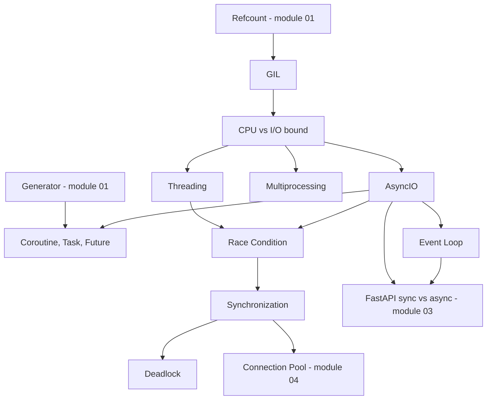

# 02 — Python Concurrency

## Module này học gì?

Các mô hình thực thi đồng thời trong Python và cách chúng hoạt động bên dưới: GIL của CPython, thread, process, AsyncIO (event loop, coroutine, Task, Future), cùng các vấn đề đi kèm khi nhiều tác vụ chia sẻ trạng thái — race condition, synchronization, deadlock.

## Tại sao cần học?

Mọi backend Python production đều chạy đồng thời: nhiều worker process, threadpool cho endpoint sync, event loop cho endpoint async, worker Celery. Hiểu sai mô hình dẫn tới những sự cố điển hình:

- Endpoint async gọi thư viện blocking làm cả worker đứng yên.
- Thêm thread cho công việc CPU mà không nhanh hơn.
- Race condition làm bán vượt tồn kho dù "Python có GIL".
- Pool starvation làm service treo dưới tải cao với CPU 0%.

## Thứ tự nên đọc

1. [Global Interpreter Lock](gil.md) — vì sao có GIL, khi nào nó được nhả; phân biệt concurrency, parallelism, async, multithreading, multiprocessing.
2. [CPU-bound, I/O-bound và chọn execution model](cpu-vs-io-bound.md) — đo workload, Little's Law, chọn mô hình.
3. [Threading](threading.md)
4. [Multiprocessing](multiprocessing.md)
5. [AsyncIO](asyncio.md) — bức tranh tổng thể và luồng một request từ socket tới coroutine.
6. [Event Loop](event-loop.md) — thuật toán bên trong loop, executor, loop lag.
7. [Coroutine, Task và Future](coroutine-task-future.md) — `Task.__step`, cancellation, TaskGroup.
8. [Race Condition](race-condition.md)
9. [Synchronization](synchronization.md)
10. [Deadlock](deadlock.md)

## Các concept phụ thuộc nhau thế nào?

Cách đọc diagram:

1. GIL xuất phát từ reference counting (module 01) và quyết định thread có ích cho loại workload nào.
2. Phân loại CPU/I/O dẫn tới ba lựa chọn: thread, process, AsyncIO.
3. AsyncIO được xây từ event loop và cơ chế coroutine — vốn là generator có thể tạm dừng (module 01).
4. Cả thread lẫn AsyncIO đều có race condition; synchronization giải quyết nó và mở ra rủi ro deadlock.
5. Kiến thức này là nền trực tiếp cho FastAPI sync/async endpoint và connection pool.

## File quan trọng nhất

[GIL](gil.md), [AsyncIO](asyncio.md) và [Race Condition](race-condition.md). Ba file này giải thích phần lớn hành vi đồng thời mà bạn gặp trong FastAPI, SQLAlchemy và Celery ở các module sau.

---

[← Python Core](../01-python-core/README.md) · [Knowledge map](../../README.md) · [FastAPI →](../03-fastapi/README.md)
