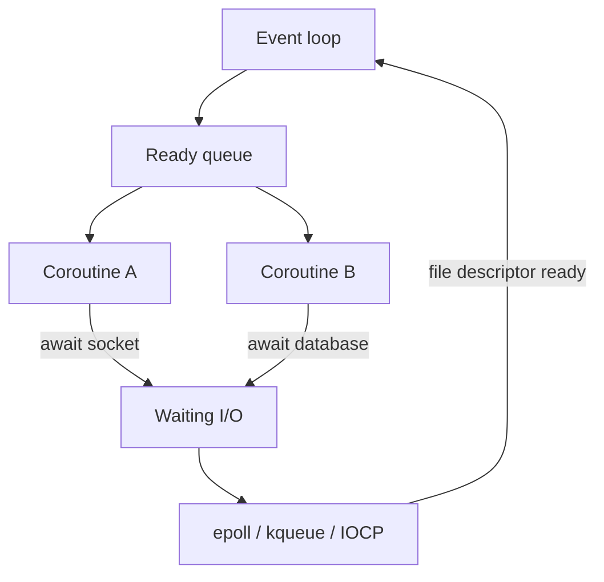

# AsyncIO

> **Phạm vi phỏng vấn:** Python Concurrency · **Ưu tiên:** P0/P1 · **Mindset:** Why → How → Trade-off → Production.

## 1. What is it?

AsyncIO là cooperative concurrency: coroutine tự nhường quyền tại `await`, event loop multiplex I/O readiness và scheduling task.

## 2. Why does it matter?

Senior Engineer cần hiểu **AsyncIO** để chọn đúng execution model, bảo vệ shared state và giữ tail latency ổn định. Điểm phỏng vấn nằm ở khả năng nêu invariant, điều kiện áp dụng và failure behavior, không nằm ở việc thuộc định nghĩa.

## 3. How does it work?

Một event loop chạy callback ngắn; `await` I/O đăng ký continuation. Blocking call chặn toàn loop, cancellation chỉ có hiệu lực tại suspension point và structured concurrency giới hạn orphan task.

Khi reasoning, đi theo chuỗi: **input → state transition → output → failure → recovery**. Quan sát `event-loop lag, queue depth, context switch, CPU saturation và p99 latency` và phân biệt symptom, bottleneck với root cause.

## 4. Example

```python
import asyncio

async def call_service(name: str, delay: float) -> str:
    await asyncio.sleep(delay)  # Simulate non-blocking I/O.
    return f"{name}:ok"

async def aggregate() -> list[str]:
    async with asyncio.TaskGroup() as group:
        tasks = [group.create_task(call_service(n, 0.05)) for n in ("vehicle", "warranty")]
    return [task.result() for task in tasks]

if __name__ == "__main__":
    print(asyncio.run(aggregate()))
```

## 5. Production Use Case

Gateway gọi ba AI service song song bằng `TaskGroup`, áp per-call timeout và semaphore; CPU-heavy parsing được offload khỏi loop.

Checklist triển khai: capacity budget, timeout, idempotency (nếu có side effect), telemetry, canary, rollback và reconciliation.

## 6. Common Problems

- Không định nghĩa invariant và source of truth trước khi chọn công nghệ.
- Retry không backoff/jitter làm traffic amplification khi dependency lỗi.
- Không có bound cho queue, connection, memory hoặc concurrency.
- Chỉ theo dõi average; bỏ qua p95/p99, saturation và error semantics.
- Rollout toàn bộ, thiếu feature flag/canary và đường rollback dữ liệu.

## 7. Trade-offs

| Lựa chọn | Lợi ích | Chi phí / rủi ro | Khi phù hợp |
|---|---|---|---|
| Tối ưu/thiết kế xoay quanh AsyncIO | Kiểm soát rõ constraint chính | Tăng complexity và coupling | Metric chứng minh đây là bottleneck/risk |
| Giữ baseline đơn giản | Ít dependency, dễ debug | Có thể chạm giới hạn sớm | Traffic vừa, invariant vẫn được giữ |
| Managed service/library | Giảm vận hành hạ tầng | Cost, lock-in, giới hạn control | SLA và economics phù hợp |
| Tự vận hành/customize | Kiểm soát sâu | Ownership và failure surface lớn | Có năng lực vận hành và nhu cầu thật |

## 8. Interview Questions

### Basic / Mid-level (10)

- **B1.** What is AsyncIO, and which concrete problem does it address?
- **B2.** Explain the main internal mechanism behind AsyncIO.
- **B3.** Which guarantees does AsyncIO provide, and which does it not provide?
- **B4.** Which metrics or observations reveal the behavior of AsyncIO?
- **B5.** What is the most common misconception about AsyncIO?
- **B6.** How would you test assumptions involving AsyncIO?
- **B7.** Which edge cases or failure modes matter most for AsyncIO?
- **B8.** How can AsyncIO affect latency, throughput, memory, or correctness?
- **B9.** Which runtime conditions or configuration choices change the behavior of AsyncIO?
- **B10.** When is a different or simpler approach better than relying on AsyncIO?

### Production Scenarios (5)

- **S1.** Event-loop lag jumps to 800 ms after a release while total CPU stays normal. How do you isolate the blocking call?
- **S2.** One request fans out to 1,000 downstream calls. Design bounded concurrency, deadline propagation, and cancellation.
- **S3.** A client disconnects during LLM streaming but provider usage continues. Where should cancellation be handled?
- **S4.** Ten sibling tasks run concurrently and one fails. Compare gather behavior with structured concurrency.
- **S5.** An async service leaks tasks during shutdown. How do you drain work without hanging deployment?

## 9. Senior-level Questions

- **L1.** How does AsyncIO constrain the surrounding architecture and operational model?
- **L2.** Which subtle correctness issue appears when AsyncIO meets concurrency or partial failure?
- **L3.** What breaks first around AsyncIO at 20,000 RPS or 100× data volume?
- **L4.** Where should admission control or backpressure be placed when using AsyncIO?
- **L5.** How would you benchmark or validate AsyncIO without a misleading microbenchmark?
- **L6.** Which hidden coupling or migration cost can AsyncIO introduce?
- **L7.** How would you change a poor decision around AsyncIO with no downtime?
- **L8.** What production evidence would make you choose a different approach?
- **L9.** How do correctness, latency, cost, and complexity trade off for AsyncIO?
- **L10.** How would you turn an incident involving AsyncIO into a durable prevention mechanism?

## 10. Short Answers

**B1.** AsyncIO là cooperative concurrency: coroutine tự nhường quyền tại `await`, event loop multiplex I/O readiness và scheduling task. Trả lời tốt nối definition với constraint/invariant và một use case cụ thể.

**B2.** Mô tả state, lifecycle, boundary và failure path; không dừng ở public API của AsyncIO.

**B3.** Nêu lúc tạo, lúc sử dụng, lúc release/commit và điều xảy ra khi timeout hoặc cancellation.

**B4.** Đo event-loop lag, queue depth, context switch, CPU saturation và p99 latency; luôn tách average khỏi tail và success khỏi useful result.

**B5.** Lỗi phổ biến là dùng AsyncIO như mặc định mà không xác định ownership, limit và fallback.

**B6.** Test invariant trước, sau đó integration test failure path, concurrency và representative load.

**B7.** Xét timeout, duplicate, stale state, overload, dependency loss và recovery/reconciliation.

**B8.** Đo critical path, contention, queueing và amplification; throughput cao không bù được p99 xấu.

**B9.** Deadline, concurrency limit, retention/TTL, resource budget, telemetry và rollout policy phải explicit.

**B10.** Tránh AsyncIO khi bài toán đơn giản hơn giải được invariant với ít state và operational cost hơn.

Cấu trúc câu trả lời: **Definition → Why → How → Trade-off → Production example**. Với câu scenario: **stabilize → observe → hypothesize → verify → mitigate → prevent**.

## 11. Follow-up Questions

- **F1.** What assumption in your answer is most risky?
- **F2.** How would you prove that with metrics or an experiment?
- **F3.** What changes if the operation is not idempotent?
- **F4.** Where would you add timeout, retry, and backpressure?
- **F5.** What is your rollback and data-reconciliation plan?

## 12. Key Takeaways

- Nói được **vai trò, constraint hoặc invariant của AsyncIO**, không chỉ “dùng để làm gì”.
- Định lượng bằng event-loop lag, queue depth, context switch, CPU saturation và p99 latency và có baseline trước tối ưu.
- Thiết kế cho timeout, duplicate, overload, partial failure và recovery.
- Mọi tối ưu đều có chi phí về correctness, complexity, latency hoặc money.
- Production-ready nghĩa là có owner, alert, runbook, canary, rollback và reconciliation.


## 13. Mental Model

Event loop không làm nhiều việc cùng lúc. Nó chạy coroutine đang sẵn sàng cho tới khi coroutine tự nhường tại `await`, rồi chuyển sang việc khác.

## 14. Internals Deep Dive


Gọi `async def` tạo coroutine object; code chưa chạy cho đến khi `await` hoặc schedule thành Task. Task gọi coroutine `.send()` cho tới khi coroutine return, raise hoặc yield một awaitable chưa hoàn tất. Event loop đăng callback để resume Task khi Future hoàn thành.

Với socket non-blocking, read chưa có data trả trạng thái “would block”; loop đăng file descriptor với selector (`epoll`, `kqueue` hoặc cơ chế tương ứng). OS báo readiness, loop đưa callback vào ready queue. `await` không sinh thread và không nhất thiết yield nếu awaitable đã hoàn tất. CPU loop không có `await` giữ event-loop thread, làm timer, socket và cancellation khác bị trễ.


Implementation detail có thể đổi theo version; khi trả lời interview, nêu rõ CPython/PostgreSQL/Redis/framework version nếu kết luận dựa vào behavior nội bộ thay vì public contract.

## 15. Request / Data Flow



Đọc diagram từ input tới state transition và output. Tại mỗi mũi tên, hỏi: operation có block không, có retry không, state có durable không, identity nào dùng để dedupe và metric nào chứng minh bước đó khỏe.

## 16. Failure Scenario

Dưới load, blocking call, unbounded fan-out, race hoặc lock contention làm queue/loop lag tăng. Áp deadline, semaphore/pool bound, structured cancellation và tách CPU work khỏi event loop.

Phân tích theo chuỗi: **trigger → saturation/incorrect state → propagation → user impact → immediate mitigation → durable prevention**. Tránh gọi retry hoặc scale là giải pháp nếu chưa chỉ ra dependency budget.

## 17. How I would debug this in production

1. Phân loại CPU-bound, blocking I/O hay async I/O.
2. Xem per-core CPU, event-loop lag, thread/process/queue depth.
3. Capture stack/profile của execution unit đang giữ CPU/lock.
4. Kiểm semaphore, timeout, cancellation và shared-state invariant.
5. Load test lại với bounded concurrency.

## 18. Common Misconceptions

**Sai:** concurrency luôn là parallelism và thêm worker luôn tăng throughput. **Đúng:** queueing, GIL, locks và downstream capacity có thể làm p99 tệ hơn.

## 19. When NOT to use

Không thêm concurrency khi workload nhỏ hoặc downstream đã saturated; model tuần tự đơn giản có thể đúng và dễ vận hành hơn.

## 20. What interviewer may ask next

1. **What guarantee does AsyncIO provide, and what does it explicitly not guarantee?**
2. **Which implementation detail changes across versions or runtimes?**
3. **Where is the first queue or contention point under high load?**
4. **What happens if the dependency times out after committing state?**
5. **How would you observe, degrade, and recover this in production?**
6. **Which simpler design would you choose at 100 RPS, and when would you evolve it?**

## 21. Check Your Understanding

1. Nếu throughput tăng 20× nhưng downstream capacity không đổi, **AsyncIO** sẽ tạo queue/backpressure ở đâu?
2. Timeout xảy ra ngay sau một state transition; caller có thể kết luận điều gì và không thể kết luận điều gì?
3. Metric, trace span và log field tối thiểu nào giúp phân biệt application, dependency và network latency?

<details>
<summary>Answer</summary>

1. Queue xuất hiện tại bounded resource đầu tiên: worker/thread/semaphore/connection pool/broker hoặc dependency. Nếu không có bound, overload chuyển thành memory growth và timeout storm.
2. Caller chỉ biết chưa nhận response trong deadline; operation có thể chưa chạy, đang chạy hoặc đã commit. Cần operation identity/idempotency và status/reconciliation.
3. Dùng end-to-end latency + queue/service time, correlation/trace ID, dependency spans, error/retry classification và saturation của pool/queue/resource.

</details>

## 22. See also

- [Event Loop](event-loop.md)
- [FastAPI Sync vs Async](../03-fastapi/sync-vs-async-endpoint.md)
- [CPU vs I/O](cpu-vs-io-bound.md)
