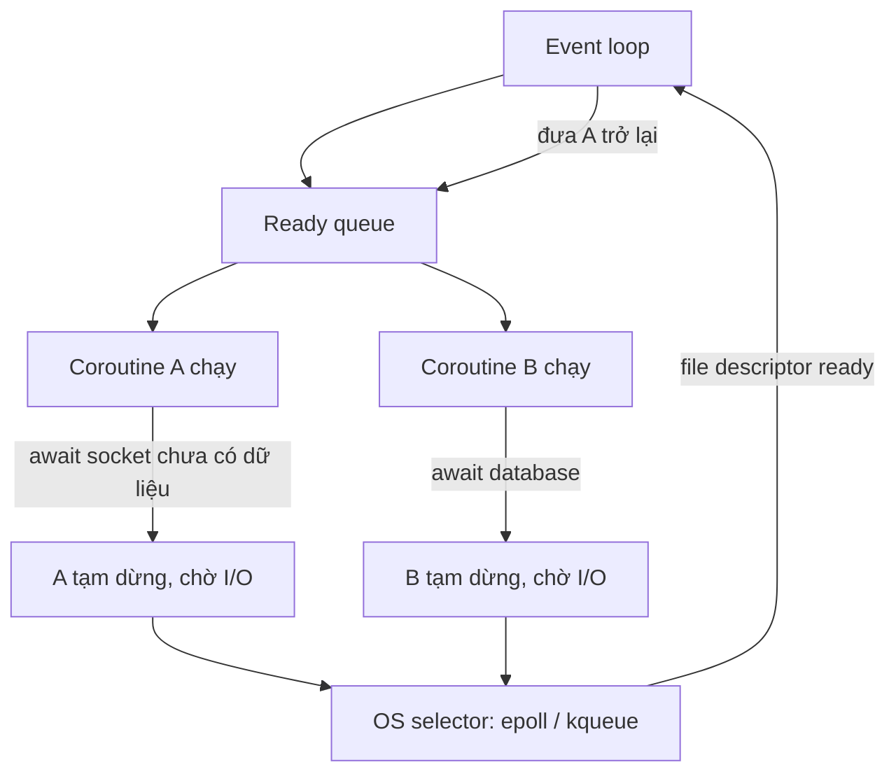
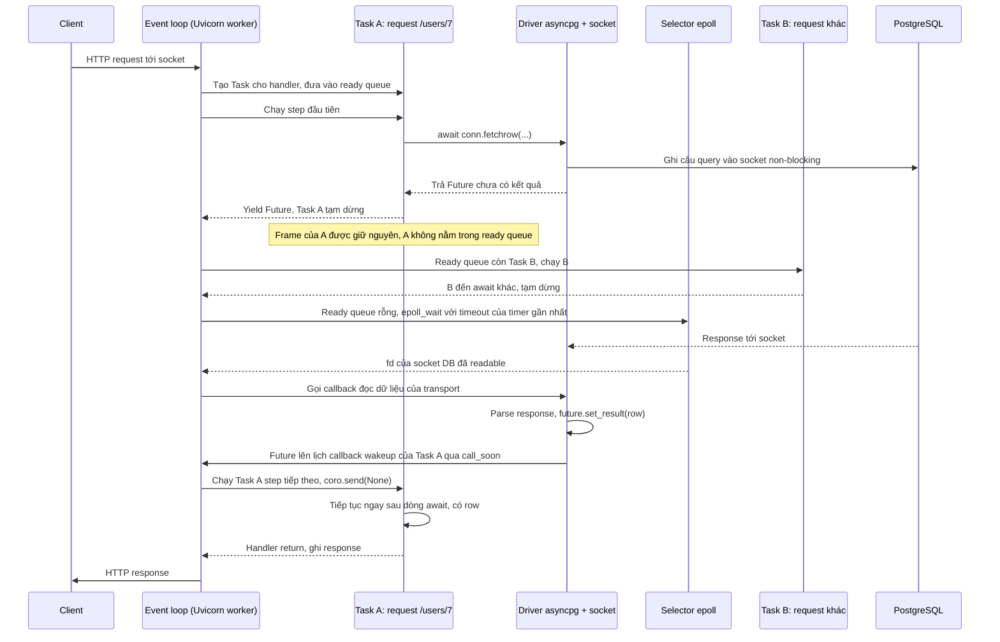
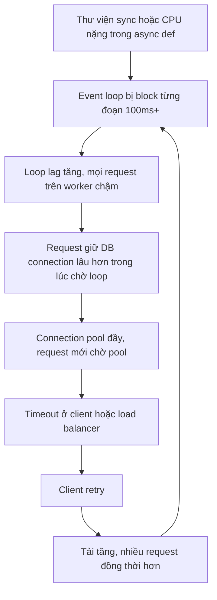

# AsyncIO

## 1. Tổng quan

AsyncIO là cơ chế concurrency dựa trên coroutine và event loop của Python.

Mục tiêu chính của AsyncIO là cho phép **một thread** xử lý nhiều tác vụ I/O đang chờ mà không cần tạo một OS thread cho mỗi tác vụ. Một worker FastAPI có thể giữ hàng nghìn kết nối đang chờ database, Redis, HTTP service khác, trong khi chỉ có một thread chạy Python code.

Khi coroutine thực thi đến một `await` mà kết quả chưa sẵn sàng, coroutine tạm dừng và trả quyền điều khiển về event loop. Event loop sau đó chạy coroutine khác đang ở trạng thái ready. Khi hệ điều hành báo dữ liệu đã tới, coroutine bị tạm dừng được đưa trở lại hàng đợi và tiếp tục chạy từ đúng dòng `await`.

Điểm quan trọng là AsyncIO không tự biến CPU-bound code thành parallel workload. Nếu một coroutine chạy CPU-intensive code quá lâu mà không nhường quyền, toàn bộ event loop bị block — mọi request khác trên worker đó đứng yên.

## 2. Mental Model



Diễn giải:

1. Event loop lấy việc từ **ready queue** — danh sách những việc có thể chạy ngay.
2. Coroutine A chạy đến khi gặp `await` trên một socket chưa có dữ liệu. A không đứng chờ; nó **tạm dừng** và trả quyền cho loop.
3. Loop lấy việc tiếp theo trong ready queue: coroutine B. B chạy đến `await` database và cũng tạm dừng.
4. Socket của A và B đã được đăng ký với **selector** của OS (`epoll` trên Linux, `kqueue` trên macOS/BSD).
5. Khi ready queue rỗng, loop hỏi OS: "socket nào có dữ liệu?" và ngủ tới khi có câu trả lời hoặc tới hạn timer gần nhất.
6. OS báo socket của A đã sẵn sàng; loop đưa A trở lại ready queue. A tiếp tục chạy từ ngay sau dòng `await`.

> Event loop không làm nhiều việc cùng lúc. Nó làm **một việc tại một thời điểm**, nhưng không bao giờ đứng chờ I/O. Thời gian chờ của mọi tác vụ được chồng lên nhau.

## 3. Vì sao cần AsyncIO?

### Bài toán: nhiều kết nối, phần lớn thời gian là chờ

Một request API điển hình: 1 ms CPU để parse và validate, 20 ms chờ database, 30 ms chờ service khác, 1 ms để serialize response. Hơn 95% thời gian request **không dùng CPU**.

### Cách tiếp cận thread-per-request

Mỗi request một thread. Thread chờ I/O thì OS cho thread khác chạy. Mô hình đơn giản, nhưng khi số kết nối đồng thời lên hàng nghìn:

- Mỗi OS thread có stack riêng (thường vài trăm KB tới vài MB bộ nhớ ảo) và cấu trúc quản lý trong kernel.
- OS context switch giữa hàng nghìn thread tốn CPU và làm hỏng cache.
- Trong CPython, mọi thread còn tranh [GIL](gil.md) mỗi khi quay lại chạy Python code.
- Shared state giữa thread cần lock.

### Cách tiếp cận event loop

Một thread, nhiều coroutine. Coroutine là object Python nhỏ (vài KB, chủ yếu là frame), chuyển đổi giữa coroutine là thao tác trong user space, không cần kernel. Chỉ chuyển đổi tại `await`, nên giữa hai `await` không ai chen ngang — ít race condition hơn thread.

Đây là lời giải kinh điển cho bài toán C10K (10.000 kết nối đồng thời), cùng họ với Node.js, Nginx, Netty.

## 4. Các khái niệm cốt lõi

| Khái niệm | Là gì | Tài liệu chi tiết |
|---|---|---|
| **Coroutine** | Object tạo ra khi gọi `async def`; một function có thể tạm dừng tại `await` và tiếp tục sau | [Coroutine, Task, Future](coroutine-task-future.md) |
| **Awaitable** | Bất cứ thứ gì dùng được sau `await`: coroutine, Task, Future, object có `__await__` | |
| **Future** | Ô chứa kết quả **sẽ có** trong tương lai; có danh sách callback chạy khi kết quả được đặt | [Coroutine, Task, Future](coroutine-task-future.md) |
| **Task** | Future đặc biệt bọc một coroutine và chịu trách nhiệm chạy nó từng bước trên event loop | [Coroutine, Task, Future](coroutine-task-future.md) |
| **Event loop** | Vòng lặp điều phối: chạy callback trong ready queue, xử lý timer, hỏi OS về I/O | [Event Loop](event-loop.md) |
| **Ready queue** | Hàng đợi callback có thể chạy ngay (trong CPython là `loop._ready`, một deque) | [Event Loop](event-loop.md) |
| **Selector** | Lớp bọc cơ chế readiness của OS: `epoll`, `kqueue`, `select` | [Event Loop](event-loop.md) |

## 5. Cơ chế hoạt động: non-blocking I/O và selector

### Blocking socket

Mặc định, `sock.recv(4096)` **block**: nếu chưa có dữ liệu, thread bị OS cho ngủ đến khi có dữ liệu. Trong thời gian đó thread không làm được gì khác.

### Non-blocking socket

Sau `sock.setblocking(False)`, `recv` không bao giờ chờ. Nếu chưa có dữ liệu, nó lập tức báo lỗi `EAGAIN`/`EWOULDBLOCK` (Python raise `BlockingIOError`). Chương trình biết "chưa có gì" và có thể làm việc khác.

Nhưng vòng lặp thử liên tục trên hàng nghìn socket (busy polling) sẽ đốt CPU. Cần một cách để hỏi OS: "trong những socket này, cái nào đã sẵn sàng?".

### Readiness notification: epoll và kqueue

| Cơ chế | Platform | Đặc điểm |
|---|---|---|
| `select` | Mọi nơi | Giới hạn số file descriptor, O(n) mỗi lần gọi |
| `poll` | Unix | Không giới hạn fd, vẫn O(n) |
| `epoll` | Linux | Đăng ký fd một lần, `epoll_wait` trả về chỉ fd đã sẵn sàng; hiệu quả với hàng chục nghìn fd |
| `kqueue` | macOS, BSD | Tương tự epoll, tổng quát hơn (cả file, signal, process) |
| IOCP | Windows | Mô hình **completion**: OS báo khi thao tác đã xong, không phải khi "có thể bắt đầu" |

Với epoll:

1. `epoll_ctl(ADD, fd, EPOLLIN)`: đăng ký "báo tôi khi fd này có dữ liệu đọc".
2. `epoll_wait(timeout)`: thread ngủ trong kernel cho tới khi có ít nhất một fd sẵn sàng hoặc hết timeout, rồi nhận danh sách fd sẵn sàng.

Module `selectors` của Python bọc các cơ chế này; `selectors.DefaultSelector` tự chọn cái tốt nhất trên platform. Event loop mặc định trên Linux/macOS là `SelectorEventLoop` dùng selector này. Trên Windows mặc định là `ProactorEventLoop` dùng IOCP. `uvloop` thay thế event loop bằng libuv (C), thường nhanh hơn đáng kể.

## 6. `await` thực sự làm gì?

```python
async def get_user(conn, user_id: int):
    row = await conn.fetchrow("SELECT * FROM users WHERE id = $1", user_id)
    return row
```

Khi thực thi `await expr`:

1. `expr` được đánh giá thành một **awaitable** (ở đây là coroutine do `conn.fetchrow(...)` tạo ra).
2. Python gọi `__await__()` của awaitable để lấy iterator, và **ủy quyền** cho nó giống như `yield from` với [generator](../01-python-core/generators-iterators.md).
3. Chuỗi ủy quyền đi sâu xuống: `fetchrow` → `await` một coroutine nội bộ của driver → cuối cùng là `await` một **Future** đại diện cho "response từ PostgreSQL sẽ tới".
4. Nếu Future **đã có kết quả**, không có gì tạm dừng: `await` trả về ngay. `await` không đồng nghĩa với nhường quyền.
5. Nếu Future **chưa có kết quả**, Future `yield` chính nó lên trên. Giá trị này đi ngược qua toàn bộ chuỗi coroutine, ra tới **Task** đang chạy chúng.
6. Task nhận Future, đăng ký một callback "hãy đánh thức tôi khi Future xong" (`future.add_done_callback(task.__wakeup)`), rồi trả quyền về event loop.

Coroutine không hề "biết" về socket hay epoll. Nó chỉ biết mình đang chờ một Future. Việc nối Future với socket là trách nhiệm của transport/protocol của driver và của event loop.

## 7. Bên trong hệ thống xảy ra gì: một request FastAPI chờ database



Từng bước:

1. **Client request**: dữ liệu HTTP đến socket đang được loop theo dõi. Uvicorn đọc, parse, và tạo một Task chạy application ASGI (FastAPI) cho request này.
2. **FastAPI handler**: Task A bắt đầu chạy middleware, routing, dependency, rồi tới endpoint.
3. **`await` database**: driver ghi câu query vào socket (ghi thường không phải chờ), tạo Future cho response, và `await` Future đó.
4. **Coroutine suspend**: Future chưa có kết quả, nó được yield lên Task A. Task A gắn callback wakeup vào Future và trả quyền về loop. Task A không nằm trong ready queue; nó chỉ được tham chiếu bởi danh sách callback của Future.
5. **Event loop chạy coroutine khác**: loop lấy Task B trong ready queue và chạy nó.
6. **Chờ OS**: khi không còn gì sẵn sàng, loop gọi `epoll_wait`. Thread ngủ trong kernel, không tốn CPU.
7. **OS báo I/O ready**: PostgreSQL gửi response, kernel đánh dấu fd readable, `epoll_wait` trả về fd đó.
8. **Coroutine quay lại ready queue**: loop gọi callback đọc của transport; driver parse dữ liệu và `set_result` cho Future. Future lên lịch các callback của nó bằng `call_soon` — callback wakeup của Task A vào ready queue.
9. **Tiếp tục thực thi**: ở vòng lặp kế tiếp, loop chạy wakeup của Task A, Task gọi `coro.send(None)`, frame của handler tiếp tục ngay sau `await` với `row` đã có.

### Khi socket chưa ready thì coroutine đi đâu?

Không đi đâu cả. Coroutine là một object trên heap với frame được giữ nguyên. Nó sống vì có chuỗi reference: socket fd đã đăng ký trong selector → transport/protocol của driver → Future đang chờ → callback của Future → Task → coroutine. Không có thread nào đang "chạy" nó, không có gì trong ready queue liên quan tới nó. Chi phí của một coroutine đang chờ chỉ là memory của các object này.

### Khi socket ready thì coroutine quay lại bằng cách nào?

Qua chuỗi callback: selector báo fd → loop gọi callback của transport → driver hoàn tất Future → Future lên lịch callback của nó → callback wakeup của Task vào ready queue → Task gửi `send(None)` vào coroutine. Mọi bước đều là function call bình thường trên cùng một thread.

## 8. CPU-bound workload ảnh hưởng event loop ra sao?

Event loop là **cooperative scheduling**: coroutine chỉ nhường quyền tại `await`. Không có cơ chế nào ngắt một coroutine đang chạy.

```python
@app.get("/report")
async def report():
    data = await load_rows()          # nhường quyền, tốt
    result = heavy_aggregate(data)    # 400ms CPU, KHÔNG nhường quyền
    return result
```

Trong 400 ms của `heavy_aggregate`:

- Không request mới nào được accept hay parse.
- Không response nào đã sẵn sàng được gửi đi.
- Timer (timeout, heartbeat) bị trễ.
- Health check của Kubernetes không được trả lời.
- Không cancellation nào được xử lý.

Toàn bộ worker đứng yên 400 ms. Với 50 request/giây gọi endpoint này, worker chỉ còn phục vụ được endpoint đó.

Cách xử lý:

| Tình huống | Cách |
|---|---|
| Thư viện blocking I/O (sync driver, `requests`, file I/O) | `await asyncio.to_thread(fn, ...)` — chạy trong threadpool, event loop tiếp tục |
| CPU-bound ngắn, native nhả GIL | `to_thread` cũng được |
| CPU-bound Python thuần | `loop.run_in_executor(process_pool, fn, ...)` hoặc đưa vào task queue |
| Vòng lặp dài trên dữ liệu | Chia nhỏ và `await asyncio.sleep(0)` định kỳ để nhường quyền (giải pháp tạm) |

Lưu ý: `asyncio` **không có** file I/O bất đồng bộ thực sự trên Linux cho file thường; đọc file lớn trong coroutine là blocking. Thư viện như `aiofiles` thực chất dùng threadpool.

## 9. Chạy nhiều việc đồng thời

### Tuần tự vs đồng thời

```python
# Tuần tự: tổng thời gian = 50 + 80 + 30 ms
user = await get_user(uid)
orders = await get_orders(uid)
points = await get_points(uid)

# Đồng thời: tổng thời gian ≈ max(50, 80, 30) ms
async with asyncio.TaskGroup() as tg:          # Python 3.11+
    user_t = tg.create_task(get_user(uid))
    orders_t = tg.create_task(get_orders(uid))
    points_t = tg.create_task(get_points(uid))
user, orders, points = user_t.result(), orders_t.result(), points_t.result()
```

`await` liên tiếp là **tuần tự** — mỗi `await` đợi xong mới sang dòng sau. Muốn đồng thời, phải tạo Task (`create_task`, `TaskGroup`, `gather`) để chúng cùng được lên lịch.

### Structured concurrency với TaskGroup

`asyncio.TaskGroup` (3.11+) đảm bảo: khi thoát khối `async with`, mọi task con đã kết thúc. Nếu một task lỗi, các task còn lại bị cancel và exception được gom thành `ExceptionGroup`. So với `gather`, TaskGroup không để lại task "mồ côi" chạy tiếp khi một task lỗi.

### Giới hạn concurrency

```python
sem = asyncio.Semaphore(20)

async def fetch(client, url):
    async with sem:                     # tối đa 20 request đồng thời
        return await client.get(url, timeout=2.0)

async with asyncio.TaskGroup() as tg:
    tasks = [tg.create_task(fetch(client, u)) for u in urls]
```

Không có Semaphore, 10.000 URL tạo 10.000 kết nối cùng lúc: cạn file descriptor, bị rate limit, làm sập service đích. Mọi fan-out phải có giới hạn. Xem [Backpressure](../10-distributed-systems/backpressure.md).

### Timeout

```python
async with asyncio.timeout(2.0):        # 3.11+; trước đó dùng asyncio.wait_for
    data = await fetch_inventory()
```

Timeout trong asyncio được cài đặt bằng **cancellation**: hết hạn, task bị cancel tại điểm `await` hiện tại, `CancelledError` được chuyển thành `TimeoutError` khi ra khỏi khối.

## 10. Cancellation

Cancellation là cách asyncio dừng một task: `task.cancel()` sắp xếp để `CancelledError` được **ném vào coroutine tại điểm `await` đang chờ**.

- `CancelledError` kế thừa `BaseException` (từ 3.8), nên `except Exception` không bắt nó — đúng ý đồ.
- Code dọn dẹp dùng `try/finally` hoặc `async with`; nếu bắt `CancelledError` để dọn dẹp, phải `raise` lại.
- Code giữa hai `await` không bị ngắt; cancellation chỉ có hiệu lực ở `await` kế tiếp.
- Khi client ngắt kết nối, server ASGI có thể cancel task xử lý request. Nếu handler đang giữa chừng một chuỗi thao tác không nguyên tử (ghi DB rồi gọi API), cancellation có thể để lại trạng thái dở dang.

Chi tiết ở [Coroutine, Task và Future](coroutine-task-future.md).

## 11. Hành vi trong production

**Một worker = một event loop = tối đa một core.** Để dùng nhiều core, chạy nhiều worker process. Mỗi worker có loop riêng, connection pool riêng, cache riêng. Xem [FastAPI Architecture](../03-fastapi/architecture.md).

**Connection pool là giới hạn thật.** Async cho phép 5.000 request đồng thời trong một worker, nhưng nếu pool database chỉ có 20 connection, 4.980 request đang xếp hàng chờ connection. Async không tạo thêm capacity cho database; nó chỉ làm việc chờ rẻ hơn. Xem [Connection Pooling](../04-database-postgresql/connection-pooling.md).

**Mọi thư viện trên đường đi phải async.** Một lời gọi `requests.get` hay driver sync trong `async def` block cả worker. Đây là lỗi phổ biến nhất khi chuyển sang async.

**Task tạo ra mà không giữ reference có thể biến mất.** Event loop chỉ giữ weak reference tới task. `asyncio.create_task(send_email())` không lưu kết quả vào đâu có thể bị GC thu hồi giữa chừng. Giữ reference (set các task nền) hoặc dùng TaskGroup.

**CPU của loop là giới hạn cuối cùng.** Ngay cả khi mọi I/O đều async, việc parse JSON, validate Pydantic, serialize response, TLS đều tốn CPU trên thread của loop. Ở tải cao, worker bão hòa CPU trước khi hết khả năng chờ I/O.

## 12. Khi scale lên thì chuyện gì xảy ra?

Giả sử mỗi request: 2 ms CPU trên loop, 1 query DB 10 ms, 1 lời gọi HTTP 40 ms. Pool DB 20 connection mỗi worker.

| Tải mỗi worker | Bottleneck | Hiện tượng |
|---|---|---|
| 100 RPS | Không có | CPU loop ~20%, ~5 request đồng thời, p99 ổn định ~55 ms |
| 400 RPS | CPU loop bắt đầu đáng kể (~80%) | Loop lag tăng lên vài ms, p99 tăng |
| 500+ RPS | CPU loop bão hòa (2 ms × 500 = 1 giây CPU mỗi giây) | Loop lag tăng vọt, mọi request chậm, timeout |
| DB chậm lên 100 ms | Pool 20 connection | Mỗi connection phục vụ tối đa 10 query/giây → 200 RPS; request xếp hàng chờ pool |

Tăng số worker giải quyết giới hạn CPU loop, nhưng **nhân số connection DB**: 16 worker × 20 = 320 connection. Ở 10.000–20.000 RPS, bottleneck thường chuyển sang database và dependency, không còn nằm ở event loop. Xem [High Traffic](../20-production-incidents/high-traffic.md).

## 13. Failure Modes và Failure Chain



Diễn giải:

1. Một lời gọi blocking hoặc đoạn CPU dài chiếm event loop.
2. Mọi coroutine khác trên worker không được chạy, kể cả những coroutine đã có dữ liệu sẵn.
3. Coroutine đang giữ connection DB không kịp trả connection về pool vì chưa được chạy tiếp.
4. Pool đầy, request mới phải chờ.
5. Latency vượt timeout, client/LB báo lỗi, client retry.
6. Retry làm tăng concurrency, vòng lặp tự khuếch đại.

| Failure | Nguyên nhân | Dấu hiệu |
|---|---|---|
| Event loop blocked | Sync I/O, CPU nặng, `time.sleep` | Loop lag cao, CPU một core 100%, mọi endpoint chậm đồng loạt |
| Unbounded fan-out | `gather` hàng nghìn task không giới hạn | Cạn fd, bị rate limit, memory tăng |
| Task mất tích | `create_task` không giữ reference | Việc nền thỉnh thoảng không chạy xong |
| Exception bị nuốt | Task lỗi không ai await | Log "Task exception was never retrieved" |
| Cancellation để lại trạng thái dở | Client ngắt kết nối giữa chuỗi thao tác | Dữ liệu không nhất quán |
| Pool starvation | Concurrency cao hơn nhiều so với pool | Pool wait time cao, DB không bận |

## 14. Trade-offs

| Tiêu chí | AsyncIO | Thread |
|---|---|---|
| Số kết nối đồng thời | Rất cao (hàng chục nghìn) | Vừa phải (hàng trăm tới vài nghìn) |
| Chi phí mỗi tác vụ chờ | Nhỏ (object Python) | Lớn hơn (OS thread, stack) |
| Điểm chuyển đổi | Chỉ tại `await` — dễ lý luận | Bất kỳ đâu — cần lock cẩn thận |
| Hệ sinh thái | Cần thư viện async | Dùng được mọi thư viện |
| Rủi ro | Một lỗi blocking làm hỏng cả worker | Race condition, GIL contention |
| CPU-bound | Không giúp | Không giúp (có GIL) |
| Debug | Stack trace qua nhiều task, khó hơn | Quen thuộc hơn |

## 15. Sai lầm thường gặp

- Nghĩ `async def` tự động làm code chạy nhanh hoặc song song.
- Gọi `requests`, `time.sleep`, driver DB sync, đọc file lớn trong `async def`.
- `await` tuần tự các thao tác độc lập thay vì chạy đồng thời.
- `gather` không giới hạn trên danh sách lớn.
- Bắt `CancelledError` (hoặc `BaseException`) rồi không raise lại.
- Tạo task nền không giữ reference và không xử lý exception.
- Tăng concurrency mà không tăng (hoặc không tính) capacity của database.

## 16. Khi nào nên dùng?

- Service chủ yếu chờ I/O: gọi database, cache, service khác, LLM API.
- Số kết nối đồng thời lớn hoặc kết nối sống lâu: WebSocket, SSE, streaming, long polling.
- Fan-out nhiều lời gọi I/O độc lập trong một request.
- Toàn bộ dependency trên đường đi có client async chất lượng tốt.

## 17. Khi nào không nên dùng?

- Workload CPU-bound: xử lý ảnh, tính toán số, parse lớn — dùng process hoặc worker queue.
- Phần lớn dependency chỉ có thư viện blocking: bọc tất cả bằng `to_thread` làm mất lợi ích, thread trực tiếp đơn giản hơn.
- Script ngắn, tool nội bộ, batch tuần tự: async thêm độ phức tạp mà không có lợi.
- Team chưa quen, và traffic không đòi hỏi concurrency cao: sync framework với nhiều worker thường đủ.

## 18. Cách debug trong production

1. **Đo event loop lag**: một coroutine định kỳ `await asyncio.sleep(0.5)` và đo độ trễ thực tế so với 0.5 giây; xuất thành metric. Lag > vài chục ms là dấu hiệu loop bị block.
2. **Debug mode**: `PYTHONASYNCIODEBUG=1` hoặc `asyncio.run(main(), debug=True)` log mọi callback chạy lâu hơn `loop.slow_callback_duration` (mặc định 100 ms), cảnh báo coroutine không được await, và theo dõi nơi tạo task.
3. **Stack của thread loop**: `py-spy dump --pid <pid>` khi worker có dấu hiệu treo; nếu thread chính đang ở trong `requests`, `time.sleep`, hoặc hàm tính toán thay vì `select`/`epoll_wait`, loop đang bị block.
4. **Số task đang tồn tại**: `len(asyncio.all_tasks())` theo thời gian; tăng liên tục là dấu hiệu task không kết thúc hoặc bị leak.
5. **Introspection task** (Python 3.14+): `python -m asyncio ps <PID>` và `python -m asyncio pstree <PID>` liệt kê task và cây `await` của một process đang chạy.
6. **Metric pool**: thời gian chờ checkout connection, số connection đang dùng; tách "chờ pool" khỏi "thời gian query".
7. **Distributed tracing**: span cho từng lời gọi I/O cho thấy request chờ ở đâu.

## 19. Best Practices

- Async phù hợp nhất khi workload chủ yếu chờ I/O và thư viện downstream hỗ trợ non-blocking I/O. Nếu workload CPU-heavy hoặc phần lớn dependency là blocking, async có thể không mang lại lợi ích tương ứng.
- Mọi lời gọi I/O có timeout; mọi fan-out có Semaphore hoặc giới hạn.
- Dùng `TaskGroup` cho concurrency có cấu trúc; giữ reference cho task nền.
- Đẩy code blocking sang `asyncio.to_thread`, CPU-bound sang process pool hoặc queue.
- Tạo client (HTTP, DB pool) một lần trong lifespan, dùng chung cho mọi request.
- Theo dõi loop lag như một metric hạng nhất, cạnh latency và error rate.
- Cân nhắc `uvloop` cho worker production sau khi đo.

## 20. Tóm tắt

- AsyncIO cho phép một thread xử lý nhiều tác vụ I/O bằng cách tạm dừng coroutine tại `await` và chạy coroutine khác.
- Non-blocking socket + selector của OS (epoll, kqueue) cho biết socket nào sẵn sàng mà không cần busy polling.
- `await` ủy quyền xuống tới một Future; nếu Future chưa xong, Task gắn callback wakeup và trả quyền về loop.
- Coroutine đang chờ không nằm trong ready queue; nó quay lại khi Future được hoàn tất và callback wakeup được lên lịch.
- Event loop là cooperative: code CPU hoặc blocking không có `await` sẽ đóng băng cả worker.
- Async làm việc chờ rẻ hơn, không tạo thêm capacity cho database hay CPU.

## Liên quan

- [Event Loop](event-loop.md)
- [Coroutine, Task và Future](coroutine-task-future.md)
- [Global Interpreter Lock](gil.md)
- [CPU-bound, I/O-bound và chọn execution model](cpu-vs-io-bound.md)
- [Sync vs Async Endpoint trong FastAPI](../03-fastapi/sync-vs-async-endpoint.md)
- [Async SQLAlchemy](../05-sqlalchemy/async-sqlalchemy.md)
- [Connection Pooling](../04-database-postgresql/connection-pooling.md)
