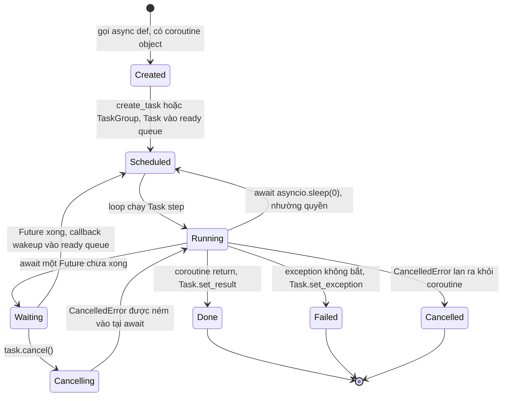
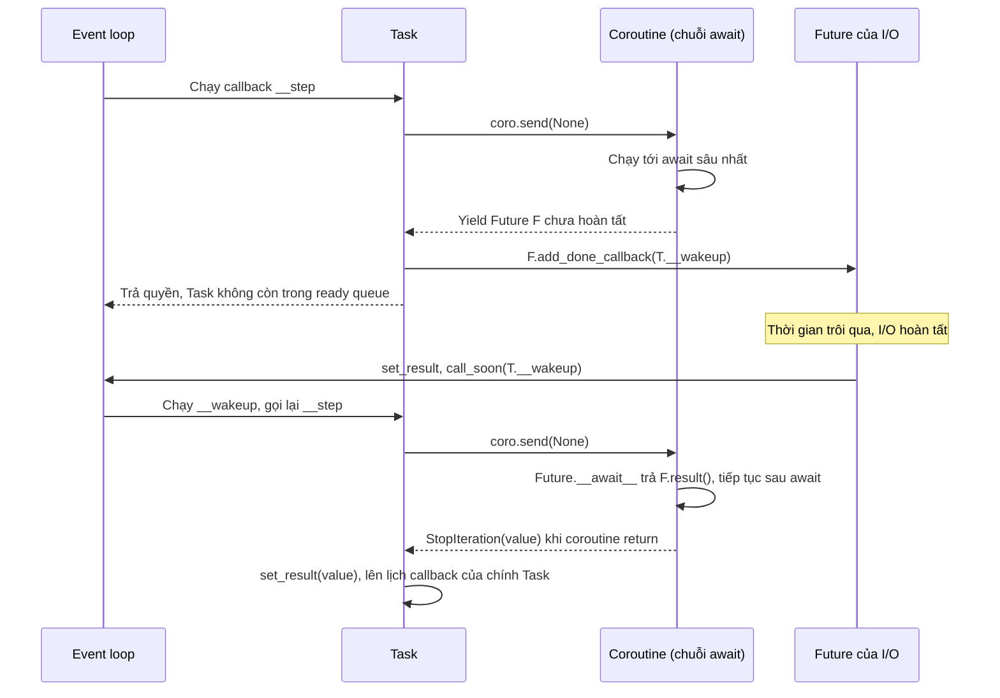

# Coroutine, Task và Future

## 1. Tổng quan

Ba loại object là xương sống của [AsyncIO](asyncio.md):

- **Coroutine** — object tạo ra khi gọi một `async def`. Nó là một đoạn tính toán có thể tạm dừng và tiếp tục, nhưng **tự nó không chạy**.
- **Future** — một ô chứa kết quả sẽ có trong tương lai, kèm danh sách callback cần gọi khi kết quả xuất hiện.
- **Task** — một Future đặc biệt bọc một coroutine và **đẩy coroutine đó chạy** trên event loop, từng bước một.

Hiểu quan hệ giữa ba object này giải thích: vì sao gọi `async def` mà không `await` thì không có gì xảy ra, `await` và `create_task` khác nhau thế nào, cancellation đi vào coroutine bằng đường nào, và vì sao exception của task có thể "biến mất".

## 2. Mental Model

- **Coroutine** là bản nhạc: có nốt, có chỗ nghỉ, nhưng không tự phát ra tiếng.
- **Task** là nhạc công: cầm bản nhạc và chơi từng đoạn, dừng ở chỗ nghỉ, chờ tín hiệu rồi chơi tiếp.
- **Future** là tín hiệu: "khi dữ liệu tới, hãy gọi các nhạc công đang chờ".



Diễn giải:

1. Gọi `fetch()` chỉ tạo coroutine object — chưa có dòng code nào chạy.
2. `create_task(fetch())` bọc coroutine trong Task và lên lịch bước đầu tiên vào ready queue.
3. Loop chạy một **step**: gửi `send(None)` vào coroutine, coroutine chạy tới `await` kế tiếp.
4. Nếu `await` chạm tới Future chưa xong, Task chuyển sang chờ; nó không nằm trong ready queue.
5. Future xong → callback wakeup của Task được lên lịch → Task chạy step tiếp theo.
6. Coroutine return → Task hoàn tất với kết quả; exception → Task hoàn tất với exception.
7. `cancel()` khiến `CancelledError` được ném vào coroutine ở điểm `await` hiện tại; nếu coroutine để nó lan ra, Task kết thúc ở trạng thái cancelled.

## 3. Coroutine

```python
async def fetch_user(user_id: int) -> dict:
    ...

coro = fetch_user(7)    # <coroutine object fetch_user>, chưa chạy
```

Coroutine object có ba method tương tự [generator](../01-python-core/generators-iterators.md):

- `coro.send(value)` — chạy tiếp tới điểm tạm dừng kế tiếp.
- `coro.throw(exc)` — ném exception vào tại điểm tạm dừng.
- `coro.close()` — dừng coroutine, chạy `finally`.

Nếu coroutine bị GC thu hồi mà chưa từng được chạy, Python cảnh báo `RuntimeWarning: coroutine 'fetch_user' was never awaited` — dấu hiệu quên `await`.

Có hai cách để coroutine chạy:

1. **`await coro`** trong một coroutine khác: coroutine hiện tại ủy quyền cho nó, chạy trong **cùng Task**. Không có concurrency mới.
2. **`asyncio.create_task(coro)`**: tạo Task mới, được loop lên lịch độc lập. Đây là cách tạo concurrency.

## 4. Future

Future là object cấp thấp đại diện cho một kết quả chưa có:

| Thuộc tính / method | Ý nghĩa |
|---|---|
| Trạng thái | `PENDING` → `FINISHED` (có result hoặc exception) hoặc `CANCELLED` |
| `set_result(v)` / `set_exception(e)` | Hoàn tất Future; lên lịch mọi callback bằng `loop.call_soon` |
| `add_done_callback(cb)` | Đăng ký hàm gọi khi Future hoàn tất |
| `result()` | Trả kết quả, hoặc raise exception đã lưu |
| `__await__` | Nếu chưa xong: `yield self`; sau khi được đánh thức: `return self.result()` |

Cài đặt `__await__` của Future (giản lược) cho thấy cơ chế tạm dừng:

```python
class Future:
    def __await__(self):
        if not self.done():
            yield self              # tạm dừng, đưa chính Future lên cho Task
        return self.result()        # chạy khi Task gửi send() lần sau
```

Code ứng dụng hiếm khi tạo Future trực tiếp. Driver và thư viện network tạo Future ở tầng thấp: "response cho query này", "dữ liệu từ socket này", "kết quả từ thread này".

## 5. Task và cơ chế `__step`

Task kế thừa Future. Khi được tạo, Task lên lịch method nội bộ `__step` vào ready queue. `__step` là trái tim của AsyncIO:



Diễn giải `__step`:

1. Task gọi `coro.send(None)` (hoặc `coro.throw(exc)` nếu có exception cần ném vào, ví dụ khi bị cancel).
2. Coroutine chạy tới khi một trong các điều sau xảy ra:
   - **Yield một Future chưa xong**: Task gắn `__wakeup` làm callback của Future đó và kết thúc step.
   - **Yield `None`** (xảy ra với `await asyncio.sleep(0)`): Task lên lịch lại ngay `__step` — nhường quyền một vòng.
   - **Raise `StopIteration(value)`** (coroutine return): Task `set_result(value)`.
   - **Raise exception khác**: Task `set_exception(exc)`.
   - **Raise `CancelledError`**: Task chuyển sang trạng thái cancelled.
3. Khi Future hoàn tất, `__wakeup` được lên lịch; nó gọi `__step` để chạy bước tiếp theo.

Một Task có thể đi qua nhiều coroutine lồng nhau (`handler` → `service` → `repository` → driver), nhưng chỉ có **một** Task. Mọi `await` trong chuỗi chỉ là ủy quyền; Future ở đáy chuỗi được chuyển thẳng lên Task.

> **Ghi chú version:** Python 3.12 thêm `asyncio.eager_task_factory`: Task được tạo sẽ chạy coroutine **ngay lập tức** tới điểm tạm dừng đầu tiên thay vì chờ vòng lặp kế tiếp. Nếu coroutine hoàn tất mà không cần tạm dừng (ví dụ cache hit), không cần lên lịch gì cả — giảm overhead đáng kể cho một số workload.

## 6. Task và Future lưu kết quả, exception ở đâu?

Task là Future, nên kết quả và exception của coroutine được lưu **trong Task object**. Ai đó phải lấy chúng ra bằng `await task` hoặc `task.result()`.

- Nếu Task kết thúc với exception mà không ai lấy, khi Task bị GC thu hồi, asyncio log `Task exception was never retrieved`. Exception không lan tới đâu cả — lỗi "biến mất" khỏi luồng xử lý chính.
- Event loop chỉ giữ **weak reference** tới Task trong tập `all_tasks`. Một Task không được ai giữ reference mạnh có thể bị thu hồi. Task đang chờ I/O thường được giữ gián tiếp qua callback của Future, nhưng tài liệu chính thức khuyến cáo luôn giữ reference cho task nền.

```python
background_tasks: set[asyncio.Task] = set()

def fire_and_forget(coro):
    task = asyncio.create_task(coro)
    background_tasks.add(task)
    task.add_done_callback(background_tasks.discard)
    task.add_done_callback(_log_exception)
    return task

def _log_exception(task: asyncio.Task):
    if not task.cancelled() and task.exception() is not None:
        logger.error("background task failed", exc_info=task.exception())
```

## 7. Cancellation hoạt động thế nào?

`task.cancel()` không dừng coroutine ngay lập tức:

1. Nếu Task đang chờ một Future, Task cancel Future đó. Future hoàn tất ở trạng thái cancelled, `__wakeup` được lên lịch.
2. Ở step tiếp theo, Task gọi `coro.throw(CancelledError())` — exception xuất hiện **tại dòng `await`** mà coroutine đang dừng.
3. Coroutine có cơ hội dọn dẹp trong `finally`/`async with`.
4. Nếu `CancelledError` lan ra khỏi coroutine, Task kết thúc ở trạng thái cancelled. `await task` từ nơi khác sẽ raise `CancelledError`.

Các điểm quan trọng:

- Code giữa hai `await` không thể bị cancel giữa chừng.
- `CancelledError` là `BaseException` (từ 3.8). Nuốt nó (bắt mà không raise lại) làm hỏng timeout và TaskGroup.
- > **Ghi chú version:** Từ 3.11, Task đếm số lần bị yêu cầu cancel (`task.cancelling()`), và `task.uncancel()` cho phép cơ chế như `asyncio.timeout` và `TaskGroup` phân biệt "cancel do tôi yêu cầu" với "cancel từ bên ngoài".
- `asyncio.shield(aw)` bảo vệ một awaitable khỏi bị cancel khi coroutine bên ngoài bị cancel; coroutine bên ngoài vẫn nhận `CancelledError`, nhưng thao tác bên trong tiếp tục chạy.

### Timeout là cancellation

```python
async with asyncio.timeout(2):
    await call_payment_provider()
```

Hết 2 giây, `asyncio.timeout` cancel task hiện tại; khi `CancelledError` lan ra tới khối `async with`, nó được chuyển thành `TimeoutError`. Nếu code bên trong nuốt `CancelledError`, timeout không có tác dụng.

**Timeout không có nghĩa thao tác chưa xảy ra.** Nếu request đã gửi tới payment provider và provider đã trừ tiền trước khi timeout xảy ra, việc cancel chỉ dừng việc **chờ** response. Đây là lý do cần [idempotency](../10-distributed-systems/idempotency.md) và [timeout](../10-distributed-systems/timeout.md) được thiết kế cẩn thận.

## 8. Chạy nhiều Task: gather, TaskGroup, wait, as_completed

| API | Hành vi khi một task lỗi | Dùng khi |
|---|---|---|
| `await asyncio.gather(*aws)` | Raise exception đầu tiên; các task khác **vẫn tiếp tục chạy** (không bị cancel) | Code cũ, hoặc `return_exceptions=True` để lấy mọi kết quả |
| `async with asyncio.TaskGroup()` (3.11+) | Cancel mọi task còn lại, raise `ExceptionGroup` | Mặc định cho code mới: không để task mồ côi |
| `asyncio.wait(aws, return_when=...)` | Không raise; trả tập done/pending | Cần kiểm soát chi tiết (FIRST_COMPLETED, timeout) |
| `asyncio.as_completed(aws)` | Trả kết quả theo thứ tự hoàn thành | Xử lý kết quả ngay khi có |

```python
async def load_dashboard(user_id: int):
    async with asyncio.TaskGroup() as tg:
        profile = tg.create_task(get_profile(user_id))
        orders = tg.create_task(get_orders(user_id))
    return {"profile": profile.result(), "orders": orders.result()}
```

Nếu `get_orders` lỗi, `get_profile` bị cancel, và `load_dashboard` nhận `ExceptionGroup`. Xử lý bằng `except*` (3.11+).

## 9. Context variables đi theo Task

Mỗi Task, khi được tạo, **copy** `contextvars.Context` hiện tại. Biến `ContextVar` đặt trong một request (trace ID, user ID, tenant) được nhìn thấy bởi mọi coroutine chạy trong Task đó và bởi Task con tạo ra từ nó, nhưng không bị lẫn sang request khác chạy xen kẽ trên cùng thread.

```python
from contextvars import ContextVar
request_id: ContextVar[str] = ContextVar("request_id", default="-")
```

Đây là cơ chế mà structured logging và OpenTelemetry dùng để gắn trace context vào log trong ứng dụng async. `threading.local` không dùng được cho mục đích này vì mọi coroutine chạy trên cùng một thread.

## 10. Hành vi trong production

- **Quên `await`**: gọi `session.commit()` (async) mà không `await` — không có gì được commit, chỉ có warning trong log.
- **Task nền mất lỗi**: gửi email, ghi audit log bằng `create_task` không theo dõi — lỗi chỉ xuất hiện dưới dạng log `never retrieved`, hoặc không xuất hiện nếu process bị tắt trước.
- **Task nền bị hủy khi shutdown**: khi worker tắt, `asyncio.run`/server cancel các task còn lại. Công việc quan trọng không được chạy dưới dạng task nền trong web worker; đưa vào queue bền vững. Xem [Background Task](../03-fastapi/background-task.md).
- **Client ngắt kết nối**: ASGI server có thể cancel Task xử lý request. Thao tác không nguyên tử giữa chừng có thể dở dang.

## 11. Failure Modes

| Failure | Nguyên nhân | Dấu hiệu |
|---|---|---|
| Code không chạy | Gọi coroutine không `await` | `RuntimeWarning: coroutine ... was never awaited` |
| Lỗi bị nuốt | Task lỗi không ai lấy kết quả | `Task exception was never retrieved` |
| Timeout vô hiệu | Code bắt `CancelledError`/`BaseException` không raise lại | Request treo quá thời hạn |
| Task mồ côi | `gather` raise, task khác chạy tiếp | Tài nguyên bị chiếm sau khi request đã lỗi |
| Tác dụng phụ dở dang | Cancel giữa chuỗi thao tác | Dữ liệu không nhất quán |

## 12. Trade-offs

| Lựa chọn | Lợi ích | Chi phí |
|---|---|---|
| `await` trực tiếp | Đơn giản, tuần tự, dễ đọc | Không có concurrency |
| `create_task` tự do | Linh hoạt | Dễ mất reference, mất lỗi, task mồ côi |
| `TaskGroup` | Structured concurrency, lỗi được lan truyền đúng | Yêu cầu 3.11+, mọi task gắn với một phạm vi |
| `shield` | Bảo vệ thao tác quan trọng khỏi cancel | Thao tác có thể chạy tiếp mà không ai chờ kết quả |

## 13. Sai lầm thường gặp

- Nhầm coroutine với Task: coroutine không tự chạy.
- `await` từng task trong vòng lặp ngay sau khi tạo, biến concurrency thành tuần tự.
- Dùng `except Exception` và nghĩ nó bắt được cancellation (không), hoặc `except BaseException` rồi nuốt cancellation (sai).
- Dùng `threading.local` để lưu request context trong code async.
- Chạy công việc cần độ tin cậy bằng `create_task` trong web worker.

## 14. Cách debug

- `asyncio.all_tasks()` để liệt kê task; `task.get_stack()` hoặc `task.print_stack()` để xem task đang dừng ở đâu.
- `task.get_coro()` và `task.get_name()` (đặt tên bằng `create_task(coro, name=...)`) giúp log dễ đọc.
- Python 3.14: `asyncio.capture_call_graph()` và `python -m asyncio pstree <PID>` hiển thị cây task/await.
- Debug mode ghi lại traceback nơi Task được tạo — hữu ích khi gặp `never retrieved`.

## 15. Best Practices

- Dùng `TaskGroup` cho concurrency trong phạm vi một request.
- Đặt tên cho task quan trọng; luôn giữ reference và xử lý exception của task nền.
- Không nuốt `CancelledError`; dọn dẹp trong `finally` và để nó lan.
- Truyền request context bằng `contextvars`.
- Thao tác có tác dụng phụ bên ngoài cần idempotency, vì timeout/cancel không đảm bảo thao tác chưa xảy ra.

## 16. Tóm tắt

- Coroutine là tính toán có thể tạm dừng, không tự chạy.
- Future là ô chứa kết quả tương lai với danh sách callback.
- Task bọc coroutine; `__step` gửi `send()` vào coroutine, và khi coroutine yield một Future chưa xong, Task đăng ký wakeup rồi trả quyền cho loop.
- Cancellation là `CancelledError` được ném vào tại điểm `await`; timeout được xây trên cancellation.
- Exception của Task nằm trong Task; không ai lấy thì lỗi bị mất.
- Mỗi Task mang một bản copy của context, là nền tảng cho trace ID và request context trong code async.

## Liên quan

- [AsyncIO](asyncio.md)
- [Event Loop](event-loop.md)
- [Iterators và Generators](../01-python-core/generators-iterators.md)
- [Timeout](../10-distributed-systems/timeout.md)
- [Background Task trong FastAPI](../03-fastapi/background-task.md)
