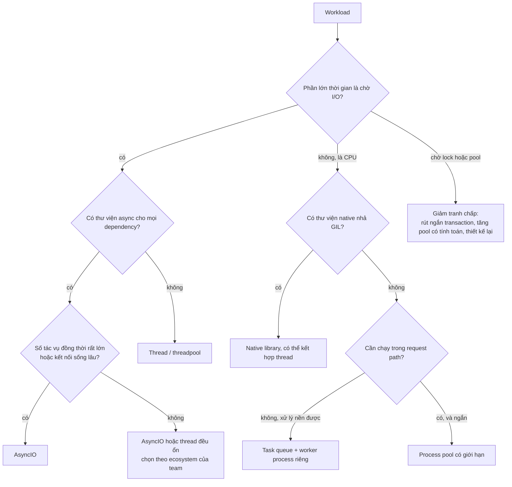

# CPU-bound, I/O-bound và chọn execution model

## 1. Tổng quan

Trước khi chọn thread, process hay AsyncIO, phải biết **workload đang bị giới hạn bởi cái gì**. Tăng thứ không phải bottleneck không làm hệ thống nhanh hơn — thường còn làm chậm hơn.

| Loại | Thời gian chủ yếu dành cho | Ví dụ | Thêm gì thì nhanh hơn |
|---|---|---|---|
| **CPU-bound** | Tính toán trên CPU | Parse file lớn, nén, resize ảnh, tính điểm rủi ro, serialize JSON lớn | Nhiều core (process), thuật toán tốt hơn, code native |
| **I/O-bound** | Chờ network, disk, database | Gọi API, query DB, đọc Redis, upload S3 | Nhiều tác vụ chờ đồng thời (thread, async) |
| **Memory-bound** | Chờ dữ liệu từ RAM, cache miss | Duyệt cấu trúc lớn ngẫu nhiên | Cấu trúc dữ liệu gọn, locality tốt |
| **Contention-bound** | Chờ lock, connection pool, rate limit | Nhiều request tranh một row, pool 10 connection | Giảm tranh chấp, không phải thêm worker |

Khái niệm concurrency, parallelism, asynchronous, multithreading, multiprocessing được phân biệt chi tiết trong [GIL](gil.md#5-phân-biệt-các-khái-niệm-concurrency-parallelism-async-multithreading-multiprocessing). Tài liệu này tập trung vào **đo** và **chọn**.

## 2. Mental Model

> CPU-bound: người thợ bận tay liên tục — thêm thợ (core) mới nhanh hơn.
> I/O-bound: người thợ phần lớn thời gian đứng chờ hàng về — cho một người trông nhiều đơn hàng cùng lúc là đủ, thêm thợ không giúp nhiều.
> Contention-bound: nhiều thợ xếp hàng chờ một cái máy duy nhất — thêm thợ chỉ làm hàng dài hơn.

## 3. Vì sao phân loại quan trọng?

- Service CPU-bound chạy AsyncIO: không nhanh hơn, còn làm event loop bị block.
- Service I/O-bound chạy 32 process: tốn memory gấp 32 lần mà không lợi gì so với vài worker async.
- Service contention-bound (DB lock, pool) được "scale" bằng cách thêm pod: tải lên DB tăng, tranh chấp tăng, latency tệ hơn.

## 4. Cách đo: CPU time vs wall time

Cách nhanh nhất để phân loại một đoạn code:

```python
import time

wall_start = time.perf_counter()
cpu_start = time.process_time()      # CPU time của process (mọi thread)
do_work()
wall = time.perf_counter() - wall_start
cpu = time.process_time() - cpu_start
print(f"wall={wall:.3f}s cpu={cpu:.3f}s ratio={cpu / wall:.0%}")
```

| Tỷ lệ CPU/wall | Kết luận |
|---|---|
| ~100% (một thread) | CPU-bound |
| < 20% | I/O-bound hoặc đang chờ lock/pool |
| > 100% | Đang chạy song song (native code nhả GIL, nhiều process) |

Ở mức production:

- `top`/`htop`: process ở trạng thái `R` (running) liên tục → CPU; `S` (sleeping) → chờ.
- Per-core CPU: một core 100%, các core khác rảnh trong process nhiều thread → CPU-bound bị GIL giới hạn.
- Distributed tracing: span DB/HTTP chiếm phần lớn thời gian request → I/O-bound; khoảng trống giữa các span lớn → CPU hoặc chờ loop/pool.
- Profiler sampling (`py-spy top`): thời gian nằm trong function của bạn → CPU; nằm trong `recv`, `select`, `acquire` → chờ.

## 5. Cây quyết định chọn execution model



Diễn giải:

1. Câu hỏi đầu tiên luôn là "thời gian đi đâu", được trả lời bằng đo lường, không bằng cảm giác.
2. I/O-bound với ecosystem async đầy đủ và concurrency cao → AsyncIO. Với thư viện blocking → thread.
3. CPU-bound: trước hết tìm thư viện native (NumPy, Polars, orjson, Pillow-SIMD...). Nếu phải là Python thuần, tách khỏi request path bằng task queue; chỉ dùng process pool trong request khi công việc ngắn và cần kết quả ngay.
4. Nếu thời gian là chờ lock hoặc pool, thêm worker không giải quyết gì — phải giảm tranh chấp.

## 6. Workload hỗn hợp: trường hợp phổ biến nhất

Endpoint thực tế thường là hỗn hợp: `2 ms CPU (validate) + 15 ms DB + 40 ms HTTP + 5 ms CPU (build response)`.

- Phần I/O chiếm ~90% → AsyncIO hoặc thread giúp xử lý nhiều request đồng thời.
- Phần CPU 7 ms mỗi request → một worker tối đa ~140 request/giây trước khi CPU bão hòa. Muốn nhiều hơn phải thêm worker process.

Hai giới hạn tồn tại song song: **concurrency** (bao nhiêu request đang chờ được giữ đồng thời) và **CPU throughput** (bao nhiêu CPU-giây mỗi giây). Worker async giải quyết cái đầu; số worker process giải quyết cái sau.

## 7. Little's Law và sizing

**Little's Law**: `L = λ × W`

- `L`: số request đang được xử lý đồng thời (in-flight).
- `λ`: throughput (request/giây).
- `W`: thời gian mỗi request ở trong hệ thống.

Ứng dụng:

| Câu hỏi | Tính |
|---|---|
| 500 RPS, latency 200 ms, cần bao nhiêu slot đồng thời? | 500 × 0.2 = 100 |
| Threadpool 40 thread, latency 400 ms, throughput tối đa? | 40 / 0.4 = 100 RPS |
| DB pool 20 connection, query giữ connection 50 ms, throughput tối đa? | 20 / 0.05 = 400 query/s |

Khi dependency chậm đi (W tăng), số slot cần (L) tăng tỷ lệ. Tài nguyên có giới hạn (thread, connection) sẽ bão hòa và request bắt đầu xếp hàng.

### Vì sao không chạy CPU ở 100%

Theo lý thuyết hàng đợi, thời gian chờ tăng rất nhanh khi utilization tiến gần 100%. Với mô hình đơn giản M/M/1, thời gian trong hệ thống tỷ lệ với `1 / (1 - ρ)`:

| Utilization ρ | Hệ số thời gian so với lúc rảnh |
|---|---|
| 50% | 2× |
| 70% | 3.3× |
| 90% | 10× |
| 95% | 20× |

Đây là lý do capacity planning thường nhắm utilization 60–70% cho tài nguyên nằm trên đường request, và vì sao p99 bùng nổ trước khi CPU chạm 100%.

## 8. Ví dụ: tính số worker cho một service

Service FastAPI async; mỗi request tốn 4 ms CPU trên event loop, 60 ms chờ I/O; mục tiêu 2.000 RPS; mỗi pod 2 CPU.

1. CPU cần: 2.000 × 0.004 = 8 CPU-giây/giây → 8 core ở 100%.
2. Nhắm 65% utilization: 8 / 0.65 ≈ 12.3 core → 13 core.
3. Mỗi pod 2 worker (một worker mỗi core) → 7 pod.
4. Concurrency: 2.000 × 0.064 ≈ 128 request đồng thời toàn hệ thống → ~9 mỗi worker — event loop dễ dàng giữ được.
5. DB: nếu mỗi request 1 query 10 ms → 2.000 × 0.01 = 20 connection bận trung bình. Pool mỗi worker 5 → 14 worker × 5 = 70 connection tối đa; đủ dư cho spike mà không vượt `max_connections`.

Các con số này phải được xác nhận bằng load test; nhưng tính trước giúp biết cần đo gì. Xem [Capacity Estimation](../11-system-design/capacity-estimation.md) và [Load Testing](../17-performance-reliability/load-testing.md).

## 9. Hành vi trong production

- **Autoscaling theo tín hiệu đúng.** Service CPU-bound: scale theo CPU. Service I/O-bound: CPU thấp dù quá tải — scale theo concurrency, latency, hoặc độ sâu hàng đợi. HPA theo CPU cho service I/O-bound có thể không bao giờ kích hoạt. Xem [HPA](../13-kubernetes/hpa.md).
- **Workload thay đổi theo thời gian.** Endpoint vốn I/O-bound trở thành CPU-bound khi payload lớn lên (serialize response 5 MB). Theo dõi phân phối kích thước payload.
- **Contention ẩn sau "I/O".** Trace cho thấy 800 ms "chờ DB", nhưng DB CPU thấp: có thể là chờ lock row hoặc chờ connection pool, không phải query chậm. Tách metric "pool wait" khỏi "query time".

## 10. Failure Modes

| Failure | Nguyên nhân | Dấu hiệu |
|---|---|---|
| Scale không hiệu quả | Thêm worker cho workload contention-bound | Latency không giảm, DB lock wait tăng |
| Async không nhanh hơn | Workload CPU-bound hoặc dependency blocking | Loop lag cao, CPU một core 100% |
| HPA không phản ứng | Scale theo CPU cho service I/O-bound | Latency tăng, CPU vẫn thấp, không có pod mới |
| p99 bùng nổ | Utilization quá cao trên đường request | p50 ổn, p99 tăng mạnh khi tải tăng nhẹ |

## 11. Trade-offs

| Model | Tốt cho | Tệ cho |
|---|---|---|
| AsyncIO | I/O concurrency cao, kết nối dài | CPU, thư viện blocking |
| Thread | I/O với thư viện sync, concurrency vừa | CPU Python thuần, concurrency rất cao |
| Process | CPU Python thuần, cô lập | Dữ liệu chia sẻ lớn, I/O thuần |
| Task queue | Việc nặng, dài, cần retry | Việc cần kết quả trong vài ms |
| Native | Tính toán số, xử lý dữ liệu | Logic nghiệp vụ phức tạp, thay đổi thường xuyên |

## 12. Sai lầm thường gặp

- Chọn model trước khi đo.
- Nhìn CPU trung bình của host thay vì per-core và per-process.
- Coi "chờ DB" là I/O thuần mà không tách chờ lock/pool.
- Đặt mục tiêu utilization 90%+ cho tài nguyên trên đường request.
- Quên rằng thêm worker nhân số connection tới mọi dependency.

## 13. Cách debug trong production

1. Trace một request chậm: phần nào là span I/O, phần nào là khoảng trống (CPU hoặc chờ loop/pool).
2. So sánh CPU time và wall time của worker trong một khoảng thời gian.
3. Per-core CPU và loop lag để phát hiện CPU-bound trên một thread.
4. Metric pool (wait time, in-use) và DB (lock wait, `pg_stat_activity.wait_event`) để phát hiện contention.
5. Load test tăng dần: vẽ throughput theo concurrency; điểm throughput ngừng tăng là nơi bottleneck xuất hiện.

## 14. Best Practices

- Đo trước khi chọn: CPU/wall ratio, trace, profiler.
- Tách công việc CPU nặng khỏi request path.
- Tính sizing bằng Little's Law và nhắm utilization 60–70% cho tài nguyên trên đường request.
- Scale theo tín hiệu phản ánh đúng bottleneck (CPU, concurrency, queue age).
- Khi thời gian là chờ lock hoặc pool, sửa tranh chấp trước khi thêm tài nguyên.

## 15. Tóm tắt

- Phân loại workload theo nơi thời gian được dùng: CPU, I/O, memory, hay tranh chấp.
- CPU/wall time ratio, per-core CPU, trace và profiler là công cụ phân loại.
- I/O-bound → AsyncIO/thread; CPU-bound → process, native, hoặc task queue; contention → giảm tranh chấp.
- Little's Law cho biết cần bao nhiêu slot đồng thời; lý thuyết hàng đợi giải thích vì sao không chạy tài nguyên ở 100%.
- Workload thực tế là hỗn hợp: cần cả concurrency (async/thread) lẫn CPU throughput (số process).

## Liên quan

- [Global Interpreter Lock](gil.md)
- [AsyncIO](asyncio.md)
- [Threading](threading.md)
- [Multiprocessing](multiprocessing.md)
- [Capacity Estimation](../11-system-design/capacity-estimation.md)
- [Performance Debugging](../17-performance-reliability/performance-debugging.md)
