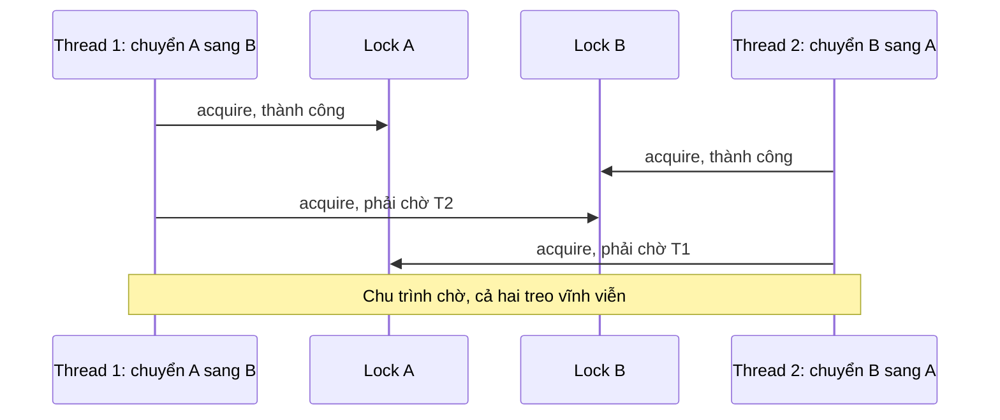
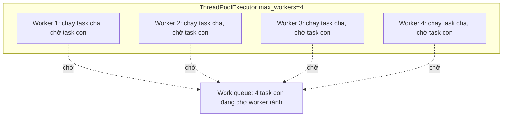

# Deadlock trong ứng dụng Python

## 1. Tổng quan

Deadlock là trạng thái mà một nhóm tác vụ **chờ lẫn nhau vĩnh viễn**: mỗi tác vụ giữ một tài nguyên và chờ tài nguyên đang bị tác vụ khác trong nhóm giữ. Không tác vụ nào tiến triển được, và không có gì tự phá vỡ vòng chờ.

Tài liệu này nói về deadlock **trong process Python**: giữa thread, coroutine, pool. Deadlock giữa transaction trong database có cơ chế phát hiện riêng, xem [Deadlock trong PostgreSQL](../04-database-postgresql/deadlock.md).

Khác với database, Python **không có** bộ phát hiện deadlock. Thread bị deadlock treo mãi, CPU 0%, không có exception, không có log — service vẫn "sống" nhưng không làm gì.

## 2. Mental Model

> Hai xe gặp nhau trên cây cầu một làn, mỗi xe chờ xe kia lùi. Không ai lùi, không ai qua được.

Deadlock là một **chu trình trong đồ thị chờ** (wait-for graph): A chờ B, B chờ A (hoặc A → B → C → A).

## 3. Bốn điều kiện cần (Coffman)

Deadlock chỉ xảy ra khi **cả bốn** điều kiện cùng đúng:

1. **Mutual exclusion**: tài nguyên chỉ một tác vụ giữ tại một thời điểm.
2. **Hold and wait**: tác vụ giữ tài nguyên này trong khi chờ tài nguyên khác.
3. **No preemption**: không thể cướp tài nguyên khỏi tác vụ đang giữ.
4. **Circular wait**: tồn tại chu trình chờ.

Phòng tránh deadlock là phá vỡ ít nhất một điều kiện. Trong thực tế, dễ nhất là phá **circular wait** (thứ tự lock cố định) và **hold and wait** (không giữ lock khi chờ thứ khác, hoặc chờ có timeout).

## 4. Luồng xử lý: deadlock kinh điển ABBA



Diễn giải:

1. Thread 1 khóa tài khoản A trước, rồi muốn khóa B.
2. Thread 2 cùng lúc khóa B trước, rồi muốn khóa A.
3. Mỗi thread giữ một lock và chờ lock còn lại — chu trình hình thành.

Cách sửa: **mọi code lấy nhiều lock phải lấy theo cùng một thứ tự toàn cục**, ví dụ theo ID tăng dần.

```python
def transfer(src, dst, amount):
    first, second = sorted([src, dst], key=lambda acc: acc.id)
    with first.lock, second.lock:
        src.balance -= amount
        dst.balance += amount
```

## 5. Các dạng deadlock thường gặp trong backend Python

### Tự deadlock với `Lock` không reentrant

```python
lock = threading.Lock()

def update():
    with lock:
        validate()          # validate() cũng lấy lock → treo

def validate():
    with lock:
        ...
```

Một thread chờ chính nó. `RLock` cho phép thread đang giữ acquire lại; nhưng thường tốt hơn là tách phần "đã giữ lock" ra function nội bộ không lấy lock.

`asyncio.Lock` **không reentrant**: coroutine đang giữ lock mà `await` một coroutine khác cũng lấy lock đó sẽ treo.

### Pool starvation deadlock



Diễn giải:

1. Task cha được submit vào pool; bên trong, nó submit task con vào **cùng pool** rồi `future.result()` để chờ.
2. Khi số task cha đồng thời bằng số worker, mọi worker đều đang chờ task con.
3. Task con nằm trong queue, cần một worker rảnh — nhưng không có worker nào rảnh.
4. Không ai tiến triển. Đây là deadlock trên **tài nguyên pool**, không có lock nào xuất hiện trong code.

Cùng mẫu này xảy ra với:

- Connection pool: request giữ một connection, rồi gọi code lấy thêm connection thứ hai từ cùng pool (ví dụ mở session mới bên trong transaction). Khi pool có N connection và N request đồng thời làm vậy → treo tới `pool_timeout`.
- Celery: task chờ đồng bộ kết quả của task khác (`result.get()` bên trong task) trong cùng worker pool. Celery cảnh báo mạnh về điều này.
- Threadpool của FastAPI: endpoint `def` gọi đồng bộ vào code cần một slot khác của cùng threadpool.

Cách sửa: không chờ đồng bộ task con trong cùng pool; dùng pool riêng cho từng tầng; hoặc tái cấu trúc để task cha không giữ tài nguyên trong khi chờ.

### Gọi ngược vào event loop từ chính nó

```python
async def handler():
    # sai: chạy trên thread của loop, rồi chờ đồng bộ một coroutine cần chính loop đó
    future = asyncio.run_coroutine_threadsafe(other(), loop)
    return future.result()       # block thread của loop → other() không bao giờ chạy
```

`run_coroutine_threadsafe(...).result()` chỉ dùng từ **thread khác** với thread của loop. Gọi từ thread của loop tạo chu trình: loop chờ future, future chờ loop.

### Fork khi đang giữ lock

Process con tạo bằng `fork()` chỉ có thread đã gọi fork. Lock bị thread khác giữ tại thời điểm fork (lock của logging, của allocator, của thư viện) vẫn ở trạng thái "đã khóa" trong process con, và không còn ai để nhả. Process con treo ở lần đầu tiên chạm vào lock đó. Xem [Multiprocessing](multiprocessing.md).

### Queue đầy hai chiều

Producer chờ đưa vào queue A (đầy) trong khi consumer của A đang chờ đưa kết quả vào queue B (đầy) mà consumer của B lại chính là producer ban đầu. Chu trình trên tài nguyên queue.

## 6. Livelock và starvation

- **Livelock**: các tác vụ không bị block, nhưng liên tục phản ứng với nhau mà không tiến triển (ví dụ cùng retry, cùng nhường nhau, cùng thất bại, cùng retry lại). Jitter trong retry phá vỡ sự đồng bộ này.
- **Starvation**: một tác vụ không bao giờ được tài nguyên vì các tác vụ khác liên tục được ưu tiên (task dài chiếm worker, task ưu tiên thấp không bao giờ được chạy).

## 7. Hành vi trong production

Dấu hiệu deadlock trong một service:

- Request treo tới timeout của load balancer, không có lỗi ứng dụng.
- CPU của worker gần 0%, số thread bận không đổi.
- Health check có thể vẫn thành công nếu nó chạy trên đường khác (event loop vẫn rảnh trong khi threadpool treo) — service trông khỏe nhưng không phục vụ được.
- Khởi động lại worker "chữa" được tạm thời, rồi lỗi quay lại dưới tải.

Vì deadlock thường cần một mức concurrency nhất định mới xuất hiện (pool starvation), nó hay bùng lên đúng lúc traffic cao.

## 8. Failure Modes

| Dạng | Tài nguyên | Dấu hiệu |
|---|---|---|
| ABBA lock ordering | Hai lock | Hai nhóm thread treo ở `acquire` khác nhau |
| Self-deadlock | Lock không reentrant | Một thread treo ở lock nó đã giữ |
| Pool starvation | Worker, connection | Mọi worker bận, queue có việc, CPU 0% |
| Event loop tự chờ | Loop thread | Worker async treo hoàn toàn, loop lag vô hạn |
| Fork với lock bị giữ | Lock trong process con | Worker mới treo ngay khi khởi động |

## 9. Trade-offs của các cách phòng tránh

| Cách | Phá điều kiện | Chi phí |
|---|---|---|
| Thứ tự lock toàn cục | Circular wait | Phải kỷ luật và tài liệu hóa thứ tự |
| `acquire(timeout=...)` rồi lùi lại | No preemption (mềm) | Cần code xử lý thất bại và retry có jitter |
| Không lồng lock | Hold and wait | Hạn chế thiết kế |
| Pool riêng cho từng tầng | Hold and wait trên pool | Nhiều pool cần cấu hình |
| Message passing thay lock | Mutual exclusion trên dữ liệu | Thiết kế lại luồng dữ liệu |

## 10. Sai lầm thường gặp

- Nghĩ deadlock chỉ xảy ra khi có nhiều lock tường minh; bỏ qua deadlock trên pool.
- Chờ đồng bộ task con trong cùng pool với task cha.
- Lấy lock rồi gọi callback/hook do người khác cung cấp (callback có thể lấy lock khác theo thứ tự ngược).
- Gọi `future.result()` trên thread của event loop.
- Dùng `acquire()` không timeout trong code chạy ở production mà không có cách chẩn đoán.

## 11. Cách debug trong production

1. **Lấy stack của mọi thread**: `py-spy dump --pid <pid>`. Deadlock hiện ra như nhiều thread dừng ở `acquire`/`wait`/`result` trong thời gian dài. Chạy hai lần cách nhau vài giây: stack không đổi → không tiến triển.
2. **`faulthandler`**: `faulthandler.dump_traceback_later(60, repeat=True)` in stack mọi thread mỗi 60 giây nếu được bật (hữu ích trong môi trường không có py-spy). Hoặc `faulthandler.register(signal.SIGUSR1)` để in stack khi nhận signal.
3. **Metric pool**: số worker/connection đang bận bằng giới hạn trong khi throughput bằng 0 → pool starvation.
4. **Watchdog**: một thread nền kiểm tra "tiến triển" (ví dụ số task hoàn thành tăng) và log/alert nếu đứng yên quá lâu.
5. Với asyncio: `python -m asyncio pstree <PID>` (3.14+) cho thấy task đang chờ gì.

## 12. Best Practices

- Tránh lấy nhiều lock; nếu phải lấy, lấy theo thứ tự toàn cục.
- Không gọi code bên ngoài (callback, I/O) khi đang giữ lock.
- Không chờ đồng bộ công việc được gửi vào cùng pool mà mình đang chiếm.
- Mọi chờ đợi (lock, pool, future) đều có timeout ở production, kèm log đủ để chẩn đoán.
- Tách pool theo tầng/dependency.
- Tránh fork trong process có nhiều thread; dùng `spawn`/`forkserver`.

## 13. Tóm tắt

- Deadlock là chu trình chờ; cần đủ bốn điều kiện Coffman.
- Python không phát hiện deadlock; tác vụ treo vĩnh viễn, CPU 0%.
- Ngoài lock tường minh, deadlock hay xảy ra trên tài nguyên pool (thread, connection, worker).
- Phòng tránh chủ yếu bằng thứ tự lock cố định, không giữ tài nguyên khi chờ, và timeout.
- Chẩn đoán bằng stack dump của mọi thread (py-spy, faulthandler) và metric pool.

## Liên quan

- [Synchronization](synchronization.md)
- [Race Condition](race-condition.md)
- [Threading](threading.md)
- [Deadlock trong PostgreSQL](../04-database-postgresql/deadlock.md)
- [Database Deadlock (sự cố)](../20-production-incidents/database-deadlock.md)
