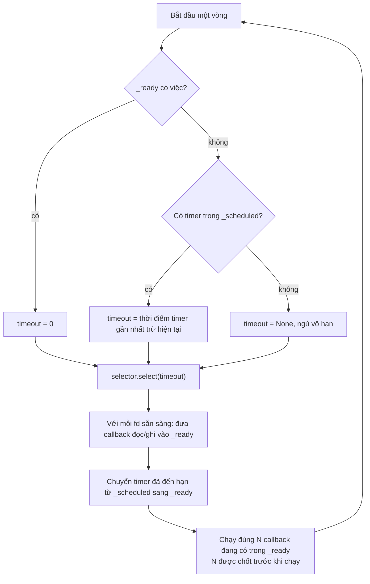
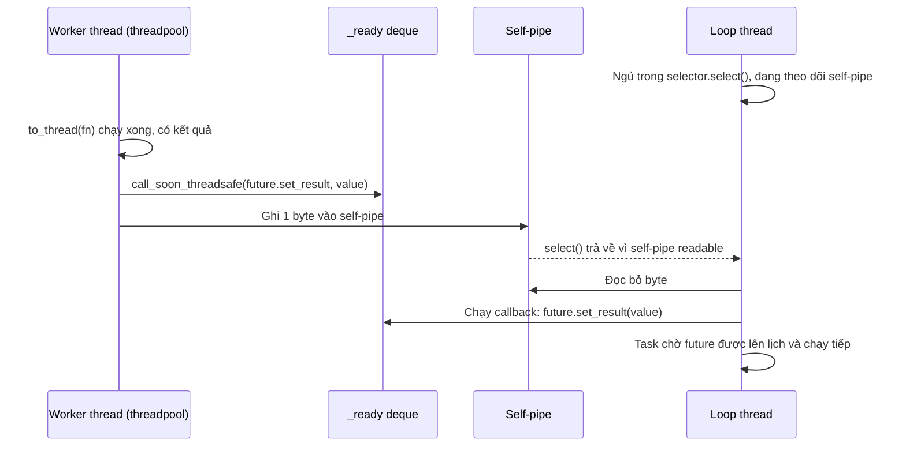

# Event Loop

## 1. Tổng quan

Event loop chịu trách nhiệm điều phối việc thực thi các coroutine có thể tiếp tục chạy tại một thời điểm. Cụ thể, nó là một vòng lặp vô hạn trên **một thread** làm ba việc:

1. Chạy các callback đã sẵn sàng (trong đó có việc "cho Task chạy tiếp một bước").
2. Chuyển các timer đã đến hạn thành callback sẵn sàng.
3. Hỏi hệ điều hành xem file descriptor (socket, pipe) nào đã sẵn sàng đọc/ghi, và chuyển sự kiện đó thành callback sẵn sàng.

[AsyncIO](asyncio.md) mô tả bức tranh tổng thể; tài liệu này đi vào bên trong loop: dữ liệu nó giữ, thuật toán một vòng lặp, cách thread khác đánh thức nó, và cách đo sức khỏe của nó trong production.

> **Ghi chú version:** Mô tả bám theo `asyncio` của CPython 3.11–3.14 (`BaseEventLoop`, `SelectorEventLoop`). `uvloop` và `ProactorEventLoop` (Windows) cài đặt khác bên trong nhưng tuân theo cùng giao diện và cùng mô hình cooperative scheduling.

## 2. Mental Model

> Event loop là một người điều phối duy nhất với ba hộp thư: "việc làm ngay", "việc hẹn giờ", và "chuông cửa của OS". Mỗi vòng, người đó xử lý hết việc làm ngay đang có, rồi ngủ cho tới khi chuông cửa reo hoặc tới giờ hẹn gần nhất.

Không có preemption: người điều phối không thể ngắt một việc đang làm dở. Mọi việc phải ngắn và tự trả quyền.

## 3. Vì sao cần hiểu bên trong loop?

- Giải thích **loop lag**: vì sao một timer 100 ms lại chạy sau 800 ms.
- Hiểu vì sao `call_soon_threadsafe` tồn tại và thread khác giao tiếp với loop thế nào (threadpool, callback từ thư viện C).
- Hiểu vì sao `asyncio.to_thread` có thể bị nghẽn, và vì sao DNS resolution có thể làm chậm mọi kết nối mới.
- Đọc được stack trace khi loop bị treo.

## 4. Cấu trúc dữ liệu bên trong

| Thành phần | Kiểu | Vai trò |
|---|---|---|
| `_ready` | `collections.deque` các `Handle` | Callback chạy ở vòng hiện tại hoặc kế tiếp |
| `_scheduled` | heap các `TimerHandle` theo thời điểm | Callback hẹn giờ (`call_later`, `call_at`, timeout, `sleep`) |
| `_selector` | `selectors.DefaultSelector` | Theo dõi fd; map fd → callback đọc/ghi |
| self-pipe (hoặc socketpair) | cặp fd | Cho thread khác đánh thức loop đang ngủ trong `select` |
| default executor | `ThreadPoolExecutor` | Chạy `run_in_executor(None, ...)`, `to_thread`, `getaddrinfo` |

Các API lên lịch tương ứng:

- `loop.call_soon(cb)` → thêm vào cuối `_ready`.
- `loop.call_later(delay, cb)` / `call_at(when, cb)` → push vào heap `_scheduled`.
- `loop.add_reader(fd, cb)` / `add_writer` → đăng ký fd với selector.
- `loop.call_soon_threadsafe(cb)` → thêm vào `_ready` **và** ghi một byte vào self-pipe để đánh thức loop.

## 5. Thuật toán một vòng lặp (`_run_once`)



Diễn giải:

1. **Tính timeout cho selector.** Nếu đã có việc sẵn sàng, không được ngủ: timeout = 0 (chỉ "liếc" xem có I/O mới không). Nếu không có việc, ngủ tới timer gần nhất. Nếu không có cả timer, ngủ vô hạn tới khi có I/O.
2. **Gọi `selector.select(timeout)`** — đây là nơi thread ngủ trong kernel (`epoll_wait`, `kevent`). Khi loop rảnh, stack trace của thread loop dừng ở đây.
3. **Xử lý sự kiện I/O**: mỗi fd sẵn sàng có callback đã đăng ký (thường là hàm đọc/ghi của transport); callback đó được đưa vào `_ready`.
4. **Timer đến hạn** được chuyển vào `_ready`.
5. **Chạy callback**: loop chốt `N = len(_ready)` rồi chạy đúng N callback. Callback mới được thêm trong lúc chạy sẽ đợi vòng sau. Điều này đảm bảo I/O được kiểm tra đều đặn — một callback liên tục `call_soon` chính nó không thể độc chiếm loop mãi mãi.

Một "bước" của Task (chạy coroutine từ `await` này tới `await` kế tiếp) chính là một callback trong `_ready`. Thời gian của bước đó tính trọn vào vòng lặp hiện tại.

## 6. Ví dụ: tự xây một event loop mini

Để thấy rằng không có phép màu nào, đây là một event loop tối giản dùng [generator](../01-python-core/generators-iterators.md) làm "coroutine" và `selectors` làm cơ chế chờ I/O. Mỗi generator `yield` ra thứ nó muốn chờ.

```python
import selectors
import socket
from collections import deque

selector = selectors.DefaultSelector()
ready = deque()

def spawn(gen):
    ready.append(gen)

def run_forever():
    while ready or selector.get_map():
        while ready:                                  # 1. chạy việc sẵn sàng
            gen = ready.popleft()
            try:
                event, sock = next(gen)               # chạy tới yield kế tiếp
            except StopIteration:
                continue
            mask = selectors.EVENT_READ if event == "read" else selectors.EVENT_WRITE
            selector.register(sock, mask, gen)        # 2. đăng ký chờ I/O
        for key, _ in selector.select():              # 3. ngủ tới khi có fd sẵn sàng
            selector.unregister(key.fileobj)
            ready.append(key.data)                    # 4. generator sẵn sàng trở lại

def server(port):
    srv = socket.socket()
    srv.bind(("127.0.0.1", port))
    srv.listen()
    srv.setblocking(False)
    while True:
        yield "read", srv                             # chờ có kết nối mới
        conn, _ = srv.accept()
        conn.setblocking(False)
        spawn(echo(conn))

def echo(conn):
    while True:
        yield "read", conn                            # chờ dữ liệu
        data = conn.recv(4096)
        if not data:
            conn.close()
            return
        yield "write", conn                           # chờ có thể ghi
        conn.send(data)

spawn(server(9000))
# run_forever()
```

Một thread, không lock, phục vụ hàng nghìn kết nối echo đồng thời. `asyncio` thật khác ở chi tiết (dùng Future và callback thay vì generator yield tuple, có timer, có transport buffer), nhưng xương sống giống hệt: **ready queue + đăng ký chờ + select + đưa trở lại ready queue**.

## 7. Thread khác đánh thức loop thế nào?

Loop đang ngủ trong `epoll_wait` không nhìn thấy việc ai đó `append` vào `_ready` từ thread khác. Đó là lý do `call_soon_threadsafe` tồn tại.



Diễn giải:

1. Loop luôn đăng ký đầu đọc của một self-pipe trong selector.
2. Khi thread khác (ví dụ thread trong threadpool chạy `to_thread`) cần trả kết quả về loop, nó gọi `call_soon_threadsafe`: thêm callback vào `_ready` và ghi một byte vào pipe.
3. Việc ghi làm pipe readable, `select` trả về, loop thức dậy.
4. Loop chạy callback, đặt kết quả cho Future, và Task đang chờ Future đó tiếp tục.

Mọi API asyncio **không** thread-safe ngoại trừ `call_soon_threadsafe` và `asyncio.run_coroutine_threadsafe`. Gọi `future.set_result` trực tiếp từ thread khác là lỗi — có thể không có hiệu lực tới khi loop tình cờ thức dậy, hoặc làm hỏng cấu trúc dữ liệu.

## 8. Executor: nơi code blocking được gửi tới

`loop.run_in_executor(None, fn, *args)` và `asyncio.to_thread(fn, *args)` (3.9+) gửi `fn` sang **default executor** — một `ThreadPoolExecutor` với `max_workers` mặc định `min(32, os.cpu_count() + 4)`.

Hệ quả ít người để ý:

- **Executor có giới hạn.** Với 8 CPU, chỉ 12 thread. Request thứ 13 gọi `to_thread` phải xếp hàng. Nếu hàm blocking mất 1 giây, throughput tối đa của đường này là 12 request/giây mỗi worker.
- **DNS dùng chung executor.** `loop.getaddrinfo` (được gọi khi mở kết nối mới tới hostname) chạy trong default executor. Nếu executor đang bận bởi `to_thread` chậm, **mọi kết nối mới** phải chờ để phân giải DNS.
- FastAPI/Starlette **không** dùng default executor của asyncio cho endpoint sync; chúng dùng threadpool của AnyIO (mặc định 40 token). Hai pool này độc lập. Xem [Sync vs Async Endpoint](../03-fastapi/sync-vs-async-endpoint.md).

Có thể thay default executor bằng `loop.set_default_executor(ThreadPoolExecutor(max_workers=...))`, hoặc dùng executor riêng cho từng loại công việc để cô lập (bulkhead). Xem [Bulkhead](../10-distributed-systems/bulkhead.md).

## 9. Transport, Protocol và Stream

asyncio có hai tầng API cho network:

- **Transport/Protocol** (tầng thấp, callback): transport quản lý socket và buffer; protocol nhận callback `connection_made`, `data_received`, `connection_lost`. Uvicorn (với `httptools`), asyncpg dùng tầng này vì hiệu năng.
- **Streams** (`StreamReader`/`StreamWriter`, tầng cao, coroutine): `await reader.read()`, `writer.write(); await writer.drain()`. Bên dưới vẫn là transport/protocol.

`await writer.drain()` là điểm **backpressure**: nếu buffer ghi của transport vượt ngưỡng (vì client đọc chậm), `drain` tạm dừng coroutine cho tới khi buffer vơi. Bỏ qua `drain` khi ghi dữ liệu lớn khiến memory tăng không giới hạn.

## 10. Vòng đời của loop: `asyncio.run`

`asyncio.run(main())`:

1. Tạo event loop mới và đặt làm loop hiện tại của thread.
2. Chạy `main()` như một Task cho tới khi xong.
3. Cancel mọi Task còn sót lại và chờ chúng kết thúc.
4. Đóng các async generator còn mở (`shutdown_asyncgens`).
5. Tắt default executor (`shutdown_default_executor`).
6. Đóng loop.

Mỗi thread có tối đa một loop đang chạy. Uvicorn tạo loop cho mỗi worker process khi khởi động. Không gọi `asyncio.run` bên trong code đang chạy trên loop (ví dụ trong endpoint async) — sẽ báo lỗi vì loop đã tồn tại.

## 11. Hành vi trong production: loop lag

**Loop lag** là độ trễ giữa thời điểm một callback **đáng lẽ** được chạy và thời điểm nó **thực sự** chạy. Nó đo trực tiếp mức độ loop bị chiếm.

```python
import asyncio
import time

async def monitor_loop_lag(interval: float = 0.5):
    while True:
        start = time.perf_counter()
        await asyncio.sleep(interval)
        lag = time.perf_counter() - start - interval
        LOOP_LAG_SECONDS.observe(max(lag, 0.0))     # metric Prometheus histogram
```

Diễn giải kết quả:

| Loop lag | CPU thread loop | Ý nghĩa |
|---|---|---|
| < 5 ms | Bất kỳ | Loop khỏe |
| Tăng dần theo tải, CPU gần 100% | Cao | Loop bão hòa CPU: cần thêm worker hoặc giảm CPU mỗi request |
| Spike lớn, CPU thấp | Thấp | Có lời gọi blocking (sync I/O, `time.sleep`, lock) chiếm loop |
| Spike theo chu kỳ | Cao trong spike | Công việc CPU định kỳ hoặc [GC pause](../01-python-core/gc-reference-counting.md) |

Loop lag là metric sớm hơn p99 latency: nó tăng trước khi người dùng thấy chậm.

## 12. Khi scale lên thì chuyện gì xảy ra?

- Số kết nối tăng → selector theo dõi nhiều fd hơn; với epoll chi phí này gần như hằng số, không phải vấn đề.
- Số callback mỗi giây tăng → thời gian của `_run_once` tăng tuyến tính theo CPU dùng cho mỗi callback. Giới hạn thực tế là **CPU của một core**.
- Đường `to_thread` bị nghẽn trước tiên nếu có code blocking, vì executor nhỏ.
- Thêm worker process chia tải ra nhiều loop; mỗi loop độc lập, không chia sẻ gì — kể cả connection pool.

## 13. Failure Modes

| Failure | Cơ chế | Dấu hiệu |
|---|---|---|
| Loop bị block | Callback/step chạy lâu (CPU, sync I/O) | Loop lag spike, debug mode log "Executing ... took X seconds" |
| Executor nghẽn | `to_thread` với hàm chậm vượt số thread | Latency tăng ở endpoint dùng `to_thread` và ở kết nối mới (DNS) |
| Gọi API asyncio từ thread khác | Không dùng `call_soon_threadsafe` | Kết quả tới trễ ngẫu nhiên, lỗi khó tái hiện |
| Buffer ghi phình to | Ghi mà không `drain` | Memory tăng khi client chậm |
| Starvation | Callback tự lên lịch lại liên tục với công việc nặng | Timer và I/O trễ đều đặn |

## 14. Trade-offs

| Lựa chọn | Lợi ích | Chi phí |
|---|---|---|
| `SelectorEventLoop` mặc định | Chuẩn, có sẵn | Chậm hơn uvloop |
| `uvloop` | Nhanh hơn (libuv, C), ít overhead mỗi callback | Dependency ngoài, không có trên Windows, khác biệt nhỏ trong hành vi |
| Default executor | Không cần cấu hình | Dùng chung cho mọi việc, kể cả DNS |
| Executor riêng theo loại việc | Cô lập, giới hạn rõ ràng | Thêm cấu hình và quản lý vòng đời |

## 15. Sai lầm thường gặp

- Nghĩ event loop có thể "ngắt" coroutine chạy lâu.
- Gọi `loop.run_until_complete` / `asyncio.run` bên trong code đã chạy trên loop.
- Dùng `to_thread` cho mọi thứ mà không biết executor chỉ có vài chục thread.
- Chia sẻ một loop giữa nhiều thread, hoặc gọi API asyncio từ thread không phải thread loop.
- Chỉ đo latency của request mà không đo loop lag.

## 16. Cách debug trong production

1. **Metric loop lag** như ở mục 11, gắn nhãn theo worker.
2. **Debug mode** (`PYTHONASYNCIODEBUG=1`) trên môi trường staging: log callback chậm kèm vị trí, phát hiện gọi API không thread-safe.
3. **py-spy dump**: thread loop rảnh sẽ nằm ở `select`/`epoll_wait`/`_run_once`. Nếu thấy nó nằm trong `requests`, `socket.recv` blocking, `json.loads` lớn, hoặc code nghiệp vụ, đó là thứ đang chiếm loop.
4. **Kích thước hàng đợi executor**: `executor._work_queue.qsize()` (thuộc tính nội bộ, chỉ dùng để chẩn đoán).
5. **Đối chiếu loop lag với GC**: dùng `gc.callbacks` để ghi thời điểm GC; nếu spike trùng GC, xem [GC](../01-python-core/gc-reference-counting.md).

## 17. Best Practices

- Giữ mỗi bước của coroutine ngắn; nhường quyền trước khi làm việc dài hoặc đẩy nó ra khỏi loop.
- Chỉ dùng `call_soon_threadsafe`/`run_coroutine_threadsafe` để giao tiếp từ thread khác.
- Cấu hình executor tường minh cho công việc blocking đáng kể; không để DNS chờ sau công việc chậm.
- Luôn `await writer.drain()` khi ghi dữ liệu lớn qua stream.
- Xuất loop lag thành metric và cảnh báo trên nó.

## 18. Tóm tắt

- Event loop là vòng lặp một thread với ba nguồn việc: `_ready`, timer heap, và sự kiện I/O từ selector.
- Mỗi vòng: tính timeout, `select`, đưa I/O và timer đến hạn vào `_ready`, chạy đúng số callback đã chốt.
- Không có preemption; một callback chậm làm chậm mọi thứ khác — đo bằng loop lag.
- Thread khác đánh thức loop qua `call_soon_threadsafe` và self-pipe.
- Default executor nhỏ và dùng chung (kể cả DNS); code blocking cần được giới hạn và cô lập.

## Liên quan

- [AsyncIO](asyncio.md)
- [Coroutine, Task và Future](coroutine-task-future.md)
- [Iterators và Generators](../01-python-core/generators-iterators.md)
- [Sync vs Async Endpoint](../03-fastapi/sync-vs-async-endpoint.md)
- [Bulkhead](../10-distributed-systems/bulkhead.md)
