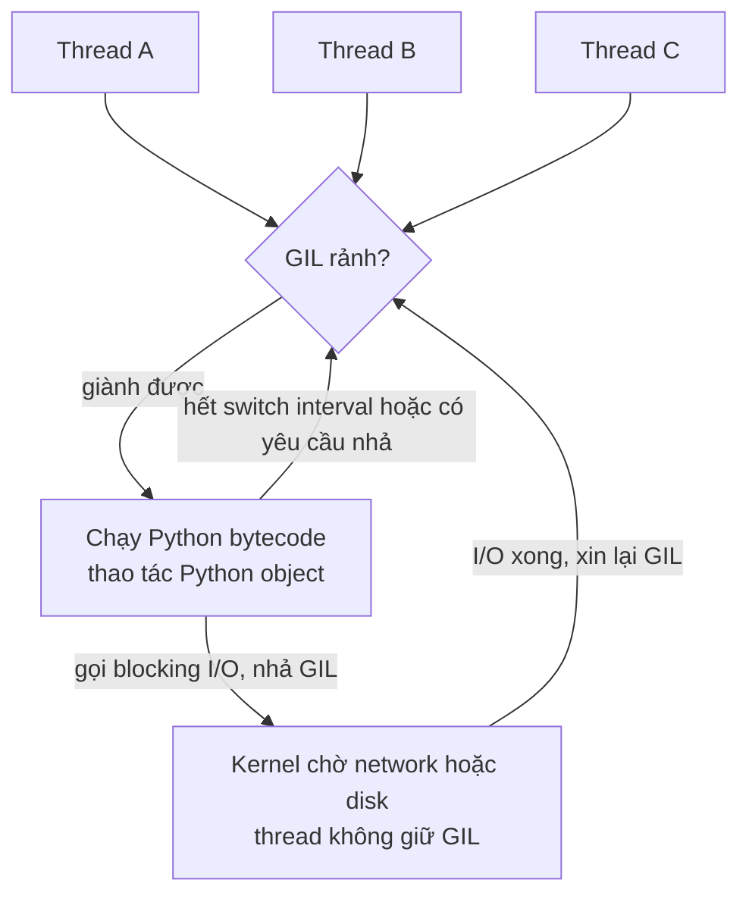
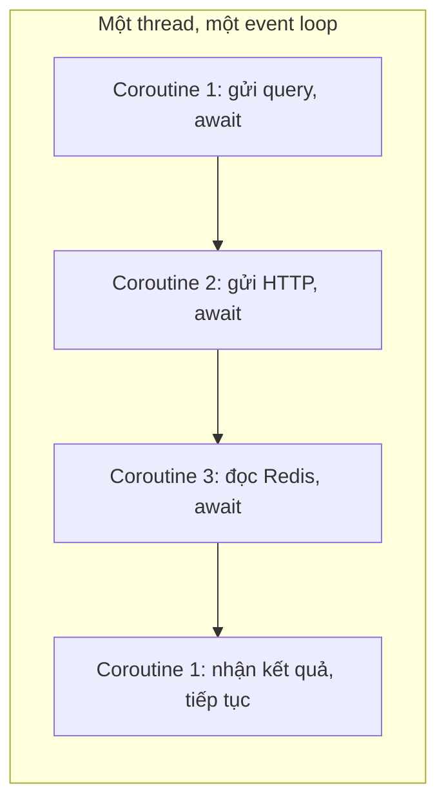
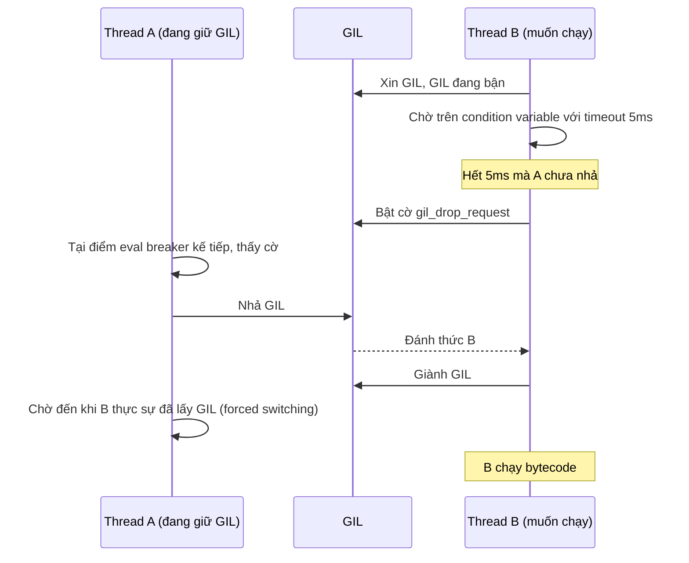
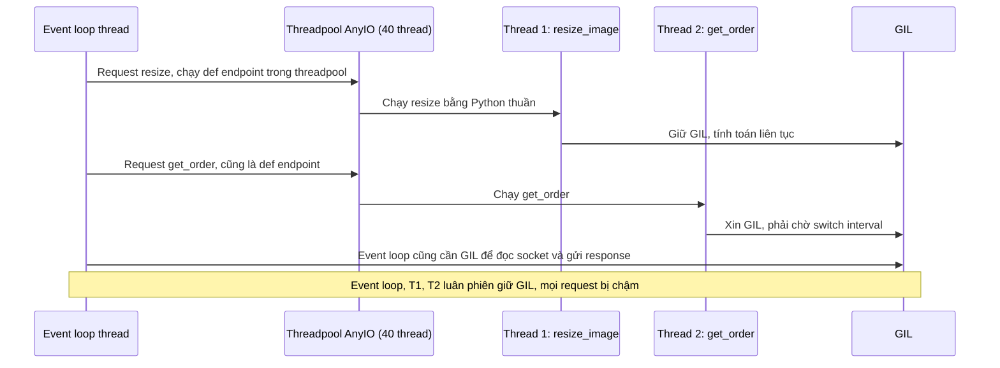
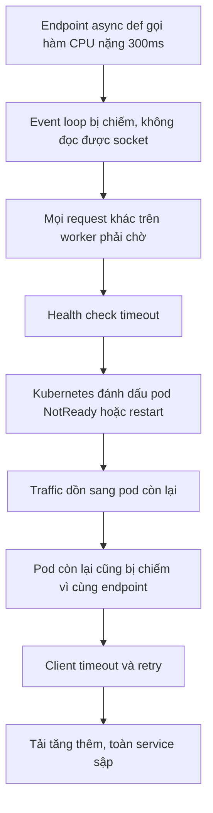

# Global Interpreter Lock (GIL)

## 1. Tổng quan

Global Interpreter Lock (GIL) là một mutex trong CPython đảm bảo **tại một thời điểm, chỉ một thread được thực thi Python bytecode** trong một interpreter. Các thread khác muốn chạy Python code phải chờ tới lượt giữ GIL.

Hệ quả nổi tiếng: trên máy 8 core, một process Python với 8 thread chạy code Python thuần CPU-bound vẫn chỉ dùng được khoảng một core. Nhưng GIL **không** làm thread vô dụng: thread đang chờ I/O (network, disk, `sleep`) nhả GIL, nên thread vẫn rất hiệu quả cho workload I/O-bound.

Để hiểu đúng GIL cần trả lời được: GIL thuộc về cái gì, nó bảo vệ cái gì, nó **không** bảo vệ cái gì, khi nào nó được nhả, và làm sao vượt qua nó khi cần parallelism.

> **Ghi chú version:** Nội dung mô tả CPython 3.12–3.14 build mặc định. Từ 3.13 có **free-threaded build** tùy chọn không có GIL (PEP 703); từ 3.14 build này được hỗ trợ chính thức (PEP 779) nhưng **chưa phải mặc định**. Xem mục 12.

## 2. Mental Model

> GIL là chiếc micro duy nhất trong phòng họp. Ai cầm micro mới được nói (chạy Python bytecode). Người đang chờ ai đó trả lời email (chờ I/O) đặt micro xuống cho người khác. Người nói liên tục (CPU-bound) bị nhắc nhở định kỳ phải chuyền micro, nhưng dù có bao nhiêu người trong phòng, tại mỗi thời điểm chỉ một người nói.



Diễn giải:

1. Ba thread cùng muốn chạy Python code, tất cả phải qua "cổng" GIL.
2. Thread giành được GIL chạy bytecode và được phép chạm vào Python object.
3. Khi thread gọi thao tác I/O blocking (đọc socket, ghi file, `time.sleep`), CPython nhả GIL **trước** khi vào syscall. Thread đó chờ trong kernel mà không chặn ai.
4. Khi I/O xong, thread phải xin lại GIL trước khi tiếp tục chạy Python code.
5. Thread chạy CPU liên tục bị buộc nhả GIL định kỳ để thread khác có cơ hội.

## 3. CPython là gì, và GIL thuộc về ai?

**Python** là ngôn ngữ, được định nghĩa bởi Python Language Reference. **CPython** là implementation chính thức, viết bằng C. Các implementation khác: PyPy (JIT, cũng có GIL), Jython và IronPython (không có GIL, chạy trên JVM/.NET, đã không còn theo kịp Python 3 hiện đại), GraalPy.

GIL là **chi tiết implementation của CPython**, không phải quy tắc của ngôn ngữ. Language reference không nói gì về GIL. Code Python đúng đắn không được phép dựa vào GIL để đảm bảo thread-safety.

Tuy vậy, vì CPython chiếm gần như toàn bộ production Python, "Python có GIL" là cách nói phổ biến và thực dụng.

## 4. Vì sao GIL tồn tại?

### Reference counting không thread-safe

Mọi Python object có trường `ob_refcnt` ([Reference Counting](../01-python-core/gc-reference-counting.md)). Mỗi lần gán, truyền tham số, lấy phần tử ra khỏi list, refcount bị tăng/giảm. Đó là thao tác đọc-sửa-ghi trên memory:

```text
Thread A: đọc refcount = 1
Thread B: đọc refcount = 1
Thread A: ghi refcount = 2
Thread B: ghi refcount = 2      ← đáng lẽ phải là 3
```

Refcount sai theo hướng thấp → object bị giải phóng khi vẫn đang dùng → crash (use-after-free). Sai theo hướng cao → memory leak.

Có hai cách giải quyết:

1. Mỗi thao tác refcount dùng atomic instruction hoặc lock riêng — hàng tỷ thao tác mỗi giây, mỗi thao tác chậm đi nhiều lần.
2. Một lock chung duy nhất cho toàn interpreter — chỉ lấy/nhả khi chuyển thread, chi phí gần như bằng 0 cho chương trình một thread.

CPython chọn cách 2.

### Không chỉ refcount

GIL còn bảo vệ trạng thái nội bộ khác của interpreter: cấu trúc `dict`, `list` bên trong, allocator pymalloc, trạng thái của import system, cache nội bộ. Không có GIL, từng cấu trúc này cần cơ chế đồng bộ riêng.

### C extension dễ viết

Hệ sinh thái C extension (NumPy, lxml, psycopg, Pillow...) được viết với giả định: khi code C đang chạy và giữ GIL, không thread nào khác chạm vào Python object. Giả định này giúp viết extension đơn giản và là một lý do lớn khiến Python thành công trong khoa học dữ liệu. Nó cũng là lý do bỏ GIL rất khó: phải sửa toàn bộ ecosystem.

### Hiệu năng single-thread

Các thử nghiệm bỏ GIL trước đây (2000s, "free-threading patch" của Greg Stein; Gilectomy của Larry Hastings) đều làm code một thread chậm đi đáng kể. Phần lớn chương trình Python là một thread, nên đánh đổi không được chấp nhận — cho đến PEP 703 với các kỹ thuật mới (xem mục 12).

## 5. Phân biệt các khái niệm: concurrency, parallelism, async, multithreading, multiprocessing

Đây là các khái niệm hay bị dùng lẫn lộn. Chúng trả lời những câu hỏi khác nhau.

| Khái niệm | Định nghĩa | Câu hỏi nó trả lời |
|---|---|---|
| **Concurrency** | Nhiều tác vụ **đang tiến triển** trong cùng một khoảng thời gian; có thể xen kẽ trên một core | Chương trình có quản lý được nhiều việc dở dang cùng lúc không? |
| **Parallelism** | Nhiều tác vụ **thực sự chạy cùng một thời điểm** trên nhiều core | Có nhiều CPU cùng làm việc không? |
| **Asynchronous** | Mô hình lập trình trong đó tác vụ khởi động thao tác (thường là I/O) rồi **không đứng chờ**, mà được thông báo khi xong | Code có block trong lúc chờ không? |
| **Multithreading** | Nhiều thread OS trong một process, dùng chung memory | Đơn vị thực thi là gì, ai lập lịch (OS)? |
| **Multiprocessing** | Nhiều process, mỗi process có memory và interpreter riêng | Có cô lập memory, có dùng nhiều core không? |

Concurrency là **cấu trúc** (xử lý nhiều việc), parallelism là **thực thi** (làm nhiều việc cùng lúc). Có thể có concurrency mà không có parallelism (AsyncIO trên một thread), và có parallelism với rất ít concurrency (một phép nhân ma trận chia cho 8 core).

### Minh họa trên dòng thời gian

**Hai thread CPU-bound, CPython có GIL** — concurrency nhưng không parallelism:

```mermaid
gantt
    title Hai thread CPU-bound trên CPython có GIL
    dateFormat X
    axisFormat %s
    section Thread A
    Chạy bytecode      :a1, 0, 5
    Chờ GIL            :done, a2, 5, 10
    Chạy bytecode      :a3, 10, 15
    Chờ GIL            :done, a4, 15, 20
    section Thread B
    Chờ GIL            :done, b1, 0, 5
    Chạy bytecode      :b2, 5, 10
    Chờ GIL            :done, b3, 10, 15
    Chạy bytecode      :b4, 15, 20
```



Hai thread luân phiên cầm GIL. Tổng thời gian bằng (hoặc hơi lớn hơn, do chi phí chuyển đổi) chạy tuần tự. Dù máy có nhiều core, chỉ một core bận chạy bytecode tại mỗi thời điểm.

**Hai thread I/O-bound** — thời gian chờ chồng lên nhau:

```mermaid
gantt
    title Hai thread I/O-bound
    dateFormat X
    axisFormat %s
    section Thread A
    Gửi request        :a1, 0, 1
    Chờ network, nhả GIL :done, a2, 1, 9
    Xử lý response     :a3, 9, 10
    section Thread B
    Gửi request        :b1, 1, 2
    Chờ network, nhả GIL :done, b2, 2, 10
    Xử lý response     :b3, 10, 11
```



Thời gian chờ network của hai thread trùng nhau. Tổng thời gian ~11 đơn vị thay vì ~20 nếu chạy tuần tự. GIL gần như không ảnh hưởng vì thread chỉ giữ nó trong khoảnh khắc ngắn gửi request và xử lý response.

**Hai process CPU-bound** — parallelism thật:

```mermaid
gantt
    title Hai process CPU-bound, mỗi process có GIL riêng
    dateFormat X
    axisFormat %s
    section Process 1 trên core 1
    Chạy bytecode :p1, 0, 10
    section Process 2 trên core 2
    Chạy bytecode :p2, 0, 10
```



Mỗi process có interpreter và GIL riêng; OS chạy chúng trên hai core. Thời gian bằng một nửa so với tuần tự (trừ chi phí khởi tạo và truyền dữ liệu).

**AsyncIO** — concurrency trên một thread:



Không có thread nào khác, nên GIL không bị tranh chấp. Concurrency đến từ việc coroutine tự nhường quyền tại `await`. Không có parallelism: tại một thời điểm chỉ một coroutine chạy. Chi tiết ở [AsyncIO](asyncio.md).

## 6. Cơ chế hoạt động: thread chạy bytecode thế nào?

### Thread state

Mỗi OS thread chạy Python code có một **thread state** (`PyThreadState`) chứa call stack của thread, exception hiện tại, và các thông tin khác. Để chạy bytecode, thread phải **gắn** thread state của nó vào interpreter và giữ GIL. Khi nhả GIL, thread state được "tháo" ra.

### Chuyển thread: switch interval

Từ Python 3.2 (thiết kế "new GIL" của Antoine Pitrou), việc chuyển thread dựa trên thời gian:



Các bước:

1. Thread B muốn chạy nhưng GIL đang bị A giữ. B chờ trên một condition variable với timeout bằng **switch interval** (mặc định 5 ms, xem `sys.getswitchinterval()`).
2. Nếu hết timeout mà A vẫn giữ GIL, B bật cờ `gil_drop_request`.
3. A là thread đang chạy eval loop; eval loop kiểm tra "eval breaker" ở các điểm như đầu function và nhánh nhảy ngược của vòng lặp ([CPython Runtime](../01-python-core/cpython-runtime.md)). Khi thấy cờ, A nhả GIL.
4. B được đánh thức và lấy GIL.
5. Cơ chế "forced switching" buộc A chờ đến khi B thực sự đã lấy GIL, tránh trường hợp A nhả rồi lấy lại ngay.

Điểm quan trọng: một lệnh bytecode không bị chia cắt, nhưng **một dòng Python gồm nhiều lệnh bytecode** có thể bị chen giữa bởi thread khác. Đó là lý do GIL không làm code của bạn thread-safe. Xem [Race Condition](race-condition.md).

### Nhả GIL khi làm blocking I/O

Code C của CPython bao quanh các syscall blocking bằng macro:

```c
Py_BEGIN_ALLOW_THREADS      // nhả GIL, tháo thread state
n = recv(fd, buf, len, 0);  // thread chờ trong kernel, không giữ GIL
Py_END_ALLOW_THREADS        // xin lại GIL, gắn lại thread state
```

Hầu hết thao tác I/O của standard library đều làm vậy: `socket.recv/send`, `file.read/write`, `time.sleep`, `select`, `subprocess.wait`, driver database viết bằng C (psycopg) khi chờ server trả lời. Trong khoảng giữa hai macro, code C **không được chạm vào Python object**.

### C extension nhả GIL cho tính toán nặng

Extension có thể nhả GIL cho phần tính toán không đụng tới Python object:

- NumPy nhả GIL trong nhiều phép toán trên array lớn.
- `hashlib` nhả GIL khi hash dữ liệu lớn hơn khoảng 2 KB.
- `zlib`, `bz2`, `lzma` nhả GIL khi nén/giải nén.
- Nhiều thư viện ảnh, mật mã, xử lý dữ liệu (Pillow, cryptography, Polars) làm tương tự.

Vì vậy thread có thể mang lại parallelism thật **nếu phần nặng nằm trong code native nhả GIL**. Với code Python thuần (vòng `for` cộng số, parse JSON bằng Python, xử lý string bằng vòng lặp), không có gì nhả GIL ngoài switch interval.

## 7. Internals: GIL, refcount và "convoy effect"

Một vấn đề ít được nhắc đến: khi trộn thread CPU-bound với thread I/O-bound, thread I/O có thể bị chậm đáng kể.

Thread I/O nhận dữ liệu từ socket xong, muốn xin lại GIL để xử lý vài micro giây rồi quay lại chờ. Nhưng GIL đang bị thread CPU giữ, thread I/O phải chờ đến hết switch interval (tối đa khoảng 5 ms) mới được chạy. Nếu mỗi request cần vài lần trao đổi I/O, mỗi lần mất thêm tới 5 ms, latency tăng vọt. Đây là **convoy effect**: thread nhanh bị kẹt sau thread chậm.

Hệ quả thực tế: một endpoint CPU-bound chạy trong threadpool của web server có thể làm tăng latency của mọi endpoint I/O khác trong cùng process, dù CPU của host còn trống.

## 8. Bên trong hệ thống xảy ra gì: FastAPI với endpoint sync CPU-bound



Diễn giải:

1. FastAPI chạy endpoint khai báo `def` (không `async`) trong threadpool của AnyIO để không block event loop.
2. Thread 1 chạy code resize ảnh bằng Python thuần, giữ GIL liên tục (chỉ nhả khi bị yêu cầu).
3. Thread 2 phục vụ một request đơn giản nhưng phải chờ tới lượt giữ GIL.
4. Ngay cả event loop — thread đọc socket, parse HTTP, gửi response — cũng phải tranh GIL.
5. Kết quả: throughput của cả worker giảm, p99 của mọi endpoint tăng, trong khi CPU của host chỉ bận một core.

Giải pháp đúng là đưa công việc CPU-bound ra khỏi process web: process pool, worker queue ([Celery](../07-celery/README.md)), hoặc thư viện native nhả GIL.

## 9. Ví dụ đo lường

```python
import time
from concurrent.futures import ThreadPoolExecutor, ProcessPoolExecutor

def cpu_work(n: int) -> int:
    total = 0
    for i in range(n):
        total += i * i
    return total

def io_work(_: int) -> None:
    time.sleep(0.5)                     # nhả GIL trong lúc ngủ

def bench(executor_cls, fn, jobs):
    start = time.perf_counter()
    with executor_cls(max_workers=4) as pool:
        list(pool.map(fn, jobs))
    return time.perf_counter() - start

if __name__ == "__main__":
    cpu_jobs = [5_000_000] * 4
    io_jobs = range(4)
    print("CPU, tuần tự   ", bench(ThreadPoolExecutor, cpu_work, cpu_jobs[:1]) * 4)
    print("CPU, 4 thread  ", bench(ThreadPoolExecutor, cpu_work, cpu_jobs))
    print("CPU, 4 process ", bench(ProcessPoolExecutor, cpu_work, cpu_jobs))
    print("I/O, 4 thread  ", bench(ThreadPoolExecutor, io_work, io_jobs))
```

Kết quả điển hình trên máy 4 core với CPython có GIL:

| Trường hợp | Thời gian tương đối | Lý do |
|---|---|---|
| CPU, tuần tự | 1.0× | Baseline |
| CPU, 4 thread | ~1.0× (có thể chậm hơn) | GIL tuần tự hóa bytecode, thêm chi phí chuyển đổi |
| CPU, 4 process | ~0.25–0.3× | Mỗi process có GIL riêng, chạy trên core riêng |
| I/O, 4 thread | ~0.5s thay vì 2s | `sleep` nhả GIL, thời gian chờ chồng lên nhau |

## 10. Hành vi trong production

**Process là đơn vị dùng nhiều core.** Web server Python production chạy nhiều **worker process** (Gunicorn, Uvicorn `--workers`) để dùng hết core của máy. Mỗi worker có GIL riêng. Số worker thường khởi điểm bằng số core (async worker) hoặc `2 × core + 1` (sync worker I/O-bound), rồi điều chỉnh bằng load test.

**Trong Kubernetes, core là CPU request/limit của container.** Pod có `limits.cpu: 1` chạy 4 worker process sẽ bị throttle; pod 4 core chạy 1 worker chỉ dùng tối đa một core cho bytecode.

**CPU của host "thấp" nhưng service chậm.** Dấu hiệu kinh điển của GIL contention: một core ở 100%, các core khác rảnh, host báo CPU 25% trên máy 4 core, nhưng p99 cao. Nhìn per-core CPU hoặc per-process CPU thay vì trung bình host.

**Thư viện thay đổi hình dạng bài toán.** `json` chuẩn chạy bằng C nhưng vẫn giữ GIL khi tạo Python object; `orjson` nhanh hơn nhiều lần. NumPy/Polars đưa vòng lặp xuống native. Đo trước khi đổi kiến trúc: đôi khi thay thư viện hiệu quả hơn thêm process.

## 11. Khi scale lên thì chuyện gì xảy ra?

Giả sử service có một endpoint tạo báo cáo tốn 200 ms CPU Python thuần, còn lại là endpoint I/O 20 ms.

| Tải | Điều xảy ra |
|---|---|
| 10 RPS báo cáo | 2 core-giây/giây. Với 4 worker process, ổn; nếu chỉ 1 worker nhiều thread, một core bão hòa, endpoint I/O bắt đầu chậm |
| 50 RPS báo cáo | Cần 10 core cho riêng báo cáo. Worker process bão hòa, request xếp hàng trong accept queue và threadpool; p99 của mọi endpoint tăng mạnh |
| 200 RPS báo cáo | Thêm pod không đủ nhanh; timeout ở load balancer; client retry làm tải tăng thêm |

Bài học: khi công việc CPU-bound chung process với request path, nó quyết định capacity của **toàn bộ** service. Tách nó ra queue riêng với worker riêng để scale độc lập và để request path chỉ làm I/O ngắn.

## 12. Free-threaded Python và các hướng khác

### Free-threaded build (PEP 703)

> **Ghi chú version:** 3.13: experimental, cài dưới tên `python3.13t`. 3.14: được hỗ trợ chính thức (PEP 779), chi phí single-thread giảm đáng kể so với 3.13 (khoảng 5–10% tùy workload, theo công bố của core team), nhưng vẫn là build tùy chọn. Kiểm tra bằng `sys._is_gil_enabled()`.

Các kỹ thuật chính cho phép bỏ GIL mà không làm chậm quá nhiều:

- **Biased reference counting**: refcount tách thành phần local (thread sở hữu object, không cần atomic) và phần shared (thread khác, dùng atomic).
- **Immortal object** và **deferred reference counting** cho các object dùng chung cực nhiều (function, module, code object).
- **mimalloc** thay pymalloc, thread-safe và hỗ trợ GC tìm object.
- **Per-object lock** (critical section) cho `list`, `dict`, `set`: một thao tác đơn lẻ trên container vẫn nhất quán.

Điều **không** thay đổi: invariant nghiệp vụ gồm nhiều bước vẫn cần lock. Thực ra race condition trở nên dễ xảy ra hơn vì thread chạy song song thật.

C extension phải khai báo tương thích (`Py_mod_gil`). Nếu import một extension chưa khai báo, interpreter **bật lại GIL** tại runtime kèm cảnh báo (có thể ép tắt bằng `PYTHON_GIL=0`, chấp nhận rủi ro). Trước khi dùng free-threaded trong production, phải kiểm tra từng dependency native.

### Subinterpreter với GIL riêng

Từ 3.12 (PEP 684), mỗi subinterpreter có thể có GIL riêng. Python 3.14 thêm module `concurrent.interpreters` và `InterpreterPoolExecutor` (PEP 734). Mô hình này nằm giữa thread và process: nhiều interpreter trong một process, chạy song song, nhưng không chia sẻ object trực tiếp — dữ liệu phải truyền qua kênh. Ecosystem hỗ trợ còn hạn chế.

### Các lựa chọn đã chín

| Lựa chọn | Khi nào |
|---|---|
| Nhiều worker process | Web server, mặc định cho mọi service |
| `ProcessPoolExecutor` / `multiprocessing` | CPU-bound trong một job, dữ liệu truyền qua lại vừa phải |
| Task queue (Celery, RQ, Dramatiq) | CPU-bound tách khỏi request path, cần retry/scale riêng |
| Thư viện native nhả GIL | Tính toán số, ảnh, nén, mã hóa |
| Viết extension bằng Rust (PyO3) / Cython | Hot path được xác định rõ bằng profiler |

## 13. Failure Modes và Failure Chain

### Failure chain: CPU-bound trong async endpoint



Diễn giải:

1. Code CPU trong `async def` không có `await` nào; event loop không thể chuyển sang coroutine khác. (Đây là vấn đề của event loop, nhưng GIL làm cho việc "chuyển sang thread" cũng không giải quyết được nếu vẫn là Python thuần.)
2. Mọi request cùng worker bị treo trong lúc hàm chạy.
3. Readiness/liveness probe cũng là request, nó timeout.
4. Pod bị loại khỏi Service hoặc restart, capacity giảm.
5. Traffic dồn sang các pod còn lại, chúng gặp đúng vấn đề đó nhanh hơn.
6. Client retry khuếch đại tải. Xem [Retry](../10-distributed-systems/retry.md) và [Failure Scenarios](../10-distributed-systems/failure-scenarios.md).

### Các failure khác

| Failure | Cơ chế | Dấu hiệu |
|---|---|---|
| Thêm thread không tăng throughput | CPU-bound Python thuần bị GIL tuần tự hóa | Một core 100%, throughput phẳng khi tăng thread |
| Latency I/O tăng khi có job CPU | Convoy effect | p99 endpoint nhẹ tăng khi endpoint nặng chạy |
| Race condition "dù có GIL" | Invariant nhiều bước bị chen ngang | Counter sai, dữ liệu mất cập nhật |
| Hiệu năng giảm sau khi bật free-threaded | Extension bật lại GIL, hoặc chi phí single-thread | Cảnh báo lúc import, `sys._is_gil_enabled()` trả True |

## 14. Trade-offs

| Mô hình | Parallelism CPU | Chia sẻ memory | Chi phí | Phù hợp |
|---|---|---|---|---|
| Thread (có GIL) | Không cho Python thuần; có với native nhả GIL | Có, rẻ | Thấp; cần lock | I/O blocking, thư viện sync |
| Process | Có | Không; phải serialize | Memory × số process, khởi động chậm, IPC | CPU-bound Python thuần |
| AsyncIO | Không | Có (một thread) | Phải dùng thư viện async | I/O concurrency rất cao |
| Free-threaded thread | Có | Có | Ecosystem đang chuyển đổi, cần lock cẩn thận | Thử nghiệm, workload đã kiểm tra dependency |
| Native extension | Có (nhả GIL) | Qua buffer | Build phức tạp | Hot path tính toán |

## 15. Sai lầm thường gặp

- "Python không chạy được đa luồng." Sai: thread chạy concurrency tốt với I/O; chỉ không có parallelism cho bytecode.
- "Có GIL nên không cần lock." Sai: GIL bảo vệ interpreter, không bảo vệ invariant của bạn.
- "Async nhanh hơn thread cho mọi thứ." Async giúp với số lượng lớn kết nối I/O; không giúp CPU-bound.
- "Thêm worker sẽ tăng throughput." Chỉ đúng khi CPU hoặc concurrency là bottleneck, không phải database hay dependency.
- Đọc CPU trung bình của host để kết luận "còn dư CPU".
- Nghĩ free-threaded Python là bật lên là nhanh.

## 16. Cách debug trong production

1. **Per-core CPU**: `top -H -p <pid>` (theo thread), `htop`, `mpstat -P ALL`. Một thread 100% trong process nhiều thread là dấu hiệu CPU-bound bị GIL giới hạn.
2. **py-spy**: `py-spy top --pid <pid>` để xem function nào tốn CPU; `py-spy dump --pid <pid>` để xem stack từng thread; tùy chọn `--gil` chỉ lấy mẫu thread đang giữ GIL — cho biết ai đang chiếm GIL.
3. **Event loop lag** với worker async: đo độ trễ giữa thời điểm callback được lên lịch và thời điểm chạy. Xem [Event Loop](event-loop.md).
4. **Threadpool saturation**: số thread đang bận và độ dài hàng đợi của threadpool (AnyIO mặc định 40 token).
5. **So sánh throughput theo số worker process** trong load test: tăng tuyến tính → CPU-bound và process giúp; phẳng → bottleneck nằm ở chỗ khác (DB, network, lock).

## 17. Best Practices

- Coi process là đơn vị dùng nhiều core; thread và coroutine là đơn vị xử lý I/O concurrency.
- Đưa công việc CPU nặng ra khỏi request path: queue + worker riêng, hoặc process pool có giới hạn.
- Trước khi thêm process, thử thư viện native nhả GIL cho hot path.
- Không dựa vào GIL cho thread-safety; bảo vệ shared state bằng lock, queue hoặc immutable data.
- Khi đánh giá free-threaded build, kiểm tra từng C extension và đo cả single-thread lẫn multi-thread trên workload thật.
- Theo dõi per-process CPU và event loop lag, không chỉ CPU trung bình của host.

## 18. Tóm tắt

- GIL là mutex của CPython, không phải của ngôn ngữ Python; chỉ một thread chạy bytecode tại một thời điểm trong một interpreter.
- GIL tồn tại chủ yếu để bảo vệ reference counting và trạng thái nội bộ với chi phí thấp cho chương trình một thread, và để C extension dễ viết.
- Thread nhả GIL khi làm blocking I/O và khi code native chủ động nhả; thread CPU-bound bị buộc nhả sau switch interval (5 ms).
- Concurrency khác parallelism: thread với GIL và AsyncIO cho concurrency; process (hoặc native code, free-threaded build) cho parallelism.
- GIL không làm code thread-safe: một dòng Python là nhiều lệnh bytecode.
- Free-threaded CPython (3.13 experimental, 3.14 supported, chưa mặc định) bỏ GIL bằng biased refcount và per-object lock; invariant nghiệp vụ vẫn cần lock.

## Liên quan

- [CPU-bound, I/O-bound và chọn execution model](cpu-vs-io-bound.md)
- [Threading](threading.md)
- [Multiprocessing](multiprocessing.md)
- [AsyncIO](asyncio.md)
- [Race Condition](race-condition.md)
- [Reference Counting và GC](../01-python-core/gc-reference-counting.md)
- [Sync vs Async Endpoint trong FastAPI](../03-fastapi/sync-vs-async-endpoint.md)
