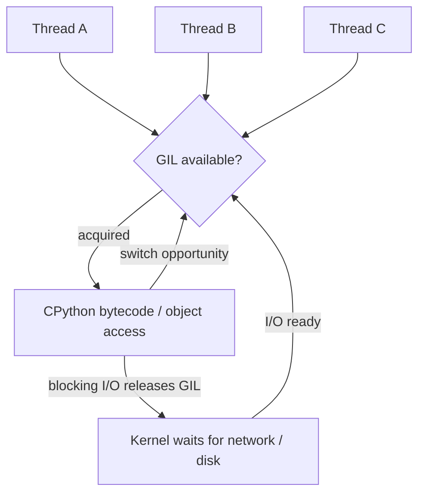

# Global Interpreter Lock (GIL)

> **Phạm vi phỏng vấn:** Python Concurrency · **Ưu tiên:** P0/P1 · **Mindset:** Why → How → Trade-off → Production.

## 1. What is it?

Trong CPython build mặc định có GIL, một thread tại một thời điểm thực thi Python bytecode trong một interpreter; GIL không khóa I/O và không biến compound operation thành thread-safe. CPython từ 3.13 cũng có free-threaded build tùy chọn, nên luôn nói rõ runtime/build.

## 2. Why does it matter?

Senior Engineer cần hiểu **Global Interpreter Lock (GIL)** để chọn đúng execution model, bảo vệ shared state và giữ tail latency ổn định. Điểm phỏng vấn nằm ở khả năng nêu invariant, điều kiện áp dụng và failure behavior, không nằm ở việc thuộc định nghĩa.

## 3. How does it work?

Thread đang block I/O thường nhả GIL; interpreter chuyển quyền theo interval và native extension có thể nhả GIL. Free-threaded build cho phép thread chạy Python song song nhưng extension chưa tương thích có thể bật lại GIL và shared state vẫn cần synchronization. Với build mặc định, CPU-bound Python thường cần process, native/vectorized code hoặc runtime phù hợp.

Khi reasoning, đi theo chuỗi: **input → state transition → output → failure → recovery**. Quan sát `event-loop lag, queue depth, context switch, CPU saturation và p99 latency` và phân biệt symptom, bottleneck với root cause.

## 4. Example

```python
from dataclasses import dataclass

@dataclass(frozen=True)
class Decision:
    topic: str
    invariant: str
    metric: str

decision = Decision(
    topic='Global Interpreter Lock (GIL)',
    invariant="Không làm mất hoặc lặp business effect",
    metric="p99 latency và error rate",
)
```

Ví dụ biến quyết định về **Global Interpreter Lock (GIL)** thành invariant và tín hiệu vận hành có thể kiểm chứng.

## 5. Production Use Case

Image preprocessing bằng Python trong async API bão hòa một core và tăng event-loop lag; chuyển sang process pool/worker queue, đo serialization overhead và giới hạn concurrency.

Checklist triển khai: capacity budget, timeout, idempotency (nếu có side effect), telemetry, canary, rollback và reconciliation.

## 6. Common Problems

- Không định nghĩa invariant và source of truth trước khi chọn công nghệ.
- Retry không backoff/jitter làm traffic amplification khi dependency lỗi.
- Không có bound cho queue, connection, memory hoặc concurrency.
- Chỉ theo dõi average; bỏ qua p95/p99, saturation và error semantics.
- Rollout toàn bộ, thiếu feature flag/canary và đường rollback dữ liệu.

## 7. Trade-offs

| Lựa chọn | Lợi ích | Chi phí / rủi ro | Khi phù hợp |
|---|---|---|---|
| Tối ưu/thiết kế xoay quanh Global Interpreter Lock (GIL) | Kiểm soát rõ constraint chính | Tăng complexity và coupling | Metric chứng minh đây là bottleneck/risk |
| Giữ baseline đơn giản | Ít dependency, dễ debug | Có thể chạm giới hạn sớm | Traffic vừa, invariant vẫn được giữ |
| Managed service/library | Giảm vận hành hạ tầng | Cost, lock-in, giới hạn control | SLA và economics phù hợp |
| Tự vận hành/customize | Kiểm soát sâu | Ownership và failure surface lớn | Có năng lực vận hành và nhu cầu thật |

## 8. Interview Questions

### Basic / Mid-level (10)

- **B1.** What is Global Interpreter Lock (GIL), and which concrete problem does it address?
- **B2.** Explain the main internal mechanism behind Global Interpreter Lock (GIL).
- **B3.** Which guarantees does Global Interpreter Lock (GIL) provide, and which does it not provide?
- **B4.** Which metrics or observations reveal the behavior of Global Interpreter Lock (GIL)?
- **B5.** What is the most common misconception about Global Interpreter Lock (GIL)?
- **B6.** How would you test assumptions involving Global Interpreter Lock (GIL)?
- **B7.** Which edge cases or failure modes matter most for Global Interpreter Lock (GIL)?
- **B8.** How can Global Interpreter Lock (GIL) affect latency, throughput, memory, or correctness?
- **B9.** Which runtime conditions or configuration choices change the behavior of Global Interpreter Lock (GIL)?
- **B10.** When is a different or simpler approach better than relying on Global Interpreter Lock (GIL)?

### Production Scenarios (5)

- **S1.** A CPU-heavy endpoint slows unrelated requests although host CPU is only 25%. How can the GIL and worker topology explain this?
- **S2.** A C extension makes threaded code 6× faster. What must be true about its GIL behavior, and how do you verify safety?
- **S3.** You move work to a process pool and latency gets worse. Which serialization, startup, queueing, and memory metrics do you inspect?
- **S4.** A compound dictionary update loses correctness across threads. Why did the GIL not protect the invariant?
- **S5.** Your Python runtime is upgraded to a free-threaded build. Which assumptions, extensions, and race tests must be revisited?

## 9. Senior-level Questions

- **L1.** How does Global Interpreter Lock (GIL) constrain the surrounding architecture and operational model?
- **L2.** Which subtle correctness issue appears when Global Interpreter Lock (GIL) meets concurrency or partial failure?
- **L3.** What breaks first around Global Interpreter Lock (GIL) at 20,000 RPS or 100× data volume?
- **L4.** Where should admission control or backpressure be placed when using Global Interpreter Lock (GIL)?
- **L5.** How would you benchmark or validate Global Interpreter Lock (GIL) without a misleading microbenchmark?
- **L6.** Which hidden coupling or migration cost can Global Interpreter Lock (GIL) introduce?
- **L7.** How would you change a poor decision around Global Interpreter Lock (GIL) with no downtime?
- **L8.** What production evidence would make you choose a different approach?
- **L9.** How do correctness, latency, cost, and complexity trade off for Global Interpreter Lock (GIL)?
- **L10.** How would you turn an incident involving Global Interpreter Lock (GIL) into a durable prevention mechanism?

## 10. Short Answers

**B1.** Trong CPython build mặc định có GIL, một thread tại một thời điểm thực thi Python bytecode trong một interpreter; GIL không khóa I/O và không biến compound operation thành thread-safe. CPython từ 3.13 cũng có free-threaded build tùy chọn, nên luôn nói rõ runtime/build. Trả lời tốt nối definition với constraint/invariant và một use case cụ thể.

**B2.** Mô tả state, lifecycle, boundary và failure path; không dừng ở public API của Global Interpreter Lock (GIL).

**B3.** Nêu lúc tạo, lúc sử dụng, lúc release/commit và điều xảy ra khi timeout hoặc cancellation.

**B4.** Đo event-loop lag, queue depth, context switch, CPU saturation và p99 latency; luôn tách average khỏi tail và success khỏi useful result.

**B5.** Lỗi phổ biến là dùng Global Interpreter Lock (GIL) như mặc định mà không xác định ownership, limit và fallback.

**B6.** Test invariant trước, sau đó integration test failure path, concurrency và representative load.

**B7.** Xét timeout, duplicate, stale state, overload, dependency loss và recovery/reconciliation.

**B8.** Đo critical path, contention, queueing và amplification; throughput cao không bù được p99 xấu.

**B9.** Deadline, concurrency limit, retention/TTL, resource budget, telemetry và rollout policy phải explicit.

**B10.** Tránh Global Interpreter Lock (GIL) khi bài toán đơn giản hơn giải được invariant với ít state và operational cost hơn.

Cấu trúc câu trả lời: **Definition → Why → How → Trade-off → Production example**. Với câu scenario: **stabilize → observe → hypothesize → verify → mitigate → prevent**.

## 11. Follow-up Questions

- **F1.** What assumption in your answer is most risky?
- **F2.** How would you prove that with metrics or an experiment?
- **F3.** What changes if the operation is not idempotent?
- **F4.** Where would you add timeout, retry, and backpressure?
- **F5.** What is your rollback and data-reconciliation plan?

## 12. Key Takeaways

- Nói được **vai trò, constraint hoặc invariant của Global Interpreter Lock (GIL)**, không chỉ “dùng để làm gì”.
- Định lượng bằng event-loop lag, queue depth, context switch, CPU saturation và p99 latency và có baseline trước tối ưu.
- Thiết kế cho timeout, duplicate, overload, partial failure và recovery.
- Mọi tối ưu đều có chi phí về correctness, complexity, latency hoặc money.
- Production-ready nghĩa là có owner, alert, runbook, canary, rollback và reconciliation.


## 13. Mental Model

GIL là vé vào vùng thực thi Python object/bytecode của một interpreter build có GIL. Thread chờ I/O trả vé; thread chạy Python CPU liên tục tranh cùng một vé.

## 14. Internals Deep Dive


GIL thuộc CPython implementation, không phải quy tắc của ngôn ngữ Python. Ở build mặc định có GIL, thread phải giữ GIL và attached thread state để thao tác Python object/C API. Thiết kế lịch sử đơn giản hóa bảo vệ runtime state và reference count, nhưng GIL không thay thế lock cho business invariant gồm nhiều bước.

Interpreter định kỳ cho thread khác cơ hội chạy; blocking I/O và nhiều native extension detach thread state/release GIL. Vì vậy thread vẫn hữu ích cho nhiều blocking I/O. Với CPU-bound pure Python, nhiều thread chủ yếu time-slice một core cho bytecode; process/native code thường phù hợp hơn. Từ CPython 3.13 có free-threaded build tùy chọn: built-in có internal synchronization, extension phải khai báo tương thích và shared mutable state vẫn cần lock.


Implementation detail có thể đổi theo version; khi trả lời interview, nêu rõ CPython/PostgreSQL/Redis/framework version nếu kết luận dựa vào behavior nội bộ thay vì public contract.

## 15. Request / Data Flow



Đọc diagram từ input tới state transition và output. Tại mỗi mũi tên, hỏi: operation có block không, có retry không, state có durable không, identity nào dùng để dedupe và metric nào chứng minh bước đó khỏe.

## 16. Failure Scenario

Dưới load, blocking call, unbounded fan-out, race hoặc lock contention làm queue/loop lag tăng. Áp deadline, semaphore/pool bound, structured cancellation và tách CPU work khỏi event loop.

Phân tích theo chuỗi: **trigger → saturation/incorrect state → propagation → user impact → immediate mitigation → durable prevention**. Tránh gọi retry hoặc scale là giải pháp nếu chưa chỉ ra dependency budget.

## 17. How I would debug this in production

1. Phân loại CPU-bound, blocking I/O hay async I/O.
2. Xem per-core CPU, event-loop lag, thread/process/queue depth.
3. Capture stack/profile của execution unit đang giữ CPU/lock.
4. Kiểm semaphore, timeout, cancellation và shared-state invariant.
5. Load test lại với bounded concurrency.

## 18. Common Misconceptions

**Sai:** concurrency luôn là parallelism và thêm worker luôn tăng throughput. **Đúng:** queueing, GIL, locks và downstream capacity có thể làm p99 tệ hơn.

## 19. When NOT to use

Không thêm concurrency khi workload nhỏ hoặc downstream đã saturated; model tuần tự đơn giản có thể đúng và dễ vận hành hơn.

## 20. What interviewer may ask next

1. **What guarantee does Global Interpreter Lock (GIL) provide, and what does it explicitly not guarantee?**
2. **Which implementation detail changes across versions or runtimes?**
3. **Where is the first queue or contention point under high load?**
4. **What happens if the dependency times out after committing state?**
5. **How would you observe, degrade, and recover this in production?**
6. **Which simpler design would you choose at 100 RPS, and when would you evolve it?**

## 21. Check Your Understanding

1. Nếu throughput tăng 20× nhưng downstream capacity không đổi, **Global Interpreter Lock (GIL)** sẽ tạo queue/backpressure ở đâu?
2. Timeout xảy ra ngay sau một state transition; caller có thể kết luận điều gì và không thể kết luận điều gì?
3. Metric, trace span và log field tối thiểu nào giúp phân biệt application, dependency và network latency?

<details>
<summary>Answer</summary>

1. Queue xuất hiện tại bounded resource đầu tiên: worker/thread/semaphore/connection pool/broker hoặc dependency. Nếu không có bound, overload chuyển thành memory growth và timeout storm.
2. Caller chỉ biết chưa nhận response trong deadline; operation có thể chưa chạy, đang chạy hoặc đã commit. Cần operation identity/idempotency và status/reconciliation.
3. Dùng end-to-end latency + queue/service time, correlation/trace ID, dependency spans, error/retry classification và saturation của pool/queue/resource.

</details>

## 22. See also

- [AsyncIO](asyncio.md)
- [Event Loop](event-loop.md)
- [FastAPI Sync vs Async](../03-fastapi/sync-vs-async-endpoint.md)
- [CPU vs I/O](cpu-vs-io-bound.md)
