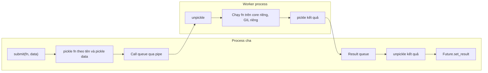

# Multiprocessing

## 1. Tổng quan

Multiprocessing chạy code trên nhiều **process** độc lập. Mỗi process có vùng memory riêng, interpreter riêng và [GIL](gil.md) riêng, nên các process thực sự chạy song song trên nhiều core. Đây là cách chuẩn để có parallelism cho code Python thuần CPU-bound trên CPython có GIL.

Trong backend, multiprocessing xuất hiện ở hai dạng:

- **Kiến trúc**: Gunicorn/Uvicorn chạy nhiều worker process; Celery dùng prefork pool. Mỗi worker là một process.
- **Trong code**: `ProcessPoolExecutor`, `multiprocessing.Pool` để chia một tác vụ CPU nặng ra nhiều core.

Cái giá của isolation: process không chia sẻ object. Mọi dữ liệu truyền qua lại phải được **serialize** (pickle), gửi qua pipe, và deserialize — chi phí có thể lớn hơn chính công việc.

## 2. Mental Model

> Mỗi process là một văn phòng riêng với nhân viên, bàn ghế, tài liệu riêng. Các văn phòng làm việc thật sự song song. Muốn chuyển tài liệu giữa hai văn phòng phải photocopy, đóng gói và gửi thư — không thể đưa tay qua bàn.

Hệ quả:

- Không có race condition trên Python object (vì không chia sẻ), nhưng có race trên tài nguyên chung bên ngoài (database, file, Redis).
- Mỗi process tốn memory riêng: N process ≈ N lần memory (trừ phần chia sẻ copy-on-write).
- Dữ liệu càng lớn, chi phí truyền càng lớn.

## 3. Vì sao cần?

- Tính toán CPU-bound bằng Python thuần: parse file lớn, biến đổi dữ liệu, tính toán nghiệp vụ phức tạp, tạo báo cáo.
- Dùng hết core của máy cho web server (worker process).
- Cô lập lỗi: một process crash (segfault trong C extension, memory leak) không kéo theo process khác.
- Giới hạn tài nguyên theo process (restart sau N task để thu hồi memory).

## 4. Cơ chế hoạt động: start method

Cách tạo process con ảnh hưởng mạnh tới hành vi:

| Start method | Cách làm | Ưu điểm | Nhược điểm |
|---|---|---|---|
| `fork` | Sao chép process cha bằng `fork()` | Rất nhanh; con kế thừa memory copy-on-write | Không an toàn khi cha có nhiều thread (lock bị giữ); kế thừa cả tài nguyên không mong muốn (socket, connection) |
| `spawn` | Khởi động interpreter mới, import lại module chính | An toàn, sạch | Chậm (import lại mọi thứ); cần `if __name__ == "__main__":` |
| `forkserver` | Một server process sạch được fork sớm; con được fork từ server đó | An toàn hơn fork, nhanh hơn spawn | Chỉ có trên Unix |

> **Ghi chú version:** Mặc định: Windows luôn `spawn`; macOS `spawn` từ 3.8; Linux `fork` cho tới 3.13 và `forkserver` từ 3.14. Code phụ thuộc vào việc con "thấy" biến global của cha (chỉ đúng với `fork`) sẽ hỏng khi đổi version hoặc platform. Luôn chọn start method tường minh bằng `multiprocessing.get_context("spawn")` khi hành vi quan trọng.

## 5. Luồng xử lý: ProcessPoolExecutor



Diễn giải:

1. `submit` serialize function (bằng **tên đầy đủ** `module.qualname`, không phải bytecode) và argument bằng pickle.
2. Dữ liệu đi qua pipe tới một worker process.
3. Worker import module chứa function (nếu chưa), unpickle argument, chạy function.
4. Kết quả được pickle, gửi ngược qua pipe.
5. Một management thread trong process cha nhận kết quả, unpickle, và hoàn tất Future.

Mỗi mũi tên qua biên process là **copy dữ liệu**. Với input 200 MB, process cha tốn thời gian pickle, pipe truyền 200 MB, worker tốn thời gian unpickle — và cả hai phía đều giữ một bản trong memory.

### Yêu cầu của pickle

- Function phải định nghĩa ở **module level** để import được theo tên. Lambda, function lồng nhau, closure không pickle được.
- Argument và kết quả phải pickle được: không truyền connection, lock, file handle, generator.
- Exception trong worker được pickle và raise lại ở `future.result()`; exception tùy biến phải pickle được.

## 6. Ví dụ

```python
from concurrent.futures import ProcessPoolExecutor
import multiprocessing as mp

def score_claims(batch: list[dict]) -> list[float]:
    # CPU-bound: tính điểm rủi ro bằng Python thuần
    return [compute_risk(c) for c in batch]

def score_all(claims: list[dict], batch_size: int = 5_000) -> list[float]:
    batches = [claims[i:i + batch_size] for i in range(0, len(claims), batch_size)]
    ctx = mp.get_context("spawn")
    with ProcessPoolExecutor(max_workers=4, mp_context=ctx, max_tasks_per_child=100) as pool:
        results = pool.map(score_claims, batches)
    return [score for batch in results for score in batch]

if __name__ == "__main__":
    ...
```

- Gửi theo **batch** thay vì từng claim: chi phí pickle/IPC cố định mỗi lần gửi được chia cho 5.000 phần tử.
- `max_tasks_per_child` (3.11+) tái tạo worker sau N task để giới hạn memory leak/fragmentation.
- `if __name__ == "__main__":` bắt buộc với `spawn`/`forkserver`: worker import lại module chính; không có guard, worker sẽ tự tạo pool mới đệ quy.

## 7. Giao tiếp giữa process

| Cơ chế | Cách hoạt động | Dùng khi |
|---|---|---|
| `Queue` / `Pipe` | Pickle qua pipe; `Queue` có feeder thread nền | Truyền message vừa và nhỏ |
| `shared_memory` (3.8+) | Vùng memory OS dùng chung, truy cập như buffer | Mảng số lớn (kết hợp NumPy), tránh copy |
| `Value` / `Array` | Kiểu C trong shared memory, có lock | Vài biến đếm đơn giản |
| `Manager` | Server process giữ object, các process khác gọi qua proxy | Chia sẻ dict/list phức tạp; chậm vì mỗi thao tác là một IPC |
| Hệ thống ngoài (Redis, DB, object storage) | Qua network | Dữ liệu lớn, nhiều máy, cần bền vững |

Với dữ liệu lớn, cách hiệu quả thường là **không truyền dữ liệu**, chỉ truyền tham chiếu: đường dẫn file, key trong object storage, khoảng ID trong database; worker tự đọc.

## 8. Hành vi trong production

**Prefork server.** Gunicorn master fork worker; mỗi worker phục vụ request độc lập. Master theo dõi và restart worker chết. Worker không chia sẻ cache trong memory — cache in-process có N bản, và invalidation chỉ ảnh hưởng một worker.

**Connection không được kế thừa an toàn.** Với `fork`, process con kế thừa socket của connection pool cha. Hai process dùng chung một socket database làm hỏng giao thức. Tạo engine/pool **sau** khi fork (trong hook `post_fork` hoặc lifespan của worker), hoặc gọi `engine.dispose()` trong process con.

**Memory nhân theo số process.** 8 worker × 500 MB = 4 GB. Copy-on-write sau fork giúp ban đầu, nhưng refcount và GC dần làm page bị copy (xem [Python Memory Model](../01-python-core/python-memory-model.md)).

**Worker chết.** Nếu một worker của `ProcessPoolExecutor` bị OOM kill hoặc segfault, pool trở thành `BrokenProcessPool` và mọi Future đang chờ đều lỗi. Celery prefork phát hiện worker chết và tạo lại, nhưng task đang chạy có thể được giao lại hoặc mất tùy cấu hình ack. Xem [Broker và Worker](../07-celery/broker-worker.md).

**Signal và shutdown.** SIGTERM gửi tới process cha phải được truyền tới con; process con mồ côi (orphan) hoặc zombie xuất hiện khi cha không `join`/`wait`. Trong container, PID 1 cần xử lý signal và reap zombie (dùng `tini` hoặc `--init`). Xem [Docker Production](../12-docker/production-best-practices.md).

## 9. Khi scale lên thì chuyện gì xảy ra?

**Amdahl's Law**: nếu 20% công việc là tuần tự (đọc input, gộp kết quả, IPC), tốc độ tối đa dù có vô hạn core chỉ là 5×.

| Số process | Tăng tốc lý tưởng | Thực tế thường gặp | Lý do |
|---|---|---|---|
| 2 | 2× | ~1.8× | Chi phí IPC nhỏ |
| 4 | 4× | ~3.2× | Phần tuần tự bắt đầu lộ rõ |
| 16 | 16× | ~6× | IPC, memory bandwidth, phần tuần tự |
| Nhiều hơn số core | — | Chậm hơn | Context switch, cạnh tranh cache |

Trong Kubernetes, "số core" là CPU limit của container, không phải số core của node. Tạo 16 process trong pod có `limits.cpu: 2` chỉ làm CPU bị throttle. Xem [Resource Limit](../13-kubernetes/resource-limit.md).

## 10. Failure Modes

| Failure | Nguyên nhân | Dấu hiệu |
|---|---|---|
| `PicklingError` | Truyền lambda/closure/object chứa lock | Lỗi khi submit |
| Tạo process đệ quy | Thiếu `if __name__ == "__main__"` với spawn | Process tăng vô hạn, lỗi `RuntimeError` bootstrapping |
| Chậm hơn tuần tự | Dữ liệu truyền lớn so với tính toán | CPU của process cha cao ở pickle |
| Process con treo | Fork khi thread khác giữ lock | Worker không tiến triển |
| Hỏng giao thức DB | Chia sẻ connection qua fork | Lỗi protocol ngẫu nhiên, dữ liệu lẫn lộn |
| `BrokenProcessPool` | Worker bị kill (OOM) | Mọi task đang chờ lỗi cùng lúc |
| Hành vi khác giữa môi trường | Start method khác (Linux vs macOS, 3.13 vs 3.14) | Biến global không thấy trong worker |

## 11. Trade-offs

| Lựa chọn | Lợi ích | Chi phí |
|---|---|---|
| ProcessPoolExecutor | Parallelism trong một job, API đơn giản | Pickle/IPC, không bền vững, chết cùng process cha |
| Task queue (Celery) | Bền vững, retry, scale theo máy | Hạ tầng broker, độ trễ cao hơn, cần idempotency |
| Thư viện native (NumPy, Polars) | Nhanh hơn nhiều, có thể song song nội bộ | Phải diễn đạt bài toán theo API của thư viện |
| Thread (free-threaded build) | Chia sẻ memory, parallelism | Ecosystem đang chuyển đổi, cần lock cẩn thận |

## 12. Sai lầm thường gặp

- Dùng process cho I/O-bound, trả chi phí IPC và memory mà không cần.
- Gửi từng phần tử nhỏ thay vì batch.
- Truyền dataset lớn qua argument thay vì truyền tham chiếu.
- Dựa vào biến global được kế thừa qua `fork`.
- Tạo process pool mới cho mỗi request web (chi phí khởi động rất lớn).
- Chạy process pool bên trong web worker vốn đã là nhiều process, dẫn tới số process vượt xa số core.

## 13. Khi nào nên dùng?

- CPU-bound Python thuần, dữ liệu truyền nhỏ so với lượng tính toán.
- Cần cô lập crash hoặc memory của thư viện không ổn định.
- Batch job chạy trên một máy lớn.

## 14. Khi nào không nên dùng?

- I/O-bound: dùng thread hoặc AsyncIO.
- Dữ liệu cần chia sẻ và cập nhật liên tục giữa các worker: dùng hệ thống ngoài hoặc thiết kế lại.
- Tác vụ cần độ tin cậy, retry, phân tán nhiều máy: dùng task queue.
- Bài toán diễn đạt được bằng thư viện vectorized.

## 15. Cách debug trong production

- `ps -ef --forest` hoặc `pstree -p <pid>` để xem cây process, phát hiện orphan/zombie.
- `py-spy dump --pid <child_pid>` cho từng worker.
- Đo thời gian pickle: profile process cha; nếu `pickle.dumps` chiếm phần lớn, giảm dữ liệu truyền.
- Theo dõi RSS/PSS mỗi process và sự kiện OOM kill (`dmesg`, event của Kubernetes).
- Log PID trong mọi dòng log để phân biệt worker.

## 16. Best Practices

- Chọn start method tường minh; viết code không phụ thuộc biến global kế thừa.
- Gửi batch, truyền tham chiếu thay vì dữ liệu lớn.
- Tạo pool một lần và tái sử dụng; đặt `max_workers` theo CPU limit thật.
- Tạo connection/client trong process con, không kế thừa qua fork.
- Dùng `max_tasks_per_child` hoặc `--max-tasks-per-child` (Celery) để giới hạn memory tích lũy.
- Với công việc cần bền vững, dùng task queue thay vì process pool trong web worker.

## 17. Tóm tắt

- Mỗi process có memory, interpreter và GIL riêng — parallelism thật cho Python thuần.
- Dữ liệu qua biên process phải pickle và copy; chi phí IPC quyết định có đáng chia hay không.
- Start method (fork, spawn, forkserver) ảnh hưởng tới an toàn và hành vi; mặc định trên Linux đổi sang forkserver từ 3.14.
- Memory nhân theo số process; connection không được chia sẻ qua fork.
- Amdahl's Law giới hạn tốc độ; số process hữu ích bị giới hạn bởi CPU limit thật.

## Liên quan

- [Global Interpreter Lock](gil.md)
- [Threading](threading.md)
- [CPU-bound, I/O-bound và chọn execution model](cpu-vs-io-bound.md)
- [Python Memory Model](../01-python-core/python-memory-model.md)
- [Celery Architecture](../07-celery/architecture.md)
