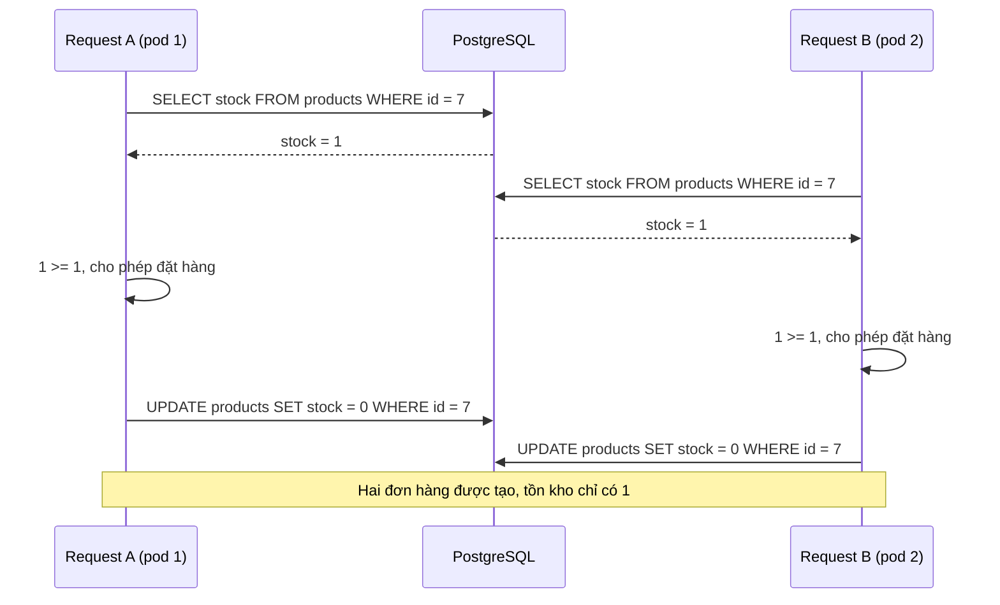

# Race Condition

## 1. Tổng quan

Race condition xảy ra khi **tính đúng đắn của kết quả phụ thuộc vào thứ tự hoặc thời điểm** mà các tác vụ đồng thời truy cập cùng một trạng thái chung. Với cùng input, chương trình lúc cho kết quả đúng, lúc cho kết quả sai, tùy vào việc tác vụ nào "về trước".

Race condition không chỉ là vấn đề của thread. Nó xuất hiện ở mọi tầng:

| Tầng | Tác vụ đồng thời | Trạng thái chung |
|---|---|---|
| Trong process | Thread, coroutine | Biến global, cache in-memory, object dùng chung |
| Giữa process / pod | Worker Gunicorn, pod Kubernetes, Celery worker | Database, Redis, file, object storage |
| Giữa hệ thống | Service khác nhau, webhook, retry | Bản ghi nghiệp vụ, số dư, tồn kho |

Race condition trong backend thường gây thiệt hại thật: bán vượt tồn kho, trừ tiền hai lần, áp dụng một mã giảm giá nhiều lần, cấp trùng số hóa đơn.

## 2. Mental Model

> Hai người cùng nhìn vào một tờ giấy ghi "còn 1 vé", cùng quyết định "tôi lấy", cùng ghi "còn 0". Hai vé đã được bán từ một vé.

Mọi race condition đều có cùng cấu trúc: **đọc trạng thái → quyết định dựa trên trạng thái đó → ghi**, trong khi giữa bước đọc và bước ghi, trạng thái có thể đã bị người khác thay đổi.

## 3. Vì sao race condition khó?

- **Không tái hiện ổn định**: chỉ xảy ra khi thời điểm trùng khớp, thường dưới tải cao.
- **Test đơn vị không bắt được**: test chạy tuần tự.
- **Hậu quả xuất hiện muộn**: dữ liệu sai được phát hiện khi đối soát cuối ngày.
- **Hiểu lầm về GIL**: nhiều người tin rằng Python "không có race condition" vì có GIL.

## 4. Data race và race condition

- **Data race**: hai thread truy cập cùng một vùng memory, ít nhất một thao tác ghi, không có đồng bộ. Trong C/C++ đây là undefined behavior. Trong CPython có GIL, Python object được interpreter bảo vệ khỏi data race ở mức memory — bạn không làm hỏng cấu trúc bên trong của `dict`.
- **Race condition**: lỗi ở mức **logic**. Mỗi thao tác đơn lẻ đều an toàn, nhưng chuỗi thao tác không nguyên tử. GIL **không** ngăn điều này.

> **Ghi chú version:** Với free-threaded build (3.13+), built-in container vẫn được bảo vệ bằng per-object lock, nhưng race condition logic trở nên dễ xảy ra hơn vì thread chạy song song thật.

## 5. Các dạng race condition kinh điển

### Read-modify-write

```python
counter += 1           # đọc, cộng, ghi — ba bước bytecode
balance = balance - amount
```

Hai tác vụ cùng đọc giá trị cũ, cùng ghi giá trị mới — một lần cập nhật bị mất (**lost update**). Chi tiết bytecode ở [CPython Runtime](../01-python-core/cpython-runtime.md#vì-sao-x--1-không-nguyên-tử).

### Check-then-act

```python
if not os.path.exists(path):      # kiểm tra
    create_file(path)             # hành động — người khác có thể đã tạo giữa hai dòng

if user.coupon_used is False:     # kiểm tra
    apply_discount(order)         # hành động
    user.coupon_used = True
```

Điều kiện đúng lúc kiểm tra nhưng không còn đúng lúc hành động (TOCTOU — time of check to time of use).

### Race trong AsyncIO

Coroutine không bị chen ngang giữa hai `await`, nhưng **bị chen ngang tại mỗi `await`**:

```python
cache: dict[str, Profile] = {}

async def get_profile(user_id: str) -> Profile:
    if user_id not in cache:                     # kiểm tra
        profile = await fetch_profile(user_id)   # nhường quyền ở đây
        cache[user_id] = profile                 # hành động
    return cache[user_id]
```

100 request cùng lúc cho một user mới: cả 100 đều thấy cache trống trước khi request đầu tiên kịp ghi, và cùng gọi `fetch_profile`. Đây là dạng nhỏ của [cache stampede](../06-redis/cache-problems.md). Với số dư:

```python
async def withdraw(account_id, amount):
    balance = await repo.get_balance(account_id)    # await → nhường quyền
    if balance >= amount:
        await repo.set_balance(account_id, balance - amount)
```

Hai request rút tiền xen kẽ nhau tại `await` → số dư âm.

### Race giữa nhiều instance

Code không có race trong một process vẫn có race khi chạy 10 pod. Lock trong process (`threading.Lock`, `asyncio.Lock`) **không có tác dụng** giữa các pod. Trạng thái chung nằm trong database hoặc Redis, nên đồng bộ phải xảy ra ở đó.

## 6. Luồng xử lý: lost update giữa hai request



Diễn giải:

1. Hai request ở hai pod khác nhau đọc cùng giá trị `stock = 1`.
2. Cả hai kiểm tra điều kiện trên giá trị đã đọc — cả hai đều hợp lệ.
3. Cả hai ghi `stock = 0` (giá trị tính từ lần đọc). Không có lỗi nào xảy ra ở database; mỗi câu lệnh đều hợp lệ.
4. Mặc định ở isolation level Read Committed của PostgreSQL, hai transaction này không xung đột nhau. Xem [Isolation Level](../04-database-postgresql/isolation-level.md).

## 7. Các cách xử lý

### Đưa thao tác về dạng nguyên tử tại nơi lưu trạng thái

```sql
UPDATE products
SET stock = stock - 1
WHERE id = 7 AND stock >= 1
RETURNING stock;
```

Database kiểm tra và cập nhật trong **một câu lệnh**; row bị lock trong lúc cập nhật. Nếu không có row nào được trả về, hết hàng. Đây thường là giải pháp đơn giản và nhanh nhất.

Tương tự với Redis: `INCR`, `DECRBY`, `SET key value NX`, hoặc Lua script cho logic nhiều bước.

### Constraint của database

```sql
CREATE UNIQUE INDEX uniq_coupon_use ON coupon_redemptions (coupon_id, user_id);
```

Để database là trọng tài cuối cùng: request thứ hai vi phạm unique constraint và thất bại, dù code ứng dụng có race. Constraint là tuyến phòng thủ không phụ thuộc vào việc mọi đoạn code đều viết đúng.

### Pessimistic locking

```sql
BEGIN;
SELECT balance FROM accounts WHERE id = 42 FOR UPDATE;   -- khóa row
-- tính toán trong ứng dụng
UPDATE accounts SET balance = :new WHERE id = 42;
COMMIT;
```

Transaction khác muốn `FOR UPDATE` cùng row phải chờ. Đơn giản để lý luận; cái giá là chờ đợi và rủi ro [deadlock](../04-database-postgresql/deadlock.md). Transaction phải ngắn. Xem [Locks](../04-database-postgresql/locks.md).

### Optimistic locking (version)

```sql
UPDATE claims
SET status = 'approved', version = version + 1
WHERE id = 99 AND version = 5;
```

Nếu 0 row được cập nhật, ai đó đã sửa trước; ứng dụng đọc lại và thử lại (hoặc báo xung đột cho người dùng). Phù hợp khi xung đột hiếm.

### Isolation level cao hơn

`SERIALIZABLE` trong PostgreSQL phát hiện các bất thường và hủy một transaction với lỗi serialization; ứng dụng phải retry toàn bộ transaction. Mạnh nhưng tốn chi phí và cần code retry đúng.

### Trong process: lock, queue, hoặc không chia sẻ

- `threading.Lock` / `asyncio.Lock` bao quanh đoạn check-then-act **trong một process**.
- Truyền việc qua `queue.Queue` cho một thread duy nhất sở hữu trạng thái (confinement).
- Dùng dữ liệu immutable.
- Với cache async: lưu **Future/Task** thay vì giá trị để các request đồng thời cùng chờ một lần tải (single-flight).

### Idempotency cho thao tác lặp lại

Nhiều race đến từ **cùng một yêu cầu được gửi hai lần** (client retry, message redelivery). [Idempotency key](../10-distributed-systems/idempotency.md) và unique constraint trên key đó biến lần thứ hai thành no-op.

## 8. Hành vi trong production

- Race condition thường ẩn ở tải thấp và bùng lên ở tải cao, khi khoảng thời gian giữa đọc và ghi (latency DB) tăng.
- Thêm pod làm tăng số tác vụ đồng thời thực sự, làm race xảy ra thường xuyên hơn.
- Retry của client, redelivery của queue và double-click của người dùng tạo ra request trùng — nguồn race phổ biến nhất trong thực tế.
- Distributed lock (Redis) thường bị dùng như giải pháp, nhưng lock có thể hết hạn trong khi tác vụ vẫn đang chạy. Tầng lưu trữ phải có kiểm tra cuối cùng (constraint, version, fencing token). Xem [Distributed Lock](../10-distributed-systems/distributed-lock.md).

## 9. Failure Modes

| Failure | Cơ chế | Dấu hiệu |
|---|---|---|
| Oversell | Check-then-act trên tồn kho | Số đơn vượt tồn kho khi flash sale |
| Double charge | Request trùng không có idempotency | Khách hàng khiếu nại, đối soát lệch |
| Lost update | Hai request ghi đè giá trị tính từ lần đọc cũ | Thay đổi của một người dùng "biến mất" |
| Duplicate record | Kiểm tra tồn tại rồi insert | Bản ghi trùng lặp khi không có unique constraint |
| Cache stampede | Nhiều request cùng tải lại key hết hạn | Spike tải lên DB khi key hot hết hạn |

## 10. Trade-offs

| Cách | Ưu điểm | Nhược điểm |
|---|---|---|
| Câu lệnh nguyên tử (`UPDATE ... WHERE`) | Nhanh, đơn giản, không giữ lock lâu | Chỉ áp dụng khi logic diễn đạt được trong một câu lệnh |
| Unique constraint | Đảm bảo tuyệt đối, không phụ thuộc code | Phải xử lý lỗi vi phạm; chỉ cho tính duy nhất |
| `SELECT FOR UPDATE` | Dễ lý luận, logic phức tạp trong ứng dụng | Chờ lock, deadlock, giảm throughput |
| Optimistic version | Không giữ lock, tốt khi ít xung đột | Retry khi xung đột nhiều; cần xử lý ở UI |
| Serializable | Bảo vệ toàn diện | Nhiều abort, phải retry cả transaction |
| Distributed lock | Điều phối giữa hệ thống không có transaction chung | Không an toàn tuyệt đối; cần fencing |

## 11. Sai lầm thường gặp

- Tin rằng GIL loại bỏ race condition.
- Tin rằng code async không có race vì chỉ có một thread.
- Dùng `threading.Lock` để bảo vệ trạng thái trong database khi chạy nhiều pod.
- Kiểm tra tồn tại rồi insert mà không có unique constraint.
- Đọc giá trị, tính toán trong Python, ghi lại giá trị tuyệt đối thay vì cập nhật tương đối.
- Dùng Redis lock làm cơ chế duy nhất cho thao tác tài chính.

## 12. Cách debug

- **Tăng khả năng xen kẽ trong test**: `sys.setswitchinterval(1e-6)` làm thread chuyển đổi liên tục; chạy test đồng thời với nhiều thread/coroutine và kiểm tra invariant.
- **Test đồng thời thật**: bắn N request cùng lúc vào cùng một resource (ví dụ bằng `asyncio.gather` hoặc công cụ load test) rồi kiểm tra trạng thái cuối.
- **Invariant check trong production**: job đối soát định kỳ (tổng tồn kho, tổng số dư, số bản ghi trùng); alert khi lệch.
- **Log có correlation ID và thời gian chính xác** cho mọi thao tác ghi trạng thái quan trọng để dựng lại thứ tự sự kiện.
- **Database**: log lỗi vi phạm constraint và lỗi serialization — chúng là dấu hiệu race đã được chặn, cho biết tần suất.

## 13. Best Practices

- Đặt đảm bảo đúng đắn ở nơi lưu trạng thái: câu lệnh nguyên tử, constraint, version, transaction.
- Ưu tiên cập nhật tương đối (`stock = stock - 1`) có điều kiện thay vì đọc-tính-ghi.
- Mọi thao tác có tác dụng phụ quan trọng đều có idempotency key.
- Trong process, giảm trạng thái chia sẻ; nếu phải chia sẻ, bảo vệ bằng lock ngắn hoặc dùng queue với một chủ sở hữu.
- Coi lock phân tán là tối ưu hóa để giảm tranh chấp, không phải đảm bảo đúng đắn duy nhất.

## 14. Tóm tắt

- Race condition: kết quả phụ thuộc thứ tự thực thi của các tác vụ đồng thời trên trạng thái chung.
- Cấu trúc chung: đọc → quyết định → ghi, với khoảng hở giữa đọc và ghi.
- GIL không ngăn race condition logic; AsyncIO có race tại mỗi `await`; nhiều pod có race qua database.
- Giải pháp tốt nhất thường là làm thao tác nguyên tử tại nơi lưu trạng thái, hoặc để constraint làm trọng tài.
- Request trùng lặp (retry, redelivery) là nguồn race phổ biến; idempotency là phòng thủ chính.

## Liên quan

- [Synchronization](synchronization.md)
- [Deadlock](deadlock.md)
- [Transaction](../04-database-postgresql/transaction.md)
- [Isolation Level](../04-database-postgresql/isolation-level.md)
- [Locks trong PostgreSQL](../04-database-postgresql/locks.md)
- [Idempotency](../10-distributed-systems/idempotency.md)
- [Distributed Lock](../10-distributed-systems/distributed-lock.md)
