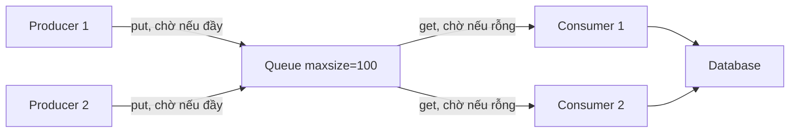

# Synchronization

## 1. Tổng quan

Synchronization là tập hợp các cơ chế giúp nhiều tác vụ đồng thời **phối hợp** với nhau: loại trừ lẫn nhau khi truy cập trạng thái chung, chờ một điều kiện xảy ra, giới hạn số tác vụ cùng làm một việc, hoặc truyền dữ liệu an toàn.

Python có bốn "họ" primitive, mỗi họ chỉ hoạt động trong phạm vi của nó:

| Họ | Module | Phạm vi |
|---|---|---|
| Thread | `threading`, `queue` | Các thread trong **một process** |
| AsyncIO | `asyncio` | Các coroutine trên **một event loop** |
| Process | `multiprocessing` | Các process trên **một máy** |
| Phân tán | PostgreSQL lock, Redis, ZooKeeper/etcd | Nhiều máy, nhiều service |

Dùng primitive sai phạm vi là lỗi phổ biến: `asyncio.Lock` không bảo vệ gì giữa các thread; `threading.Lock` không bảo vệ gì giữa các pod.

## 2. Mental Model

> Mọi primitive đồng bộ đều trả lời một câu hỏi: "ai được đi tiếp, và những người còn lại chờ ở đâu?"

- **Lock**: một người đi qua cửa tại một thời điểm.
- **Semaphore**: tối đa N người trong phòng.
- **Event**: tất cả chờ cho tới khi đèn xanh bật.
- **Condition**: chờ cho tới khi một điều kiện cụ thể thành đúng, và được đánh thức khi có người thay đổi trạng thái.
- **Queue**: không chia sẻ trạng thái, chỉ chuyền đồ qua ô cửa; ô cửa có giới hạn thì người chuyền phải chờ.

## 3. Vì sao cần?

- Bảo vệ invariant khi nhiều tác vụ đọc/ghi trạng thái chung ([Race Condition](race-condition.md)).
- Giới hạn concurrency tới tài nguyên có hạn (connection, API có rate limit).
- Phối hợp producer/consumer với backpressure.
- Chờ sự kiện: service sẵn sàng, dữ liệu đã tải xong, yêu cầu shutdown.

## 4. Các primitive trong `threading`

| Primitive | Hành vi | Dùng khi |
|---|---|---|
| `Lock` | Một chủ sở hữu; `acquire` block tới khi được | Bảo vệ đoạn code critical ngắn |
| `RLock` | Thread đang giữ có thể acquire lại (đếm số lần) | Code đệ quy hoặc method gọi method cùng lock |
| `Semaphore(n)` | Tối đa n lượt giữ cùng lúc | Giới hạn concurrency |
| `BoundedSemaphore(n)` | Như trên, báo lỗi nếu release nhiều hơn acquire | Phát hiện bug release thừa |
| `Event` | Cờ boolean; `wait()` block tới khi `set()` | Tín hiệu một lần: sẵn sàng, dừng |
| `Condition` | Lock + hàng chờ; `wait()` nhả lock và ngủ, `notify()` đánh thức | Chờ điều kiện phức tạp trên trạng thái chung |
| `Barrier(n)` | n thread chờ nhau tại một điểm | Đồng bộ các pha tính toán |
| `queue.Queue(maxsize)` | Hàng đợi thread-safe, `put` block khi đầy | Producer/consumer, truyền việc giữa thread |

Trong CPython, `acquire()` khi phải chờ sẽ **nhả GIL** (chờ trên primitive của OS), nên thread chờ lock không chặn thread khác chạy Python code.

### Condition: luôn chờ trong vòng lặp

```python
import threading

class BoundedBuffer:
    def __init__(self, capacity: int):
        self._items: list = []
        self._capacity = capacity
        self._cond = threading.Condition()

    def put(self, item) -> None:
        with self._cond:
            while len(self._items) >= self._capacity:   # while, không phải if
                self._cond.wait()
            self._items.append(item)
            self._cond.notify_all()

    def get(self):
        with self._cond:
            while not self._items:
                self._cond.wait()
            item = self._items.pop(0)
            self._cond.notify_all()
            return item
```

`wait()` phải nằm trong `while` vì khi được đánh thức, điều kiện có thể đã bị thread khác làm sai lại (hoặc thread bị đánh thức giả — spurious wakeup). Trong thực tế, `queue.Queue` đã cài đặt đúng pattern này; hãy dùng nó thay vì tự viết.

## 5. Các primitive trong `asyncio`

`asyncio.Lock`, `Event`, `Condition`, `Semaphore`, `BoundedSemaphore`, `Barrier` (3.11+), `Queue` có API tương tự nhưng:

- Chỉ dùng được giữa các coroutine **trên cùng một event loop**.
- **Không thread-safe**.
- Chờ bằng `await`, nhường quyền cho coroutine khác thay vì block thread.

```python
sem = asyncio.Semaphore(10)

async def call_partner(payload):
    async with sem:                    # tối đa 10 lời gọi đồng thời
        return await client.post("/v1/score", json=payload, timeout=2.0)
```

Semaphore là công cụ chính để giới hạn fan-out trong code async. Xem [AsyncIO](asyncio.md#giới-hạn-concurrency).

`asyncio.Queue(maxsize=N)`: `await queue.put()` tạm dừng producer khi đầy — backpressure tự nhiên giữa coroutine.

## 6. Luồng xử lý: producer/consumer với hàng đợi có giới hạn



Diễn giải:

1. Producer đặt việc vào queue; consumer lấy ra xử lý.
2. Khi consumer chậm (DB chậm), queue đầy dần.
3. Khi queue đầy, `put` block producer — tốc độ sinh việc tự động giảm xuống bằng tốc độ tiêu thụ. Đây là **backpressure**.
4. Không có `maxsize`, queue lớn vô hạn: memory tăng, và việc nằm trong queue càng lâu càng "cũ".
5. Producer và consumer không chia sẻ trạng thái nào ngoài queue — không cần lock cho dữ liệu nghiệp vụ.

Nguyên lý "chia sẻ bằng cách truyền message, không truyền message bằng cách chia sẻ memory" giúp tránh phần lớn lỗi đồng bộ. Xem [Backpressure](../10-distributed-systems/backpressure.md).

## 7. Internals: lock bên trong connection pool

Connection pool (SQLAlchemy `QueuePool`, asyncpg pool) là một ví dụ thực tế của synchronization:

- Bên trong là một queue các connection rảnh, được bảo vệ bởi lock/condition.
- `checkout`: lấy connection; nếu hết và chưa đạt `max_overflow`, tạo mới; nếu đạt giới hạn, **chờ** trên condition tới khi có connection được trả hoặc hết `pool_timeout`.
- `checkin`: trả connection vào queue và `notify` một thread/coroutine đang chờ.

Vì vậy "chờ connection pool" là một dạng chờ lock: nó xuất hiện dưới dạng latency, không phải CPU. Xem [Connection Pooling](../04-database-postgresql/connection-pooling.md).

## 8. Ví dụ: single-flight cho cache trong AsyncIO

Nhiều coroutine cùng cần một key chưa có trong cache: chỉ một coroutine nên tải, số còn lại chờ kết quả.

```python
import asyncio

class SingleFlight:
    def __init__(self):
        self._inflight: dict[str, asyncio.Task] = {}

    async def do(self, key: str, loader):
        task = self._inflight.get(key)
        if task is None:
            task = asyncio.create_task(loader())
            self._inflight[key] = task
            task.add_done_callback(lambda _t: self._inflight.pop(key, None))
        return await task
```

Không cần lock vì giữa việc kiểm tra `self._inflight.get(key)` và gán `self._inflight[key]` không có `await` — trên một event loop, đoạn này không bị chen ngang. Đây là điểm mạnh của cooperative scheduling. Trong code đa thread, đoạn tương tự **cần** lock.

## 9. Hành vi trong production

- **Lock contention**: nhiều tác vụ chờ cùng một lock làm throughput giảm về mức tuần tự. Dấu hiệu: latency tăng khi concurrency tăng, CPU thấp.
- **Giữ lock qua I/O**: `with lock: requests.get(...)` hoặc `async with lock: await http_call()` biến lock thành nút cổ chai tuần tự hóa mọi request đi qua nó.
- **Lock toàn cục trong thư viện**: logging handler có lock; ghi log đồng bộ ra file/network chậm làm mọi thread chờ nhau. Dùng `QueueHandler`/`QueueListener` để ghi log bất đồng bộ.
- **Nhiều pod**: mọi primitive trong process chỉ có tác dụng trong pod đó. Đồng bộ giữa pod phải qua database (row lock, advisory lock, constraint) hoặc hệ thống điều phối.

## 10. Failure Modes

| Failure | Nguyên nhân | Dấu hiệu |
|---|---|---|
| Deadlock | Chờ vòng tròn giữa các lock | Thread/coroutine treo vĩnh viễn, CPU 0% |
| Contention | Lock thô, giữ lâu | Throughput không tăng khi thêm worker |
| Lock không có tác dụng | Dùng primitive sai phạm vi | Race condition vẫn xảy ra |
| Quên release | Acquire không dùng `with` và có exception | Mọi tác vụ sau đó treo |
| Queue phình | Không có `maxsize` | Memory tăng, việc cũ bị xử lý muộn |
| Lost wakeup | `notify` trước khi bên kia `wait`, kiểm tra điều kiện bằng `if` | Consumer ngủ mãi dù có việc |

## 11. Trade-offs

| Lựa chọn | Lợi ích | Chi phí |
|---|---|---|
| Lock thô (một lock cho cả cấu trúc) | Đơn giản, khó sai | Contention cao |
| Lock mịn (nhiều lock nhỏ) | Concurrency cao | Phức tạp, rủi ro deadlock |
| Message passing (queue) | Không chia sẻ trạng thái, dễ lý luận | Thêm độ trễ, cần thiết kế lại luồng dữ liệu |
| Immutable data | Không cần đồng bộ khi đọc | Tạo object mới khi thay đổi |
| Atomic tại storage | Đúng đắn giữa nhiều process/pod | Phụ thuộc khả năng của database |

## 12. Sai lầm thường gặp

- Dùng `asyncio.Lock` giữa thread hoặc `threading.Lock` trong coroutine (block cả event loop).
- Giữ lock trong lúc chờ network.
- Kiểm tra điều kiện của `Condition` bằng `if` thay vì `while`.
- Acquire/release thủ công thay vì `with`.
- Nghĩ lock trong process bảo vệ được dữ liệu trong database khi có nhiều instance.
- Tự viết producer/consumer thay vì dùng `queue.Queue`/`asyncio.Queue`.

## 13. Cách debug

- `py-spy dump`: nhiều thread nằm ở `acquire` hoặc `wait` cùng một chỗ → contention hoặc deadlock.
- Đo thời gian chờ lock: bọc acquire bằng timer và xuất metric cho các lock quan trọng.
- `acquire(timeout=...)` trong môi trường staging để biến treo vô hạn thành lỗi có traceback.
- Với asyncio, debug mode cảnh báo khi primitive được dùng từ loop khác.
- Metric queue: độ dài, thời gian việc nằm trong queue (queue age).

## 14. Best Practices

- Chọn primitive đúng phạm vi: thread, loop, process, hay phân tán.
- Ưu tiên queue và immutable data; dùng lock khi thực sự phải chia sẻ trạng thái.
- Giữ critical section ngắn, không chứa I/O hoặc `await` tới dịch vụ ngoài.
- Luôn dùng `with`/`async with` cho lock.
- Mọi queue và pool đều có giới hạn và timeout khi chờ.
- Đồng bộ giữa instance bằng cơ chế của storage (constraint, row lock, atomic update).

## 15. Tóm tắt

- Primitive đồng bộ quyết định ai đi tiếp và ai chờ ở đâu: lock, semaphore, event, condition, queue.
- Mỗi họ primitive chỉ có tác dụng trong phạm vi của nó: thread, event loop, process, hay hệ thống phân tán.
- Queue có giới hạn vừa truyền dữ liệu an toàn vừa tạo backpressure.
- Lock giữ qua I/O là nguồn contention phổ biến nhất.
- Trong asyncio, đoạn code không có `await` không bị chen ngang — có thể tránh lock trong nhiều trường hợp.

## Liên quan

- [Race Condition](race-condition.md)
- [Deadlock](deadlock.md)
- [Threading](threading.md)
- [AsyncIO](asyncio.md)
- [Backpressure](../10-distributed-systems/backpressure.md)
- [Distributed Lock](../10-distributed-systems/distributed-lock.md)
