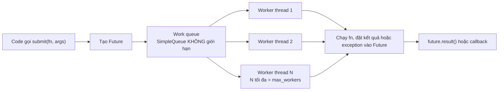
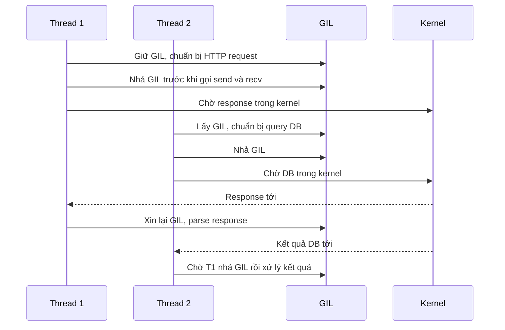

# Threading

## 1. Tổng quan

Thread là đơn vị thực thi do **hệ điều hành** lập lịch. Các thread trong cùng một process chia sẻ toàn bộ memory (heap, biến global, file descriptor) nhưng mỗi thread có call stack riêng. Trong CPython, mỗi `threading.Thread` là một OS thread thật (pthread trên Linux/macOS).

Thread trong Python có một đặc điểm riêng: vì [GIL](gil.md), tại một thời điểm chỉ một thread chạy Python bytecode. Do đó thread trong Python là công cụ cho **concurrency với I/O blocking**, không phải công cụ để tăng tốc tính toán CPU bằng Python thuần.

Thread xuất hiện ở khắp nơi trong backend Python dù bạn không tạo trực tiếp: threadpool chạy endpoint `def` của FastAPI, worker `gthread` của Gunicorn, `asyncio.to_thread`, thread nền của thư viện logging/metrics/OpenTelemetry exporter, feeder thread của `multiprocessing.Queue`.

## 2. Mental Model

> Nhiều người cùng làm việc trong một căn phòng, dùng chung mọi đồ đạc. Giao tiếp rất rẻ (chỉ cần đặt đồ lên bàn), nhưng hai người cùng với lấy một món đồ thì phải có quy tắc. Và trong CPython, cả phòng chỉ có một cây bút (GIL) để viết.

- Chia sẻ memory giúp giao tiếp rẻ và cũng là nguồn gốc của [race condition](race-condition.md).
- OS có thể chuyển thread **bất kỳ lúc nào** (preemptive), không chỉ tại điểm bạn chọn như `await`.
- Thread chờ I/O nhả GIL, nên nhiều thread chờ I/O chồng lên nhau hiệu quả.

## 3. Vì sao cần thread?

- Dùng thư viện **blocking** (psycopg2, `requests`, SDK cloud đồng bộ, file I/O) mà vẫn phục vụ nhiều việc đồng thời.
- Chạy việc nền trong process: gửi metric theo lô, heartbeat, flush log buffer.
- Cô lập code blocking khỏi event loop (`asyncio.to_thread`).
- Tận dụng thư viện native nhả GIL (NumPy, nén, hash, xử lý ảnh) để có parallelism thật trong một process.

## 4. Cơ chế hoạt động

### Vòng đời

```python
import threading

def worker(job_id: int) -> None:
    ...

t = threading.Thread(target=worker, args=(1,), name="worker-1", daemon=False)
t.start()      # tạo OS thread, bắt đầu chạy worker
t.join()       # chờ thread kết thúc
```

- `start()` tạo OS thread, cấp stack (kích thước mặc định do OS quyết định, thường 8 MB bộ nhớ ảo trên Linux, chỉ phần thực sự dùng mới chiếm RAM), tạo thread state cho interpreter.
- `daemon=True`: process không chờ thread này khi thoát; thread bị dừng đột ngột, `finally` không chạy. Không dùng daemon thread cho việc cần hoàn tất (ghi file, commit).
- Không có cách an toàn để **kill** một thread từ bên ngoài. Dừng thread phải hợp tác: thread tự kiểm tra một `threading.Event` và thoát.

### Exception trong thread

Exception không bắt trong thread **không** lan về main thread. Nó được chuyển tới `threading.excepthook` (mặc định in traceback ra stderr) rồi thread chết lặng lẽ. Nếu thread đó là worker xử lý queue, công việc dừng mà không ai biết. Với `ThreadPoolExecutor`, exception được lưu trong `Future` và chỉ xuất hiện khi gọi `future.result()`.

## 5. ThreadPoolExecutor bên trong



Diễn giải:

1. `submit` tạo một `Future` và đặt work item vào **work queue**.
2. Worker thread được tạo dần (khi cần) cho tới `max_workers`.
3. Mỗi worker lặp: lấy work item, chạy, ghi kết quả vào Future.
4. Caller lấy kết quả qua `future.result()` (block) hoặc `add_done_callback`.

Điểm nguy hiểm: work queue **không có giới hạn**. Nếu submit nhanh hơn tốc độ xử lý, queue phình ra vô hạn — memory tăng, latency của mỗi việc tăng (chờ trong queue), và khi process bị restart, mọi việc trong queue mất. Bọc `submit` bằng `threading.BoundedSemaphore` hoặc dùng `queue.Queue(maxsize=...)` tự quản lý để có backpressure.

`max_workers` mặc định (3.8+) là `min(32, os.cpu_count() + 4)` — phù hợp I/O-bound nhẹ, không phải quy luật.

## 6. Luồng xử lý: nhiều thread chờ I/O



Diễn giải:

1. Thread 1 chỉ giữ GIL trong lúc chạy Python code để chuẩn bị request.
2. Trước syscall blocking, CPython nhả GIL; Thread 1 chờ trong kernel.
3. Thread 2 lấy GIL và làm tương tự.
4. Hai khoảng chờ chồng lên nhau — đây là nguồn lợi của thread với I/O.
5. Khi dữ liệu về, mỗi thread phải xin lại GIL; phần xử lý Python của chúng vẫn tuần tự.

## 7. Ví dụ: gọi nhiều API đồng bộ với giới hạn

```python
from concurrent.futures import ThreadPoolExecutor, as_completed
import requests

session = requests.Session()

def fetch(url: str) -> dict:
    response = session.get(url, timeout=(1.0, 3.0))     # connect, read timeout
    response.raise_for_status()
    return response.json()

def fetch_all(urls: list[str]) -> list[dict]:
    results = []
    with ThreadPoolExecutor(max_workers=16, thread_name_prefix="fetch") as pool:
        futures = {pool.submit(fetch, u): u for u in urls}
        for future in as_completed(futures):
            results.append(future.result())               # exception nổi lên ở đây
    return results
```

- Mỗi lời gọi có timeout; không có timeout, một service chậm giữ thread vô thời hạn.
- `max_workers=16` giới hạn số kết nối đồng thời tới service đích.
- `requests.Session` giữ connection pool (urllib3). Dùng chung một Session giữa thread thường hoạt động nhưng Session không được tài liệu hóa là thread-safe hoàn toàn; phương án an toàn là một Session mỗi thread hoặc dùng client được thiết kế cho concurrency.

## 8. Hành vi trong production

**FastAPI chạy endpoint `def` trong threadpool.** Threadpool của AnyIO mặc định có 40 token. Endpoint `def` thứ 41 đồng thời phải chờ. Nếu mỗi endpoint giữ thread 500 ms vì chờ DB chậm, throughput tối đa của đường sync là 80 request/giây mỗi worker, bất kể CPU còn trống. Xem [Sync vs Async Endpoint](../03-fastapi/sync-vs-async-endpoint.md).

**Object không thread-safe.** SQLAlchemy `Session`, connection của DB driver, nhiều client SDK **không** được dùng đồng thời từ nhiều thread. Quy tắc: mỗi thread (hoặc mỗi request) có session riêng; chỉ engine/pool là dùng chung.

**`threading.local` cho state theo thread.** Hữu ích với framework sync (Flask, Django) để lưu request hiện tại. Không dùng được cho code async vì mọi coroutine chạy trên cùng thread — dùng `contextvars`.

**Fork và thread không trộn lẫn.** `fork()` chỉ sao chép thread gọi fork. Nếu thread khác đang giữ một lock (logging, allocator, lock của thư viện) tại thời điểm fork, lock đó bị khóa vĩnh viễn trong process con — process con treo khi cố lấy lock. Đây là lý do:

> **Ghi chú version:** Từ Python 3.12, `os.fork()` trong process có nhiều thread phát `DeprecationWarning`. Từ 3.14, start method mặc định của `multiprocessing` trên Linux đổi từ `fork` sang `forkserver`. macOS dùng `spawn` từ 3.8.

**Thread nền của thư viện.** OpenTelemetry exporter, Sentry transport, Kafka client, Prometheus pushgateway client đều có thread nền. Khi process tắt, chúng cần được flush/shutdown, nếu không dữ liệu trong buffer bị mất.

## 9. Khi scale lên thì chuyện gì xảy ra?

Theo **Little's Law**: số việc đang xử lý đồng thời = throughput × thời gian mỗi việc.

| Tải | Latency mỗi request | Thread cần | Nhận xét |
|---|---|---|---|
| 100 RPS | 100 ms | 10 | Dễ dàng |
| 1.000 RPS | 100 ms | 100 | Vẫn ổn trong vài worker |
| 1.000 RPS | 1 s (dependency chậm) | 1.000 | Thread tràn, threadpool bão hòa, request xếp hàng |
| 10.000 RPS | 100 ms | 1.000 | Chi phí context switch, GIL contention, memory stack; async thường phù hợp hơn |

Điểm quan trọng: khi dependency chậm đi, số thread cần tăng tỷ lệ thuận. Pool thread có giới hạn sẽ bão hòa và biến sự chậm của một dependency thành sự chậm của mọi request dùng chung pool. Giới hạn thread theo từng dependency (bulkhead) để cô lập. Xem [Bulkhead](../10-distributed-systems/bulkhead.md).

## 10. Failure Modes

| Failure | Nguyên nhân | Dấu hiệu |
|---|---|---|
| Worker thread chết lặng lẽ | Exception không bắt trong thread | Queue ngừng được xử lý, chỉ có traceback trên stderr |
| Threadpool bão hòa | Việc chậm (dependency không timeout) chiếm hết thread | Latency tăng đồng loạt, CPU thấp |
| Memory tăng | Submit vào executor không giới hạn | RSS tăng khi tải cao, work queue dài |
| Process con treo sau fork | Lock bị giữ bởi thread khác lúc fork | Worker mới không phản hồi |
| Dữ liệu hỏng | Dùng chung object không thread-safe | Lỗi ngẫu nhiên dưới tải |
| Process không thoát | Non-daemon thread không bao giờ kết thúc | Shutdown treo tới khi bị SIGKILL |

## 11. Trade-offs

| Tiêu chí | Thread | AsyncIO | Process |
|---|---|---|---|
| Dùng thư viện blocking | Có | Không (phải bọc) | Có |
| Chia sẻ memory | Có, rẻ | Có | Không |
| Số tác vụ đồng thời | Hàng trăm–vài nghìn | Hàng chục nghìn | Hàng chục |
| Parallelism CPU Python thuần | Không (có GIL) | Không | Có |
| Rủi ro race condition | Cao (chuyển bất kỳ lúc nào) | Thấp hơn (chỉ tại `await`) | Thấp (không chia sẻ) |

## 12. Sai lầm thường gặp

- Dùng thread để tăng tốc tính toán Python thuần.
- Không đặt timeout cho I/O trong thread.
- Dùng executor không giới hạn như một hàng đợi công việc bền vững.
- Chia sẻ Session ORM hoặc connection giữa thread.
- Dùng daemon thread cho việc cần hoàn tất.
- Fork process trong khi có thread đang chạy.

## 13. Khi nào nên dùng?

- Service dùng thư viện đồng bộ, concurrency vừa phải.
- Offload code blocking khỏi event loop.
- Việc nền nhẹ trong process (flush, heartbeat).
- Thư viện native nhả GIL cần chạy song song.

## 14. Khi nào không nên dùng?

- CPU-bound Python thuần → [Multiprocessing](multiprocessing.md) hoặc task queue.
- Hàng chục nghìn kết nối đồng thời → [AsyncIO](asyncio.md).
- Công việc cần bền vững qua restart → queue ngoài process ([Celery](../07-celery/README.md)).

## 15. Cách debug trong production

- `py-spy dump --pid <pid>`: stack của mọi thread; thread đang chờ I/O nằm ở `recv`/`select`, thread bị treo nằm ở `acquire` của lock.
- `threading.enumerate()` qua endpoint debug nội bộ để đếm thread và xem tên (đặt `name`/`thread_name_prefix` rõ ràng).
- `top -H -p <pid>` để xem CPU theo thread.
- `faulthandler.dump_traceback_later(timeout, repeat=True)` để tự động in stack mọi thread nếu process không tiến triển.
- Metric: số thread bận, độ dài queue của executor, thời gian chờ trong queue.

## 16. Best Practices

- Mọi I/O trong thread có timeout.
- Giới hạn số việc đang chờ trong executor; không dùng executor làm queue bền vững.
- Đặt tên thread; cài `threading.excepthook` hoặc luôn lấy `future.result()` để lỗi không biến mất.
- Không chia sẻ object không thread-safe; ưu tiên truyền dữ liệu qua `queue.Queue`.
- Dừng thread bằng `Event` hợp tác; shutdown executor và thread nền khi process tắt.
- Tách pool theo dependency để một dependency chậm không chiếm hết thread.

## 17. Tóm tắt

- Thread là OS thread, chia sẻ memory, được OS lập lịch preemptive.
- Trong CPython, thread cho concurrency I/O tốt nhưng không cho parallelism bytecode vì GIL.
- ThreadPoolExecutor có work queue không giới hạn; cần tự tạo backpressure.
- Exception trong thread không lan về caller; phải lấy qua Future hoặc excepthook.
- Số thread cần = throughput × latency; dependency chậm làm pool bão hòa.
- Fork trong process nhiều thread có thể gây treo; Python 3.14 đổi start method mặc định trên Linux sang `forkserver`.

## Liên quan

- [Global Interpreter Lock](gil.md)
- [Multiprocessing](multiprocessing.md)
- [Synchronization](synchronization.md)
- [Race Condition](race-condition.md)
- [Deadlock](deadlock.md)
- [Sync vs Async Endpoint](../03-fastapi/sync-vs-async-endpoint.md)
