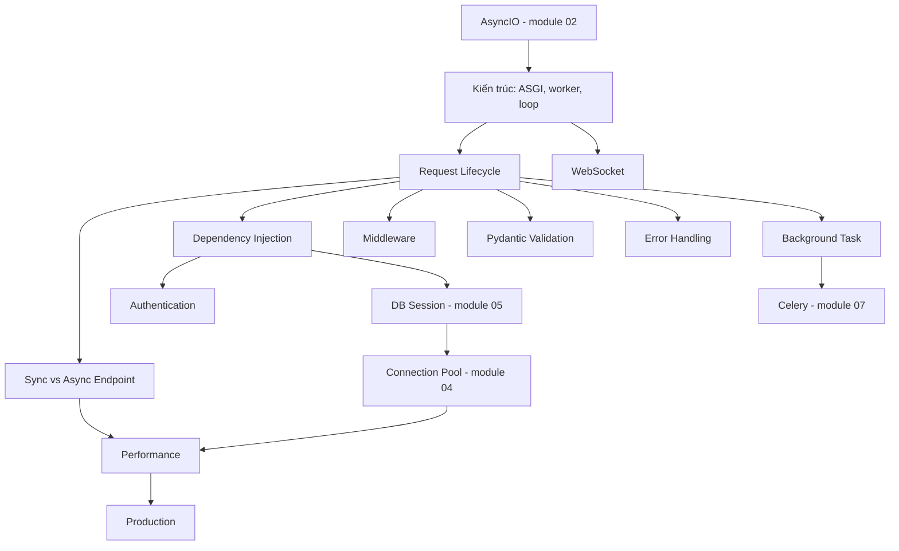

# 03 — FastAPI

## Module này học gì?

FastAPI như một hệ thống chạy thật, không phải một tutorial API: ASGI và Uvicorn, mô hình worker process, event loop và threadpool bên trong worker, vòng đời một request từ socket tới database và ngược lại, dependency injection, middleware, validation bằng Pydantic, xử lý lỗi, WebSocket, background task, hiệu năng và vận hành production.

## Tại sao cần học?

Phần lớn sự cố của service FastAPI không nằm ở cú pháp mà ở tương tác giữa các tầng: endpoint `async def` gọi thư viện blocking, dependency `def` làm bão hòa threadpool, số worker nhân lên làm cạn connection database, keep-alive lệch với load balancer gây 502, deploy làm mất request vì thiếu graceful shutdown. Module này giải thích các tầng đó để bạn dự đoán được hành vi dưới tải.

## Thứ tự nên đọc

1. [Kiến trúc FastAPI: ASGI, Uvicorn, Gunicorn](architecture.md)
2. [Request Lifecycle](request-lifecycle.md)
3. [Sync và Async Endpoint](sync-vs-async-endpoint.md)
4. [Dependency Injection](dependency-injection.md)
5. [Middleware](middleware.md)
6. [Validation với Pydantic](validation-pydantic.md)
7. [Error Handling](error-handling.md)
8. [Authentication và Authorization](authentication.md)
9. [Background Task](background-task.md)
10. [WebSocket](websocket.md)
11. [Performance](performance.md)
12. [Vận hành production](production-best-practices.md)

## Các concept phụ thuộc nhau thế nào?



Cách đọc diagram:

1. Kiến trúc (ASGI, worker, event loop) dựa trên AsyncIO của module 02.
2. Request lifecycle là trục chính; các file còn lại mô tả từng tầng trên trục đó.
3. Sync vs async và dependency injection nối trực tiếp tới session database và connection pool — nơi quyết định hiệu năng khi scale.
4. Background task dẫn sang Celery khi cần độ tin cậy.
5. Performance và production tổng hợp mọi thứ phía trên.

Chuỗi phụ thuộc quan trọng nhất:

```text
AsyncIO
↓
FastAPI Async (sync vs async endpoint)
↓
Database async driver (Async SQLAlchemy)
↓
Connection Pool
```

## File quan trọng nhất

[Request Lifecycle](request-lifecycle.md), [Sync và Async Endpoint](sync-vs-async-endpoint.md) và [Performance](performance.md).

---

[← Python Concurrency](../02-python-concurrency/README.md) · [Knowledge map](../../README.md) · [PostgreSQL →](../04-database-postgresql/README.md)
