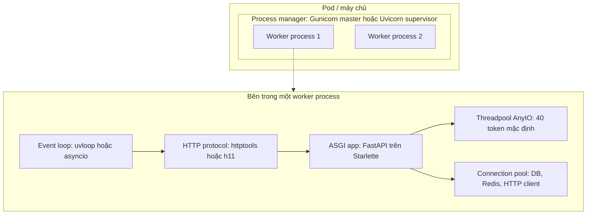
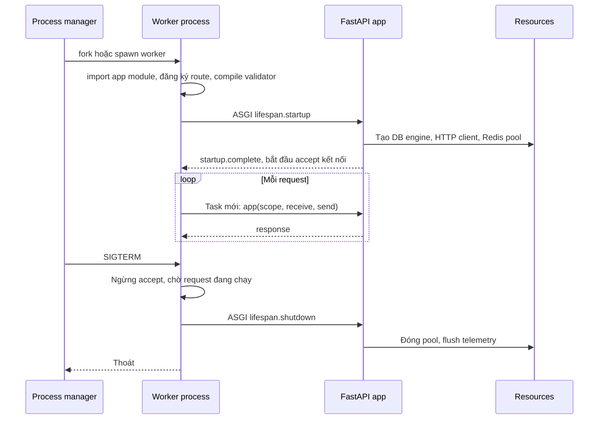

# Kiến trúc FastAPI: ASGI, Uvicorn, Gunicorn và worker model

## 1. Tổng quan

FastAPI không phải một web server. Nó là một **ASGI application framework** được ghép từ ba phần:

| Thành phần | Vai trò |
|---|---|
| **Starlette** | Tầng web: routing, request/response, middleware, WebSocket, background task, lifespan |
| **Pydantic** | Parse và validate dữ liệu, serialize response, sinh JSON Schema |
| **FastAPI** | Dependency injection, đọc type hint để gắn validation vào endpoint, sinh OpenAPI |

Để chạy, FastAPI cần một **ASGI server** — phổ biến nhất là **Uvicorn** — chịu trách nhiệm mở socket, nói giao thức HTTP, quản lý event loop. Để dùng nhiều core, cần nhiều **worker process**, do Uvicorn (`--workers`) hoặc **Gunicorn** quản lý.

Hiểu ranh giới giữa các tầng này quyết định việc bạn cấu hình timeout ở đâu, capacity bị giới hạn ở đâu, và lỗi xuất phát từ tầng nào.

## 2. Mental Model



Diễn giải:

1. Một pod chạy một **process manager** và nhiều **worker process**. Mỗi worker là một process Python độc lập với GIL riêng — đây là cách dùng nhiều core.
2. Trong mỗi worker có đúng **một event loop** chạy trên main thread.
3. Protocol HTTP (httptools/h11) parse byte từ socket thành sự kiện ASGI.
4. ASGI app (FastAPI) xử lý request trên event loop.
5. Endpoint và dependency khai báo `def` (sync) được đẩy sang **threadpool** của AnyIO để không block loop.
6. Mỗi worker có **connection pool riêng** — không chia sẻ giữa các worker.

Ba ranh giới capacity khác nhau:

- **Worker process** giới hạn CPU (mỗi worker tối đa một core cho Python code).
- **Event loop** giới hạn số request async đồng thời gần như không giới hạn, nhưng chỉ khi không bị block.
- **Threadpool** và **connection pool** giới hạn cứng số việc sync và số query đồng thời.

## 3. Vì sao cần ASGI?

WSGI (PEP 3333, chuẩn của Flask/Django truyền thống) định nghĩa application là một function đồng bộ: nhận request, trả response. Một request chiếm một thread/process suốt vòng đời. Mô hình này không phù hợp với:

- WebSocket, Server-Sent Events, long polling — kết nối sống lâu, hai chiều.
- Hàng nghìn request đồng thời chủ yếu chờ I/O.
- HTTP/2, streaming request/response.

**ASGI** (Asynchronous Server Gateway Interface) định nghĩa application là một **coroutine** giao tiếp với server bằng các sự kiện bất đồng bộ, hỗ trợ cả HTTP, WebSocket và sự kiện vòng đời (lifespan).

## 4. Giao diện ASGI

Một ASGI application là một callable async:

```python
async def app(scope: dict, receive, send) -> None:
    ...
```

| Tham số | Nội dung |
|---|---|
| `scope` | Dict mô tả kết nối: `type` (`http`, `websocket`, `lifespan`), `method`, `path`, `query_string`, `headers` (list cặp bytes), `client`, `server`, `scheme`, `root_path`, `state` |
| `receive` | Coroutine trả về sự kiện tiếp theo từ client: `http.request` (một phần body, cờ `more_body`), `http.disconnect`, `websocket.receive`... |
| `send` | Coroutine gửi sự kiện tới client: `http.response.start` (status, headers), `http.response.body` (body, `more_body`), `websocket.send`... |

Ví dụ ASGI "thô", không framework:

```python
async def app(scope, receive, send):
    if scope["type"] != "http":
        return
    body = b""
    while True:
        event = await receive()
        body += event.get("body", b"")
        if not event.get("more_body"):
            break
    await send({"type": "http.response.start", "status": 200,
                "headers": [(b"content-type", b"text/plain")]})
    await send({"type": "http.response.body", "body": b"ok"})
```

Mọi thứ FastAPI làm — routing, validation, DI — là các lớp bọc quanh giao diện này. Middleware ASGI cũng chỉ là một ASGI app bọc một ASGI app khác.

### Lifespan

Khi worker khởi động, server gửi scope `type="lifespan"` với sự kiện `lifespan.startup`; khi tắt, gửi `lifespan.shutdown`. FastAPI biến giao thức này thành hàm `lifespan` dạng [async context manager](../01-python-core/context-manager.md) — nơi tạo và đóng connection pool, HTTP client, tải model.

## 5. Uvicorn: ASGI server

Uvicorn đảm nhận:

- Mở socket, `listen` với backlog (mặc định 2048), `accept` kết nối.
- Chạy event loop: `uvloop` nếu được cài (nhanh hơn), không thì `asyncio`.
- Parse HTTP bằng `httptools` (binding C của parser của Node.js) hoặc `h11` (Python thuần).
- Quản lý keep-alive (`--timeout-keep-alive`, mặc định 5 giây), giới hạn concurrency (`--limit-concurrency`), graceful shutdown (`--timeout-graceful-shutdown`).
- Tạo scope và gọi ASGI app cho mỗi request trong một Task riêng.
- Đọc header `X-Forwarded-*` khi `--proxy-headers` được bật và IP của proxy nằm trong `--forwarded-allow-ips`.

## 6. Process model: Uvicorn workers và Gunicorn

| Cách chạy | Mô tả | Khi phù hợp |
|---|---|---|
| `uvicorn app:app` | Một process, một event loop | Local, hoặc container 1 worker được orchestrator nhân bản |
| `uvicorn app:app --workers 4` | Uvicorn tự fork và giám sát worker | Đơn giản, không cần thêm dependency |
| `gunicorn app:app -k uvicorn_worker.UvicornWorker -w 4` | Gunicorn làm process manager, mỗi worker chạy Uvicorn | Cần tính năng của Gunicorn: `--max-requests`, worker timeout/heartbeat, hook `post_fork`, reload graceful |

> **Ghi chú version:** Worker class `uvicorn.workers.UvicornWorker` trong gói uvicorn đã bị đánh dấu deprecated; dùng gói `uvicorn-worker` (`uvicorn_worker.UvicornWorker`). Tính năng quản lý process của Uvicorn cũng được cải thiện đáng kể ở các bản gần đây. Kiểm tra tài liệu của version đang dùng.

### Một container một worker hay nhiều worker?

Trên Kubernetes có hai trường phái:

- **1 worker/pod, nhiều pod**: đơn giản, metric và memory rõ ràng theo pod, HPA điều khiển trực tiếp. Tốn overhead mỗi pod (sidecar, memory nền).
- **N worker/pod**: tận dụng CPU của pod lớn, chia sẻ memory copy-on-write khi preload. Pod chết thì mất N worker.

Cả hai đều hợp lệ. Điều quan trọng là **tổng số worker × pool size** không vượt giới hạn connection của database, và CPU limit của pod khớp với số worker.

### Gunicorn worker timeout với async worker

Gunicorn master theo dõi heartbeat của worker; worker không báo hiệu trong `--timeout` giây (mặc định 30) sẽ bị kill (`WORKER TIMEOUT`). Với UvicornWorker, heartbeat được gửi từ event loop. Nếu event loop bị block (CPU nặng, code sync) quá 30 giây, worker bị kill giữa chừng — mọi request đang xử lý trên worker đó bị mất. Đây là triệu chứng phổ biến của blocking code trong `async def`.

## 7. Bên trong một worker: các vòng đời lồng nhau



Diễn giải:

1. **Process lifetime**: worker được tạo; import module chạy mọi code module-level và decorator — đăng ký route, sinh schema Pydantic.
2. **Application lifetime**: `lifespan` startup tạo tài nguyên dùng chung. Chỉ sau khi startup xong, worker mới nhận request.
3. **Request lifetime**: mỗi request là một Task riêng trên event loop, với dependency, session, trace context riêng.
4. **Shutdown**: nhận SIGTERM, worker ngừng nhận kết nối mới, chờ request đang chạy (tới graceful timeout), chạy lifespan shutdown, rồi thoát.

Ba vòng đời này quyết định **scope của tài nguyên**: engine/pool/client sống theo application; session/transaction sống theo request; không có gì nên sống theo module import.

## 8. Ví dụ: cấu trúc một ứng dụng

```python
from contextlib import asynccontextmanager
from typing import Annotated
from fastapi import Depends, FastAPI, Request
from sqlalchemy.ext.asyncio import AsyncSession, async_sessionmaker, create_async_engine

@asynccontextmanager
async def lifespan(app: FastAPI):
    engine = create_async_engine(settings.database_url, pool_size=10, max_overflow=5)
    app.state.sessionmaker = async_sessionmaker(engine, expire_on_commit=False)
    yield
    await engine.dispose()

app = FastAPI(lifespan=lifespan)

async def get_session(request: Request):
    async with request.app.state.sessionmaker() as session:
        yield session

SessionDep = Annotated[AsyncSession, Depends(get_session)]

@app.get("/claims/{claim_id}")
async def get_claim(claim_id: int, session: SessionDep):
    return await ClaimService(session).get(claim_id)
```

- Engine (và pool bên trong) sống theo application, tạo trong lifespan.
- Session sống theo request, tạo và đóng bởi dependency có `yield`.
- Endpoint mỏng; logic nghiệp vụ nằm trong service. Xem [Layered Architecture](../09-software-architecture/layered-architecture.md).

## 9. Hành vi trong production

- **Tổng connection**: `pods × workers × (pool_size + max_overflow)`. 20 pod × 4 worker × 15 = 1.200 connection — vượt xa `max_connections` mặc định (100) của PostgreSQL. Thường cần PgBouncer hoặc pool nhỏ hơn. Xem [Connection Pooling](../04-database-postgresql/connection-pooling.md).
- **Cache in-process nhân theo worker**: mỗi worker có bản cache riêng, hit ratio giảm khi số worker tăng, và invalidation chỉ tác động một worker.
- **Keep-alive giữa load balancer và Uvicorn**: nếu idle timeout của Uvicorn (5 giây) **ngắn hơn** của load balancer (ALB mặc định 60 giây), LB có thể gửi request vào một kết nối mà Uvicorn vừa đóng → lỗi 502 ngẫu nhiên. Đặt keep-alive của server dài hơn idle timeout của LB.
- **Proxy headers**: sau load balancer, `request.client.host` là IP của LB trừ khi cấu hình proxy headers đúng và chỉ tin IP của proxy.

## 10. Khi scale lên thì chuyện gì xảy ra?

| Tải | Điểm nghẽn xuất hiện | Hướng xử lý |
|---|---|---|
| 100 RPS | Hầu như không có | Một vài worker là đủ |
| 1.000 RPS | CPU của worker (validation, serialization), DB pool | Thêm worker/pod theo CPU, tối ưu query |
| 10.000 RPS | Tổng connection DB, dependency downstream, load balancer | PgBouncer, cache, read replica, rate limit |
| 20.000+ RPS | Database write, hot key, network | Sharding/partition, queue cho write, thiết kế lại |

Chi tiết theo từng bậc tải ở [FastAPI Performance](performance.md) và [High Traffic](../20-production-incidents/high-traffic.md).

## 11. Failure Modes

| Failure | Nguyên nhân | Dấu hiệu |
|---|---|---|
| `WORKER TIMEOUT` / worker bị kill | Event loop block quá timeout của Gunicorn | Log Gunicorn, request bị ngắt 502 |
| 502 ngẫu nhiên sau LB | Keep-alive của server ngắn hơn idle timeout của LB | 502 rải rác, không tương quan tải |
| Cạn connection DB | Số worker × pool vượt giới hạn DB | `too many connections`, pool timeout |
| Worker khởi động chậm | Import nặng, lifespan chờ dependency không timeout | Readiness fail, rolling update chậm |
| Mất request khi deploy | Không graceful shutdown, grace period ngắn | Lỗi tăng mỗi lần deploy |

## 12. Trade-offs

| Lựa chọn | Lợi ích | Chi phí |
|---|---|---|
| Uvicorn `--workers` | Ít thành phần | Ít tính năng quản lý hơn Gunicorn |
| Gunicorn + UvicornWorker | Heartbeat, max-requests, hook | Thêm một tầng, thêm cấu hình timeout |
| 1 worker/pod | Rõ ràng, HPA trực tiếp | Overhead mỗi pod |
| N worker/pod | Tận dụng pod lớn, chia sẻ memory | Blast radius lớn hơn, cần CPU limit khớp |
| uvloop + httptools | Nhanh hơn | Dependency C, không có trên Windows |

## 13. Sai lầm thường gặp

- Coi FastAPI là web server và tìm cấu hình timeout/keep-alive trong FastAPI.
- Tạo engine/client ở module level hoặc mỗi request thay vì trong lifespan.
- Đặt số worker theo công thức mà không đối chiếu CPU limit và connection budget.
- Chạy migration database trong lifespan startup của mọi worker.
- Không cấu hình proxy headers, log IP của load balancer thay vì client.

## 14. Cách debug trong production

- Log khởi động của worker: thời gian import, thời gian lifespan startup.
- `py-spy dump` trên từng worker PID khi một worker không phản hồi.
- Metric theo worker: request in-flight, loop lag, threadpool đang dùng, pool DB checkout.
- Log của Gunicorn master cho worker timeout/restart.
- So sánh log 502 của LB với log truy cập của Uvicorn để phân biệt lỗi kết nối và lỗi ứng dụng.

## 15. Best Practices

- Hiểu và cấu hình từng tầng đúng chỗ: timeout kết nối ở server/LB, timeout nghiệp vụ trong code.
- Tài nguyên dùng chung tạo trong lifespan; tài nguyên theo request tạo trong dependency có `yield`.
- Tính connection budget toàn hệ thống trước khi chọn số worker và pool size.
- Keep-alive của server dài hơn idle timeout của load balancer.
- Bật graceful shutdown và đặt grace period của orchestrator lớn hơn thời gian request dài nhất hợp lệ.
- Tách migration ra job riêng chạy trước deploy.

## 16. Tóm tắt

- FastAPI = Starlette (web) + Pydantic (dữ liệu) + DI và OpenAPI; chạy trên ASGI server như Uvicorn.
- ASGI là giao diện `app(scope, receive, send)` dựa trên sự kiện async, hỗ trợ HTTP, WebSocket và lifespan.
- Mỗi worker process có một event loop, một threadpool và các connection pool riêng.
- Process manager (Uvicorn hoặc Gunicorn) tạo nhiều worker để dùng nhiều core.
- Ba vòng đời lồng nhau: process, application (lifespan), request — quyết định scope của tài nguyên.

## Liên quan

- [Request Lifecycle](request-lifecycle.md)
- [Sync vs Async Endpoint](sync-vs-async-endpoint.md)
- [Production Best Practices](production-best-practices.md)
- [AsyncIO](../02-python-concurrency/asyncio.md)
- [Connection Pooling](../04-database-postgresql/connection-pooling.md)
