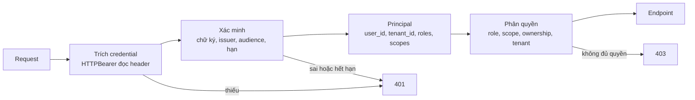
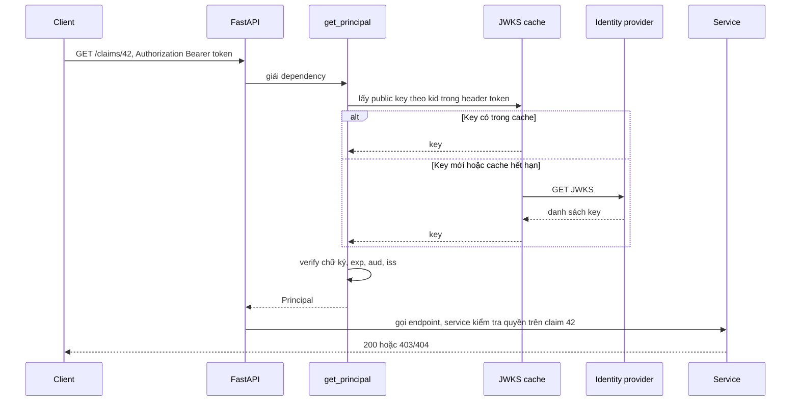

# Authentication và Authorization trong FastAPI

## 1. Tổng quan

- **Authentication** (xác thực) trả lời: *ai đang gọi?* — kiểm tra credential (token, API key, session cookie) và xác định danh tính.
- **Authorization** (phân quyền) trả lời: *người đó có được làm việc này trên tài nguyên này không?*

FastAPI không có hệ thống auth "cài sẵn". Nó cung cấp các **security utility** (`OAuth2PasswordBearer`, `HTTPBearer`, `APIKeyHeader`...) để trích xuất credential và khai báo vào OpenAPI, còn việc xác minh và phân quyền do bạn viết bằng [dependency](dependency-injection.md).

Tài liệu này tập trung vào cách auth vận hành **bên trong FastAPI**. Khái niệm authN/authZ, session vs token, RBAC/ABAC nằm ở [Authentication và Authorization](../08-api-design/authentication-authorization.md); chi tiết JWT và OAuth2 ở [JWT](../16-security/jwt.md) và [OAuth2](../16-security/oauth2.md).

## 2. Mental Model



Diễn giải:

1. Utility bảo mật chỉ **trích** credential từ request (header `Authorization: Bearer ...`). Nó không xác minh gì.
2. Dependency xác minh credential và tạo ra một **principal** — object tối thiểu mô tả người gọi.
3. Phân quyền dùng principal cùng với tài nguyên cụ thể để quyết định.
4. Thiếu hoặc sai credential → 401; đúng danh tính nhưng thiếu quyền → 403.

## 3. Vì sao đặt auth trong dependency?

- Dependency biết route và có thể trả lỗi có cấu trúc.
- Có thể áp dụng theo endpoint, theo router, hoặc toàn app.
- Security scheme xuất hiện trong OpenAPI (nút "Authorize" trong `/docs`).
- Test override dễ: thay `get_current_user` bằng user giả.
- Kết quả được cache trong request: nhiều dependency dùng `get_current_user` chỉ xác minh token một lần.

## 4. Cơ chế hoạt động: xác minh JWT trong dependency

```python
from typing import Annotated
import jwt                                    # PyJWT
from fastapi import Depends, HTTPException, Security, status
from fastapi.security import HTTPAuthorizationCredentials, HTTPBearer

bearer = HTTPBearer(auto_error=False)
jwks_client = jwt.PyJWKClient(settings.jwks_url, cache_keys=True, lifespan=3600)

class Principal(BaseModel):
    user_id: str
    tenant_id: str
    roles: frozenset[str]

def get_principal(
    creds: Annotated[HTTPAuthorizationCredentials | None, Security(bearer)],
) -> Principal:
    if creds is None:
        raise HTTPException(status.HTTP_401_UNAUTHORIZED, headers={"WWW-Authenticate": "Bearer"})
    try:
        key = jwks_client.get_signing_key_from_jwt(creds.credentials)
        claims = jwt.decode(
            creds.credentials,
            key.key,
            algorithms=["RS256"],              # cố định thuật toán, không tin header alg
            audience=settings.jwt_audience,
            issuer=settings.jwt_issuer,
            options={"require": ["exp", "iat", "sub"]},
            leeway=30,                         # chịu lệch đồng hồ nhỏ
        )
    except jwt.PyJWTError:
        raise HTTPException(status.HTTP_401_UNAUTHORIZED, headers={"WWW-Authenticate": "Bearer"})
    return Principal(user_id=claims["sub"], tenant_id=claims["tid"], roles=frozenset(claims.get("roles", [])))

CurrentPrincipal = Annotated[Principal, Depends(get_principal)]
```

Các điểm quan trọng:

1. **Cố định `algorithms`** — không để token tự khai báo thuật toán (tấn công `alg=none`, nhầm lẫn HS256/RS256).
2. **Kiểm tra `aud` và `iss`** — token hợp lệ cho service khác không được chấp nhận ở service này.
3. **Kiểm tra `exp`** với leeway nhỏ cho lệch đồng hồ.
4. **Cache JWKS** (public key của identity provider) — không tải lại mỗi request.
5. Dependency viết `def` vì `PyJWKClient` có thể gọi HTTP đồng bộ khi làm mới key → chạy trong threadpool, không block event loop. Nếu dùng thư viện async hoặc key đã cache sẵn trong memory, có thể viết `async def`.
6. Principal là object **bất biến, tối thiểu** — không mang cả token hay dữ liệu user đầy đủ vào tầng nghiệp vụ.

## 5. Authorization: ba tầng kiểm tra

### Theo role hoặc scope (coarse-grained)

```python
def require_roles(*required: str):
    def checker(principal: CurrentPrincipal) -> Principal:
        if not set(required) <= principal.roles:
            raise HTTPException(status.HTTP_403_FORBIDDEN)
        return principal
    return checker

@router.post("/claims/{claim_id}/approve", dependencies=[Depends(require_roles("claim_reviewer"))])
async def approve(claim_id: int): ...
```

`Security(dep, scopes=[...])` và `SecurityScopes` của FastAPI hỗ trợ khai báo scope OAuth2 vào OpenAPI.

### Theo tài nguyên (fine-grained)

Role không đủ: một `claim_reviewer` của đại lý A không được duyệt claim của đại lý B. Kiểm tra quyền trên **tài nguyên cụ thể** cần tải tài nguyên:

```python
async def approve_claim(claim_id: int, principal: Principal, session: AsyncSession):
    claim = await session.get(Claim, claim_id)
    if claim is None or claim.tenant_id != principal.tenant_id:
        raise NotFound()                    # không tiết lộ claim tồn tại ở tenant khác
    if claim.dealer_id not in principal.dealer_ids:
        raise Forbidden()
    ...
```

Loại kiểm tra này thuộc về **service**, vì nó cần dữ liệu nghiệp vụ. Thiếu nó là lỗ hổng BOLA/IDOR — lỗi phổ biến nhất trong OWASP API Top 10. Xem [API Security](../16-security/api-security.md).

### Theo tenant ở tầng dữ liệu

Với hệ thống multi-tenant, mọi query phải lọc theo `tenant_id` của principal. Cách phòng thủ nhiều lớp: repository luôn nhận `tenant_id`; hoặc PostgreSQL Row-Level Security với biến session thiết lập theo request.

## 6. Bên trong hệ thống xảy ra gì với mỗi request có token?



Diễn giải: xác minh JWT hoàn toàn cục bộ (chữ ký + claim) khi key đã có trong cache — không cần gọi identity provider mỗi request. Đây là lý do JWT phổ biến trong microservice. Cái giá: token đã cấp không thể thu hồi ngay trước khi hết hạn, trừ khi có cơ chế bổ sung (thời hạn ngắn, danh sách thu hồi).

## 7. Hành vi trong production

- **Chi phí xác minh**: RS256 verify tốn CPU (vài chục tới hàng trăm micro giây). Ở 5.000 RPS/worker, đáng để đo. ES256/EdDSA verify nhanh hơn RSA ở một số thư viện.
- **Xoay vòng key**: identity provider đổi key định kỳ. JWKS client phải tải lại khi gặp `kid` chưa biết, có giới hạn tần suất để token giả với `kid` ngẫu nhiên không biến thành DoS lên identity provider.
- **Lệch đồng hồ** giữa máy cấp token và máy xác minh gây lỗi 401 ngẫu nhiên với `iat`/`nbf`; dùng NTP và leeway nhỏ.
- **Hash mật khẩu** (nếu service tự quản lý login) bằng bcrypt/argon2 tốn 50–300 ms CPU có chủ đích. Trong `async def`, nó block event loop — chạy trong threadpool hoặc process pool, và rate limit endpoint login.
- **Không log token.** Header `Authorization` phải bị lọc khỏi log truy cập, trace và error tracker.

## 8. Failure Modes

| Failure | Nguyên nhân | Dấu hiệu |
|---|---|---|
| BOLA/IDOR | Chỉ kiểm tra role, không kiểm tra quyền trên tài nguyên | User đọc/sửa được dữ liệu người khác bằng cách đổi ID |
| Chấp nhận token của service khác | Không kiểm tra `aud` | Token đúng chữ ký nhưng sai đối tượng vẫn qua |
| `alg` confusion | Không cố định thuật toán | Token giả được chấp nhận |
| 401 hàng loạt sau xoay key | JWKS cache không làm mới khi gặp `kid` mới | Lỗi tăng vọt đúng thời điểm IdP đổi key |
| Event loop bị block | Hash mật khẩu hoặc tải JWKS đồng bộ trong `async def` | Loop lag khi có đợt login |
| Rò rỉ tenant | Query không lọc theo tenant | Dữ liệu tenant khác xuất hiện |

## 9. Trade-offs

| Lựa chọn | Lợi ích | Chi phí |
|---|---|---|
| JWT tự chứa, xác minh cục bộ | Không phụ thuộc IdP mỗi request, scale tốt | Khó thu hồi, token lớn |
| Opaque token + introspection | Thu hồi tức thì | Mỗi request (hoặc mỗi lần cache miss) gọi IdP |
| Session cookie phía server | Thu hồi dễ, token nhỏ | Cần store dùng chung (Redis), CSRF |
| Phân quyền trong dependency | Tái sử dụng, khai báo | Chỉ phù hợp kiểm tra thô |
| Phân quyền trong service | Có dữ liệu tài nguyên | Phải nhớ gọi ở mọi thao tác |
| Row-Level Security trong DB | Phòng thủ cuối cùng | Cấu hình phức tạp, debug khó hơn |

## 10. Sai lầm thường gặp

- Nghĩ `OAuth2PasswordBearer` xác minh token (nó chỉ đọc header).
- Decode JWT không verify (`options={"verify_signature": False}`) ở production.
- Chỉ kiểm tra "đã đăng nhập" mà không kiểm tra quyền trên tài nguyên.
- Trả 403 cho tài nguyên của tenant khác, tiết lộ rằng tài nguyên tồn tại.
- Đặt auth trong middleware và tự phân tích path để biết route nào cần bảo vệ.
- Để endpoint mới mặc định công khai; nên mặc định yêu cầu auth ở router.

## 11. Cách debug

- Log lý do từ chối (loại lỗi JWT: hết hạn, sai audience, sai chữ ký) ở mức debug, không log token.
- Metric số 401/403 theo route và theo lý do; spike 401 sau deploy hoặc xoay key là tín hiệu rõ.
- Test tự động cho BOLA: với mỗi endpoint có ID trong path, dùng principal của tenant khác và kỳ vọng 404/403.
- Kiểm tra OpenAPI để xác nhận mọi route có security scheme như mong đợi.

## 12. Best Practices

- Xác thực trong dependency, gắn ở mức router để mặc định mọi route đều yêu cầu auth.
- Cố định thuật toán, kiểm tra `iss`, `aud`, `exp`; cache JWKS và làm mới có giới hạn.
- Tạo principal bất biến tối thiểu; truyền vào service.
- Kiểm tra quyền trên từng tài nguyên trong service; lọc tenant ở mọi query.
- Chạy thao tác CPU nặng của auth (hash mật khẩu) ngoài event loop.
- Không log credential dưới bất kỳ hình thức nào.

## 13. Tóm tắt

- Authentication xác định ai gọi; authorization quyết định họ được làm gì trên tài nguyên nào.
- Security utility của FastAPI chỉ trích credential; xác minh và phân quyền nằm trong dependency và service.
- JWT được xác minh cục bộ bằng public key đã cache; phải cố định thuật toán và kiểm tra `iss`, `aud`, `exp`.
- Kiểm tra role là cần nhưng không đủ; kiểm tra quyền trên tài nguyên và tenant là bắt buộc.
- Thao tác auth tốn CPU phải tránh block event loop.

## Liên quan

- [Dependency Injection](dependency-injection.md)
- [Authentication và Authorization](../08-api-design/authentication-authorization.md)
- [JWT](../16-security/jwt.md)
- [OAuth2](../16-security/oauth2.md)
- [API Security](../16-security/api-security.md)
