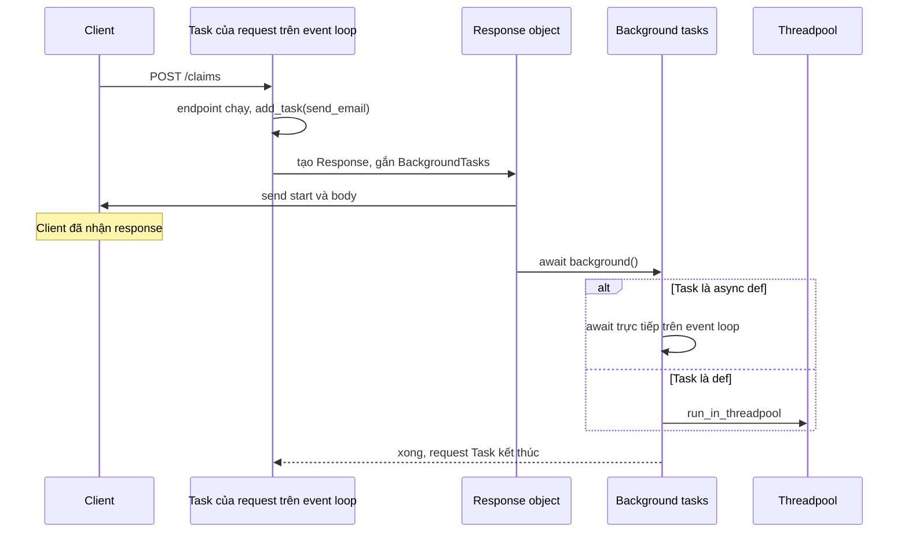
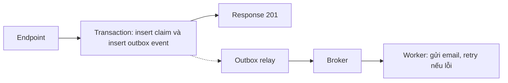

# Background Task trong FastAPI

## 1. Tổng quan

`BackgroundTasks` của FastAPI (kế thừa từ Starlette) cho phép đăng ký một function chạy **sau khi response đã được gửi** cho client, trong **cùng process, cùng worker**.

```python
from fastapi import BackgroundTasks

@app.post("/claims")
async def create_claim(payload: ClaimIn, background: BackgroundTasks):
    claim = await service.create(payload)
    background.add_task(send_confirmation_email, claim.id)
    return {"id": claim.id}
```

Client nhận `{"id": ...}` ngay; email được gửi sau đó. Cơ chế này tiện cho việc nhỏ, nhanh, không quan trọng. Nó **không phải** một job queue: không bền vững, không retry, không phân tán, mất khi process tắt.

## 2. Mental Model

> Background task là việc "làm nốt sau khi tiễn khách ra cửa" — do chính người phục vụ đó làm, tại chính quầy đó. Nếu quán đóng cửa đột ngột, việc làm nốt bị bỏ dở và không ai nhớ tới nó.

## 3. Vì sao tồn tại?

Giảm latency người dùng thấy cho những việc phụ không ảnh hưởng tới kết quả response: gửi email xác nhận, ghi analytics, xóa file tạm, làm mới cache. Không cần hạ tầng queue cho những việc mà mất vài lần cũng chấp nhận được.

## 4. Cơ chế hoạt động



Diễn giải:

1. `add_task` chỉ ghi lại function và argument vào một danh sách gắn với response.
2. Response được gửi đầy đủ cho client.
3. **Trong cùng Task của request**, Starlette lần lượt chạy các background task theo thứ tự đăng ký.
4. Task `async def` chạy trên event loop; task `def` chạy trong threadpool (dùng chung 40 token với endpoint `def`).
5. Chỉ khi mọi background task xong, Task của request mới kết thúc.

Hệ quả:

- Worker vẫn **bận** sau khi client nhận response; request in-flight của worker bao gồm cả thời gian background.
- Background task CPU nặng trong `async def` vẫn block event loop.
- Exception trong background task được log nhưng không ảnh hưởng response (đã gửi rồi), và không có retry.

## 5. Vì sao không phải job queue?

| Thuộc tính | `BackgroundTasks` | Job queue (Celery, RQ, Dramatiq, Arq) |
|---|---|---|
| Lưu trữ việc | Memory của process | Broker bền vững (Redis, RabbitMQ, SQS) |
| Khi process crash/deploy | Việc bị mất | Việc còn trong broker, worker khác nhận |
| Retry | Không | Có, với backoff |
| Chạy ở đâu | Cùng web worker | Worker riêng, scale riêng |
| Theo dõi trạng thái | Không | Có (state, result backend, metric) |
| Giới hạn tài nguyên | Chiếm tài nguyên của web worker | Cô lập |
| Thời gian chạy hợp lý | Vài trăm ms | Giây tới giờ |

Kubernetes gửi SIGTERM khi rolling update; worker có grace period để hoàn tất request đang chạy (bao gồm background task). Việc vượt quá grace period bị kill. Việc đang chờ trong danh sách background của request chưa tới lượt cũng mất.

## 6. Luồng thay thế: ghi ý định vào database, xử lý bằng queue

Với việc quan trọng (gửi thông báo thanh toán, đồng bộ sang ERP), đảm bảo không mất bằng cách ghi **ý định** trong cùng transaction với dữ liệu nghiệp vụ:



Diễn giải: event nằm trong database cùng với claim, nên nếu claim được lưu thì event chắc chắn tồn tại. Relay đọc outbox và publish lên broker; worker xử lý có retry. Đây là [Outbox Pattern](../10-distributed-systems/outbox-pattern.md).

## 7. Ví dụ dùng đúng và sai

```python
# Đúng: việc nhỏ, idempotent, mất cũng chấp nhận được
background.add_task(metrics_client.record_signup, user.id)
background.add_task(os.remove, temp_path)

# Sai: dùng session của request trong background
async def update_stats(session: AsyncSession, claim_id: int):
    await session.execute(...)          # session có thể đã đóng khi task chạy

background.add_task(update_stats, session, claim.id)

# Đúng hơn: background tự mở session riêng
async def update_stats(claim_id: int):
    async with sessionmaker() as session, session.begin():
        await session.execute(...)
```

Tài nguyên của dependency có `yield` (session) có thể đã được dọn dẹp trước khi background task chạy — hành vi phụ thuộc version FastAPI. Background task phải tự quản lý tài nguyên của nó. Xem [Dependency Injection](dependency-injection.md#5-dependency-có-yield).

## 8. Hành vi trong production

- **Đếm sai tải**: metric latency của request (đo đến lúc gửi response) trông tốt, nhưng worker thực ra bận lâu hơn. Throughput tối đa thấp hơn dự kiến.
- **Lỗi im lặng**: exception trong background chỉ xuất hiện trong log; không có alert nếu không cấu hình riêng.
- **Mất việc khi deploy**: mỗi rolling update có thể mất một số việc đang chờ.
- **Tranh chấp threadpool**: background `def` dùng chung threadpool với endpoint `def`.

## 9. Failure Modes

| Failure | Nguyên nhân | Dấu hiệu |
|---|---|---|
| Mất việc | Process restart, OOM, deploy | Email/notification thiếu, không có lỗi |
| Không retry | Dependency tạm thời lỗi | Lỗi một lần trong log, việc không bao giờ hoàn tất |
| Event loop block | Background CPU/sync trong `async def` | Loop lag sau các request có background |
| Session đã đóng | Dùng tài nguyên của request | Lỗi session/connection trong log background |
| Worker quá tải | Background dài chiếm worker | Throughput giảm, in-flight cao |

## 10. Khi nào nên dùng?

- Việc ngắn (dưới vài trăm ms), không quan trọng, idempotent.
- Mất vài việc khi deploy là chấp nhận được.
- Không cần biết kết quả, không cần retry.

## 11. Khi nào không nên dùng?

- Việc có tác động nghiệp vụ hoặc tài chính.
- Việc dài, CPU nặng, gọi dịch vụ ngoài không ổn định.
- Việc cần retry, theo dõi trạng thái, hoặc scale độc lập.
- Việc cần chạy đúng một lần hoặc có thứ tự.

Dùng [Celery](../07-celery/architecture.md) hoặc queue khác, kết hợp outbox nếu việc phải gắn với transaction.

## 12. Cách debug

- Log bắt đầu/kết thúc/lỗi của background task kèm request ID.
- Đo thời gian từ lúc gửi response tới lúc request Task kết thúc (in-flight thực tế).
- Đếm việc được đăng ký và việc hoàn tất để phát hiện mất mát khi deploy.

## 13. Best Practices

- Chỉ dùng cho việc nhỏ, idempotent, best-effort.
- Background task tự mở tài nguyên riêng (session, client), không dùng của request.
- Bọc task bằng try/except có log và metric.
- Việc quan trọng: ghi ý định vào DB (outbox) và xử lý bằng queue có retry.
- Đặt grace period của orchestrator đủ dài cho request + background.

## 14. Tóm tắt

- `BackgroundTasks` chạy sau khi response được gửi, trong cùng Task, cùng worker.
- Không bền vững, không retry, không cô lập tài nguyên; mất khi process tắt.
- Task `async def` chạy trên event loop, `def` chạy trong threadpool.
- Việc quan trọng cần queue bền vững và outbox pattern.

## Liên quan

- [Request Lifecycle](request-lifecycle.md)
- [Coroutine, Task và Future](../02-python-concurrency/coroutine-task-future.md)
- [Celery Architecture](../07-celery/architecture.md)
- [Outbox Pattern](../10-distributed-systems/outbox-pattern.md)
