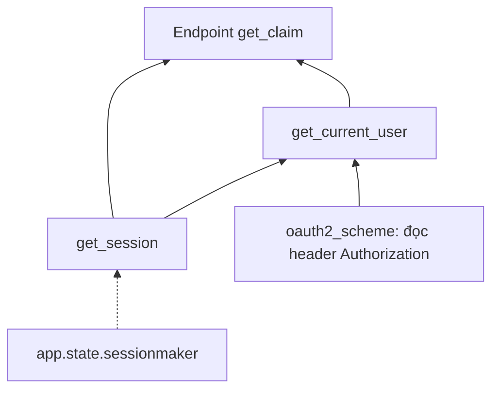
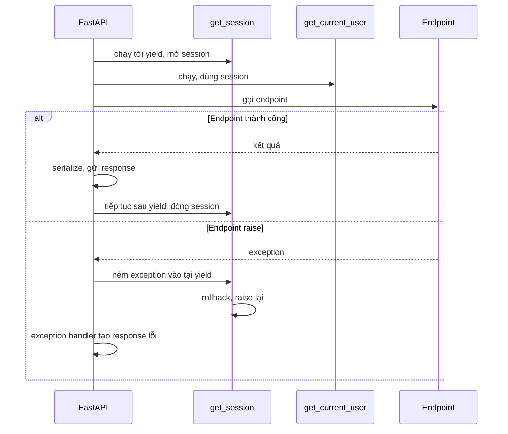

# Dependency Injection trong FastAPI

## 1. Tổng quan

Dependency Injection (DI) là kỹ thuật trong đó một thành phần **không tự tạo** những thứ nó cần (database session, user hiện tại, config, client), mà **khai báo** nhu cầu và để bên ngoài cung cấp.

FastAPI có hệ thống DI riêng dựa trên `Depends`: bạn khai báo tham số của endpoint là kết quả của một callable khác. Với mỗi request, FastAPI tự gọi các callable đó theo đúng thứ tự, truyền kết quả vào, và dọn dẹp sau khi xong.

```python
@app.get("/claims/{claim_id}")
async def get_claim(
    claim_id: int,
    user: Annotated[User, Depends(get_current_user)],
    session: Annotated[AsyncSession, Depends(get_session)],
): ...
```

DI của FastAPI là nơi đặt các concern gắn với request: xác thực, phân quyền, DB session, transaction, tenant context, rate limit, phân trang chung.

## 2. Mental Model

> Mỗi endpoint là gốc của một **cây dependency**. Với mỗi request, FastAPI duyệt cây từ lá lên gốc, gọi mỗi node một lần, và nhớ kết quả để các node khác cùng dùng. Dependency có `yield` giống một context manager: mở khi đi vào, đóng khi request kết thúc.

## 3. Vì sao cần DI?

- **Tái sử dụng**: logic xác thực viết một lần, dùng ở mọi endpoint cần nó.
- **Vòng đời rõ ràng**: session DB được tạo và đóng đúng một lần mỗi request, kể cả khi có exception.
- **Test dễ**: thay dependency thật bằng giả qua `app.dependency_overrides` mà không sửa code endpoint.
- **Tài liệu tự động**: dependency khai báo query/header/security được đưa vào OpenAPI.
- **Endpoint mỏng**: endpoint chỉ nhận thứ đã sẵn sàng và gọi logic nghiệp vụ.

## 4. Cơ chế hoạt động

### Dependency là callable bất kỳ

Function, async function, class (constructor là callable), hoặc instance có `__call__`. FastAPI phân tích **signature** của dependency giống như endpoint: tham số của dependency có thể là path/query/header/body, hoặc lại là `Depends` khác.

```python
async def get_current_user(
    token: Annotated[str, Depends(oauth2_scheme)],
    session: Annotated[AsyncSession, Depends(get_session)],
) -> User:
    claims = verify_jwt(token)
    user = await session.get(User, claims["sub"])
    if user is None:
        raise HTTPException(status_code=401)
    return user
```

### Giải đồ thị dependency



Diễn giải:

1. FastAPI phân tích đồ thị **một lần** khi route được đăng ký (lúc import).
2. Với mỗi request, nó giải từ lá: `oauth2_scheme` đọc header, `get_session` mở session.
3. `get_current_user` nhận token và session.
4. Endpoint nhận `user` và `session`.
5. `get_session` được dùng ở hai nơi nhưng chỉ được **gọi một lần**: kết quả được cache trong phạm vi request, nên endpoint và `get_current_user` dùng **cùng một session** — cùng transaction.

Cache mặc định bật; `Depends(dep, use_cache=False)` buộc gọi lại mỗi lần xuất hiện.

### Sync và async dependency

- Dependency `async def` được `await` trên event loop.
- Dependency `def` chạy trong **threadpool** (40 token mặc định mỗi worker), giống endpoint `def`.

Một endpoint async với ba dependency `def` tiêu tốn ba lần mượn thread cho mỗi request. Với tải cao, đây có thể là nguyên nhân bão hòa threadpool. Dependency rẻ, không I/O nên viết `async def` để tránh chi phí chuyển thread. Xem [Sync vs Async Endpoint](sync-vs-async-endpoint.md).

## 5. Dependency có `yield`

```python
async def get_session(request: Request):
    async with request.app.state.sessionmaker() as session:
        try:
            yield session
        except Exception:
            await session.rollback()
            raise
```

Cơ chế bên trong:

1. FastAPI chạy phần trước `yield`, lấy giá trị được yield làm kết quả dependency.
2. Generator được đăng ký vào một `AsyncExitStack` gắn với request (xem [Context Manager](../01-python-core/context-manager.md#6-quản-lý-nhiều-tài-nguyên-exitstack)).
3. Khi request kết thúc, `AsyncExitStack` chạy phần sau `yield` của mọi dependency theo thứ tự **ngược** với lúc khởi tạo.
4. Nếu endpoint raise exception, exception được **ném vào** generator tại dòng `yield` — dependency có thể rollback, rồi phải `raise` lại.



> **Ghi chú version:** Thời điểm phần sau `yield` chạy so với lúc gửi response đã thay đổi qua các version FastAPI (thay đổi lớn ở 0.106.0; các bản gần đây bổ sung tùy chọn scope cho dependency để chọn chạy cleanup trước hay sau khi gửi response). Không dùng tài nguyên của dependency (session) trong background task, và không dựa vào cleanup để quyết định response. Kiểm tra tài liệu cho version bạn dùng.

### Transaction nên commit ở đâu?

Hai lựa chọn phổ biến:

1. **Dependency commit sau `yield`**: đơn giản, mọi endpoint có transaction tự động. Nhưng nếu commit thất bại **sau khi** response 200 đã được gửi (tùy version), client nhận thành công cho một thao tác không được lưu.
2. **Service commit tường minh** trước khi return: lỗi commit trở thành response lỗi đúng; dependency chỉ lo đóng session và rollback khi có lỗi.

Lựa chọn 2 an toàn hơn cho thao tác ghi quan trọng. Xem [Transaction trong SQLAlchemy](../05-sqlalchemy/transaction.md).

## 6. Các pattern thường dùng

### Alias với `Annotated`

```python
SessionDep = Annotated[AsyncSession, Depends(get_session)]
CurrentUser = Annotated[User, Depends(get_current_user)]

@app.post("/claims")
async def create_claim(payload: ClaimIn, user: CurrentUser, session: SessionDep): ...
```

### Dependency có tham số (factory)

```python
def require_role(role: str):
    async def checker(user: CurrentUser) -> User:
        if role not in user.roles:
            raise HTTPException(status_code=403)
        return user
    return checker

@app.delete("/claims/{claim_id}", dependencies=[Depends(require_role("admin"))])
async def delete_claim(claim_id: int): ...
```

`dependencies=[...]` chạy dependency chỉ để lấy tác dụng (kiểm tra quyền), không truyền kết quả vào endpoint. Có thể gắn cho cả router: `APIRouter(dependencies=[Depends(verify_api_key)])`.

### Class làm dependency

```python
class Pagination:
    def __init__(self, limit: int = Query(20, le=100), cursor: str | None = None):
        self.limit = limit
        self.cursor = cursor
```

### Override trong test

```python
app.dependency_overrides[get_current_user] = lambda: User(id=1, roles=["admin"])
```

Override thay dependency theo **identity của callable**. Nếu code tạo dependency mới mỗi lần (như `require_role("admin")` tạo closure mới), override theo cách này không bắt được — nên override dependency gốc bên trong (`get_current_user`).

## 7. DI của FastAPI không phải là gì

- **Không phải IoC container toàn ứng dụng.** DI của FastAPI sống trong phạm vi request và chỉ hoạt động cho endpoint/dependency. Service và repository bên dưới vẫn cần được tạo bằng cách khác (truyền qua constructor, factory).
- **Không phải nơi đặt logic nghiệp vụ.** Dependency làm nhiều việc (gọi nhiều service, quyết định nghiệp vụ) khiến logic bị phân tán vào signature của endpoint và khó test độc lập.
- **Không thay thế lifespan.** Tài nguyên dùng chung (engine, client) phải tạo trong lifespan; dependency chỉ lấy chúng ra (`request.app.state`). Tạo `httpx.AsyncClient()` trong dependency mỗi request là tạo connection pool mới mỗi request.

## 8. Hành vi trong production

- **Chi phí ẩn**: mỗi dependency là một lời gọi function, có thể một lần chuyển thread, có thể một query. `get_current_user` query DB mỗi request → một query bổ sung cho mọi endpoint. Cân nhắc cache ngắn hạn cho dữ liệu user/permission, hoặc đưa claim cần thiết vào token.
- **Gọi trùng**: hai dependency khác nhau cùng gọi một service lấy cùng dữ liệu (không qua dependency chung) → hai query. Gom vào một dependency để hưởng cache theo request.
- **Transaction quá rộng**: session mở từ đầu request trong dependency, và endpoint gọi HTTP ra ngoài trong lúc transaction đang mở → giữ connection và lock trong suốt lời gọi HTTP. Xem [Connection Pooling](../04-database-postgresql/connection-pooling.md).
- **Thứ tự dependency và rate limit**: dependency rate limit nên chạy **trước** dependency đắt (xác thực có query DB). FastAPI giải dependency theo thứ tự khai báo trong signature và theo đồ thị.

## 9. Failure Modes

| Failure | Nguyên nhân | Dấu hiệu |
|---|---|---|
| Threadpool bão hòa | Nhiều dependency `def` | Endpoint async chậm dù loop rảnh |
| Session đóng khi dùng | Dùng session của request trong background task | Lỗi "session is closed" hoặc connection về pool rồi |
| Commit fail sau response | Commit trong cleanup sau khi đã gửi 200 | Client nhận thành công, dữ liệu không có |
| Exception bị nuốt | Dependency `yield` bắt exception không raise lại | Lỗi biến mất, response sai |
| Query thừa | Dependency xác thực query DB mỗi request | Số query tăng tuyến tính theo RPS |
| Override không tác dụng | Override closure tạo động | Test dùng dependency thật |

## 10. Trade-offs

| Cách | Ưu điểm | Nhược điểm |
|---|---|---|
| Dependency cho auth/session | Vòng đời chuẩn, test override dễ | Gắn với FastAPI |
| Middleware cho auth | Áp dụng mọi request | Không biết route, khó trả lỗi theo endpoint, khó test |
| Truyền tường minh qua constructor | Độc lập framework | Nhiều code "đi dây" hơn |
| DI container bên ngoài (dependency-injector...) | Quản lý đồ thị service lớn | Thêm abstraction, hai hệ DI song song |

## 11. Sai lầm thường gặp

- Tạo client/engine trong dependency cho mỗi request.
- Viết dependency `def` cho thứ không có I/O.
- Để dependency chứa logic nghiệp vụ phức tạp.
- Dựa vào commit trong cleanup cho thao tác quan trọng.
- Dùng session của request sau khi request kết thúc.
- Không raise lại exception trong dependency có `yield`.

## 12. Cách debug

- Bật log SQL để đếm query mỗi request; dependency sinh query thừa sẽ lộ ra.
- Tracing: tạo span cho dependency quan trọng (xác thực, session) để thấy thời gian của chúng.
- Kiểm tra threadpool đang dùng khi endpoint async chậm.
- Test override: xác nhận override được áp dụng bằng cách assert dependency thật không được gọi.

## 13. Best Practices

- Dependency cho concern theo request: xác thực, phân quyền, session, tenant, pagination.
- Tài nguyên dùng chung trong lifespan; dependency chỉ truy xuất.
- Viết dependency `async def` khi có thể; chỉ dùng `def` khi phải gọi thư viện sync.
- Dependency có `yield` luôn `try/except/raise` hoặc `try/finally`.
- Commit tường minh ở tầng service cho thao tác ghi quan trọng.
- Dùng `Annotated` alias để giữ signature gọn và nhất quán.

## 14. Tóm tắt

- `Depends` khai báo nhu cầu; FastAPI giải đồ thị dependency mỗi request, gọi mỗi dependency một lần và cache kết quả trong request.
- Dependency `def` chạy trong threadpool; `async def` chạy trên loop.
- Dependency có `yield` là context manager theo request, được quản lý bằng `AsyncExitStack`, cleanup theo thứ tự ngược.
- Exception của endpoint được ném vào dependency tại `yield`.
- Thời điểm cleanup so với lúc gửi response phụ thuộc version; không dựa vào nó cho đúng đắn.

## Liên quan

- [Request Lifecycle](request-lifecycle.md)
- [Authentication](authentication.md)
- [Context Manager](../01-python-core/context-manager.md)
- [Session Lifecycle](../05-sqlalchemy/session-lifecycle.md)
- [Hexagonal Architecture](../09-software-architecture/hexagonal-architecture.md)
