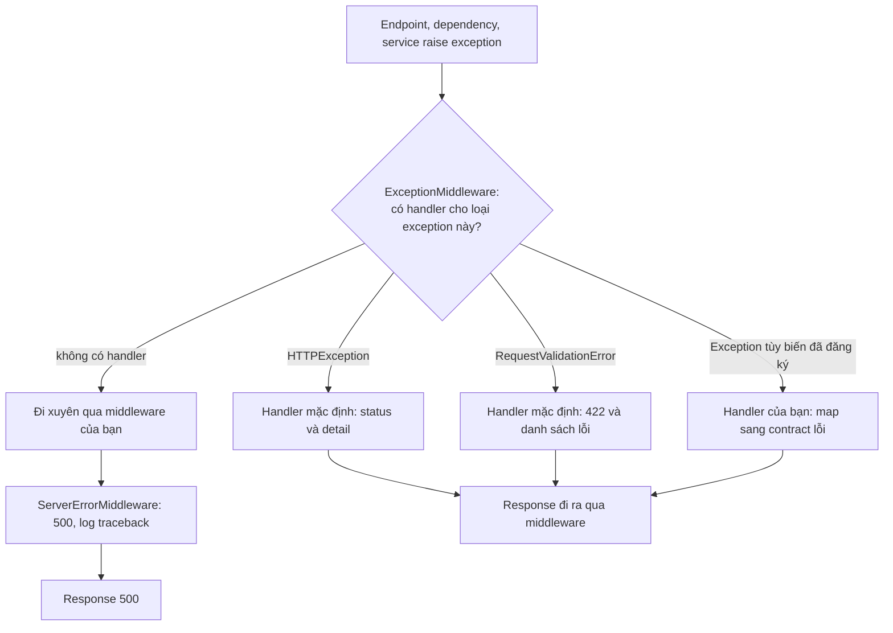

# Error Handling trong FastAPI

## 1. Tổng quan

Error handling trong một API không chỉ là "bắt exception". Nó là việc **chuyển mọi loại lỗi** — lỗi input, lỗi nghiệp vụ, lỗi hạ tầng, timeout, bug — thành một **contract lỗi ổn định** cho client, đồng thời giữ đủ thông tin để debug mà không rò rỉ chi tiết nội bộ.

Một hệ thống error handling tốt trả lời được cho mỗi lỗi:

- Client nhận **status code** gì và **body** gì?
- Client có nên **retry** không?
- Lỗi được **log** ở đâu, một lần hay nhiều lần?
- Có **correlation ID** để nối response lỗi với log và trace không?

## 2. Mental Model

> Mỗi tầng chỉ xử lý lỗi mà nó **hiểu được ý nghĩa**. Repository biết "không tìm thấy row", service biết "claim đã được duyệt, không thể sửa", tầng HTTP biết "điều đó nghĩa là 409". Lỗi đi lên qua các tầng dưới dạng exception có kiểu, và được dịch sang HTTP đúng một lần ở biên.

## 3. Vì sao cần thiết kế error handling?

- Client (frontend, service khác, đối tác) cần phân biệt lỗi do họ (4xx, sửa request) và lỗi do server (5xx, có thể retry).
- Retry của client phụ thuộc vào việc lỗi có retryable không. Retry lỗi 400 là lãng phí; không retry lỗi 503 là mất cơ hội phục hồi.
- Stack trace, câu SQL, tên bảng trong response là rò rỉ thông tin bảo mật.
- Log lỗi ở mọi tầng tạo ra năm dòng log cho một lỗi, làm nhiễu alert.

## 4. Cơ chế hoạt động trong FastAPI



Diễn giải:

1. Exception được raise ở bất kỳ đâu trong endpoint/dependency đi lên tới `ExceptionMiddleware`.
2. Handler được tìm theo **MRO của loại exception**: handler cho class cha bắt cả exception con. Nhờ đó một handler cho `DomainError` bao được mọi lỗi nghiệp vụ.
3. `HTTPException` và `RequestValidationError` có handler mặc định.
4. Exception không có handler đi xuyên qua middleware của bạn tới `ServerErrorMiddleware` ở ngoài cùng, thành 500. Handler cho `Exception` (class gốc) được Starlette gắn vào `ServerErrorMiddleware`, nên nó chạy ở ngoài cùng.

## 5. Phân loại lỗi và mapping

| Loại lỗi | Ví dụ | Status | Retryable |
|---|---|---|---|
| Input sai định dạng | Thiếu field, kiểu sai | 400 / 422 | Không |
| Chưa xác thực | Token thiếu/hết hạn | 401 | Không (lấy token mới) |
| Không đủ quyền | Sai role, sai tenant | 403 (hoặc 404 để không lộ tồn tại) | Không |
| Không tìm thấy | Claim không tồn tại | 404 | Không |
| Xung đột trạng thái | Sửa claim đã duyệt, version cũ | 409 | Không (đọc lại rồi quyết định) |
| Vi phạm quy tắc nghiệp vụ | Vượt hạn mức bảo hành | 422 | Không |
| Quá tải phía client | Vượt rate limit | 429 + `Retry-After` | Có, sau thời gian chỉ định |
| Dependency tạm thời lỗi | DB failover, service ngoài 503 | 503 + `Retry-After` | Có |
| Timeout dependency | Service ngoài không trả lời | 504 (gateway) hoặc 503 | Có nếu thao tác idempotent |
| Bug | `KeyError`, `AttributeError` | 500 | Không chắc; thường không |

Retry thao tác **ghi** sau timeout chỉ an toàn khi có [idempotency key](../08-api-design/idempotency.md).

## 6. Ví dụ: exception nghiệp vụ và contract lỗi

```python
from fastapi import FastAPI, Request
from fastapi.responses import JSONResponse

class DomainError(Exception):
    status_code = 400
    code = "domain_error"
    retryable = False

    def __init__(self, message: str, **details):
        super().__init__(message)
        self.details = details

class ClaimAlreadyApproved(DomainError):
    status_code = 409
    code = "claim_already_approved"

class DependencyUnavailable(DomainError):
    status_code = 503
    code = "dependency_unavailable"
    retryable = True

def problem(request: Request, status: int, code: str, title: str, retryable: bool, **extra):
    return JSONResponse(
        status_code=status,
        media_type="application/problem+json",
        content={
            "type": f"https://errors.example.com/{code}",
            "title": title,
            "status": status,
            "code": code,
            "retryable": retryable,
            "request_id": request_id_var.get(),
            **extra,
        },
        headers={"Retry-After": "5"} if retryable else None,
    )

def register_error_handlers(app: FastAPI) -> None:
    @app.exception_handler(DomainError)
    async def domain_error_handler(request: Request, exc: DomainError):
        return problem(request, exc.status_code, exc.code, str(exc), exc.retryable, **exc.details)

    @app.exception_handler(Exception)
    async def unhandled_handler(request: Request, exc: Exception):
        logger.exception("unhandled error")          # log MỘT lần, kèm traceback
        return problem(request, 500, "internal_error", "Internal server error", False)
```

- Service raise `ClaimAlreadyApproved` — không biết gì về HTTP.
- Handler dịch sang HTTP ở biên, theo định dạng Problem Details (RFC 9457, trước đó là RFC 7807).
- Response lỗi có `request_id` để client báo lỗi và đội vận hành tìm log.
- Lỗi không lường trước trả thông điệp chung chung, chi tiết nằm trong log.

## 7. Timeout, cancellation và lỗi hạ tầng

- **Timeout của dependency**: bắt `httpx.TimeoutException`, `asyncio.TimeoutError`, lỗi timeout của driver ở tầng adapter, chuyển thành `DependencyUnavailable` (hoặc lỗi riêng) để handler trả 503/504. Không để chúng thành 500 chung chung — 500 không nói cho client biết có nên retry.
- **`CancelledError`**: không bao giờ bắt để biến thành response. Cancellation nghĩa là không còn ai chờ response (client ngắt, timeout ở tầng ngoài). Để nó lan ra. Xem [Coroutine, Task và Future](../02-python-concurrency/coroutine-task-future.md#7-cancellation-hoạt-động-thế-nào).
- **Lỗi database**: `IntegrityError` do unique constraint thường là xung đột nghiệp vụ (409), không phải 500. Map tường minh những constraint có ý nghĩa nghiệp vụ; phần còn lại là 500.
- **Lỗi serialization/deadlock** của PostgreSQL (`40001`, `40P01`): nên retry toàn bộ transaction ở tầng service trước khi báo lỗi. Xem [Deadlock](../04-database-postgresql/deadlock.md).

## 8. Hành vi trong production

- **Log một lần tại biên sở hữu.** Tầng dưới không log rồi re-raise; handler cuối cùng log với đủ context. Ngoại lệ: tầng dưới có thông tin mà tầng trên không có — gắn vào exception (`raise ... from exc`, thêm attribute) thay vì log riêng.
- **Giữ nguyên nhân gốc**: `raise DependencyUnavailable("pricing") from exc` giữ `__cause__` để traceback đầy đủ.
- **4xx không phải lỗi của server**: không alert trên 4xx như alert trên 5xx; nhưng theo dõi tỷ lệ 4xx bất thường (client deploy lỗi, tấn công).
- **Error tracker (Sentry)**: lọc dữ liệu nhạy cảm; gom nhóm theo loại exception; đừng gửi 4xx dự kiến.
- **Exception trong middleware hoặc sau khi response bắt đầu gửi** không thể biến thành response lỗi có cấu trúc nữa — chỉ còn log.

## 9. Failure Modes

| Failure | Nguyên nhân | Dấu hiệu |
|---|---|---|
| Rò rỉ chi tiết nội bộ | Trả `str(exc)` của lỗi hạ tầng | Response chứa SQL, đường dẫn, tên host |
| Retry storm | Lỗi tạm thời trả 500 thay vì 503, client retry mọi 5xx không kiểm soát | Tải tăng khi dependency lỗi |
| Client không retry khi nên | Lỗi tạm thời trả 400 | Tỷ lệ thất bại cao khi failover |
| Log nhiễu | Log ở mọi tầng | Một lỗi tạo nhiều dòng log, alert trùng |
| Timeout bị vô hiệu | Bắt `BaseException`/`CancelledError` | Request treo quá deadline |
| Constraint thành 500 | Không map `IntegrityError` | Duplicate request trả 500 thay vì 409 |

## 10. Trade-offs

| Lựa chọn | Lợi ích | Chi phí |
|---|---|---|
| `HTTPException` rải trong service | Nhanh | Service phụ thuộc HTTP, khó tái sử dụng cho worker/CLI |
| Domain exception + handler ở biên | Tách biệt, nhất quán | Thêm class và mapping |
| Problem Details chuẩn | Client hiểu định dạng chung | Cần thống nhất giữa các team |
| Trả 404 thay 403 cho tài nguyên không thuộc tenant | Không lộ sự tồn tại | Debug khó hơn một chút |

## 11. Sai lầm thường gặp

- Raise `HTTPException` từ sâu trong tầng nghiệp vụ.
- `except Exception: return {"error": str(e)}` với status 200.
- Mọi lỗi đều là 500.
- Không có request ID trong response lỗi.
- Bắt exception, log, rồi raise lại ở từng tầng.
- Dùng exception cho luồng điều khiển bình thường ở hot path.

## 12. Cách debug

- Từ `request_id` trong response lỗi, tìm log và trace tương ứng.
- Metric lỗi theo route, status, và `code` nghiệp vụ.
- Kiểm tra `exc.__cause__`/`__context__` để tìm nguyên nhân gốc bị bọc.
- Test contract lỗi: mỗi loại exception nghiệp vụ có test kiểm tra status, code, retryable.

## 13. Best Practices

- Định nghĩa hệ thống exception nghiệp vụ có kiểu; dịch sang HTTP ở một nơi.
- Dùng định dạng lỗi thống nhất (Problem Details) với `code` ổn định cho máy đọc.
- Phân biệt rõ retryable và không retryable; dùng 503/429 kèm `Retry-After` cho lỗi tạm thời.
- Log một lần, ở biên, với request ID và nguyên nhân gốc.
- Không để lộ chi tiết nội bộ trong response.
- Để `CancelledError` lan; map timeout của dependency thành lỗi có nghĩa.

## 14. Tóm tắt

- FastAPI tìm handler theo MRO của exception; exception không có handler thành 500 ở tầng ngoài cùng.
- Lỗi nên đi lên dưới dạng exception nghiệp vụ có kiểu và được dịch sang HTTP ở biên.
- Contract lỗi cần status đúng, `code` ổn định, cờ retryable và request ID.
- Timeout và lỗi tạm thời phải được phân biệt với bug để client retry đúng.
- Log một lần tại biên, giữ nguyên nhân gốc, không rò rỉ chi tiết nội bộ.

## Liên quan

- [Request Lifecycle](request-lifecycle.md)
- [Middleware](middleware.md)
- [Retry và Timeout trong API](../08-api-design/retry-timeout.md)
- [Idempotency trong API](../08-api-design/idempotency.md)
- [Metrics, Logging và Tracing](../17-performance-reliability/metrics-logging-tracing.md)
