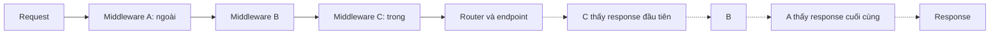
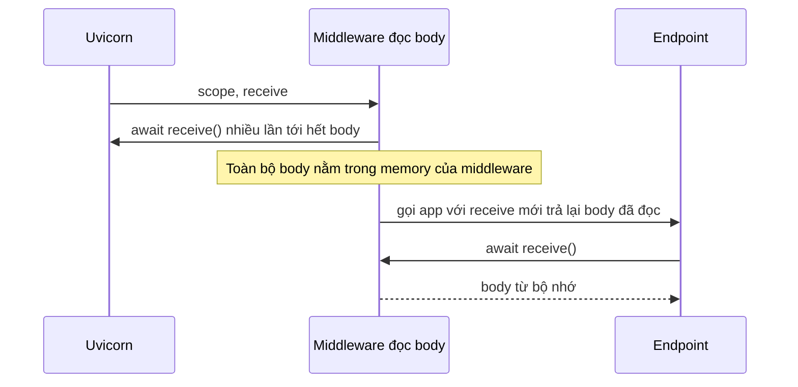

# Middleware trong FastAPI

## 1. Tổng quan

Middleware là lớp code bọc quanh toàn bộ application, chạy **trước** khi request tới router và **sau** khi response rời router. Nó phù hợp cho concern áp dụng cho mọi request mà không cần biết route cụ thể: gắn request ID, đo thời gian, tracing, CORS, nén, header bảo mật, giới hạn kích thước.

Trong FastAPI (Starlette), middleware là **ASGI middleware**: một ASGI app nhận một ASGI app khác và gọi nó. Hiểu điều này giải thích thứ tự thực thi, vì sao một số middleware làm hỏng streaming, và vì sao exception đôi khi "lọt qua" middleware của bạn.

## 2. Mental Model

> Middleware là các lớp vỏ hành. Request đi từ vỏ ngoài vào lõi (router), response đi từ lõi ra vỏ ngoài. Mỗi lớp thấy request trước lớp bên trong và thấy response sau lớp bên trong.



Diễn giải: A bọc B, B bọc C, C bọc router. Chiều vào A → B → C; chiều ra C → B → A. Lớp nào ở ngoài thì đo được nhiều nhất (thời gian của mọi lớp bên trong) và thấy exception mà lớp trong không xử lý.

## 3. Vì sao cần middleware?

- Concern **xuyên suốt** không nên lặp ở mỗi endpoint: request ID, logging truy cập, metrics, tracing.
- Xử lý ở mức **giao thức**: CORS preflight, nén GZip, chuyển hướng HTTPS, kiểm tra Host.
- Chạy cả cho request **không khớp route nào** (404) — điều dependency không làm được.

## 4. Cơ chế hoạt động

### Thứ tự đăng ký và thứ tự thực thi

```python
app.add_middleware(TimingMiddleware)      # thêm trước → nằm TRONG
app.add_middleware(RequestIdMiddleware)   # thêm sau → nằm NGOÀI
```

Mỗi `add_middleware` bọc stack hiện tại bằng một lớp mới ở **ngoài cùng**. Middleware thêm sau cùng chạy **đầu tiên** ở chiều vào. Muốn request ID có mặt trong log của timing middleware, `RequestIdMiddleware` phải nằm ngoài, tức được thêm sau.

Stack đầy đủ của FastAPI (từ ngoài vào):

1. `ServerErrorMiddleware` — bắt exception chưa xử lý, trả 500.
2. Middleware của bạn (theo thứ tự ngược với thứ tự `add_middleware`).
3. `ExceptionMiddleware` — chạy exception handler (`HTTPException`, validation, handler tùy biến).
4. Router.

Hệ quả: response 404/422/403 do handler tạo ra đi qua middleware của bạn như response bình thường. Exception **không có handler** đi xuyên qua middleware của bạn (dưới dạng exception) tới `ServerErrorMiddleware`. Middleware muốn log mọi lỗi phải bắt exception hoặc nằm ngoài cùng.

### Hai cách viết middleware

**`BaseHTTPMiddleware` / `@app.middleware("http")`** — tiện, làm việc với `Request`/`Response`:

```python
@app.middleware("http")
async def add_request_id(request: Request, call_next):
    request_id = request.headers.get("x-request-id") or uuid4().hex
    response = await call_next(request)
    response.headers["x-request-id"] = request_id
    return response
```

**Pure ASGI middleware** — làm việc trực tiếp với `scope`, `receive`, `send`:

```python
class RequestIdMiddleware:
    def __init__(self, app):
        self.app = app

    async def __call__(self, scope, receive, send):
        if scope["type"] != "http":
            return await self.app(scope, receive, send)
        headers = dict(scope["headers"])
        request_id = headers.get(b"x-request-id", uuid4().hex.encode())
        token = request_id_var.set(request_id.decode())

        async def send_with_id(message):
            if message["type"] == "http.response.start":
                message.setdefault("headers", []).append((b"x-request-id", request_id))
            await send(message)

        try:
            await self.app(scope, receive, send_with_id)
        finally:
            request_id_var.reset(token)
```

| Tiêu chí | `BaseHTTPMiddleware` | Pure ASGI |
|---|---|---|
| Độ dễ viết | Dễ | Cần hiểu ASGI |
| Streaming response | `call_next` bọc body qua một kênh nội bộ; hoạt động nhưng thêm overhead | Không ảnh hưởng |
| Hiệu năng | Thêm overhead mỗi request (tạo task/stream nội bộ) | Tối thiểu |
| WebSocket | Không áp dụng | Xử lý được mọi loại scope |
| Context variables | Đã từng có vấn đề lan truyền giữa middleware và endpoint ở các version cũ | Hoạt động tự nhiên |

> **Ghi chú version:** Starlette đã cải thiện `BaseHTTPMiddleware` qua nhiều version (xử lý contextvars, background task, streaming). Với middleware chạy trên mọi request trong service tải cao, pure ASGI middleware vẫn là lựa chọn an toàn và nhanh hơn.

## 5. Bên trong hệ thống xảy ra gì khi middleware đọc body?



Diễn giải:

1. Body HTTP đến qua `receive()` theo từng phần và **chỉ đọc được một lần** từ server.
2. Middleware muốn đọc body (để log, verify chữ ký webhook) phải đọc hết rồi tạo `receive` giả để trả lại body cho app bên trong.
3. Hệ quả: body nằm trọn trong memory, upload lớn không còn streaming được, latency tăng vì app bên trong chỉ bắt đầu khi body đã tới đủ.

Chỉ đọc body trong middleware khi thực sự cần, giới hạn kích thước, và bỏ qua cho route upload.

## 6. Middleware thường dùng

| Middleware | Việc | Lưu ý |
|---|---|---|
| `CORSMiddleware` | Trả lời preflight `OPTIONS`, thêm header `Access-Control-*` | Không dùng `allow_origins=["*"]` cùng `allow_credentials=True` |
| `GZipMiddleware` | Nén response lớn hơn `minimum_size` | Tốn CPU trên event loop; thường để LB/CDN nén |
| `TrustedHostMiddleware` | Chặn Host header không hợp lệ | Chống host header injection |
| `HTTPSRedirectMiddleware` | Chuyển hướng HTTP → HTTPS | Thường xử lý ở LB |
| OpenTelemetry ASGI instrumentation | Tạo span cho mỗi request, lan truyền trace context | Nên nằm ngoài cùng trong nhóm của bạn |
| Request ID / correlation | Gắn ID vào `contextvars` và response header | Để log mọi tầng có cùng ID |

## 7. Middleware hay dependency?

| Concern | Middleware | Dependency |
|---|---|---|
| Áp dụng cho request 404, request không khớp route | Có | Không |
| Cần biết route, tham số, model | Khó | Có |
| Trả lỗi có cấu trúc riêng theo endpoint | Khó | Dễ (`HTTPException`) |
| Hiển thị trong OpenAPI (security scheme) | Không | Có |
| Override khi test | Khó | `dependency_overrides` |
| Áp dụng cho WebSocket | Pure ASGI: có | Có (WebSocket endpoint) |

Quy tắc: xác thực và phân quyền theo route → dependency. Request ID, tracing, metric, CORS, header bảo mật → middleware.

## 8. Hành vi trong production

- **Mỗi middleware chạy cho mọi request.** 5 middleware × 0.2 ms = 1 ms mỗi request trên event loop. Ở 2.000 RPS/worker, đó là 2 giây CPU mỗi giây — vượt một core. Middleware phải rẻ.
- **Middleware gọi I/O** (kiểm tra API key trong DB, rate limit qua Redis) thêm một round trip cho **mọi** request, kể cả health check. Loại trừ health check và cache kết quả.
- **Log truy cập ở middleware ngoài cùng** là nguồn sự thật về latency của application; kết hợp với log của LB để thấy thời gian chờ trước application.
- **Exception trong middleware** đi thẳng tới `ServerErrorMiddleware`: response 500 dạng text, không qua exception handler JSON của bạn.

## 9. Failure Modes

| Failure | Nguyên nhân | Dấu hiệu |
|---|---|---|
| Request ID không có trong log của middleware khác | Thứ tự đăng ký sai | Một số dòng log thiếu ID |
| Upload lớn gây OOM | Middleware đọc toàn bộ body | Memory spike theo kích thước upload |
| Latency tăng đều | Middleware làm I/O hoặc CPU nặng | Mọi endpoint, kể cả health check, chậm hơn |
| Lỗi 500 không có JSON | Exception không có handler hoặc raise trong middleware | Body 500 dạng text |
| CORS lỗi trên trình duyệt | Cấu hình origin/credentials sai, CORS nằm trong middleware khác trả lỗi trước | Preflight bị chặn |

## 10. Trade-offs

| Lựa chọn | Lợi ích | Chi phí |
|---|---|---|
| `@app.middleware("http")` | Nhanh để viết | Overhead, hạn chế với streaming và WebSocket |
| Pure ASGI | Hiệu năng, kiểm soát đầy đủ | Code dài, cần hiểu giao thức |
| Xử lý ở LB/API Gateway (TLS, nén, CORS, rate limit) | Giảm tải cho Python | Cấu hình phân tán ở nhiều nơi |

## 11. Sai lầm thường gặp

- Đặt logic phụ thuộc route vào middleware.
- Đọc body trong middleware cho mọi request.
- Không hiểu thứ tự `add_middleware` là ngược với thứ tự thực thi.
- Gọi DB/Redis trong middleware cho mọi request mà không loại trừ health check.
- Nén GZip trong Python trong khi LB có thể làm.

## 12. Cách debug

- In `app.user_middleware` để xem thứ tự đăng ký.
- Middleware timing ngoài cùng và trong cùng: hiệu hai con số là chi phí của các middleware ở giữa.
- Profile một request đơn giản (health check) để thấy overhead cố định của middleware.
- Log exception tại middleware ngoài cùng kèm request ID.

## 13. Best Practices

- Middleware chỉ cho concern xuyên suốt, rẻ, không phụ thuộc route.
- Ưu tiên pure ASGI middleware cho đường nóng.
- Request ID và tracing nằm ngoài cùng trong nhóm middleware của bạn.
- Không đọc body trừ khi bắt buộc; giới hạn kích thước khi đọc.
- Đẩy TLS, nén, giới hạn kích thước và một phần rate limit lên LB/gateway.

## 14. Tóm tắt

- Middleware là ASGI app bọc ASGI app; thực thi theo mô hình vỏ hành.
- `add_middleware` thêm lớp ngoài cùng: thêm sau chạy trước.
- Exception handler nằm trong middleware của bạn; exception không có handler đi xuyên qua tới `ServerErrorMiddleware`.
- Pure ASGI middleware nhanh và không phá streaming; `BaseHTTPMiddleware` tiện nhưng có overhead.
- Auth theo route dùng dependency; request ID, tracing, CORS dùng middleware.

## Liên quan

- [Request Lifecycle](request-lifecycle.md)
- [Dependency Injection](dependency-injection.md)
- [Error Handling](error-handling.md)
- [Metrics, Logging và Tracing](../17-performance-reliability/metrics-logging-tracing.md)
