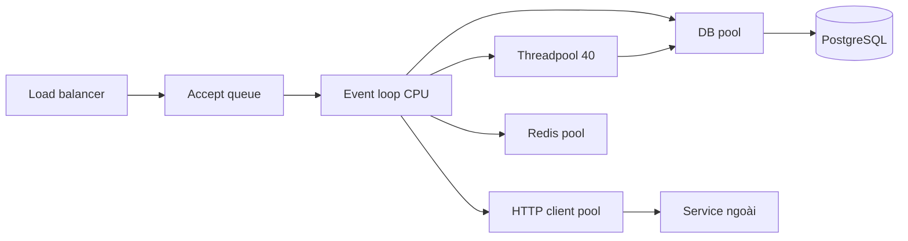
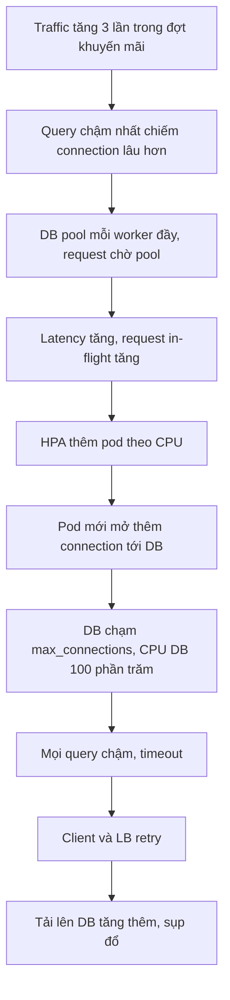

# Hiệu năng của ứng dụng FastAPI

## 1. Tổng quan

"FastAPI nhanh" là nhận định về **framework overhead**: phần thời gian mà Starlette, Pydantic và Uvicorn tốn cho mỗi request là nhỏ. Nhưng latency và throughput của một service thực tế được quyết định bởi **toàn bộ đường đi** của request: hàng đợi trước application, event loop, threadpool, validation, serialization, connection pool, database, cache, service phụ thuộc, và network.

Tối ưu hiệu năng là tìm ra **tài nguyên nào bão hòa đầu tiên** ở mức tải mục tiêu, rồi quyết định có nên làm nó rộng hơn, rẻ hơn, hay đi vòng qua nó.

## 2. Mental Model

> Một request là một chuỗi hàng đợi nối tiếp. Throughput của cả chuỗi bằng throughput của khâu hẹp nhất; latency bằng tổng thời gian phục vụ cộng tổng thời gian **chờ** ở mỗi khâu. Khi một khâu gần bão hòa, thời gian chờ ở đó tăng vọt.



Diễn giải: mỗi hộp là một tài nguyên có giới hạn và có hàng đợi phía trước. Request có thể chờ ở accept queue (worker bận), chờ loop rảnh, chờ thread, chờ connection DB, chờ lock trong DB, chờ service ngoài. Chỉ số trung bình che giấu những hàng đợi này; p95/p99 và metric "wait time" của từng pool làm lộ chúng.

## 3. Vì sao cần phương pháp, không phải mẹo?

Các "mẹo" (dùng orjson, bật uvloop, tăng worker) chỉ hiệu quả khi chúng nhắm vào đúng bottleneck. Tăng worker khi bottleneck là database làm tệ hơn: nhiều connection hơn, tranh chấp lock hơn. Đổi sang async khi bottleneck là CPU không cải thiện gì.

Quy trình đúng: **đo baseline → tìm bottleneck → thay đổi một thứ → đo lại**.

## 4. Phân rã chi phí của một request

Ví dụ một request `GET /claims/{id}` điển hình:

| Giai đoạn | Chạy ở đâu | Chi phí điển hình |
|---|---|---|
| TLS, routing ở LB | Load balancer | 1–3 ms |
| Parse HTTP, tạo scope | Event loop | vài chục µs |
| Middleware (3–5 cái) | Event loop | 0.05–0.5 ms |
| Giải dependency, verify JWT | Event loop hoặc threadpool | 0.1–1 ms |
| Validation input | Event loop (Rust) | vài µs tới vài ms tùy payload |
| Lấy connection từ pool | Chờ | 0 ms nếu rảnh; không giới hạn nếu cạn |
| Query DB | Chờ I/O | 1–50 ms |
| Gọi service khác | Chờ I/O | 10–200 ms |
| Serialize response | Event loop | vài µs tới hàng chục ms với response lớn |
| Ghi response | Event loop | nhỏ |

Phần **chạy trên event loop** quyết định giới hạn CPU của một worker. Phần **chờ** quyết định latency và số request đồng thời cần giữ.

## 5. Các đòn bẩy hiệu năng

### Tầng framework và server

- **uvloop + httptools**: cài `uvicorn[standard]`; giảm overhead event loop và parse HTTP.
- **Serialize trực tiếp bằng Pydantic**: khai báo `response_model`/return type để FastAPI serialize bằng Pydantic core; tránh `jsonable_encoder` thủ công trên cấu trúc lớn.
- **Middleware**: ít và nhẹ; pure ASGI middleware cho đường nóng. Xem [Middleware](middleware.md).
- **Dependency**: `async def` cho dependency không I/O để tránh chuyển thread.

### Tầng dữ liệu (thường là đòn bẩy lớn nhất)

- Loại bỏ [N+1 query](../05-sqlalchemy/n-plus-one.md); chỉ `SELECT` cột cần thiết; index đúng. Xem [Query Optimization](../04-database-postgresql/query-optimization.md).
- Transaction ngắn; không giữ connection trong lúc gọi service ngoài.
- Cache kết quả đọc nhiều bằng Redis với chiến lược rõ ràng. Xem [Cache Patterns](../06-redis/cache-patterns.md).
- Pagination bằng cursor thay vì offset lớn. Xem [Pagination](../08-api-design/pagination.md).

### Tầng concurrency

- Gọi dependency độc lập **đồng thời** (`TaskGroup`) thay vì tuần tự.
- Mọi lời gọi ra ngoài có timeout và giới hạn concurrency.
- Đẩy công việc CPU nặng ra khỏi request path.

### Tầng payload

- Response nhỏ: không trả dữ liệu client không dùng; pagination.
- Nén ở LB/CDN thay vì trong Python.
- Upload/download lớn qua pre-signed URL của object storage thay vì đi qua API.

## 6. Ví dụ: tuần tự và đồng thời

```python
# Trước: 45 + 60 + 30 = 135 ms chờ tuần tự
@app.get("/vehicles/{vin}/summary")
async def summary(vin: str, deps: Deps):
    vehicle = await deps.vehicles.get(vin)
    warranty = await deps.warranty.coverage(vin)
    recalls = await deps.recalls.open_for(vin)
    return build_summary(vehicle, warranty, recalls)

# Sau: max(45, 60, 30) = 60 ms
@app.get("/vehicles/{vin}/summary")
async def summary(vin: str, deps: Deps):
    async with asyncio.TaskGroup() as tg:
        vehicle = tg.create_task(deps.vehicles.get(vin))
        warranty = tg.create_task(deps.warranty.coverage(vin))
        recalls = tg.create_task(deps.recalls.open_for(vin))
    return build_summary(vehicle.result(), warranty.result(), recalls.result())
```

Lưu ý: ba lời gọi đồng thời có thể dùng ba connection DB cùng lúc nếu chúng cùng dùng database, và một `AsyncSession` **không** được dùng đồng thời từ nhiều task. Mỗi task cần session riêng, hoặc gộp thành một query.

## 7. Khi scale lên thì chuyện gì xảy ra?

Giả định: mỗi request tốn 3 ms CPU trên loop, 1–2 query DB (tổng 8 ms), đôi khi gọi một service ngoài 40 ms; mỗi worker pool DB 10 connection.

### 100 RPS

- CPU: 0.3 core. Một pod 2 worker là thừa.
- DB: ~1 query đồng thời trung bình.
- Không có hàng đợi đáng kể; p99 ≈ thời gian phục vụ.
- Rủi ro chính: code blocking lẻ tẻ chưa lộ ra vì tải thấp.

### 1.000 RPS

- CPU: 3 core → cần ~5 worker ở 60–70% utilization.
- DB: 1.000 × 1.5 query × 8 ms ≈ 12 connection bận trung bình; tổng pool 5 × 10 = 50, đủ.
- Bottleneck bắt đầu lộ: query chậm nhất (không index, N+1), CPU serialize của endpoint trả list lớn.
- Cache bắt đầu có ý nghĩa cho dữ liệu đọc nhiều.

### 10.000 RPS

- CPU: 30 core → ~50 worker, ví dụ 13 pod × 4 worker.
- Connection: 50 worker × 10 = 500 connection tới PostgreSQL — vượt ngưỡng hợp lý của một instance. Cần **PgBouncer** (transaction pooling) hoặc giảm pool mỗi worker.
- DB: 15.000 query/giây — cần cache hit ratio cao, read replica cho đọc chấp nhận stale, query tối ưu. Write path có thể thành bottleneck.
- Service ngoài: 10.000 × tỷ lệ gọi — cần kiểm tra quota/rate limit của họ; cần [circuit breaker](../10-distributed-systems/circuit-breaker.md) và timeout chặt.
- Load balancer, NAT, số kết nối outbound bắt đầu là vấn đề.

### 20.000 RPS

- Mọi thứ ở mức 10.000 nhân đôi; database primary gần như chắc chắn là giới hạn cho write.
- Cần: tách read/write, partition hoặc shard dữ liệu nóng, đưa write không cần đồng bộ qua queue, rate limit và load shedding để bảo vệ core.
- Hot key trong cache (một sản phẩm hot) có thể làm bão hòa một node Redis. Xem [Cache Problems](../06-redis/cache-problems.md).
- Chi phí cold start và deploy: rolling update 60 pod cần thời gian; warm-up cache và pool.

Bottleneck di chuyển từ **code của ứng dụng** (100–1.000 RPS) sang **tài nguyên dùng chung** (DB, cache, dependency) ở mức cao hơn. Xem phân tích chi tiết trong [High Traffic](../20-production-incidents/high-traffic.md) và [Database Scaling](../11-system-design/database-scaling.md).

## 8. Failure Chain: tăng tải làm service sụp đổ



Diễn giải:

1. Tải tăng làm lộ query chậm; connection bị giữ lâu hơn.
2. Pool cạn, request xếp hàng chờ connection — CPU của pod không cao, nhưng latency cao.
3. Autoscaler (nếu theo CPU hoặc latency) thêm pod. Mỗi pod mới mang theo pool riêng → tổng connection tăng.
4. Database, vốn là bottleneck thật, nhận thêm connection và query → chậm hơn.
5. Timeout sinh retry → tải càng tăng.

Cách phá vòng: giới hạn tổng connection (PgBouncer), giới hạn autoscale theo capacity của DB, [load shedding](../10-distributed-systems/backpressure.md) khi pool wait vượt ngưỡng, retry có budget và jitter, và tối ưu query gốc.

## 9. Bottleneck thường gặp

| Bottleneck | Dấu hiệu | Hướng xử lý |
|---|---|---|
| Blocking code trong `async def` | Loop lag cao, mọi endpoint chậm | Đổi thư viện async hoặc `to_thread` |
| CPU event loop | CPU worker ~100%, loop lag tăng dần theo tải | Thêm worker, giảm CPU/request (serialize, validate) |
| Threadpool | Endpoint `def` chậm, CPU thấp | Async hóa, tăng token có tính toán, timeout |
| DB pool | Pool wait cao, DB không bận | Transaction ngắn hơn, tăng pool trong giới hạn |
| DB CPU/IO | Query chậm, DB CPU cao | Index, tối ưu query, cache, replica |
| Service ngoài | Span HTTP dài | Timeout, cache, gọi đồng thời, circuit breaker |
| Payload lớn | CPU serialize, băng thông | Pagination, field selection, nén ở LB |

## 10. Trade-offs

| Tối ưu | Lợi ích | Chi phí |
|---|---|---|
| Cache | Giảm tải DB, latency thấp | Stale data, invalidation, thêm failure mode |
| Thêm worker/pod | Nhiều CPU hơn | Nhiều connection hơn, chi phí hạ tầng |
| Read replica | Tách tải đọc | Replication lag, đọc dữ liệu cũ |
| Gọi đồng thời | Latency thấp | Nhiều connection đồng thời, phức tạp khi lỗi |
| Pre-computation (materialized view, bảng tổng hợp) | Đọc rất nhanh | Dữ liệu trễ, chi phí ghi |

## 11. Sai lầm thường gặp

- Benchmark endpoint "hello world" rồi kết luận về hiệu năng service.
- Load test với dữ liệu nhỏ, cache nóng, một user — không giống production.
- Chỉ nhìn latency trung bình.
- Tăng worker/pod khi bottleneck là database.
- Tối ưu vi mô (orjson, uvloop) trước khi sửa N+1 query.

## 12. Cách debug trong production

Đi theo thứ tự, từ ngoài vào trong:

1. **RPS và phân bố latency** (p50/p95/p99) theo route; tách route chậm.
2. **Error rate và loại lỗi** (timeout, 503, 500).
3. **Saturation của worker**: CPU mỗi worker, loop lag, request in-flight, threadpool đang dùng.
4. **Memory và GC**: RSS mỗi worker, GC pause nếu có spike định kỳ.
5. **Pool**: DB pool in-use và wait time; HTTP client pool; Redis pool.
6. **Database**: query latency theo loại (`pg_stat_statements`), lock wait, CPU/IO, connection count.
7. **Cache**: hit ratio, latency Redis, key hot.
8. **Dependency**: latency và error của từng service ngoài.
9. **Trace** của request chậm cụ thể: span nào dài, khoảng trống nào lớn.
10. **Profile** worker đang nóng bằng `py-spy` nếu CPU là vấn đề.

Chi tiết quy trình ở [Performance Debugging](../17-performance-reliability/performance-debugging.md) và [API Slow](../20-production-incidents/api-slow.md).

## 13. Best Practices

- Đặt mục tiêu (SLO) cho p95/p99 và throughput trước khi tối ưu.
- Load test với dữ liệu và traffic giống production, tăng tải dần để tìm điểm gãy.
- Ưu tiên tối ưu tầng dữ liệu; sau đó concurrency; sau cùng là framework.
- Tính connection budget toàn hệ thống; giới hạn autoscale theo capacity của tài nguyên dùng chung.
- Mọi pool có metric wait time; mọi dependency có timeout.
- Theo dõi loop lag cùng với latency.

## 14. Tóm tắt

- Framework overhead của FastAPI nhỏ; hiệu năng thực tế do toàn đường đi của request quyết định.
- Request là chuỗi hàng đợi; khâu hẹp nhất quyết định throughput, thời gian chờ quyết định tail latency.
- Phần chạy trên event loop giới hạn CPU mỗi worker; phần chờ giới hạn bởi pool và dependency.
- Khi scale từ 100 lên 20.000 RPS, bottleneck di chuyển từ code ứng dụng sang database, cache và dependency.
- Thêm pod khi database là bottleneck có thể gây sụp đổ dây chuyền.

## Liên quan

- [Kiến trúc FastAPI](architecture.md)
- [Sync vs Async Endpoint](sync-vs-async-endpoint.md)
- [Connection Pooling](../04-database-postgresql/connection-pooling.md)
- [Performance Debugging](../17-performance-reliability/performance-debugging.md)
- [Load Testing](../17-performance-reliability/load-testing.md)
- [High Traffic](../20-production-incidents/high-traffic.md)
