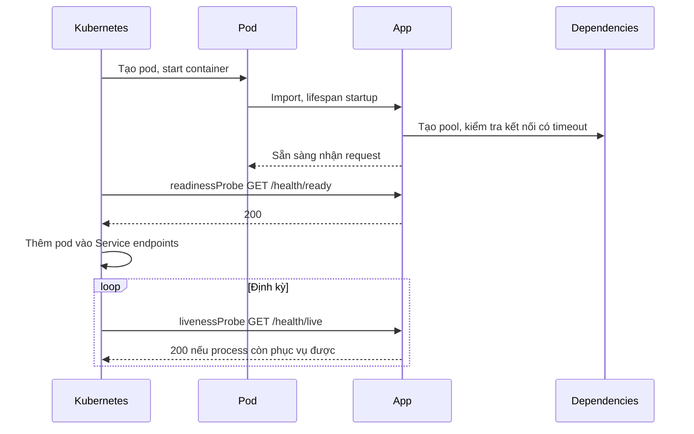
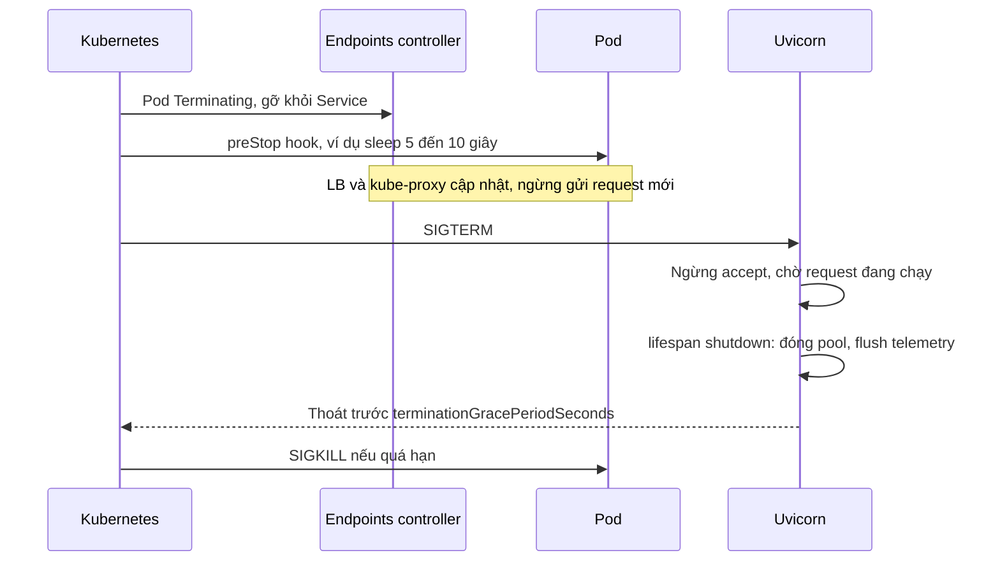

# Vận hành FastAPI trong production

## 1. Tổng quan

Một ứng dụng FastAPI chạy được trên laptop khác xa một service chạy ổn định dưới tải thật, qua hàng trăm lần deploy, với dependency thỉnh thoảng lỗi. Khoảng cách đó nằm ở các quyết định vận hành: cách chạy process, vòng đời tài nguyên, shutdown, health check, timeout ở từng tầng, cấu hình, logging, và bảo mật mặc định.

Tài liệu này tổng hợp các quyết định đó và **lý do** đằng sau từng quyết định. Mỗi mục liên kết tới tài liệu chi tiết.

## 2. Mental Model

> Production readiness là việc trả lời trước những câu hỏi mà sự cố sẽ hỏi: khi pod bị tắt thì request đang chạy ra sao? khi database chậm thì request chờ bao lâu? khi cấu hình sai thì service phát hiện lúc nào? khi có lỗi thì tìm log bằng cách nào?

## 3. Process và worker

- Chọn mô hình: Uvicorn `--workers N` hoặc Gunicorn + `uvicorn_worker.UvicornWorker`. Xem [Kiến trúc FastAPI](architecture.md#6-process-model-uvicorn-workers-và-gunicorn).
- Số worker khớp với CPU limit của container; không đặt 8 worker trong pod giới hạn 1 CPU.
- Cài `uvicorn[standard]` để có uvloop và httptools.
- Worker recycling (`--max-requests` với jitter trong Gunicorn) như lưới an toàn cho memory leak chậm từ thư viện; không thay cho việc sửa leak.

## 4. Vòng đời tài nguyên

| Tài nguyên | Scope | Nơi tạo/đóng |
|---|---|---|
| DB engine / pool, Redis pool, HTTP client, SDK client | Application | `lifespan` |
| DB session, transaction, request context | Request | Dependency có `yield` |
| Config | Application | Load và validate lúc khởi động |

Không tạo client ở module level (khó kiểm soát, không đóng được, chia sẻ sai qua fork) và không tạo client mỗi request (mất connection pooling, tốn TLS handshake).

## 5. Khởi động và readiness

Diễn giải:

1. Pod chỉ nhận traffic sau khi readiness trả 200.
2. **Readiness** trả lời "có nên gửi traffic cho tôi không?" — có thể kiểm tra dependency thiết yếu (DB có kết nối được không) với timeout ngắn.
3. **Liveness** trả lời "tôi có bị treo không cần restart không?" — chỉ kiểm tra chính process (event loop còn phản hồi). **Không** kiểm tra dependency: nếu DB chết, liveness fail sẽ làm Kubernetes restart mọi pod, không sửa được gì mà còn tạo restart storm.
4. `startupProbe` cho ứng dụng khởi động chậm, tránh liveness giết pod trong lúc đang khởi động.

Xem [Health Check](../13-kubernetes/health-check.md).

## 6. Graceful shutdown

Diễn giải:

1. Việc gỡ pod khỏi Service và việc gửi SIGTERM xảy ra **song song**; LB có thể vẫn gửi request tới pod trong vài giây sau SIGTERM. `preStop` sleep ngắn cho các thành phần định tuyến kịp cập nhật.
2. Uvicorn nhận SIGTERM, ngừng nhận kết nối mới, chờ request đang xử lý (tới `--timeout-graceful-shutdown`).
3. Lifespan shutdown đóng pool, flush log/trace/metric.
4. `terminationGracePeriodSeconds` phải lớn hơn preStop + thời gian request dài nhất + shutdown.

Thiếu bất kỳ bước nào → lỗi 502/503 tăng vọt mỗi lần deploy. Xem [Rolling Update](../13-kubernetes/rolling-update.md).

## 7. Timeout ở từng tầng

Timeout phải **giảm dần** từ ngoài vào trong: tầng trong hết hạn trước để tầng ngoài còn thời gian trả lỗi có ý nghĩa.

| Tầng | Ví dụ | Ghi chú |
|---|---|---|
| Client / API Gateway | 30 s | Giới hạn trên |
| Load balancer idle timeout | 60 s | Keep-alive của Uvicorn phải **dài hơn** giá trị này để tránh 502 |
| Deadline nghiệp vụ của request | 10 s | Truyền xuống dưới dạng deadline |
| Lời gọi service ngoài | 2 s connect + read | Mỗi lời gọi, nhỏ hơn deadline còn lại |
| Pool checkout | 1–3 s | Fail nhanh thay vì chờ vô hạn |
| Query DB (`statement_timeout`) | 2–5 s | Đặt ở role hoặc session |
| Lock wait (`lock_timeout`) | 1–2 s | Tránh chờ lock vô hạn |

Xem [Timeout](../10-distributed-systems/timeout.md).

## 8. Cấu hình

- Dùng `pydantic-settings`: đọc biến môi trường, validate kiểu lúc khởi động. Cấu hình sai làm worker fail ngay khi start — phát hiện trong rollout thay vì lúc 3 giờ sáng.
- Secret đọc từ secret manager hoặc Kubernetes Secret gắn vào env/file; không commit vào repo, không in ra log. Xem [Secrets Management](../16-security/secrets-management.md).
- Cấu hình khác nhau giữa môi trường chỉ qua biến, không qua nhánh code.

## 9. Logging, metrics, tracing

- **Log có cấu trúc (JSON)** với các field cố định: timestamp, level, request_id, trace_id, route, status, duration, tenant (đã ẩn danh nếu cần).
- **Request ID** sinh ở middleware ngoài cùng (hoặc nhận từ header upstream), lưu trong `contextvars`, gắn vào mọi log và response header.
- **Metrics** RED theo route (rate, errors, duration histogram), cùng saturation: loop lag, threadpool, pool DB, in-flight.
- **Tracing** với OpenTelemetry: instrument ASGI, HTTP client, SQLAlchemy, Redis; lan truyền context qua message queue.
- Lọc dữ liệu nhạy cảm (header `Authorization`, cookie, PII) khỏi log và trace.

Xem [Observability](../17-performance-reliability/observability.md) và [Metrics, Logging và Tracing](../17-performance-reliability/metrics-logging-tracing.md).

## 10. Bảo vệ đầu vào

- Giới hạn kích thước body ở LB/Ingress.
- Giới hạn độ dài chuỗi, số phần tử list trong Pydantic model.
- Rate limit ở gateway hoặc bằng dependency dùng Redis. Xem [Rate Limiting](../08-api-design/rate-limiting.md).
- `TrustedHostMiddleware`, CORS chặt, header bảo mật.
- Tắt hoặc bảo vệ `/docs`, `/openapi.json` trên môi trường public nếu API không công khai.

## 11. Proxy và địa chỉ client

Sau LB, `request.client.host` là IP của LB. Bật `--proxy-headers` và đặt `--forwarded-allow-ips` bằng dải IP của LB, để Uvicorn tin `X-Forwarded-For` **chỉ** từ proxy đáng tin. Tin header này từ mọi nguồn cho phép client giả IP để né rate limit.

## 12. Database migration

- Chạy migration (Alembic) bằng **job riêng** trước khi deploy phiên bản mới, không trong lifespan của mọi worker (N worker cùng chạy migration → tranh chấp lock).
- Migration phải tương thích ngược theo mô hình expand/contract để phiên bản cũ và mới cùng chạy được trong rolling update. Xem [Rollback](../15-terraform-cicd/rollback.md).
- Thao tác khóa bảng lớn (thêm cột có default ở version cũ, tạo index không `CONCURRENTLY`) có thể làm service đứng. Đặt `lock_timeout` cho migration.

## 13. Container

- Image tối giản, non-root user, dependency pin theo lockfile.
- Process chính nhận signal đúng (exec form trong `CMD`, hoặc init như `tini`).
- Không ghi file vào filesystem của container trừ thư mục tạm; dữ liệu bền vững ở storage ngoài.

Xem [Docker Production](../12-docker/production-best-practices.md).

## 14. Failure Modes

| Failure | Nguyên nhân | Dấu hiệu |
|---|---|---|
| 502/503 mỗi lần deploy | Thiếu preStop, graceful shutdown ngắn | Spike lỗi đúng thời điểm rollout |
| Restart storm khi DB lỗi | Liveness kiểm tra DB | Mọi pod restart liên tục |
| 502 ngẫu nhiên | Keep-alive server ngắn hơn LB idle timeout | Lỗi rải rác không theo tải |
| Request treo | Không timeout ở pool/query/HTTP | In-flight tăng, không có lỗi |
| Migration khóa bảng | Migration chạy trong startup hoặc không `lock_timeout` | Service đứng khi deploy |
| Rate limit bị né | Tin `X-Forwarded-For` từ mọi nguồn | Một client gửi quá hạn mức |

## 15. Checklist trước khi lên production

- [ ] Worker count khớp CPU limit; connection budget toàn hệ thống đã tính.
- [ ] Tài nguyên dùng chung trong lifespan; session theo request trong dependency.
- [ ] Readiness và liveness tách biệt; liveness không phụ thuộc dependency.
- [ ] Graceful shutdown: preStop, SIGTERM, grace period đủ dài.
- [ ] Timeout ở mọi tầng, giảm dần từ ngoài vào trong.
- [ ] Config validate lúc khởi động; secret không nằm trong code/log.
- [ ] Log JSON có request ID/trace ID; metric RED + saturation; tracing.
- [ ] Giới hạn kích thước request và input; rate limit.
- [ ] Proxy headers chỉ tin IP của LB.
- [ ] Migration chạy riêng, tương thích ngược.

## 16. Tóm tắt

- Production readiness là trả lời trước cách service hành xử khi tắt, khi dependency chậm, khi cấu hình sai, khi có lỗi.
- Tài nguyên theo đúng vòng đời: application trong lifespan, request trong dependency.
- Readiness khác liveness; liveness không kiểm tra dependency.
- Graceful shutdown cần phối hợp preStop, SIGTERM, graceful timeout và grace period.
- Timeout giảm dần từ ngoài vào trong; keep-alive của server dài hơn idle timeout của LB.

## Liên quan

- [Kiến trúc FastAPI](architecture.md)
- [Performance](performance.md)
- [Health Check](../13-kubernetes/health-check.md)
- [Timeout](../10-distributed-systems/timeout.md)
- [Observability](../17-performance-reliability/observability.md)
- [Docker Production](../12-docker/production-best-practices.md)
