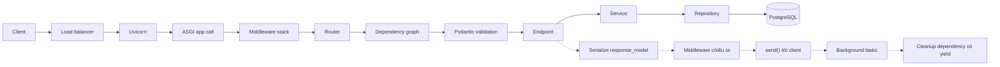
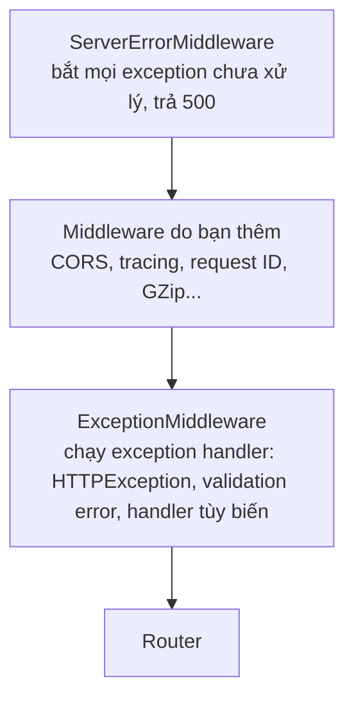
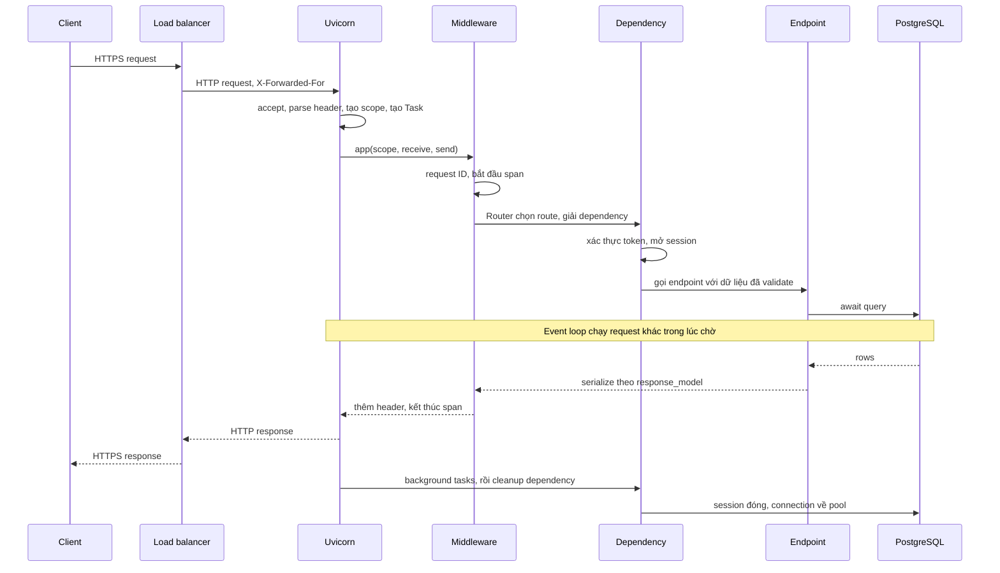

# Request Lifecycle trong FastAPI

## 1. Tổng quan

Một request HTTP tới FastAPI đi qua nhiều tầng trước khi tới dòng code đầu tiên trong endpoint, và đi qua nhiều tầng nữa sau khi endpoint return. Mỗi tầng có thể thêm latency, ném lỗi, giữ tài nguyên, hoặc bị cancel.

```text
Client
↓
Load Balancer
↓
Uvicorn (socket, HTTP parser, event loop)
↓
ASGI (scope, receive, send)
↓
Middleware
↓
Router
↓
Dependency Injection
↓
Validation (Pydantic)
↓
Endpoint
↓
Service
↓
Repository
↓
Database
```

Tài liệu này đi qua từng bước theo chiều vào và chiều ra, chỉ ra điều gì xảy ra ở mỗi bước, ai sở hữu tài nguyên, và lỗi nào có thể xuất hiện.

## 2. Mental Model

> Một request là một **scope có thời hạn** với quyền sở hữu tài nguyên rõ ràng: được tạo khi request tới, làm việc, trả response, và dọn dẹp — kể cả khi có exception hoặc cancellation.

Chiều vào xây dựng context (parse, xác thực, mở session). Chiều ra phá dỡ context theo thứ tự ngược lại (serialize, commit/rollback, đóng session, ghi log). Cấu trúc này giống một chồng [context manager](../01-python-core/context-manager.md) lồng nhau.

## 3. Vì sao cần hiểu lifecycle?

- Biết **đặt logic ở đâu**: middleware, dependency hay endpoint.
- Biết **latency đến từ đâu**: chờ trong accept queue, chờ threadpool, validation, query, serialization.
- Biết **tài nguyên được giải phóng lúc nào**: session DB đóng trước hay sau khi response gửi đi.
- Biết **lỗi được xử lý ở tầng nào** và vì sao có lỗi trả về 500 dạng text thay vì JSON.

## 4. Luồng xử lý tổng thể



Đường liền là chiều vào; đường đứt là chiều ra. Phần dưới đây mô tả từng bước.

## 5. Bên trong hệ thống xảy ra gì? Chiều vào

### Bước 1 — Load balancer

Load balancer (ALB, Nginx, Ingress controller) nhận kết nối TLS từ client, thường **terminate TLS**, chọn một pod theo thuật toán cân bằng tải, và mở (hoặc tái sử dụng) kết nối HTTP tới pod. Nó thêm header `X-Forwarded-For`, `X-Forwarded-Proto`. Timeout ở tầng này (idle timeout, request timeout) là giới hạn trên cho mọi thứ bên dưới. Xem [Load Balancer](../11-system-design/load-balancer.md).

### Bước 2 — Uvicorn nhận kết nối

1. Kernel hoàn tất TCP handshake và đặt kết nối vào **accept queue** của socket đang listen. Nếu worker bận (event loop bị block), kết nối nằm ở đây — latency tăng mà application không hề thấy.
2. Event loop của worker `accept` kết nối, tạo transport và một instance protocol HTTP.
3. Byte tới được parser (httptools) xử lý: method, path, header. Khi đủ header, Uvicorn tạo **scope** ASGI.
4. Uvicorn tạo một **Task** mới chạy `app(scope, receive, send)`. Từ đây request có coroutine riêng trên event loop.

Body **chưa** được đọc lúc này. Body đến dần qua `receive()`.

### Bước 3 — Middleware stack

Starlette dựng một chồng ASGI app lồng nhau. Với FastAPI, thứ tự từ ngoài vào trong là:



Diễn giải:

1. **ServerErrorMiddleware** ngoài cùng: exception không ai xử lý sẽ tới đây và thành response 500 (và được log).
2. **Middleware của bạn** ở giữa; middleware thêm sau cùng bằng `add_middleware` nằm **ngoài cùng** trong nhóm này.
3. **ExceptionMiddleware** gần router: chuyển `HTTPException`, `RequestValidationError` và exception có handler đăng ký thành response.
4. **Router** chọn route.

Vì exception handler nằm **trong** middleware của bạn, middleware nhìn thấy response đã được xử lý (ví dụ 404, 422), nhưng exception không có handler sẽ đi xuyên qua middleware của bạn tới ServerErrorMiddleware. Chi tiết ở [Middleware](middleware.md) và [Error Handling](error-handling.md).

### Bước 4 — Routing

Router duyệt danh sách route theo **thứ tự đăng ký**, so khớp path với regex đã compile từ path template (`/claims/{claim_id}`) và method. Route đầu tiên khớp thắng. Path parameter được trích xuất vào `scope["path_params"]`.

Hệ quả: `/users/me` phải đăng ký **trước** `/users/{user_id}`, nếu không `"me"` bị coi là `user_id` và validation `int` thất bại với 422.

### Bước 5 — Dependency resolution

FastAPI đã phân tích signature của endpoint lúc import (xem [Typing](../01-python-core/typing.md)). Với mỗi request, nó giải **dependency graph**:

1. Duyệt đồ thị theo chiều sâu; dependency con được giải trước dependency cha.
2. Mỗi dependency được gọi **tối đa một lần mỗi request** (trừ khi `use_cache=False`) — nếu `get_session` được dùng bởi ba dependency khác nhau, cả ba nhận cùng một session.
3. Dependency `async def` chạy trên event loop; dependency `def` chạy trong **threadpool**.
4. Dependency có `yield`: phần trước `yield` chạy ngay; phần sau `yield` được đăng ký vào một `AsyncExitStack` để chạy khi dọn dẹp.
5. Dependency có thể raise `HTTPException` (ví dụ 401) để dừng request trước khi tới endpoint.

Chi tiết ở [Dependency Injection](dependency-injection.md).

### Bước 6 — Đọc body và validation

1. Nếu endpoint cần body, FastAPI gọi `await request.body()` (hoặc form parser): lặp `receive()` tới khi hết body. Toàn bộ body được đọc vào memory — body 100 MB chiếm 100 MB.
2. Body JSON được parse và validate bằng Pydantic theo model khai báo. Path, query, header, cookie được validate theo type hint.
3. Lỗi validation được gom lại thành `RequestValidationError` → ExceptionMiddleware trả **422** với danh sách lỗi chi tiết.

Validation bằng Pydantic v2 chạy trong code Rust đã compile, nhưng vẫn tốn CPU trên event loop — với payload lớn, đây là chi phí đáng kể. Xem [Validation với Pydantic](validation-pydantic.md).

### Bước 7 — Endpoint

- `async def` endpoint: được `await` trực tiếp trên event loop.
- `def` endpoint: chạy trong threadpool AnyIO (40 token mặc định mỗi worker).

Xem [Sync vs Async Endpoint](sync-vs-async-endpoint.md).

### Bước 8 — Service, repository, database

Endpoint gọi service (logic nghiệp vụ), service gọi repository (truy cập dữ liệu), repository dùng session để gửi query. Mỗi `await` tới database là một điểm event loop có thể chạy request khác. Connection được lấy từ pool khi query đầu tiên chạy (hoặc khi transaction bắt đầu) và giữ tới khi transaction kết thúc. Xem [Session Lifecycle](../05-sqlalchemy/session-lifecycle.md).

## 6. Bên trong hệ thống xảy ra gì? Chiều ra

### Bước 9 — Serialize response

1. Giá trị endpoint trả về được validate và serialize theo `response_model` (hoặc return type annotation). Field không có trong model bị loại — đây là lớp bảo vệ chống rò rỉ dữ liệu (không trả `password_hash` dù ORM object có).
2. Kết quả được đóng gói thành `JSONResponse` (hoặc response class được chỉ định).

Serialize danh sách lớn (10.000 object) là chi phí CPU đáng kể, chạy trên event loop.

### Bước 10 — Middleware chiều ra

Response đi ngược qua middleware: thêm header (request ID, timing), nén (GZip), ghi log truy cập, kết thúc span tracing.

### Bước 11 — Gửi response

Starlette gọi `send({"type": "http.response.start", ...})` rồi `send({"type": "http.response.body", ...})`. Uvicorn ghi byte vào transport. Nếu client đọc chậm, buffer ghi đầy và `send` tạm dừng (backpressure).

### Bước 12 — Background tasks

`BackgroundTasks` được chạy **sau khi** response đã gửi xong, trong cùng Task, trên cùng worker. Client đã nhận response nhưng worker vẫn đang bận. Xem [Background Task](background-task.md).

### Bước 13 — Cleanup dependency có `yield`

`AsyncExitStack` chạy phần sau `yield` của các dependency theo thứ tự **ngược** với lúc khởi tạo: đóng session, trả connection về pool, nhả lock.

> **Ghi chú version:** Thời điểm chạy phần sau `yield` so với lúc gửi response (và so với background task) đã thay đổi qua các version FastAPI — có thay đổi lớn ở 0.106.0 và các version gần đây bổ sung tùy chọn scope cho dependency. Không thiết kế logic đúng đắn (ví dụ commit transaction) dựa trên giả định về thứ tự này; commit tường minh trong service trước khi return, và không dùng session của request bên trong background task.

### Bước 14 — Keep-alive

Kết nối HTTP/1.1 được giữ mở cho request tiếp theo tới hết `--timeout-keep-alive`.

## 7. Toàn bộ vòng đời trên một sequence diagram



Diễn giải: điểm quan trọng nhất nằm ở cuối diagram — **client đã nhận response trước khi connection DB được trả về pool** (tùy version và cấu hình), và trước khi background task chạy xong. Thời gian giữ tài nguyên của một request dài hơn latency mà client thấy.

## 8. Ví dụ: đo thời gian từng tầng

```python
import time
from starlette.types import ASGIApp, Receive, Scope, Send

class TimingMiddleware:
    def __init__(self, app: ASGIApp):
        self.app = app

    async def __call__(self, scope: Scope, receive: Receive, send: Send):
        if scope["type"] != "http":
            return await self.app(scope, receive, send)
        start = time.perf_counter()

        async def send_wrapper(message):
            if message["type"] == "http.response.start":
                elapsed_ms = (time.perf_counter() - start) * 1000
                headers = list(message.get("headers", []))
                headers.append((b"server-timing", f"app;dur={elapsed_ms:.1f}".encode()))
                message["headers"] = headers
            await send(message)

        await self.app(scope, receive, send_wrapper)
```

Middleware ASGI thuần bọc `send` để đo thời gian tới lúc bắt đầu gửi response và thêm header `Server-Timing`. Nó không đọc body, không phá streaming. So sánh con số này với latency ở load balancer cho biết thời gian nằm ngoài application (accept queue, network).

## 9. Hành vi trong production

- **Thời gian chờ ẩn**: latency client thấy = chờ ở LB + chờ trong accept queue + chờ event loop rảnh + chờ threadpool/pool + thời gian xử lý thật. Tracing trong application chỉ thấy phần sau cùng.
- **Client ngắt kết nối**: nếu client đóng kết nối giữa chừng, `receive()` trả về `http.disconnect`. Tùy server và cách xử lý, Task có thể bị cancel. Transaction đang dở được rollback nhờ cleanup, nhưng tác dụng phụ bên ngoài (gọi API thanh toán) có thể đã xảy ra.
- **Request body lớn**: đọc toàn bộ vào memory. Giới hạn kích thước body ở LB/Ingress và xử lý upload lớn bằng streaming hoặc pre-signed URL tới object storage.
- **Exception trong cleanup**: lỗi khi đóng session sau khi response đã gửi không thể thay đổi response nữa; chỉ còn log.

## 10. Failure Modes

| Tầng | Failure | Dấu hiệu |
|---|---|---|
| Accept queue | Worker bận, event loop bị block | Latency ở LB cao hơn nhiều so với latency trong app |
| Routing | Thứ tự route sai | 422 bất ngờ, route không bao giờ được gọi |
| Dependency | Dependency sync chậm chiếm threadpool | Latency tăng ở mọi endpoint dùng dependency đó |
| Validation | Payload lớn, model lồng sâu | CPU event loop cao |
| Endpoint | Blocking call trong `async def` | Loop lag, mọi request chậm |
| Serialize | Response rất lớn | CPU cao, memory spike |
| Background | Task nặng sau response | Worker bận dù không có request, lỗi không ai thấy |
| Cleanup | Session dùng sau khi đóng | Lỗi trong background task truy cập DB |

## 11. Trade-offs: đặt logic ở tầng nào?

| Logic | Tầng phù hợp | Lý do |
|---|---|---|
| Request ID, tracing, timing, CORS, nén | Middleware | Áp dụng cho mọi request, không cần biết route |
| Xác thực, phân quyền theo route | Dependency | Biết route, trả lỗi có cấu trúc, test override dễ |
| DB session, transaction scope | Dependency có `yield` | Vòng đời gắn với request, cleanup đảm bảo |
| Kiểm tra định dạng dữ liệu | Pydantic model | Khai báo, sinh OpenAPI |
| Quy tắc nghiệp vụ | Service | Độc lập framework, test được |
| Truy cập dữ liệu | Repository | Tách khỏi nghiệp vụ |

## 12. Sai lầm thường gặp

- Đặt xác thực vào middleware rồi phải tự parse route để biết endpoint nào cần bảo vệ.
- Đọc body trong middleware kiểu `BaseHTTPMiddleware`, làm hỏng streaming và tăng memory.
- Dùng session DB của request trong background task.
- Tin rằng latency trong trace là latency người dùng thấy.
- Khai báo route động trước route tĩnh cùng tiền tố.

## 13. Cách debug trong production

1. So sánh latency ở LB (access log của LB/Ingress) với latency trong application (middleware timing): chênh lệch lớn → chờ trước application (accept queue, event loop).
2. Distributed tracing với span cho dependency, query, lời gọi ngoài; span gốc bắt đầu ở middleware.
3. Metric: request in-flight mỗi worker, loop lag, threadpool đang bận, pool wait.
4. Log có request ID xuyên suốt các tầng, kể cả background task và cleanup.
5. Với lỗi 500 dạng text: exception đi thẳng tới ServerErrorMiddleware, chưa có handler — thêm handler cho loại exception đó.

## 14. Best Practices

- Middleware chỉ làm việc cross-cutting, nhẹ, không đọc body.
- Xác thực, phân quyền, session qua dependency.
- Endpoint mỏng: nhận dữ liệu đã validate, gọi service, trả kết quả.
- Luôn khai báo `response_model` hoặc return type để kiểm soát dữ liệu trả ra.
- Commit transaction tường minh trước khi return; không dựa vào cleanup để commit.
- Giới hạn kích thước request ở tầng trước application.

## 15. Tóm tắt

- Request đi qua LB → Uvicorn (accept, parse, tạo Task) → middleware → router → dependency → validation → endpoint → service → repository → DB.
- Chiều ra: serialize theo `response_model` → middleware → gửi response → background task → cleanup dependency.
- Exception handler nằm trong middleware của bạn; exception không có handler thành 500 ở tầng ngoài cùng.
- Dependency được giải một lần mỗi request; `def` chạy trong threadpool; `yield` gắn cleanup vào vòng đời request.
- Tài nguyên của request có thể còn bị giữ sau khi client đã nhận response.

## Liên quan

- [Kiến trúc FastAPI](architecture.md)
- [Middleware](middleware.md)
- [Dependency Injection](dependency-injection.md)
- [Validation với Pydantic](validation-pydantic.md)
- [Error Handling](error-handling.md)
- [AsyncIO](../02-python-concurrency/asyncio.md)
