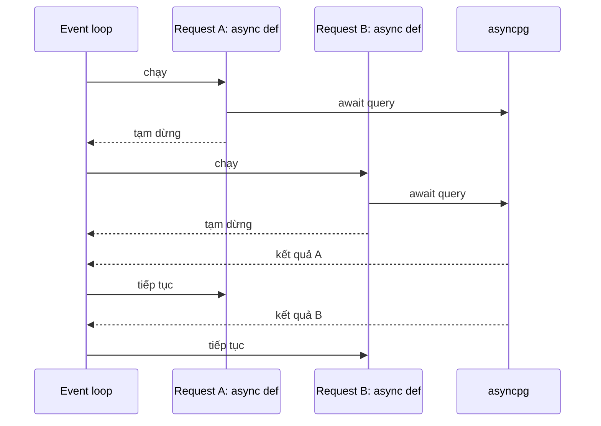
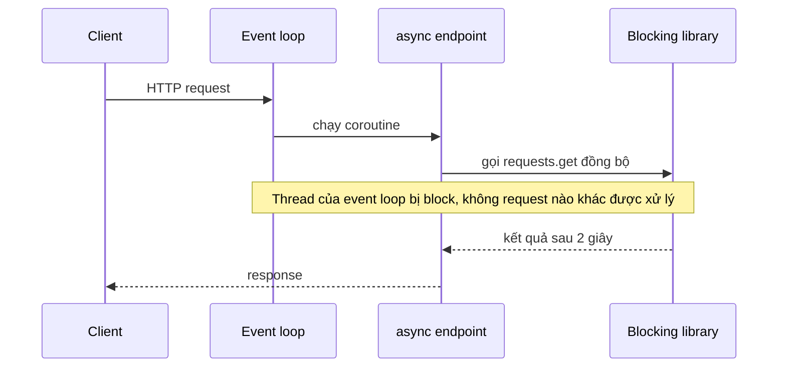
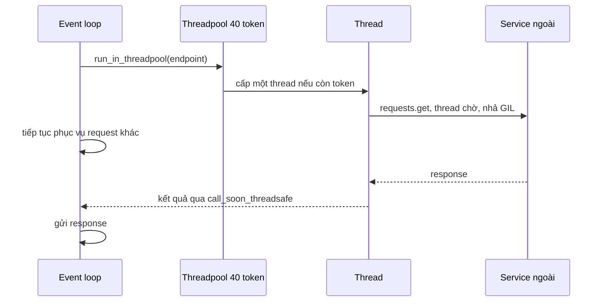
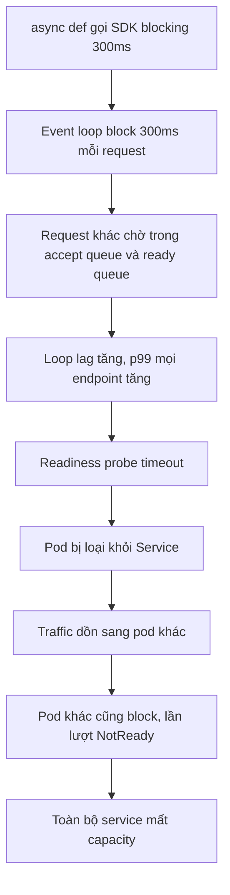

# Sync và Async Endpoint trong FastAPI

## 1. Tổng quan

FastAPI cho phép khai báo endpoint bằng `def` hoặc `async def`. Hai cách này chạy ở **hai nơi khác nhau**:

| Khai báo | Chạy ở đâu | Điều kiện để không gây hại |
|---|---|---|
| `async def` | Trực tiếp trên **event loop** của worker | Mọi I/O bên trong phải là non-blocking và được `await` |
| `def` | Trong **threadpool** của AnyIO (mặc định 40 thread mỗi worker) | Threadpool không bị bão hòa |

Quy tắc tương tự áp dụng cho **dependency**: dependency `async def` chạy trên loop, dependency `def` chạy trong threadpool.

`async def` không tự làm code non-blocking. Chỉ những thao tác thực sự `await` một I/O non-blocking mới nhường event loop. Chọn sai là nguyên nhân số một của sự cố hiệu năng trong ứng dụng FastAPI.

## 2. Mental Model

> Event loop là một người phục vụ duy nhất trông nhiều bàn. `async def` nghĩa là "tôi hứa sẽ không đứng đợi ở một bàn". `def` nghĩa là "tôi có thể đứng đợi, hãy giao việc của tôi cho một trong 40 người phụ việc".

Vi phạm lời hứa (`async def` gọi code blocking) làm người phục vụ duy nhất đứng yên — mọi bàn khác bị bỏ rơi. Dùng `def` thì an toàn cho loop, nhưng khi cả 40 người phụ việc đều bận, việc mới phải xếp hàng.

## 3. Vì sao có hai cách?

FastAPI phải hỗ trợ cả hai thế giới:

- Hệ sinh thái async: `asyncpg`, SQLAlchemy async, `httpx.AsyncClient`, `redis.asyncio`, `aiobotocore`.
- Hệ sinh thái sync lâu đời: `psycopg2`, SQLAlchemy sync, `requests`, `boto3`, nhiều SDK nội bộ.

Chạy code sync trong threadpool cho phép dùng thư viện sync mà không block event loop, đổi lại là giới hạn concurrency bằng số thread.

## 4. Cơ chế hoạt động

Khi request tới một route, FastAPI kiểm tra endpoint là coroutine function hay không:

```python
# Giản lược từ logic của FastAPI / Starlette
if is_coroutine_function(endpoint):
    result = await endpoint(**values)                 # chạy trên event loop
else:
    result = await run_in_threadpool(endpoint, **values)   # anyio.to_thread.run_sync
```

`run_in_threadpool` gửi hàm sang một thread worker của AnyIO và `await` kết quả. Event loop tiếp tục phục vụ request khác trong lúc thread chạy. Số thread đồng thời bị giới hạn bởi một `CapacityLimiter` mặc định **40 token**.

Quan trọng: FastAPI chỉ quyết định dựa trên **endpoint và dependency**. Hàm `def` mà bạn tự gọi bên trong một `async def` chạy **ngay trên event loop** — framework không tự đẩy nó sang thread.

## 5. Luồng xử lý: ba trường hợp

### Trường hợp đúng: `async def` + thư viện async



Hai request chờ database chồng lên nhau trên một thread.

### Trường hợp sai: `async def` + thư viện blocking



Diễn giải: `requests.get` không `await` gì cả; nó giữ thread của event loop trong suốt 2 giây. Trong 2 giây đó worker không accept kết nối mới, không gửi response đã sẵn sàng, không trả lời health check. Với 10 request như vậy đồng thời, request thứ 10 chờ 20 giây.

### Trường hợp an toàn: `def` + thư viện blocking



Diễn giải: thread chờ I/O nhả [GIL](../02-python-concurrency/gil.md); event loop tiếp tục làm việc. Giới hạn là 40 thread: request thứ 41 đồng thời phải chờ token.

## 6. Bảng quyết định

| Code trong endpoint | Nên khai báo | Ghi chú |
|---|---|---|
| Chỉ gọi thư viện async (`await`) | `async def` | Tối ưu nhất |
| Gọi thư viện sync blocking (DB sync, `requests`, `boto3`) | `def` | Chạy trong threadpool |
| Trộn: phần lớn async, một lời gọi sync | `async def` + `await asyncio.to_thread(sync_fn)` | Đẩy riêng phần blocking sang thread |
| CPU nặng (>vài chục ms) | Không nên chạy trong request | Đẩy sang process pool hoặc task queue |
| Không có I/O, tính toán rất nhẹ | `async def` | Tránh overhead chuyển thread |
| Không chắc thư viện có blocking không | `def` | An toàn cho loop; đo sau |

## 7. Ví dụ

```python
import asyncio
import httpx
import requests
from fastapi import FastAPI

app = FastAPI()
async_client = httpx.AsyncClient(timeout=2.0)   # trong thực tế tạo trong lifespan

@app.get("/good-async")
async def good_async():
    r = await async_client.get("https://inventory.internal/items/1")
    return r.json()

@app.get("/bad-async")
async def bad_async():
    r = requests.get("https://inventory.internal/items/1", timeout=2)   # block event loop
    return r.json()

@app.get("/good-sync")
def good_sync():
    r = requests.get("https://inventory.internal/items/1", timeout=2)   # chạy trong threadpool
    return r.json()

@app.get("/mixed")
async def mixed():
    legacy = await asyncio.to_thread(legacy_sdk_call, 42)   # offload phần blocking
    r = await async_client.get("https://pricing.internal/p/42")
    return {"legacy": legacy, "price": r.json()}
```

Lưu ý với `asyncio.to_thread`: nó dùng **default executor của asyncio** (khoảng `min(32, cpu+4)` thread), không phải threadpool 40 token của AnyIO. Hai pool độc lập. Có thể dùng `anyio.to_thread.run_sync` để dùng chung limiter với FastAPI. Xem [Event Loop](../02-python-concurrency/event-loop.md#8-executor-nơi-code-blocking-được-gửi-tới).

## 8. Internals: threadpool 40 token

- Limiter mặc định của AnyIO có 40 token, dùng chung cho mọi endpoint và dependency `def` trong worker, và cho `StreamingResponse` với generator sync, `UploadFile` thao tác file...
- Có thể thay đổi trong lifespan:

```python
import anyio

@asynccontextmanager
async def lifespan(app):
    limiter = anyio.to_thread.current_default_thread_limiter()
    limiter.total_tokens = 100
    yield
```

Tăng token không miễn phí: nhiều thread hơn nghĩa là nhiều connection DB đồng thời hơn (mỗi thread giữ một connection từ pool sync), nhiều tranh chấp GIL hơn, nhiều memory hơn. Nếu pool DB sync chỉ có 10 connection, 100 thread chỉ làm 90 thread chờ connection.

## 9. Hành vi trong production

**Thư viện "async" nhưng blocking bên trong.** Một số SDK có API `async` nhưng bên trong gọi code sync, hoặc thực hiện DNS lookup đồng bộ, đọc file cấu hình, xác thực token bằng HTTP sync. Chỉ đo lường (loop lag) mới phát hiện được.

**Dependency sync làm async endpoint phải qua threadpool.** Endpoint `async def` với dependency `def get_db()` vẫn tiêu tốn một token threadpool cho mỗi lần giải dependency. Với tải cao, threadpool bão hòa dù endpoint là async.

**CPU trên event loop.** Parse JSON lớn, validate Pydantic phức tạp, serialize response nặng, băm mật khẩu (bcrypt/argon2) đều là CPU. Trong `async def`, chúng chạy trên loop. Hash mật khẩu 200 ms trong endpoint login `async def` là một cách phổ biến để tự làm chậm cả service.

**Gunicorn worker timeout.** Event loop bị block quá `--timeout` của Gunicorn (mặc định 30 giây) làm worker bị kill. Xem [Kiến trúc FastAPI](architecture.md).

## 10. Khi scale lên thì chuyện gì xảy ra?

Giả sử endpoint gọi một dependency ngoài mất 200 ms.

| Tải mỗi worker | Endpoint `def` (40 thread) | Endpoint `async def` + client async |
|---|---|---|
| 50 RPS | Cần 10 thread, ổn | ~10 coroutine đồng thời, ổn |
| 200 RPS | Cần 40 thread — chạm giới hạn, bắt đầu xếp hàng | ~40 coroutine, ổn |
| 500 RPS | Cần 100 thread — xếp hàng, latency tăng tuyến tính | ~100 coroutine; giới hạn chuyển sang connection pool của client và CPU |
| Dependency chậm lên 2 s | Cần 1.000 thread — sụp đổ | ~1.000 coroutine chờ; nếu không có timeout và giới hạn, memory và socket cạn |

Async không loại bỏ giới hạn; nó dời giới hạn từ số thread sang connection pool, CPU của loop và capacity của dependency. Dependency chậm vẫn cần [timeout](../10-distributed-systems/timeout.md) và [bulkhead](../10-distributed-systems/bulkhead.md).

## 11. Failure Modes và Failure Chain



Diễn giải: một lời gọi blocking duy nhất trong một endpoint không quá phổ biến có thể kéo sập cả service khi tải tăng, vì nó làm hỏng chính cơ chế health check và phân phối tải.

| Failure | Nguyên nhân | Dấu hiệu |
|---|---|---|
| Loop bị block | Code sync hoặc CPU trong `async def` | Loop lag cao, mọi endpoint chậm đồng loạt |
| Threadpool bão hòa | Endpoint/dependency `def` chậm, không timeout | Latency tăng ở endpoint sync, CPU thấp |
| Pool DB cạn | Thread nhiều hơn connection | Pool wait cao |
| Thiếu thread cho việc khác | Streaming sync, file upload dùng chung limiter | Upload/stream làm chậm endpoint `def` |

## 12. Trade-offs

| Tiêu chí | `async def` | `def` |
|---|---|---|
| Concurrency | Rất cao | Giới hạn bởi số thread |
| Overhead mỗi request | Thấp | Chuyển thread, tranh GIL |
| Rủi ro | Một lỗi blocking ảnh hưởng cả worker | Bão hòa threadpool |
| Yêu cầu thư viện | Async | Bất kỳ |
| Dễ lý luận về race | Chỉ chuyển tại `await` | Chuyển bất kỳ lúc nào giữa thread |

## 13. Sai lầm thường gặp

- Viết `async def` cho mọi endpoint "vì async nhanh hơn" dù dùng thư viện sync.
- Gọi `time.sleep` trong code async (dùng `await asyncio.sleep`).
- Băm mật khẩu, resize ảnh, tạo PDF trong `async def`.
- Tăng token threadpool lên rất cao để "chữa" latency mà không tăng pool DB.
- Nghĩ rằng dependency `def` không ảnh hưởng tới endpoint `async def`.

## 14. Cách debug trong production

1. **Loop lag metric**: nếu lag tăng cùng latency, có code block loop. Xem [Event Loop](../02-python-concurrency/event-loop.md#11-hành-vi-trong-production-loop-lag).
2. **py-spy dump** trên worker chậm: thread chính nằm trong `requests`, `socket.recv` (blocking), `bcrypt`, `json` → tìm thấy thủ phạm.
3. **asyncio debug mode** trên staging: log callback chạy quá 100 ms kèm vị trí.
4. **Threadpool metric**: `limiter.borrowed_tokens` so với `total_tokens`; bằng nhau lâu dài → bão hòa.
5. **Trace**: span của request có khoảng trống lớn trước span đầu tiên → chờ threadpool hoặc loop.

## 15. Best Practices

- `async def` khi toàn bộ I/O trong đường xử lý đều có client async; `def` khi dùng thư viện sync.
- Đẩy phần blocking riêng lẻ bằng `to_thread`; đẩy CPU nặng ra khỏi request path.
- Mọi lời gọi ra ngoài có timeout, bất kể sync hay async.
- Đồng bộ kích thước threadpool, pool DB và số worker theo một ngân sách chung.
- Đo loop lag và mức sử dụng threadpool như metric hạng nhất.

## 16. Tóm tắt

- `async def` chạy trên event loop; `def` chạy trong threadpool AnyIO 40 token mỗi worker; dependency tuân theo cùng quy tắc.
- Hàm sync gọi bên trong `async def` chạy trên loop và block toàn worker.
- Async phù hợp khi cả đường xử lý là non-blocking; sync phù hợp khi thư viện là blocking và concurrency vừa phải.
- Threadpool, connection pool và CPU của loop là các giới hạn thật; async chỉ dời giới hạn chứ không xóa bỏ.
- Loop lag và mức dùng threadpool là tín hiệu sớm nhất của cấu hình sai.

## Liên quan

- [AsyncIO](../02-python-concurrency/asyncio.md)
- [Global Interpreter Lock](../02-python-concurrency/gil.md)
- [Request Lifecycle](request-lifecycle.md)
- [Performance](performance.md)
- [Async SQLAlchemy](../05-sqlalchemy/async-sqlalchemy.md)
