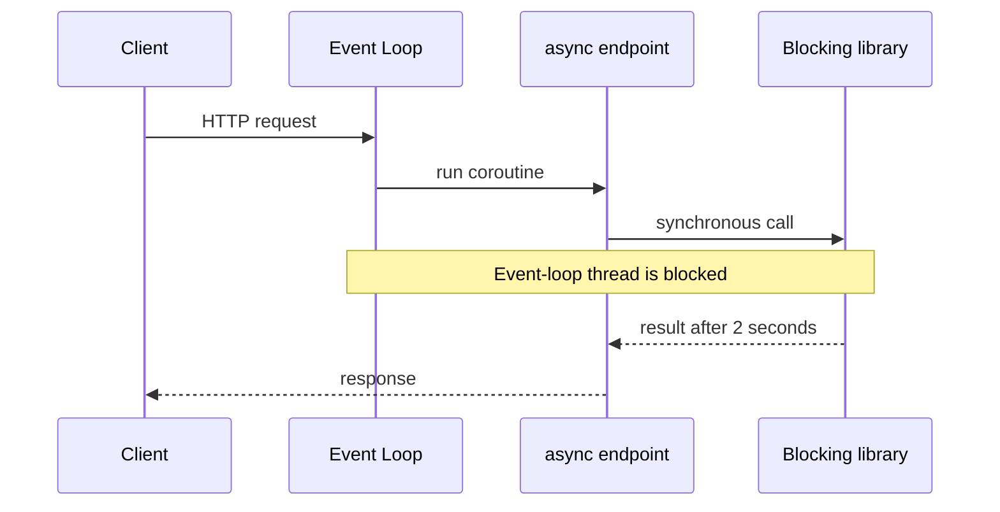

# Sync Vs Async Endpoint

> **Phạm vi phỏng vấn:** FastAPI · **Ưu tiên:** P0/P1 · **Mindset:** Why → How → Trade-off → Production.

## 1. What is it?

FastAPI chạy `async def` trực tiếp trên event loop và chạy `def` endpoint trong thread pool để tránh block loop.

## 2. Why does it matter?

Senior Engineer cần hiểu **Sync Vs Async Endpoint** để xây API có contract rõ, concurrency đúng và vận hành an toàn. Điểm phỏng vấn nằm ở khả năng nêu invariant, điều kiện áp dụng và failure behavior, không nằm ở việc thuộc định nghĩa.

## 3. How does it work?

Async chỉ có lợi khi dependency stack cũng non-blocking. Gọi driver sync trong async endpoint vẫn chặn loop; thread-pool exhaustion có thể tạo queue và tail latency.

Khi reasoning, đi theo chuỗi: **input → state transition → output → failure → recovery**. Quan sát `RPS, p95/p99 latency, error rate, event-loop lag và pool utilization` và phân biệt symptom, bottleneck với root cause.

## 4. Example

```python
import time
from fastapi import FastAPI

app = FastAPI()

def blocking_database_call() -> list[dict[str, int]]:
    time.sleep(2)  # Represents a synchronous driver call.
    return [{"id": 1}]

@app.get("/users-dangerous")
async def users_dangerous() -> list[dict[str, int]]:
    # This runs on the event-loop thread and blocks other connections.
    return blocking_database_call()

@app.get("/users-sync")
def users_sync() -> list[dict[str, int]]:
    # FastAPI runs a normal path operation in its external thread pool.
    return blocking_database_call()
```

Production ưu tiên async database driver trong `async def`; nếu buộc dùng sync library, bound thread-pool concurrency và đo thread-token/pool wait. CPU-heavy code vẫn nên đi process/job queue.

## 5. Production Use Case

Endpoint tra PostgreSQL dùng async driver; PDF rendering CPU-bound được gửi queue. Load test đo event-loop lag và pool wait thay vì đổi mọi hàm sang `async`.

Checklist triển khai: capacity budget, timeout, idempotency (nếu có side effect), telemetry, canary, rollback và reconciliation.

## 6. Common Problems

- Không định nghĩa invariant và source of truth trước khi chọn công nghệ.
- Retry không backoff/jitter làm traffic amplification khi dependency lỗi.
- Không có bound cho queue, connection, memory hoặc concurrency.
- Chỉ theo dõi average; bỏ qua p95/p99, saturation và error semantics.
- Rollout toàn bộ, thiếu feature flag/canary và đường rollback dữ liệu.

## 7. Trade-offs

| Lựa chọn | Lợi ích | Chi phí / rủi ro | Khi phù hợp |
|---|---|---|---|
| Tối ưu/thiết kế xoay quanh Sync Vs Async Endpoint | Kiểm soát rõ constraint chính | Tăng complexity và coupling | Metric chứng minh đây là bottleneck/risk |
| Giữ baseline đơn giản | Ít dependency, dễ debug | Có thể chạm giới hạn sớm | Traffic vừa, invariant vẫn được giữ |
| Managed service/library | Giảm vận hành hạ tầng | Cost, lock-in, giới hạn control | SLA và economics phù hợp |
| Tự vận hành/customize | Kiểm soát sâu | Ownership và failure surface lớn | Có năng lực vận hành và nhu cầu thật |

## 8. Interview Questions

### Basic / Mid-level (10)

- **B1.** What is Sync Vs Async Endpoint, and which concrete problem does it address?
- **B2.** Explain the main internal mechanism behind Sync Vs Async Endpoint.
- **B3.** Which guarantees does Sync Vs Async Endpoint provide, and which does it not provide?
- **B4.** Which metrics or observations reveal the behavior of Sync Vs Async Endpoint?
- **B5.** What is the most common misconception about Sync Vs Async Endpoint?
- **B6.** How would you test assumptions involving Sync Vs Async Endpoint?
- **B7.** Which edge cases or failure modes matter most for Sync Vs Async Endpoint?
- **B8.** How can Sync Vs Async Endpoint affect latency, throughput, memory, or correctness?
- **B9.** Which runtime conditions or configuration choices change the behavior of Sync Vs Async Endpoint?
- **B10.** When is a different or simpler approach better than relying on Sync Vs Async Endpoint?

### Production Scenarios (5)

- **S1.** A release involving Sync Vs Async Endpoint triples p99 while averages look normal. How do you investigate and mitigate?
- **S2.** A critical dependency around Sync Vs Async Endpoint is unavailable for ten minutes. Define degraded behavior and recovery.
- **S3.** Two concurrent operations expose a correctness gap related to Sync Vs Async Endpoint. Which invariant and atomic boundary fix it?
- **S4.** Traffic grows from 1,000 to 20,000 RPS. Which measured limit involving Sync Vs Async Endpoint fails first?
- **S5.** A canary changes the behavior of Sync Vs Async Endpoint; success rate is flat but saturation rises. Promote or roll back?

## 9. Senior-level Questions

- **L1.** How does Sync Vs Async Endpoint constrain the surrounding architecture and operational model?
- **L2.** Which subtle correctness issue appears when Sync Vs Async Endpoint meets concurrency or partial failure?
- **L3.** What breaks first around Sync Vs Async Endpoint at 20,000 RPS or 100× data volume?
- **L4.** Where should admission control or backpressure be placed when using Sync Vs Async Endpoint?
- **L5.** How would you benchmark or validate Sync Vs Async Endpoint without a misleading microbenchmark?
- **L6.** Which hidden coupling or migration cost can Sync Vs Async Endpoint introduce?
- **L7.** How would you change a poor decision around Sync Vs Async Endpoint with no downtime?
- **L8.** What production evidence would make you choose a different approach?
- **L9.** How do correctness, latency, cost, and complexity trade off for Sync Vs Async Endpoint?
- **L10.** How would you turn an incident involving Sync Vs Async Endpoint into a durable prevention mechanism?

## 10. Short Answers

**B1.** FastAPI chạy `async def` trực tiếp trên event loop và chạy `def` endpoint trong thread pool để tránh block loop. Trả lời tốt nối definition với constraint/invariant và một use case cụ thể.

**B2.** Mô tả state, lifecycle, boundary và failure path; không dừng ở public API của Sync Vs Async Endpoint.

**B3.** Nêu lúc tạo, lúc sử dụng, lúc release/commit và điều xảy ra khi timeout hoặc cancellation.

**B4.** Đo RPS, p95/p99 latency, error rate, event-loop lag và pool utilization; luôn tách average khỏi tail và success khỏi useful result.

**B5.** Lỗi phổ biến là dùng Sync Vs Async Endpoint như mặc định mà không xác định ownership, limit và fallback.

**B6.** Test invariant trước, sau đó integration test failure path, concurrency và representative load.

**B7.** Xét timeout, duplicate, stale state, overload, dependency loss và recovery/reconciliation.

**B8.** Đo critical path, contention, queueing và amplification; throughput cao không bù được p99 xấu.

**B9.** Deadline, concurrency limit, retention/TTL, resource budget, telemetry và rollout policy phải explicit.

**B10.** Tránh Sync Vs Async Endpoint khi bài toán đơn giản hơn giải được invariant với ít state và operational cost hơn.

Cấu trúc câu trả lời: **Definition → Why → How → Trade-off → Production example**. Với câu scenario: **stabilize → observe → hypothesize → verify → mitigate → prevent**.

## 11. Follow-up Questions

- **F1.** What assumption in your answer is most risky?
- **F2.** How would you prove that with metrics or an experiment?
- **F3.** What changes if the operation is not idempotent?
- **F4.** Where would you add timeout, retry, and backpressure?
- **F5.** What is your rollback and data-reconciliation plan?

## 12. Key Takeaways

- Nói được **vai trò, constraint hoặc invariant của Sync Vs Async Endpoint**, không chỉ “dùng để làm gì”.
- Định lượng bằng RPS, p95/p99 latency, error rate, event-loop lag và pool utilization và có baseline trước tối ưu.
- Thiết kế cho timeout, duplicate, overload, partial failure và recovery.
- Mọi tối ưu đều có chi phí về correctness, complexity, latency hoặc money.
- Production-ready nghĩa là có owner, alert, runbook, canary, rollback và reconciliation.


## 13. Mental Model

`async def` không tự làm code non-blocking. Chỉ những operation thật sự `await` non-blocking I/O mới nhường event loop.

## 14. Internals Deep Dive


FastAPI chạy path operation `def` trong external thread pool và `async def` trực tiếp trên event loop. Nhưng utility `def` do bạn gọi bên trong `async def` chạy ngay trên loop—framework không tự offload. Vì vậy `requests.get()`, sync DB driver hoặc CPU parse lớn trong async endpoint có thể chặn mọi connection cùng loop.

Thread pool cũng là bounded resource: nếu mọi sync endpoint chờ DB/network, queue của pool tăng và p99 xấu. Chọn async khi dependency stack có async driver; chọn sync/thread khi library chỉ blocking và concurrency đã bound; CPU-heavy chuyển process/job queue. Đo loop lag, thread tokens, pool wait và cancellation behavior.


Implementation detail có thể đổi theo version; khi trả lời interview, nêu rõ CPython/PostgreSQL/Redis/framework version nếu kết luận dựa vào behavior nội bộ thay vì public contract.

## 15. Request / Data Flow



Đọc diagram từ input tới state transition và output. Tại mỗi mũi tên, hỏi: operation có block không, có retry không, state có durable không, identity nào dùng để dedupe và metric nào chứng minh bước đó khỏe.

## 16. Failure Scenario

Một blocking dependency hoặc pool cạn có thể giữ toàn worker/loop, rồi client retry khuếch đại traffic. Load-shed/rate-limit, rollback, isolate route và bảo vệ downstream trước khi tăng replica.

Phân tích theo chuỗi: **trigger → saturation/incorrect state → propagation → user impact → immediate mitigation → durable prevention**. Tránh gọi retry hoặc scale là giải pháp nếu chưa chỉ ra dependency budget.

## 17. How I would debug this in production

1. So p50/p95/p99 theo route/worker/deploy.
2. Xem event-loop lag, thread tokens và worker saturation.
3. Trace middleware → dependency → endpoint → DB/cache.
4. Đo DB pool wait và downstream deadline/retry.
5. Rollback/canary fix rồi verify SLO.

## 18. Common Misconceptions

**Sai:** đổi mọi endpoint thành `async def` làm API nhanh. **Đúng:** toàn dependency path phải non-blocking và concurrency phải được bound.

## 19. When NOT to use

Không dùng async chỉ vì framework hỗ trợ; sync stack với bounded thread pool có thể đơn giản hơn khi dependency chỉ blocking.

## 20. What interviewer may ask next

1. **What guarantee does Sync Vs Async Endpoint provide, and what does it explicitly not guarantee?**
2. **Which implementation detail changes across versions or runtimes?**
3. **Where is the first queue or contention point under high load?**
4. **What happens if the dependency times out after committing state?**
5. **How would you observe, degrade, and recover this in production?**
6. **Which simpler design would you choose at 100 RPS, and when would you evolve it?**

## 21. Check Your Understanding

1. Nếu throughput tăng 20× nhưng downstream capacity không đổi, **Sync Vs Async Endpoint** sẽ tạo queue/backpressure ở đâu?
2. Timeout xảy ra ngay sau một state transition; caller có thể kết luận điều gì và không thể kết luận điều gì?
3. Metric, trace span và log field tối thiểu nào giúp phân biệt application, dependency và network latency?

<details>
<summary>Answer</summary>

1. Queue xuất hiện tại bounded resource đầu tiên: worker/thread/semaphore/connection pool/broker hoặc dependency. Nếu không có bound, overload chuyển thành memory growth và timeout storm.
2. Caller chỉ biết chưa nhận response trong deadline; operation có thể chưa chạy, đang chạy hoặc đã commit. Cần operation identity/idempotency và status/reconciliation.
3. Dùng end-to-end latency + queue/service time, correlation/trace ID, dependency spans, error/retry classification và saturation của pool/queue/resource.

</details>

## 22. See also

- [Request Lifecycle](request-lifecycle.md)
- [Connection Pooling](../04-database-postgresql/connection-pooling.md)
- [API Security](../16-security/api-security.md)
