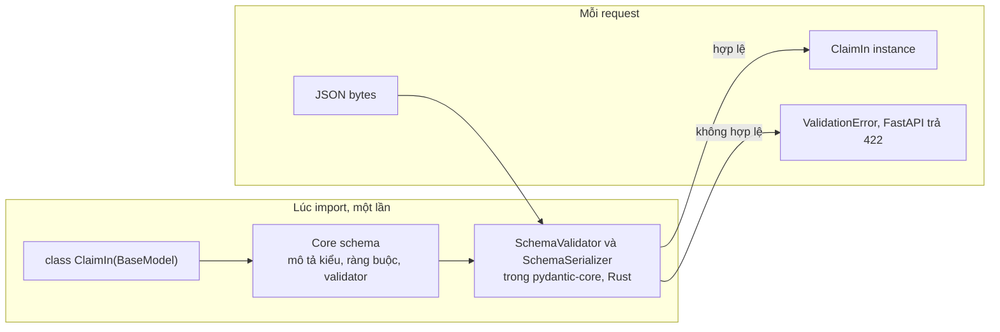

# Validation với Pydantic

## 1. Tổng quan

Pydantic là thư viện chuyển **dữ liệu không đáng tin** (JSON từ client, biến môi trường, message từ queue, response từ API khác) thành **object có kiểu và đã được kiểm tra**. FastAPI dùng Pydantic cho ba việc:

1. **Parse và validate input**: path, query, header, body.
2. **Serialize và lọc output** theo `response_model`.
3. **Sinh JSON Schema** cho tài liệu OpenAPI.

Pydantic v2 (2023+) viết lại phần lõi bằng Rust (`pydantic-core`), nhanh hơn v1 nhiều lần. Hiểu cách Pydantic hoạt động giúp dùng nó đúng chỗ: như một **boundary** giữa thế giới bên ngoài và code nghiệp vụ, không phải nơi chứa mọi quy tắc nghiệp vụ.

## 2. Mental Model

> Pydantic model là trạm kiểm soát ở biên giới. Dữ liệu đi vào phải khai báo đúng định dạng; qua được trạm thì bên trong tin tưởng nó. Trạm kiểm tra **hình dạng** dữ liệu, không kiểm tra **quyền** hay **trạng thái nghiệp vụ**.

- "Số lượng là số nguyên dương" → Pydantic.
- "User này có quyền sửa đơn này không" → authorization (dependency/service).
- "Đơn này còn ở trạng thái cho phép sửa không" → logic nghiệp vụ (service, database).

## 3. Vì sao cần validation ở boundary?

- Không bao giờ tin dữ liệu từ bên ngoài: kiểu sai, thiếu field, giá trị ngoài phạm vi, chuỗi quá dài, field thừa.
- Lỗi phát hiện ở biên cho thông báo rõ ràng (422 với vị trí lỗi) thay vì `AttributeError` sâu bên trong.
- Code nghiệp vụ nhận object có kiểu, không phải `dict[str, Any]`, nên [type checker](../01-python-core/typing.md) có thể giúp.
- Output được lọc theo model, ngăn rò rỉ field nội bộ (`password_hash`, `internal_note`).

## 4. Cơ chế hoạt động: core schema và validator đã compile



Diễn giải:

1. Khi class model được định nghĩa, Pydantic đọc annotation và `Field(...)`, dựng một **core schema** (cấu trúc mô tả cách validate từng field).
2. Core schema được compile thành validator và serializer trong Rust.
3. Mỗi request chỉ chạy validator đã compile — không phân tích lại annotation.
4. Khi FastAPI validate body, nó có thể validate thẳng từ JSON bytes, tránh bước `json.loads` tạo dict trung gian bằng Python.

Hệ quả thực tế: định nghĩa model tốn chi phí lúc import (ảnh hưởng thời gian khởi động với hàng trăm model), nhưng validation mỗi request rất nhanh.

## 5. Các tính năng cốt lõi

### Ràng buộc khai báo

```python
from datetime import date
from decimal import Decimal
from typing import Annotated, Literal
from pydantic import BaseModel, ConfigDict, Field

VIN = Annotated[str, Field(pattern=r"^[A-HJ-NPR-Z0-9]{17}$")]

class ClaimLineIn(BaseModel):
    part_code: Annotated[str, Field(min_length=3, max_length=32)]
    quantity: Annotated[int, Field(gt=0, le=1000)]
    unit_price: Annotated[Decimal, Field(ge=0, max_digits=12, decimal_places=2)]

class ClaimIn(BaseModel):
    model_config = ConfigDict(extra="forbid", str_strip_whitespace=True)

    vin: VIN
    repair_date: date
    kind: Literal["warranty", "goodwill"]
    lines: Annotated[list[ClaimLineIn], Field(min_length=1, max_length=200)]
```

- `extra="forbid"`: field lạ bị từ chối — phát hiện client gửi sai tên field thay vì âm thầm bỏ qua.
- Giới hạn độ dài chuỗi và số phần tử list: chặn payload bất thường làm tốn CPU/memory.
- `Decimal` cho tiền, không dùng `float`.

### Strict và lax mode

Mặc định Pydantic ở **lax mode**: chuyển đổi kiểu hợp lý (`"42"` → `42`, `"true"` → `True`). **Strict mode** (`ConfigDict(strict=True)` hoặc `Field(strict=True)`) từ chối mọi chuyển đổi. Lax tiện cho query string (vốn luôn là chuỗi); strict an toàn hơn cho body JSON của API nội bộ, nơi kiểu sai là dấu hiệu bug.

### Validator tùy biến

```python
from pydantic import field_validator, model_validator

class DateRange(BaseModel):
    start: date
    end: date

    @model_validator(mode="after")
    def check_order(self):
        if self.end < self.start:
            raise ValueError("end must not be before start")
        return self
```

- `field_validator`: kiểm tra một field.
- `model_validator(mode="after")`: kiểm tra quan hệ giữa các field sau khi từng field đã hợp lệ.
- Validator viết bằng Python chạy **ngoài** Rust — chậm hơn ràng buộc khai báo. Ưu tiên `Field(...)`, `Annotated`, `Literal` khi có thể.
- Validator không nên làm I/O (query DB để kiểm tra tồn tại): validator chạy đồng bộ, không `await` được, và trộn validation hình dạng với kiểm tra nghiệp vụ.

### Serialization và `response_model`

```python
class ClaimOut(BaseModel):
    id: int
    status: str
    total: Decimal

@app.get("/claims/{claim_id}", response_model=ClaimOut)
async def get_claim(claim_id: int, session: SessionDep):
    return await repo.get(session, claim_id)    # ORM object có nhiều field hơn
```

FastAPI validate và serialize giá trị trả về theo `ClaimOut`: chỉ `id`, `status`, `total` được trả. Với ORM object, cần `model_config = ConfigDict(from_attributes=True)` để Pydantic đọc attribute.

Lưu ý: đọc attribute của ORM object trong lúc serialize có thể kích hoạt **lazy loading** (query ẩn) — hoặc lỗi `MissingGreenlet` với async SQLAlchemy. Load đủ dữ liệu trước khi return. Xem [Descriptors](../01-python-core/descriptors.md#9-bên-trong-orm-descriptor-làm-gì-với-orderitems).

## 6. Bên trong hệ thống xảy ra gì khi validation thất bại?

1. Validator gom **tất cả** lỗi (không dừng ở lỗi đầu tiên), mỗi lỗi có `loc` (vị trí, ví dụ `["body", "lines", 3, "quantity"]`), `type`, `msg`.
2. FastAPI bọc thành `RequestValidationError`.
3. `ExceptionMiddleware` gọi handler mặc định, trả **422** với danh sách lỗi.
4. Endpoint không được gọi; dependency đứng sau validation cũng không chạy.

Có thể tùy biến handler để trả định dạng lỗi thống nhất của tổ chức. Xem [Error Handling](error-handling.md).

## 7. Hành vi trong production

- **Chi phí CPU tỷ lệ với kích thước payload.** Validate list 5.000 phần tử lồng nhau vẫn tốn vài đến vài chục ms, chạy trên event loop. Giới hạn kích thước list và chiều sâu lồng nhau.
- **Validate hai lần.** Endpoint trả về Pydantic model đã hợp lệ, FastAPI lại validate theo `response_model`. Với response lớn, có thể dùng return type annotation khớp chính xác và để FastAPI serialize, hoặc trả `Response` đã serialize sẵn cho đường nóng đã được kiểm chứng.
- **`model_construct()`** tạo instance **không validate** — chỉ dùng cho dữ liệu đã chắc chắn đúng (từ database của chính mình), không bao giờ cho dữ liệu từ client.
- **Thay đổi model là thay đổi contract.** Đổi `Optional` thành bắt buộc, siết `max_length`, đổi `extra` sang `forbid` đều có thể phá client hiện tại. Xem [API Versioning](../08-api-design/api-versioning.md).
- **Settings**: `pydantic-settings` validate biến môi trường lúc khởi động; cấu hình sai làm worker fail ngay thay vì lỗi lúc chạy.

## 8. Failure Modes

| Failure | Nguyên nhân | Dấu hiệu |
|---|---|---|
| Rò rỉ dữ liệu | Không có `response_model`, trả dict/ORM trực tiếp | Response chứa field nội bộ |
| CPU cao ở endpoint nhận batch | Payload lớn, validator Python cho từng phần tử | CPU event loop cao, loop lag |
| Dữ liệu sai lọt qua | Lax coercion ngoài ý muốn (`"1e3"` thành số, chuỗi rỗng) | Giá trị bất thường trong DB |
| N+1 trong serialize | Serialize ORM object với relationship lazy | Số query tăng theo số phần tử |
| Khởi động chậm | Hàng trăm model phức tạp compile lúc import | Readiness chậm |

## 9. Trade-offs

| Lựa chọn | Lợi ích | Chi phí |
|---|---|---|
| Lax mode | Thân thiện với client, hợp với query string | Có thể chấp nhận dữ liệu không mong muốn |
| Strict mode | Bắt lỗi kiểu sớm | Client phải gửi đúng kiểu tuyệt đối |
| Validator Python | Linh hoạt | Chậm hơn ràng buộc khai báo |
| Một model cho cả in và out | Ít code | Rò rỉ field, ràng buộc lẫn lộn |
| Model riêng In/Out/DB | Contract rõ, an toàn | Nhiều class hơn |

## 10. Sai lầm thường gặp

- Dùng ORM model làm response trực tiếp mà không có `response_model`.
- Đặt kiểm tra nghiệp vụ cần DB vào validator.
- Dùng `float` cho tiền.
- Không giới hạn độ dài chuỗi và kích thước list.
- Dùng `model_construct` cho dữ liệu từ client.
- Coi validation hình dạng là đủ cho authorization.

## 11. Cách debug

- `Model.model_json_schema()` để xem schema thực tế.
- `pydantic.TypeAdapter(T).validate_python(...)` để thử nhanh một kiểu.
- Log `exc.errors()` của `RequestValidationError` (không log toàn bộ body chứa dữ liệu nhạy cảm) để thấy client gửi sai gì.
- Profile endpoint nhận payload lớn để đo thời gian validate/serialize.

## 12. Best Practices

- Tách model theo vai trò: `XxxIn` (input), `XxxOut` (output), không dùng ORM model làm schema API.
- Luôn khai báo `response_model` hoặc return type.
- Dùng ràng buộc khai báo (`Field`, `Annotated`, `Literal`) thay validator Python khi có thể.
- Giới hạn kích thước mọi chuỗi và list trong input.
- `extra="forbid"` cho API nội bộ và thao tác ghi.
- Kiểm tra nghiệp vụ và quyền ở service/dependency, không ở validator.

## 13. Tóm tắt

- Pydantic chuyển dữ liệu không đáng tin thành object có kiểu tại boundary; FastAPI dùng nó cho input, output và OpenAPI.
- Model được compile một lần thành validator Rust; mỗi request chỉ chạy validator đã compile.
- Lax mode chuyển đổi kiểu; strict mode từ chối chuyển đổi.
- `response_model` lọc output, là lớp bảo vệ chống rò rỉ dữ liệu.
- Validation kiểm tra hình dạng, không thay cho authorization hay quy tắc nghiệp vụ.

## Liên quan

- [Typing](../01-python-core/typing.md)
- [Request Lifecycle](request-lifecycle.md)
- [Error Handling](error-handling.md)
- [API Versioning](../08-api-design/api-versioning.md)
- [REST API](../08-api-design/rest-api.md)
