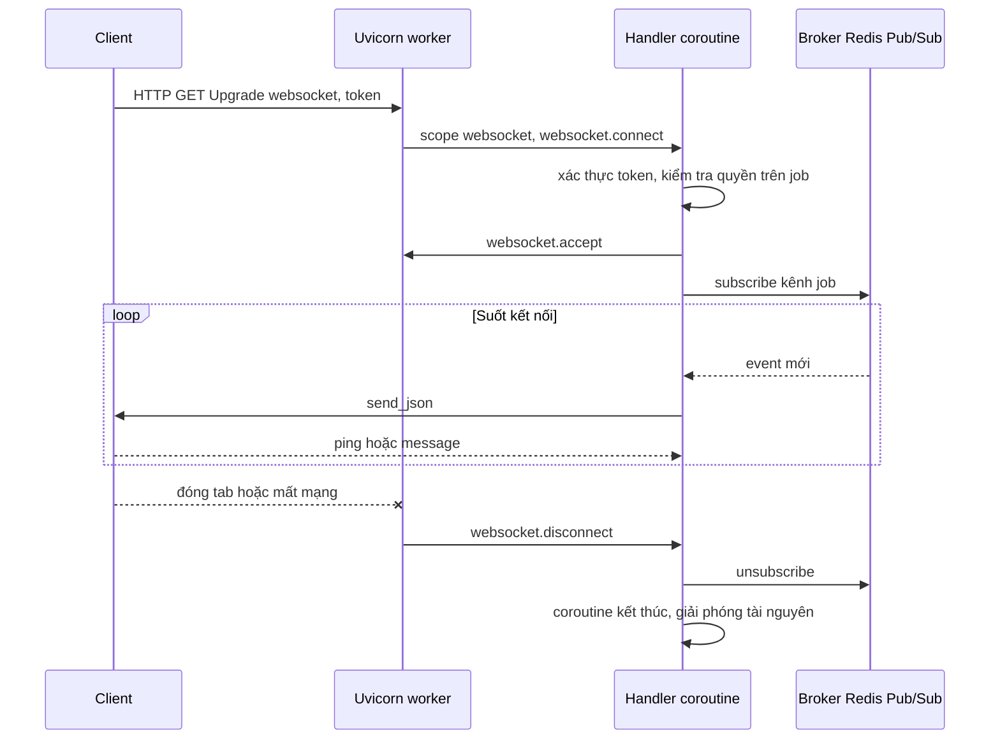
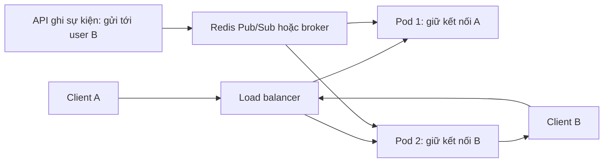

# WebSocket trong FastAPI

## 1. Tổng quan

WebSocket là kết nối **hai chiều, sống lâu** giữa client và server trên một kết nối TCP. Khác với HTTP request/response (client hỏi, server trả lời, kết thúc), WebSocket cho phép server chủ động đẩy dữ liệu bất kỳ lúc nào: thông báo realtime, trạng thái xử lý job, chat, dashboard giám sát.

Tài liệu này tập trung vào WebSocket **trong FastAPI/ASGI**: vòng đời kết nối trong worker, cách viết handler, backpressure, và cách scale khi có nhiều pod. Giao thức WebSocket (handshake, frame, so sánh với SSE/long polling) nằm ở [WebSocket (API design)](../08-api-design/websocket.md); thiết kế hệ thống realtime hoàn chỉnh nằm ở [Design Realtime WebSocket](../11-system-design/design-realtime-websocket.md).

## 2. Mental Model

> HTTP request là cuộc gọi ngắn: hỏi, trả lời, cúp máy. WebSocket là đường dây luôn mở: mỗi kết nối là **một coroutine sống lâu** trên event loop của một worker cụ thể, giữ state riêng cho tới khi một bên cúp máy.

Hệ quả trực tiếp:

- Kết nối **dính** vào một worker của một pod. Worker khác không biết kết nối này tồn tại.
- Tài nguyên (memory, fd, coroutine) bị giữ suốt thời gian kết nối, có thể hàng giờ.
- Scale không còn là "request/giây" mà là "số kết nối đồng thời" và "message/giây".

## 3. Vì sao cần WebSocket?

- Server cần đẩy dữ liệu ngay khi có sự kiện, không chờ client hỏi.
- Tần suất message cao theo cả hai chiều (chat, collaborative editing, game).
- Giảm overhead so với polling: không lặp lại header HTTP, không mở request mới liên tục.

Nếu chỉ cần server đẩy một chiều, [Server-Sent Events](../08-api-design/websocket.md) thường đơn giản hơn (dùng HTTP thường, tự reconnect).

## 4. Cơ chế hoạt động trong ASGI

1. Client gửi HTTP request với header `Upgrade: websocket`.
2. Uvicorn nhận ra upgrade, tạo scope `type="websocket"` và gọi ASGI app.
3. App nhận sự kiện `websocket.connect`; nếu chấp nhận, gửi `websocket.accept`. Từ đây kết nối là WebSocket.
4. Hai bên trao đổi `websocket.receive` / `websocket.send`.
5. Một bên gửi close frame hoặc kết nối đứt → `websocket.disconnect`.

FastAPI bọc giao thức này trong object `WebSocket`:

```python
from fastapi import WebSocket, WebSocketDisconnect

@app.websocket("/ws/jobs/{job_id}")
async def job_updates(websocket: WebSocket, job_id: str, principal: WsPrincipal):
    await websocket.accept()
    try:
        async for event in job_events.subscribe(job_id, principal.tenant_id):
            await websocket.send_json(event)
    except WebSocketDisconnect:
        pass
    finally:
        await job_events.unsubscribe(job_id)
```

Dependency hoạt động với WebSocket endpoint (xác thực lúc handshake), nhưng middleware kiểu `BaseHTTPMiddleware` thì không — chỉ pure ASGI middleware xử lý được scope WebSocket.

## 5. Luồng xử lý: một kết nối trong worker



Diễn giải:

1. Xác thực xảy ra **trước** `accept` — từ chối sớm bằng cách đóng với mã lỗi, không giữ tài nguyên.
2. Sau khi accept, handler là một coroutine sống lâu. Nó chờ event từ broker và đẩy xuống client.
3. Handler phải xử lý disconnect ở mọi điểm `send`/`receive` và dọn dẹp subscription trong `finally`.
4. Mất mạng đột ngột (không có close frame) có thể không được phát hiện ngay — TCP có thể ở trạng thái half-open nhiều phút. Heartbeat (ping/pong) là cách phát hiện.

## 6. Hai chiều đồng thời: đọc và ghi trên cùng kết nối

Handler thường cần vừa nhận message từ client vừa đẩy event từ server. Viết tuần tự (`await receive()` rồi mới `send`) sẽ block một chiều. Dùng hai task:

```python
async def session(websocket: WebSocket, user_id: str):
    await websocket.accept()
    outbound: asyncio.Queue = asyncio.Queue(maxsize=100)     # bounded

    async def reader():
        async for message in websocket.iter_json():
            await handle_client_message(user_id, message)

    async def writer():
        while True:
            event = await outbound.get()
            await websocket.send_json(event)

    registry.register(user_id, outbound)
    try:
        async with asyncio.TaskGroup() as tg:
            tg.create_task(reader())
            tg.create_task(writer())
    except* WebSocketDisconnect:
        pass
    finally:
        registry.unregister(user_id, outbound)
```

- Khi một trong hai task kết thúc (client ngắt), [TaskGroup](../02-python-concurrency/coroutine-task-future.md#8-chạy-nhiều-task-gather-taskgroup-wait-as_completed) cancel task còn lại.
- `outbound` có `maxsize`: nếu client đọc chậm, queue đầy, producer phải quyết định — chờ, bỏ event cũ, hoặc đóng kết nối.

## 7. Backpressure: client chậm

Một client trên mạng di động yếu đọc chậm. Server vẫn đẩy event với tốc độ cao:

- `send` ghi vào buffer của transport; khi buffer đầy, `send` tạm dừng (backpressure ở tầng transport).
- Nếu producer không chờ `send` mà đẩy vào queue không giới hạn, memory tăng vô hạn cho một kết nối.
- Với hàng nghìn kết nối chậm, worker hết memory.

Chính sách cho slow consumer phải được chọn tường minh:

| Chính sách | Khi phù hợp |
|---|---|
| Bỏ event cũ, giữ event mới nhất | Dashboard, trạng thái hiện tại (chỉ cần giá trị mới nhất) |
| Gộp nhiều event thành một | Counter, tiến độ |
| Đóng kết nối, client reconnect và đồng bộ lại | Chat, dữ liệu cần đầy đủ (client lấy phần thiếu qua API) |
| Chờ (block producer) | Chỉ khi producer là riêng cho kết nối đó |

## 8. Scale nhiều pod



Diễn giải:

1. Kết nối của client B nằm ở pod 2. Sự kiện cho B có thể phát sinh ở bất kỳ pod nào (hoặc ở worker Celery).
2. Pod phát sinh sự kiện publish lên một kênh chung (Redis Pub/Sub, NATS, Kafka).
3. Mọi pod subscribe; pod đang giữ kết nối của B đẩy xuống client.
4. Redis Pub/Sub là fire-and-forget: pod đang restart sẽ bỏ lỡ message. Nếu cần không mất, client phải có cơ chế đồng bộ lại (lấy các event sau `last_event_id` qua API) hoặc dùng Redis Streams. Xem [Redis Pub/Sub](../06-redis/pub-sub.md).

Load balancer phải hỗ trợ WebSocket (upgrade, idle timeout đủ dài). Idle timeout của ALB mặc định 60 giây: kết nối không có traffic trong 60 giây bị đóng — heartbeat mỗi 20–30 giây giữ kết nối sống.

## 9. Hành vi trong production

- **Deploy ngắt mọi kết nối** trên pod bị thay thế. Client phải tự reconnect với backoff và jitter; nếu không, hàng chục nghìn client reconnect cùng lúc tạo thundering herd lên pod mới.
- **Phân bố không đều**: kết nối sống lâu, nên pod mới sau scale-out nhận ít kết nối trong khi pod cũ vẫn đầy. HPA theo CPU phản ứng kém; cân nhắc metric số kết nối.
- **Giới hạn mỗi worker**: file descriptor (`ulimit -n`), memory mỗi kết nối (buffer, queue, state). Đo và đặt giới hạn số kết nối mỗi pod.
- **Xác thực hết hạn giữa chừng**: token hết hạn trong khi kết nối vẫn mở. Cần chính sách: đóng kết nối khi token hết hạn, hoặc cho client gửi token mới qua message.
- **Graceful shutdown**: khi nhận SIGTERM, gửi close frame với mã "going away" để client reconnect sang pod khác, thay vì chờ tới khi bị kill.

## 10. Khi scale lên thì chuyện gì xảy ra?

| Quy mô | Vấn đề chính |
|---|---|
| 1.000 kết nối | Một worker xử lý thoải mái |
| 50.000 kết nối | Memory mỗi kết nối, fd limit, phân bố giữa pod, heartbeat CPU |
| 500.000 kết nối | Fan-out qua broker (mỗi event tới mọi pod), reconnect storm khi deploy, cần gateway chuyên dụng |
| Group lớn (một event tới 100.000 client) | Fan-out CPU và băng thông; cần phân tầng, gộp, hoặc giới hạn tần suất |

## 11. Failure Modes

| Failure | Nguyên nhân | Dấu hiệu |
|---|---|---|
| Memory tăng dần | Queue không giới hạn cho client chậm, không dọn dẹp khi disconnect | RSS tăng theo số kết nối "ma" |
| Kết nối half-open | Mất mạng không có close frame, không heartbeat | Số kết nối cao hơn thực tế |
| Message mất | Pub/Sub khi pod restart | Client thiếu event, không có lỗi |
| Reconnect storm | Deploy ngắt mọi kết nối, client reconnect không jitter | Spike CPU/auth ngay sau deploy |
| Kết nối bị LB đóng | Idle timeout ngắn, không heartbeat | Client reconnect định kỳ đúng chu kỳ timeout |
| Event loop block | Xử lý message nặng trong handler | Mọi kết nối trên worker trễ |

## 12. Trade-offs

| Lựa chọn | Lợi ích | Chi phí |
|---|---|---|
| WebSocket trong FastAPI | Cùng codebase, dùng chung auth | Scale kết nối cùng với API, deploy ngắt kết nối |
| Gateway WebSocket riêng | Scale độc lập, deploy API không ảnh hưởng | Thêm service, giao tiếp qua broker |
| Managed service (API Gateway WebSocket, Pusher...) | Không vận hành kết nối | Chi phí, lock-in, giới hạn tùy biến |
| SSE thay WebSocket | Đơn giản, HTTP thường, tự reconnect | Một chiều, giới hạn kết nối trên HTTP/1.1 của trình duyệt |

## 13. Sai lầm thường gặp

- Accept trước rồi mới xác thực.
- Không có heartbeat, dựa vào TCP để phát hiện mất kết nối.
- Queue không giới hạn cho mỗi kết nối.
- Lưu danh sách kết nối trong memory và nghĩ mọi pod đều thấy.
- Không dọn dẹp subscription trong `finally`.
- Client reconnect ngay lập tức không backoff.

## 14. Cách debug trong production

- Metric: số kết nối đang mở mỗi pod, message gửi/nhận mỗi giây, độ dài queue outbound, số lần disconnect theo mã đóng.
- Log connect/disconnect kèm user, pod, thời lượng kết nối, lý do đóng.
- So sánh số kết nối trong ứng dụng với số socket ở trạng thái ESTABLISHED (`ss -s`) để phát hiện rò rỉ.
- Loop lag của worker WebSocket.

## 15. Best Practices

- Xác thực trước khi accept; kiểm tra quyền trên kênh/tài nguyên được subscribe.
- Heartbeat định kỳ ngắn hơn idle timeout của LB.
- Queue outbound có giới hạn và chính sách slow consumer rõ ràng.
- Dọn dẹp trong `finally`; dùng TaskGroup cho reader/writer.
- Fan-out qua broker; client có cơ chế đồng bộ lại sau reconnect.
- Graceful shutdown gửi close "going away"; client reconnect với exponential backoff và jitter.

## 16. Tóm tắt

- WebSocket là kết nối hai chiều sống lâu; trong FastAPI mỗi kết nối là một coroutine trên một worker cụ thể.
- Xác thực lúc handshake, trước `accept`.
- Đọc và ghi đồng thời cần hai task; queue outbound phải có giới hạn.
- Nhiều pod cần broker để fan-out; Pub/Sub có thể mất message khi pod restart.
- Deploy, idle timeout, half-open connection và reconnect storm là các vấn đề vận hành chính.

## Liên quan

- [WebSocket (protocol và lựa chọn)](../08-api-design/websocket.md)
- [Design Realtime WebSocket](../11-system-design/design-realtime-websocket.md)
- [Redis Pub/Sub](../06-redis/pub-sub.md)
- [AsyncIO](../02-python-concurrency/asyncio.md)
- [Backpressure](../10-distributed-systems/backpressure.md)
