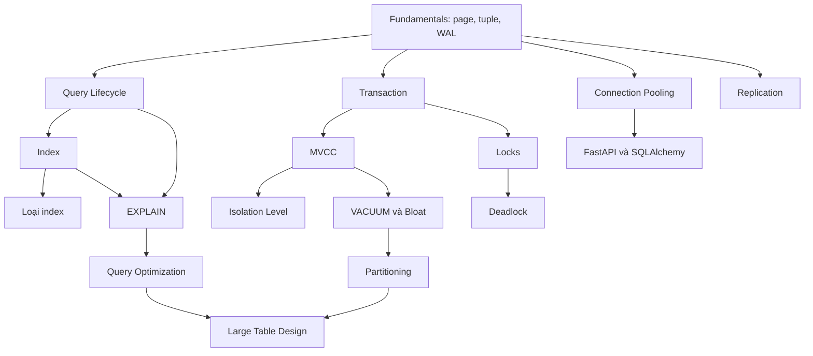

# 04 — PostgreSQL

## Module này học gì?

PostgreSQL từ bên trong: kiến trúc process và memory, cách dữ liệu nằm trên disk, WAL, vòng đời một query từ parser tới executor, index và các loại index, cách đọc execution plan, cách planner chọn scan và join, transaction, MVCC, isolation level, VACUUM, lock, deadlock, connection pooling, partitioning, replication, và thiết kế bảng lớn.

## Tại sao cần học?

Database thường là thành phần **có trạng thái** duy nhất và là bottleneck đầu tiên khi hệ thống lớn lên. Sai lầm ở tầng database không chỉ làm chậm hệ thống mà còn có thể làm **sai dữ liệu**: lost update, write skew, đơn hàng trùng. Hầu hết sự cố "API chậm", "database CPU cao", "service đứng khi deploy" đều quy về một trong các chủ đề của module này.

## Thứ tự nên đọc

**Nền tảng**

1. [PostgreSQL Fundamentals: process, memory, storage, WAL](database-fundamentals.md)
2. [Query Lifecycle: parser → planner → executor](query-lifecycle.md)

**Đọc dữ liệu nhanh**

3. [Index](index.md)
4. [Các loại index: B-tree, Hash, GIN, GiST, BRIN](btree-hash-gin-gist-brin.md)
5. [EXPLAIN ANALYZE](explain-analyze.md)
6. [Query Optimization](query-optimization.md)
7. [SQL nâng cao](sql-advanced.md)

**Đúng đắn khi đồng thời**

8. [Transaction](transaction.md)
9. [MVCC](mvcc.md)
10. [Isolation Level](isolation-level.md)
11. [Locks](locks.md)
12. [Deadlock](deadlock.md)

**Vận hành và quy mô**

13. [VACUUM, ANALYZE và Bloat](vacuum-bloat.md)
14. [Connection Pooling](connection-pooling.md)
15. [Partitioning](partitioning.md)
16. [Replication](replication.md)
17. [Thiết kế bảng lớn](large-table-design.md)

## Các concept phụ thuộc nhau thế nào?

Cách đọc diagram:

1. **Fundamentals** giải thích page, tuple header (`xmin`/`xmax`) và WAL — nền cho cả nhánh hiệu năng lẫn nhánh đúng đắn.
2. **Nhánh hiệu năng**: query lifecycle → index → EXPLAIN → optimization.
3. **Nhánh đúng đắn**: transaction → MVCC → isolation level; transaction → lock → deadlock.
4. **Nhánh vận hành**: MVCC sinh dead tuple → VACUUM; bảng lớn → partition; process-per-connection → pooling; WAL → replication.
5. Connection pooling nối trực tiếp với cách FastAPI và SQLAlchemy dùng database.

## File quan trọng nhất

[MVCC](mvcc.md), [Index](index.md), [EXPLAIN ANALYZE](explain-analyze.md), [Connection Pooling](connection-pooling.md). Bốn file này giải thích phần lớn hành vi PostgreSQL mà backend engineer gặp hằng ngày.

---

[← FastAPI](../03-fastapi/README.md) · [Knowledge map](../../README.md) · [SQLAlchemy →](../05-sqlalchemy/README.md)
